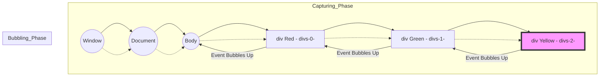
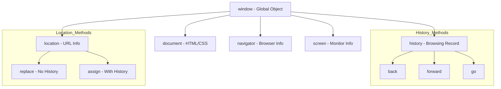
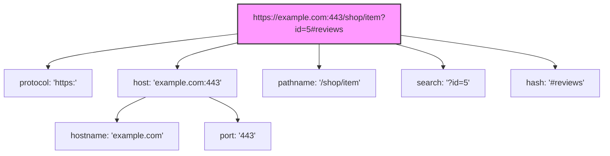

```js
 var divs = document.getElementsByClassName("myClass");
 var divs2 = document.querySelectorAll(".myClass");
 var newEle = document.createElement("div");
newEle.setAttribute("class","myClass");
 newEle.textContent = "hello new";
document.body.append(newEle);
```

### 1. الـ **Live Collection** vs. الـ **Static Collection**

الموضوع كله بيتلخص في "التفاعل مع التغيير".

- **`getElementsByClassName` (Live HTMLCollection):**
    
    ده بيرجع حاجة اسمها **HTMLCollection**. دي بنسميها "حية" (**Live**). يعني إيه؟ يعني الـ JavaScript بتفضل عاملة "علاقة حب" مستمرة مع الـ DOM. أي عنصر جديد يتضاف في الـ HTML واخد نفس الـ Class، الـ Collection دي بتحدث نفسها أوتوماتيكياً من غير ما تناديها تاني.
    
- **`querySelectorAll` (Static NodeList):**
    
    ده بيرجع **NodeList**. دي بنسميها "ثابتة" (**Static**). يعني هي بتصور الـ DOM "سيلفي" في اللحظة اللي ناديت فيها الـ Method. لو الـ DOM اتغير بعدها، الصورة (الـ NodeList) بتفضل زي ما هي، مش بتحس باللي حصل.
    

---

### 2. ليه بنستخدم دي وليه بنستخدم دي؟ (The Use Cases)

|**وجه المقارنة**|**getElementsByClassName**|**querySelectorAll**|
|---|---|---|
|**المرونة**|بتدور بالـ Class بس|بتدور بـ **CSS Selectors** (يعني تقدر تجيب ID مع Class مع Attribute)|
|**الأداء (Performance)**|أسرع بكتير (عشان متخصصة في حاجة واحدة)|أبطأ سنة (عشان بتعمل Parsing لـ Selector معقد)|
|**النوع المرتجع**|**HTMLCollection**|**NodeList**|
|**التعامل مع Array**|مفيش فيها `forEach` (لازم تحولها لـ Array)|فيها `forEach` مدمجة (Built-in)|

---

### 3. مثال عملي (السيناريو اللي أنت كتبته)

تخيل إنك بتعمل **To-Do List**.

JavaScript

```
// 1. هنجيب العناصر بطريقتين
var liveList = document.getElementsByClassName("task");
var staticList = document.querySelectorAll(".task");

console.log(liveList.length);   // هيديك مثلاً 2
console.log(staticList.length); // هيديك برضه 2

// 2. هنضيف Task جديدة للـ DOM
var newTask = document.createElement("div");
newTask.className = "task";
document.body.appendChild(newTask);

// 3. تعال نشوف الفرق دلوقتي
console.log(liveList.length);   // هتلاقيها بقت 3 (حست بالتغيير!)
console.log(staticList.length); // هتفضل 2 (نايمة في العسل)
```

---

### 4. أسئلة الإنترفيو (The Interview Trap) 🚩

دي الأسئلة اللي بسألها للناس عشان أعرف هما فاهمين **JS Engine** ولا لأ:

**س1: "لو عايز أعمل Loop على `HTMLCollection` باستخدام الـ `forEach` مباشرة، هل ينفع؟"**

- **الإجابة:** لأ، الـ `HTMLCollection` معندهاش `forEach`. لازم تحولها لـ Array حقيقية باستخدام `Array.from()` أو الـ **Spread Operator** `[...]`. لكن الـ `NodeList` اللي طالعة من `querySelectorAll` عندها `forEach` عادي.
    

**س2: "مين أسرع في الـ Performance؟ وليه؟"**

- **الإجابة:** الـ `getElementsByClassName` أسرع. ليه؟ لأن المتصفح مش محتاج "يفكر" في الـ CSS Selector، هو عنده فهرس جاهز للـ Classes فبيروح يجيبهم فوراً. الـ `querySelectorAll` لازم تعدي على **CSS Selector Engine** عشان تفهم أنت طالب إيه بالضبط.
    

**س3: "إيه المشكلة اللي ممكن تقابلني مع الـ Live Collection في الـ Loop؟"**

- **الإجابة (دي للمحترفين):** لو بتعمل Loop وبتمسح عناصر (مثلاً بتمسح كل اللي واخد Class معين)، الـ `length` بتاعت الـ `HTMLCollection` هتقل مع كل لفة، وده هيخلي الـ Loop "تخرف" وتفوت عناصر. في الحالة دي الـ Static Collection أضمن بكتير.
    

---

**عاش يا وحش، الكود الجاي إيه؟ ابعت لي الـ snippet اللي بعدها!**

**تحب المرة الجاية أشرح لك الفرق بين الـ `innerText` والـ `textContent` والـ `innerHTML` لو موجودين في الكود بتاعك؟**

---
## event life cycle : 
```js
divs[0].addEventListener("click",function(e){
    if(this===e.target){

        alert("hello iam red");
    }
    
})
divs[1].addEventListener("click",function(e){
    //  e.stopPropagation();
  if(this===e.target){
    alert("hello iam green");
    }
})
divs[2].addEventListener("click",function(e){
    //e.stopPropagation();
   alert("hello iam yellow");
});
```


## 1. إيه هو الـ Event Life Cycle؟

تخيل الـ **DOM** بتاعك عبارة عن طبقات فوق بعض (زي البصلة). لما بتدوس على عنصر جوه خالص، الـ **Event** مش بيظهر فجأة عند العنصر ده بس، لا.. ده بيمشي في رحلة. الرحلة دي 3 مراحل:

1. **Capturing Phase (Trickling):** الـ **Event** بينزل من الـ `window` والـ `document` لحد ما يوصل للعنصر اللي أنت دوست عليه (الـ **Target**).
    
2. **Target Phase:** الـ **Event** بيوصل للعنصر اللي حصل عليه الـ **Action** فعلياً.
    
3. **Bubbling Phase:** الـ **Event** بيبدأ "يفرقع" ويطلع لفوق تاني من الـ **Target** لحد الـ `window` (زي فقاقيع الهواء تحت المية).
    

---

## 2. توضيح الكود بتاعك (The Logic)

أنت كاتب حتة "صايعة" في الكود بتاعك وهي `if(this === e.target)`. تعال نعرف ليه دي بتغير اللعبة:

### الـ `e.target` vs الـ `this` (أو `e.currentTarget`)

- **`e.target`:** ده العنصر اللي "إيدك لمسته" فعلياً (The origin of the event).
    
- **`this` أو `e.currentTarget`:** ده العنصر اللي "متركب عليه" الـ **Listener** دلوقتي والـ **Event** بيعدي عليه حالياً.
    

**ليه أنت عملت الـ `if` دي؟**

عشان تمنع الـ **Event** إنه يتنفذ لو جاي من "فقاعة" (Bubbling) من عنصر جوه. أنت بتقول للـ JavaScript: "يا جافاسكربت، متنفذيش الـ `alert` دي إلا لو أنا دوست على الـ `div` ده بالذات، مش لو دوست على ابن من أبناؤه والـ **Event** سمع عندي".

### الـ `stopPropagation()`

لو شلت الكومنت من عليها، أنت كدة بتقول للـ **Event**: "استوب! متكملش رحلة الـ **Bubbling** لفوق". وده بيقطع الطريق على أي **Parent** مستني الـ **Event** ده.

---

## 3. الـ Mermaid Diagram (خريطة الرحلة)

عشان تتخيل الـ **Propagation** والفرق بين اللي أنت عملته والوضع العادي:




---

## 4. أسئلة إنترفيو "للتنانين" فقط 🐉

بص يا وحش، لما تقعد قدامي في إنترفيو، هسألك الأسئلة دي عشان أعرف أنت فاهم ولا حافظ:

**س1: إزاي أخلي الـ `addEventListener` يشتغل في الـ Capturing Phase مش الـ Bubbling؟**

- **الإجابة:** الـ `addEventListener` بتاخد **Third Argument** اختيارية اسمها `useCapture` (بوليان). لو بعت لها `true` هينفذ الـ **Function** وهي نازلة (Capturing)، الديفولت بتاعها `false` (يعني Bubbling).
    

**س2: إيه الفرق الجوهري بين `e.target` و `e.currentTarget`؟**

- **الإجابة:** الـ `target` هو اللي بدأ الحفلة (المكان اللي اتداس عليه)، أما الـ `currentTarget` هو المكان اللي الـ **Event Handler** مربوط فيه دلوقتي. (دي أهم حتة في الإنترفيو).
    

**س3: إيه هو الـ Event Delegation؟ وليه هو أحسن للأداء (Performance)؟**

- **الإجابة:** بدل ما أحط **Listener** على كل `li` جوه `ul` (وده بياخد رامات كتير)، أنا بحط **Listener** واحد بس على الـ `ul` (الـ Parent) وبستخدم الـ **Bubbling** عشان أعرف أنهي `li` اللي اتداس عليها عن طريق الـ `e.target`.
    

**س4: هل كل الـ Events بيحصلها Bubbling؟**

- **الإجابة:** لا! في **Events** مش بتعمل **Bubble** زي `focus`, `blur`, `mouseenter`, و `mouseleave`. ودي معلومة "سينيورز" أوي.
    

---

لما تيجي تمنع الـ **Event** إنه يتنفذ على العناصر الأب، فكر الأول: هل محتاج `e.stopPropagation()` (عشان تمنع الـ Event يوصل فوق خالص) ولا محتاج `if(e.target === e.currentTarget)` (عشان تضمن إن الكود يتنفذ لما تدوس على العنصر نفسه بس)؟

الخيار الثاني "أنضف" لأنه مش بيكسر الـ **Propagation** لباقي الـ **App** لو في حاجة تانية محتاجة تسمع الـ **Event**.

---

يا أهلاً بيك يا بطل في مملكة الـ **BOM (Browser Object Model)**. هنا إحنا خرجنا بره حدود الورقة والقلم (الـ DOM) وبدأنا نتحكم في "البرواز" نفسه اللي هو المتصفح (Chrome, Firefox, etc).

بصفتي خبير بقالي 20 سنة، هقولك إن الـ **BOM** ده هو اللي بيخلي الـ Web App بتاعك يحس بالمتصفح، بس فيه "تكات" تقيلة أوي لو مخدتش بالك منها هتعمل **Bugs** غريبة.

---

### 1. الـ **Window Object** (كبير العيلة)

الـ `window` هو الـ **Global Object**. أي حاجة بتعرفها بـ `var` أو أي `function` بتكتبها في الـ Global Scope، بتبقى فعلياً "ابن" من أبناء الـ `window`.

---

### 2. التحكم في النوافذ (`open` & `close`)

في الكود بتاعك أنت بتفتح نافذة جديدة وبتحفظها في متغير اسمه `newWind`.

- **القاعدة الذهبية:** الـ `open` بترجع **Reference** (مرجع) للنافذة الجديدة. من خلال المرجع ده، تقدر تتحكم فيها من النافذة الأم (الـ Parent).
    
- **الفخ (Security Trap):** المتصفحات الحديثة بتمنع الـ `window.open()` إلا لو كانت نتيجة **User Action** (يعني لازم المستخدم يدوس على Button). لو جربت تفتحها أوتوماتيك أول ما الصفحة تفتح، الـ **Pop-up Blocker** هيقتلها فوراً.
    
- **الـ `close()`:** أنت مقدرش تقفل نافذة المتصفح الحالية بالـ JavaScript إلا لو كنت أنت اللي فاتحها أصلاً بالـ `script`. يعني لو دخلت على Facebook وجربت تكتب في الكونسول `window.close()` مش هيحصل حاجة، ودي حماية للمستخدم.
    

---

### 3. رحلة عبر الزمن (`history` object)

الـ `history` ده هو السجل بتاع الـ Tab دي بالذات.

- `back()`: كأنك دوست على زرار السهم لورا في المتصفح.
    
- `forward()`: كأنك دوست على السهم لقدام.
    
- `go(n)`: دي "الجوكر". لو بعت لها `-3` هترجع 3 خطوات لورا، لو بعت `1` هتقدم خطوة.
    

---

### 4. التحكم في المكان (`location` object)

أنت استخدمت `location.replace("page2.html")`. دي بقى حتة للمحترفين:

- **الفرق بين `replace` و `assign` (أو تغيير الـ `href`):**
    
    - `assign` أو `location.href`: بتروح للصفحة الجديدة وبتسيب "أثر" في الـ **History**. يعني لو المستخدم داس Back هيرجع للصفحة القديمة.
        
    - `replace`: دي بتمسح الصفحة الحالية من الـ **History** وتحط الجديدة مكانها. يعني لو المستخدم داس Back **مش هيعرف يرجع** للصفحة اللي كان فيها. (بنستخدمها كتير في صفحات الـ Login عشان المستخدم بعد ما يدخل ميرجعش لصفحة الـ Login تاني بالصدفة).
        

---

### 5. الـ Mermaid Diagram (رسمة الـ BOM)

عشان تتخيل الهيكل التنظيمي اللي أنت شغال جواه:

Code snippet



---

### 6. أسئلة إنترفيو "للتنانين" 🐉

**س1: إيه الفرق بين `window` و `document`؟**

- **الإجابة:** الـ `window` هو الحاوية الكبيرة (المتصفح نفسه)، أما الـ `document` هو المحتوى اللي جوه الصفحة (الـ HTML). الـ `document` هو جزء من الـ `window`.
    

**س2: لو عملت `window.open()` وفتحت صفحة من Domain تاني (مثلاً https://www.google.com/search?q=google.com)، هل تقدر تعدل في الـ HTML بتاعها من عندك؟**

- **الإجابة:** لأ طبعاً! ده اسمه **Same-Origin Policy**. الـ JavaScript بتمنعك تدخل في خصوصية المواقع التانية حتى لو أنت اللي فاتح النافذة، عشان الـ Security.
    

**س3: إيه اللي هيحصل لو ناديت `history.back()` وأنا في أول صفحة فتحتها في الـ Tab؟**

- **الإجابة:** مش هيحصل حاجة، والـ JavaScript مش هتطلع Error. هي ببساطة هتلاقي الـ History فاضي وهتتجاهل الأمر.
    

**س4: متى نستخدم `location.replace()` بدلاً من `location.href`؟**

- **الإجابة:** في السيناريوهات اللي مش عايز المستخدم يرجع فيها لورا (Back button)، زي صفحات الـ Redirect بعد الـ Payment، أو بعد الـ Logout، أو صفحة الـ Login الناجحة.
    


دايماً وأنت بتتعامل مع الـ `window.open` والـ `window.close` خلي بالك من الـ **Cross-browser compatibility**. المتصفحات (خصوصاً Safari و Chrome) ليهم سياسات صارمة جداً في الـ Pop-ups، فدايماً اختبر الكود بتاعك في كذا مكان.

---
 ## Location
 الـ **Location Object** ، ده الـ "GPS" بتاع المتصفح. ده الكائن اللي مسؤول عن كل فتفوتة في الـ **URL** اللي مكتوب فوق في الـ **Address Bar**.

بصفتي خبير، هقولك إن الـ `location` مش بس بنروح بيه لصفحة تانية، ده إحنا بنفصص بيه الـ **Link** عشان نعرف المستخدم جاي منين ومعاه بيانات إيه.

---

### 1. تشريح الـ **URL** (Properties)

تخيل إن عندنا الـ URL ده:

`https://www.google.com:8080/search/products?id=100#details`

تعال نشوف الـ **Location Object** بيشوفه إزاي:

- **`location.href`**: ده "الكل في واحد"، بيرجعلك اللينك كامل.
    
- **`location.protocol`**: هيرجعلك `https:`.
    
- **`location.host`**: هيرجعلك اسم الدومين بالـ Port يعني `www.google.com:8080`.
    
- **`location.hostname`**: هيرجعلك الدومين بس `www.google.com` (من غير البورت).
    
- **`location.port`**: هيرجعلك الـ رقم البورت بس `8080`.
    
- **`location.pathname`**: ده المسار اللي بعد الدومين، هنا هيبقى `/search/products`.
    
- **`location.search`**: دي الـ **Query String** (اللي بتبدأ بـ `?`) ودي كنز بيانات، هنا هتبقى `?id=100`.
    
- **`location.hash`**: ده الجزء بتاع الـ Anchor اللي بيبدأ بـ `#` وبيروح لحته معينة في الصفحة، هنا هيبقى `#details`.
    

---

### 2. أهم الـ **Methods** (الأوامر الحركية)

هنا بقى الشغل التقيل اللي بيفرق في الـ **User Experience**:

1. **`location.assign(url)`**:
    
    - بياخدك لصفحة جديدة.
        
    - **بيسيب أثر** في الـ History (يعني الزرار بتاع Back هيرجّعك).
        
2. **`location.replace(url)`**:
    
    - بياخدك لصفحة جديدة برضه.
        
    - **بيمسح الصفحة الحالية** من الـ History ويحط الجديدة مكانها (زرار Back مش هيرجّعك للصفحة اللي كنت فيها).
        
3. **`location.reload()`**:
    
    - بيعمل Refresh للصفحة.
        
    - **تكة سينيور:** لو بعت له `true` كدة `location.reload(true)` (في بعض المتصفحات القديمة) كان بيجبره يحمل من السيرفر مش من الـ Cache، بس دلوقتي أغلب المتصفحات بتتعامل معاها عادي.
        

---

### 3. الـ Mermaid Diagram (خريطة الـ URL)

الرسمة دي تخليها في خيالك وأنت شغال:

Code snippet



---

### 4. أسئلة الإنترفيو (The "Pro" Level) 🐉

دي الأسئلة اللي بطلع بيها الناس اللي فاهمة **BOM** صح:

**س1: إيه الفرق بين `host` و `hostname`؟**

- **الإجابة:** الـ `host` بيشمل رقم الـ **Port** لو موجود، أما الـ `hostname` بيرجع اسم الدومين الصافي بس.
    

**س2: لو عايز أجيب قيمة الـ `id` من الـ URL (مثلاً `?id=100`) بالـ JavaScript، أعمل إيه؟**

- **الإجابة الصايعة:** بستخدم كائن اسمه `URLSearchParams`.
    
    JavaScript
    
    ```
    let params = new URLSearchParams(location.search);
    let id = params.get('id'); // هيطلعلك 100
    ```
    

**س3: إيه الفرق بين `location.href = url` و `location.assign(url)`؟**

- **الإجابة:** مفيش فرق جوهري، الـ `href` هي **Property** والـ `assign` هي **Method**، والاثنين بيعملوا نفس الحاجة وبيسيبوا أثر في الـ History. الـ `assign` بتعتبر "أنضف" في الكتابة لو أنت شغال Functional أكتر.
    

**س4: إزاي تمنع المستخدم إنه يرجع لصفحة الـ Login بعد ما عمل Login فعلاً؟**

- **الإجابة:** أول ما الـ Login ينجح، بدل ما أعمل `href` أو `assign` لصفحة الـ Dashboard، أعمل `location.replace('dashboard.html')`. كدة صفحة الـ Login اتمسحت من الـ History.
    

---

أوعى تستخدم `location.search` وتعمل لها **Parsing** يدوي بـ `split` و `substring` زي بتوع زمان. المتصفحات الحديثة فيها `URLSearchParams` وده أمان وأسرع وبيهندل الـ Special Characters لوحدها.


---
دخلت في منطقة الـ **Information Desk** بتاع المتصفح. الـ `navigator` object ده هو اللي من خلاله الـ JavaScript بتقدر "تستجوب" المتصفح وتعرف معلومات عنه وعن الجهاز اللي شغال عليه.

بصفتي عجوز في المهنة دي، هقولك إن الـ `navigator` زمان كان استخدامه محصور في معرفة نوع المتصفح، بس دلوقتي بقى "مرعب" وفيه صلاحيات خرافية زي الـ GPS والـ Clipboard والـ Battery.

---

### 1. أهم الخصائص (Properties) اللي بنحتاجها فعلياً

الـ `navigator` ده فيه خصائص كتير، بس دول اللي بيفرقوا معاك كـ **Developer**:

- **`navigator.onLine`**:
    
    - دي "بوليان" (`true`/`false`). بتعرفك حالاً المستخدم عنده إنترنت ولا "أوفلاين".
        
    - **استخدامها:** لو بتعمل App بيسيف داتا، ممكن تشيك عليها قبل ما تبعت الـ Request للسيرفر.
        
- **`navigator.language`**:
    
    - بتعرفك لغة المتصفح بتاع المستخدم (مثلاً `en-US` أو `ar`).
        
    - **استخدامها:** عشان تعمل **Auto-detect** للغة الـ Website وتفتح له النسخة اللي بيفهمها.
        
- **`navigator.userAgent`**:
    
    - ده "البطاقة الشخصية" للمتصفح. عبارة عن String طويل فيه نوع المتصفح، الـ Version، ونظام التشغيل (Windows, Mac, Android).
        
    - **تكة سينيور:** الـ `userAgent` حالياً بقى صعب الاعتماد عليه لوحده لأن المتصفحات بتكتب حاجات كتير فيه عشان الـ Compatibility، فبقينا نستخدم مكتبات تانية أو الـ `User-Agent Client Hints` لو محتاجين دقة.
        
- **`navigator.cookieEnabled`**:
    
    - بتعرفك لو المستخدم قافل الـ Cookies من إعدادات المتصفح ولا لأ.
        

---

### 2. القدرات الخاصة (Modern Web APIs)

هنا بقى الشغل التقيل اللي بنسميه **Hardware Access**:

- **Geolocation (`navigator.geolocation`)**:
    
    - ده اللي بيخلي الـ App يطلب إذن المستخدم عشان يعرف مكانه (الـ GPS).
        
    - الميثود الشهيرة: `getCurrentPosition()`.
        
- **Clipboard (`navigator.clipboard`)**:
    
    - بقى متاح ليك دلوقتي تعمل "Copy" أو "Paste" بكود JavaScript (بإذن المستخدم طبعاً).
        
    - الميثود: `writeText()` و `readText()`.
        

---

### 3. مثال عملي بسيط (بدون تعقيد)

تخيل إنك عايز تعمل زرار "Copy" لـ Promo Code عندك في الصفحة:

JavaScript

```
function copyCoupon(text) {
    if (navigator.clipboard) { // بنشيك الأول لو المتصفح بيدعم الخاصية دي
        navigator.clipboard.writeText(text).then(() => {
            alert("الكوبون اتنسخ يا بطل!");
        });
    } else {
        alert("متصفحك قديم شوية مش بيدعم الـ Copy أوتوماتيك");
    }
}

// مثال لـ تشيك الإنترنت
if (navigator.onLine) {
    console.log("إحنا في الأمان والنت شغال");
} else {
    console.warn("إلحق! النت قطع");
}
```

---

### 4. أسئلة الإنترفيو (Technical Questions) 🐉

**س1: إزاي تعرف المستخدم شغال بمتصفح إيه ونظام تشغيل إيه؟**

- **الإجابة:** عن طريق الـ `navigator.userAgent`. بس بوضح إننا لازم نتعامل معاها بحذر لأنها ممكن تتزيف أو تكون معقدة في الـ Parsing.
    

**س2: لو عايز تعمل الـ Web App بتاعك يشتغل Offline (زي الـ PWA)، إيه أهم خاصية في الـ `navigator` هتحتاجها؟**

- **الإجابة:** الـ `navigator.serviceWorker`. ده هو اللي بيخلينا نسجل **Service Worker** يتحكم في الـ Caching ويخلي الـ App يفتح من غير نت.
    

**س3: هل ينفع أجيب لوكيشن المستخدم (Geolocation) من غير ما يظهر له رسالة Permission؟**

- **الإجابة:** **مستحيل**. دي حماية وخصوصية (Security & Privacy) المتصفح بيفرضها. لازم المستخدم يدوس "Allow" عشان الـ JavaScript تقدر تاخد الإحداثيات.
    

**س4: إيه الفرق بين `navigator.onLine` وبين إننا نتشيك الـ Connection فعلياً؟**

- **الإجابة (للمحترفين):** الـ `navigator.onLine` بتقولك إن الجهاز واصل بـ Network (زي الـ Wi-Fi)، بس مش بتضمن إن الـ Network دي فيها إنترنت فعلاً! ممكن تكون واصل بـ Router بس الخدمة مقطوعة. عشان كدة السينيور الصح بيعمل "Ping" لـ File صغير على السيرفر عشان يتأكد.
    

---

### نصيحة الـ 20 سنة خبرة:

الـ `navigator` فيه حاجات كتير بقت **Deprecated** (اتلغت أو مبقاش ينفع نستخدمها) زي `navigator.appName` و `navigator.appCodeName` لأن كل المتصفحات دلوقتي بتكتب "Netscape" و "Mozilla" عشان التوافقية، فمتحاولش تستخدمهم في الـ Logic بتاعك أبداً. ركز على الحاجات الحديثة زي الـ **Permissions API** والـ **Clipboard**.

**كده الـ BOM بقى في جيبك يا وحش.. إيه اللي عليه الدور في محاضراتك؟ تحب نفتح الـ `Screen` ولا ندخل في الـ `Timing Functions`؟**


---
من عيوني يا بطل! بما إنك عاوز تدخل الإنترفيو "تنين" وتفهم الـ **Engine** شغال إزاي، تعال نفصص الـ **History Object** بمستوى أعمق وبأمثلة كود حية تخليك متمكن جداً.

الـ **History** مش مجرد "ورا وقدام"، ده هو اللي خلى الـ **Web Apps** الحديثة (زي React و Angular) تنفع أصلاً.

---

### 1. العمليات الأساسية (The Classic Way)

دي الطرق اللي بنتحكم فيها في "خط الزمن" بتاع المتصفح.

JavaScript

```
// 1. عشان نعرف المستخدم زار كام صفحة في التابة دي
console.log("عدد الصفحات في السجل: ", history.length);

// 2. الرجوع والتقدم (زي أزرار المتصفح)
function goBack() {
    history.back(); // بيرجع خطوة واحدة
}

function goForward() {
    history.forward(); // بيطلع خطوة واحدة قدام
}

// 3. التحرك الحر (The Remote Control)
function jump() {
    history.go(-2);  // يرجع خطوتين لورا
    history.go(2);   // يطلع خطوتين قدام
    history.go(0);   // يعمل ريفريش (بس location.reload أنضف)
}
```

---

### 2. الشغل العالي: الـ **Modern History API**

هنا بقى السحر! الـ Methods دي بتخليك تغير الـ URL من غير ما الصفحة تحمل من جديد (**No Page Reload**).

#### أ- `history.pushState()`

دي بتضيف "سجل جديد" في الـ History.

JavaScript

```
// syntax: pushState(stateObject, title, url)

let state = { pageId: 5, user: "Khaled" };
let title = "صفحة المنتج رقم 5";
let url = "product-5.html";

history.pushState(state, title, url);

// النتيجة: الـ URL فوق هيتغير لـ product-5.html 
// والصفحة مش هتعمل Reload! كأنك ضفت خطوة جديدة في الـ History.
```

#### ب- `history.replaceState()`

دي مش بتزود سجل، دي "بتبدل" السجل الحالي.

JavaScript

```
// بنستخدمها لما نكون بنعمل حاجة مش عايزين المستخدم يرجعلها بالـ Back
// مثلاً لو بنعمل Search وعايزين الـ URL يتحدث مع كل كلمة بيكتبها من غير ما الـ History يتمحى
history.replaceState({search: "laptop"}, "Search Result", "?q=laptop");
```

---

### 3. مراقبة حركة المستخدم (`popstate` Event)

لما المستخدم يدوس على زرار **Back** أو **Forward** بتاع المتصفح، المتصفح بيطلع الـ **Event** ده. أنت كـ Developer لازم "تلقفه" عشان تعرف هتعرض إيه للمستخدم.

JavaScript

```
window.addEventListener('popstate', function(event) {
    // الـ event.state هو الـ object اللي أنت بعته في الـ pushState
    if (event.state) {
        console.log("المستخدم رجع لصفحة معرفها: ", event.state.pageId);
        // هنا بقى ممكن تغير محتوى الصفحة بالـ DOM بناءً على الداتا اللي رجعت
    } else {
        console.log("المستخدم رجع لصفحة مكنش ليها State");
    }
});
```

---

### 4. الـ Mermaid Diagram (إزاي الـ History بيفكر)

عشان تتخيل الـ **Stack** بتاع الـ History لما بنستخدم الـ Methods دي:

Code snippet

```
graph LR
    A[Page 1] -->|pushState| B[Page 2]
    B -->|pushState| C[Page 3]
    C -->|back| B
    B -->|replaceState| D[Modified Page 2]
    D -.->|back| A
    style D fill:#f96,stroke:#333
```

---

### 5. أسئلة الإنترفيو "للتنانين" 🐉

**س1: لو عملت `history.pushState` لـ URL بتاع موقع تاني (مثلاً https://www.google.com/search?q=google.com) وأنا في موقعي، إيه اللي يحصل؟**

- **الإجابة:** هيضرب **Security Error (DOMException)**. الـ Security بتاع المتصفح بيسمح لك تغير الـ URL بس في حدود الـ **Same Origin** (نفس الدومين) بتاعك.
    

**س2: إيه الفرق بين `history.pushState` و `location.href`؟**

- **الإجابة:** `location.href` بيجبر المتصفح يروح للسيرفر ويطلب الصفحة ويعمل **Full Reload**. أما `pushState` بتغير الـ URL في الـ Bar بس وتخليك أنت تتحكم في المحتوى بالـ JS من غير ريفريش.
    

**س3: الـ `state object` اللي بنبعته في الـ `pushState` أخره مساحة قد إيه؟**

- **الإجابة:** المتصفحات عادةً بتسمح بـ **640KB** للـ Object ده. لو حاولت تبعت حاجة أكبر، هيرمي Error. فدايماً بنبعت فيه ID أو داتا بسيطة مش الـ HTML كله.
    

**س4: إزاي تمنع المستخدم إنه يرجع لصفحة معينة؟**

- **الإجابة:** مفيش طريقة "تمنعه" حرفياً، بس ممكن نستخدم `history.replaceState` في الصفحة اللي مش عايزينه يرجعلها، كدة لما يدوس Back هينط فوقيها ويروح للي قبلها.
    

---

### نصيحة الـ 20 سنة خبرة:

دايماً وأنت بتستخدم الـ `pushState` اتأكد إن الـ URL اللي بتكتبه له وجود حقيقي على السيرفر، عشان لو المستخدم عمل **Refresh** وهو واقف عليه، السيرفر ميرجعش **404 Not Found**. السينيور الصح بيظبط الـ Server-side Routing عشان يخدم على الـ Client-side Routing.

---

**عاش يا بطل! كدة الـ History بقى في جيبك.**

**تحب المرة الجاية ندخل في الـ `Storage` (LocalStorage vs Cookies) ولا نفتح موضوع الـ `setTimeout` والـ `Async`؟**

---
يا بطل! وصلت لمنطقة "الخزنة" بتاعة المتصفح. الـ **Client-side Storage** ده هو اللي بيخلي الموقع "يفتكر" المستخدم، سواء هو عامل Dark Mode، أو حاطط منتجات في الـ Cart، أو حتى لسه مسجل دخول.

بصفتي عجوز في الشغلانة دي، هقولك إننا زمان مكناش بنحلم غير بالـ **Cookies**، ودلوقتي بقى معانا أدوات تخلينا نبني Apps كاملة بتشتغل أوفلاين.

---

### 1. الـ **Cookies** (القديم المحنك)

الـ Cookies هي أقدم طريقة، وهي الوحيدة اللي ليها علاقة بالسيرفر.

- **المساحة:** صغيرة جداً (حوالي **4KB**).
    
- **العمر:** أنت اللي بتحدده (Expires/Max-Age). لو محددتش، بتموت أول ما تقفل المتصفح.
    
- **التواصل:** بتروح "رايحة جاية" مع كل **HTTP Request** للسيرفر.
    
- **الاستخدام:** الـ Authentication (لما تسجل دخول ويجيلك Token).
    

### 2. الـ **localStorage** (المخزن الدائم)

ده "الهارد ديسك" بتاع المتصفح في موقعك.

- **المساحة:** كبيرة (حوالي **5MB** إلى **10MB** حسب المتصفح).
    
- **العمر:** **أبدي**. الداتا مش بتتمسح إلا لو أنت مسحتها بالكود أو المستخدم مسح الـ Browser Cache.
    
- **التواصل:** موجودة على الـ Client بس، السيرفر ميعرفش عنها حاجة.
    
- **الاستخدام:** Settings المستخدم (اللغة، الـ Theme)، أو داتا مش حساسة وعايزها تفضل موجودة.
    

### 3. الـ **sessionStorage** (خزنة التابة الواحدة)

ده زي الـ localStorage بس "عمره قصير".

- **المساحة:** زي الـ localStorage.
    
- **العمر:** بتتمسح أول ما تقفل الـ **Tab** (التبابة). حتى لو فتحت نفس الموقع في تابة تانية، مش هيشوف داتا التابة الأولى.
    
- **الاستخدام:** داتا مؤقتة لعملية معينة (مثلاً خطوات Wizard أو Form كبير مش عايزه يضيع لو عملت Refresh، بس يختفي لو قفلت التابة).
    

---

### المقارنة السريعة (الجدول اللي بيبهر في الإنترفيو)

|**وجه المقارنة**|**Cookies**|**localStorage**|**sessionStorage**|
|---|---|---|---|
|**المساحة**|4KB|5MB - 10MB|5MB - 10MB|
|**تاريخ الانتهاء**|يدوي (أو عند قفل المتصفح)|لا ينتهي أبداً|عند قفل الـ Tab|
|**رايحة للسيرفر؟**|نعم (مع كل Request)|لا|لا|
|**سهولة التعامل**|صعبة (محتاجة Parsing)|سهلة جداً (Key/Value)|سهلة جداً (Key/Value)|

---

### أمثلة بالكود (عشان تبقى حريف)

**أ- التعامل مع localStorage و sessionStorage (الاتنين ليهم نفس الـ API):**

JavaScript

```
// 1. تخزين داتا
localStorage.setItem("username", "Khaled");
sessionStorage.setItem("isLoggedIn", "true");

// 2. قراءة داتا
let user = localStorage.getItem("username"); // "Khaled"

// 3. مسح عنصر واحد
localStorage.removeItem("username");

// 4. مسح كل الخزنة
localStorage.clear();

// تكة سينيور: الداتا دايماً بتتخزن كـ String
// لو عايز تخزن Object لازم تستخدم JSON.stringify
let userObj = { id: 1, name: "Khaled" };
localStorage.setItem("user", JSON.stringify(userObj));

// ولما تيجي ترجعه
let savedUser = JSON.parse(localStorage.getItem("user"));
```

**ب- التعامل مع الـ Cookies (الطريقة البدائية):**

JavaScript

```
// إضافة Cookie
document.cookie = "theme=dark; expires=Thu, 18 Dec 2026 12:00:00 UTC; path=/";

// قراءة الـ Cookies (بترجع String واحد طويل ومعقد)
console.log(document.cookie); // "theme=dark; user=khaled"
```

---

### أسئلة الإنترفيو (Interview Traps) 🚩

**س1: إيه المشكلة الأمنية في الـ localStorage؟**

- **الإجابة:** الـ localStorage عرضة لهجمات الـ **XSS (Cross-Site Scripting)**. لو أي حد قدر يحقن كود JS في موقعك، يقدر يسرق كل الداتا اللي فيها ببساطة بـ `localStorage.getItem()`. عشان كدة "أبداً" متخزنش فيها داتا حساسة زي الـ Passwords.
    

**س2: إزاي تخلي الـ Cookie أمان (Secure)؟**

- **الإجابة:** بنستخدم **Flags** مهمة:
    
    - `HttpOnly`: عشان الـ JavaScript متقدرش تقرأها (تحميك من الـ XSS).
        
    - `Secure`: عشان تتبعت بس على HTTPS.
        
    - `SameSite=Strict`: عشان تحميك من الـ CSRF.
        

**س3: هل الـ `localStorage` أسرع ولا الـ `Cookies`؟**

- **الإجابة:** الـ `localStorage` أسرع بكتير لأنها مش بتتبعت للسيرفر في كل مرة، ولأن مساحتها أكبر فالمتصفح بيتعامل معاها كـ API مباشر.
    

**س4: لو المستخدم فتح "Incognito Mode" (المتصفح الخفي)، الـ localStorage بتشتغل؟**

- **الإجابة:** في أغلب المتصفحات بتشتغل بس بتتمسح بمجرد ما يقفل المتصفح، وفي بعض المتصفحات القديمة كانت بتضرب Error لو حاولت تستخدمها. السينيور الصح بيحط الـ كود بتاعه جوه `try...catch`.
    

---

### نصيحة الـ 20 سنة خبرة:

لما تيجي تختار، اسأل نفسك: "هل السيرفر محتاج المعلومة دي في كل طلعة؟" لو آه، استخدم **Cookies**. لو لأ، اسأل: "هل الداتا دي لازم تفضل موجودة لما المستخدم يقفل الجهاز؟" لو آه، استخدم **localStorage**. لو عايزها بس طول ما هو شغال في اللحظة دي، يبقى **sessionStorage**.

---

**عاش يا وحش! كدة الـ Storage بقى في جيبك.**

**إيه اللي بعد كدة في المحاضرات؟ تحب ندخل في الـ `setTimeout` والـ `Asynchronous JS` والـ `Event Loop`؟ (الحتة دي هي اللي بتطلع الـ JavaScript Ninjas فعلاً).**