---
tags:
  - javascript
  - interview-prep
  - nodejs
  - functional-programming
  - ITI
aliases:
  - JS Engine Internals
  - محرك الجافاسكريبت
created: 2026-03-21
status: complete
---

# 🧠 JS Engine Internals — محرك الجافاسكريبت من الجذور

> [!abstract] الخريطة الكاملة
> هذه النوتة تغطي الطبقات الداخلية لمحرك الجافاسكريبت من الأسفل للأعلى:
> **LE → VE → EC → Scope Chain → Closures → Pure Functions → Immutability → Arrow Functions → Eval → Currying**

---

## 1. 📚 Lexical Environment (LE)

> [!info] التعريف
> **Data Structure داخلية** بيعملها المحرك عشان يخزن فيها المتغيرات والفانكشنز المتعرفة في "مكان" معين في الكود.
> كلمة **Lexical** = "مكاني/ترتيبي" — يعني بيتحدد بناءً على **أنت كاتب الكود فين بالظبط**.

### المكونان الأساسيان

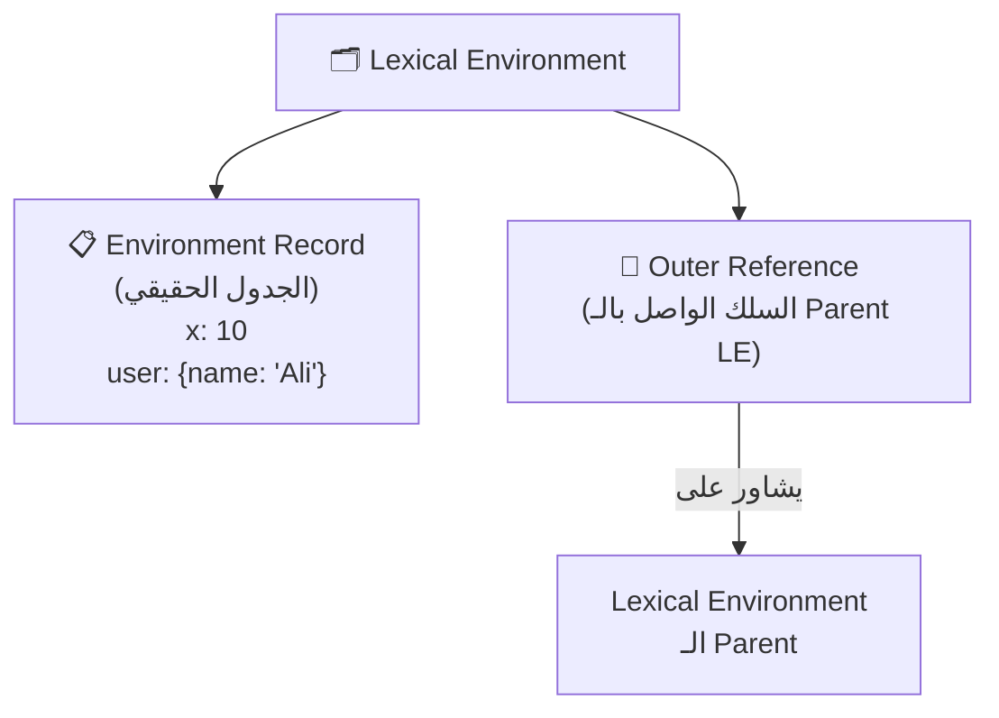

| المكوّن | الدور |
|---|---|
| **Environment Record** | الجدول الحقيقي اللي فيه أسماء المتغيرات وقيمها |
| **Outer LE Reference** | السلك اللي بيوصل اللي بالـ Parent — أساس الـ Scope Chain |

---

## 2. ⚙️ Variable Environment (VE) vs Lexical Environment (LE)

> [!tip] ليه فيه اتنين؟
> مع ظهور **ES6** و `let` و `const`، المحرك بقى يقسم البيئات جوه الـ Execution Context لنوعين عشان يطبق **Block Scope**.

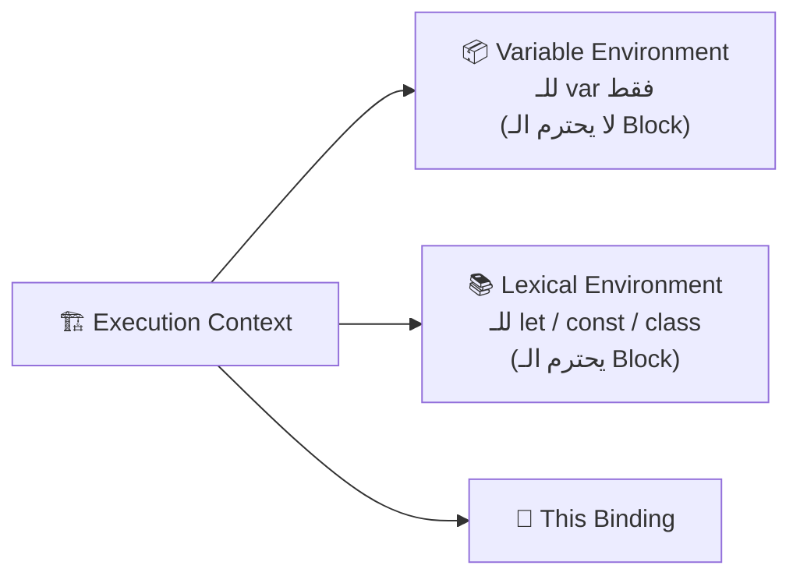

| | `var` | `let` / `const` |
|---|---|---|
| **المخزن** | Variable Environment | Lexical Environment |
| **Block Scope** | ❌ لا يعرف الـ `{}` | ✅ يحترم الـ `{}` |
| **Hoisting** | `undefined` | TDZ (Temporal Dead Zone) |

> [!example] مثال البلوك سكوب
> ```js
> {
>   var x = 1;   // يعيش في الـ VE — مرئي بره الـ Block
>   let y = 2;   // يعيش في LE جديد خاص بالـ Block ده بس
> }
> console.log(x); // 1 ✅
> console.log(y); // ReferenceError ❌
> ```

---

## 3. 🏗️ Execution Context (EC) — غرفة العمليات

> [!info] التعريف
> "الحاوية" الكبيرة اللي بتشغل الكود. **مفيش سطر كود واحد بيشتغل بره Execution Context.**

### أنواع الـ Execution Context

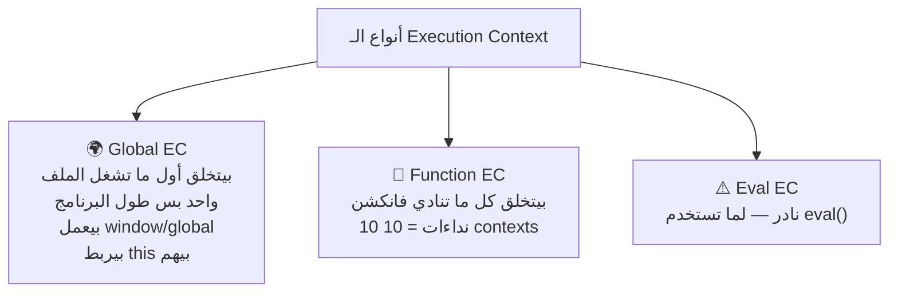

### مراحل حياة الـ Execution Context

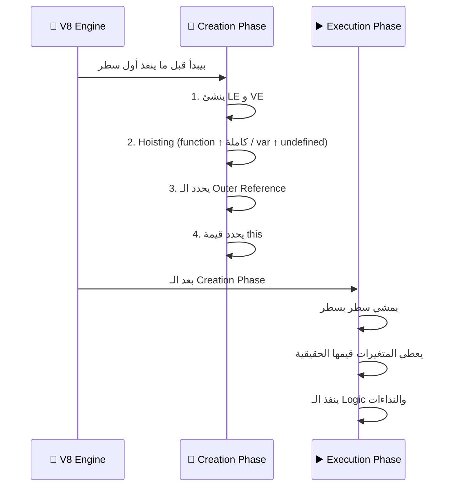

---

## 4. 📚 Call Stack — منظم المرور

> [!info] الهدف
> بما إن الجافا سكريبت **Single-Threaded** (إيد واحدة بس)، الـ Call Stack هو اللي بيعرف المحرك "أنا دلوقتي في أنهي غرفة عمليات؟"
> نوعه: **LIFO — Last In, First Out**

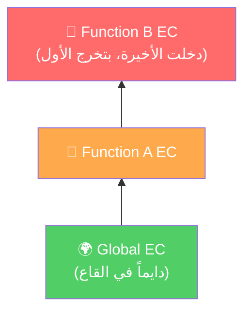

> [!example] الـ Stack في العمل
> ```js
> function b() { console.log("B"); }
> function a() { b(); }
> 
> // Stack:
> // [Global] → [a EC] → [b EC]  ← b تنفذ وتتشال
> //          → [a EC]            ← a تكمل وتتشال
> // [Global]                     ← يفضل لحد ما البرنامج يخلص
> ```

---

## 5. ⛓️ Scope Chain — السلم الواصل

> [!info] التعريف
> الـ **Scope Chain** هي النتيجة المنطقية للـ **Outer References** المتسلسلة. كل LE بيشاور على اللي فوقيه، وده بيعمل "سلم" يقدر المحرك يتسلقه عشان يلاقي المتغيرات.

### كيف تتبنى السلسلة؟

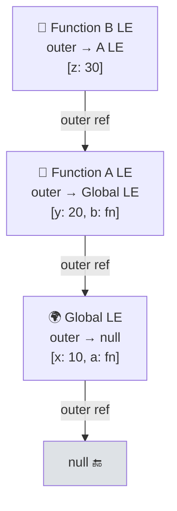

> [!warning] مبني على **مكان الكتابة** مش مكان النداء!
> الـ Outer Reference بيتحدد وقت **Definition** (لما كتبت الكود)، مش وقت **Execution** (لما ناديت الفانكشن).
> ده اللي بنسميه **Static / Lexical Scoping**.

### رحلة البحث (Identifier Resolution)

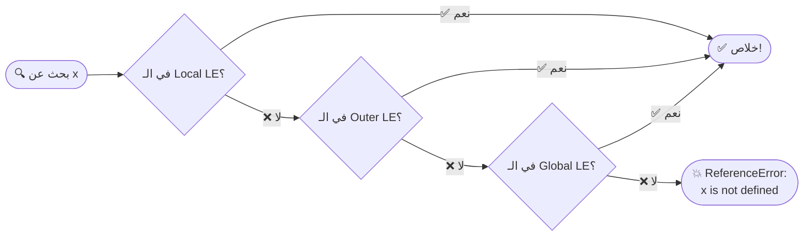

### ⚔️ Scope Chain vs Call Stack

| | Call Stack | Scope Chain |
|---|---|---|
| **يحدد** | ترتيب التنفيذ (مين نادى مين؟) | الوصول للبيانات (مين يشوف مين؟) |
| **مبني على** | وقت النداء (Runtime) | وقت الكتابة (Lexical/Static) |
| **مثال** | `a()` → `b()` → Stack | `b` كُتبت جوه `a` → يرث Scope |

### الـ Shadowing

> [!example] لو عندك `x` local و`x` global
> ```js
> let x = "global";
> function test() {
>   let x = "local"; // عمل Shadow على الـ Global x
>   console.log(x);  // "local" — المحرك وقف هنا ومكملش
> }
> test();
> ```

---

## 6. 🔒 Closures — الذاكرة الممتدة

> [!abstract] التعريف الدقيق
> **Closure** = دالة + الـ Lexical Environment اللي اتولدت فيه.
> هي قدرة الدالة الداخلية على **تذكر** والوصول لمتغيرات الـ Parent Scope حتى بعد ما الـ Parent خلص تنفيذه.

### الميكانيكا

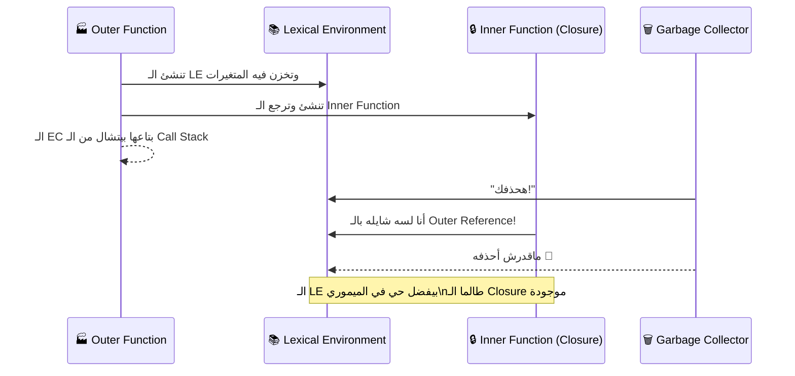

> [!example] مصنع العدادات
> ```js
> function makeCounter() {
>   let count = 0; // هيفضل محبوس في الـ LE
>
>   return function() {
>     count++;
>     return count;
>   };
> }
>
> const counter1 = makeCounter(); // LE خاص بـ counter1
> const counter2 = makeCounter(); // LE خاص بـ counter2 (منفصل!)
>
> counter1(); // 1
> counter1(); // 2
> counter2(); // 1 ← بيبدأ من الأول لأن LE منفصل
> ```

### فوائد الـ Closures

| الفائدة | الشرح |
|---|---|
| **Data Privacy** | متغيرات مش يقدر حد يوصلها من بره (زي الـ private fields) |
| **State Management** | ذاكرة خاصة للفانكشن من غير متغيرات Global |
| **Function Factories** | توليد دوال متخصصة (زي الـ Currying) |

> [!caution] الثمن: Memory Leaks
> الـ Closures بتمنع الـ Garbage Collector من مسح الـ LE القديمة. عمل آلاف الـ Closures من غير داعٍ = استهلاك ذاكرة كبير.

---

## 7. 🧼 Pure Functions والـ Side Effects

### شروط الـ Pure Function

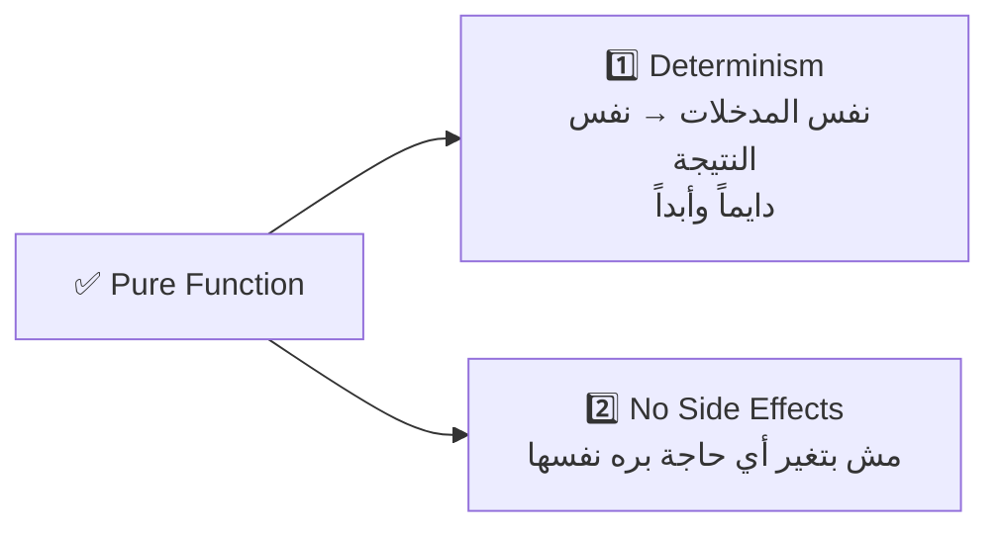

### إيه هو الـ Side Effect؟

> [!warning] أي تغيير بيحصل **بره** حدود الفانكشن
> - تعديل متغير Global
> - `console.log()` ← نعم، حتى دي!
> - الكتابة في ملف أو Database
> - الـ HTTP Requests
> - نداء فانكشن تانية Impure

> [!example] Pure vs Impure
> ```js
> // ❌ Impure — بتعدل في حاجة بره
> let total = 0;
> function addToTotal(n) {
>   total += n; // Side Effect!
> }
>
> // ✅ Pure — بترجع قيمة جديدة بس
> function add(a, b) {
>   return a + b;
> }
> ```

### استراتيجية العزل (الحل الواقعي)

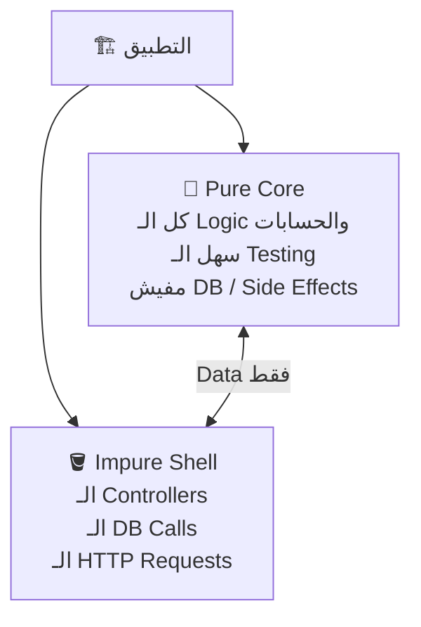

### فوائد الـ Pure Functions

| الفائدة | الشرح |
|---|---|
| **Predictability** | `add(2,2)` = 4 دايماً |
| **Testability** | مش محتاج Mock للـ DB |
| **Parallelism** | مفيش Race Conditions |
| **Memoization** | تقدر تـ Cache النتيجة |

---

## 8. 🧊 Immutability — الداتا المقدسة

> [!abstract] المبدأ
> بمجرد ما الـ Data Structure تتخلق، **ممنوع تعدلها**. لو محتاج تغيير، خد **نسخة جديدة** وعدل فيها.

### التشبيه: السبورة ضد الكراسة

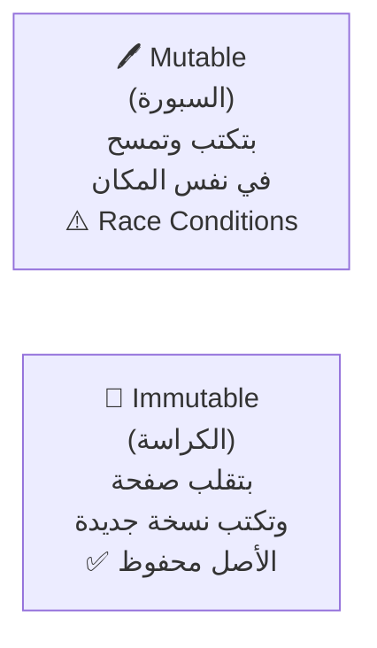

> [!caution] فخ الـ Reference في الجافاسكريبت
> ```js
> const user = { name: "Ali" };
> const admin = user; // مش نسخة — نفس الـ Reference!
>
> admin.name = "Mohamed";
> console.log(user.name); // "Mohamed" 😱
> // الاتنين بيشاوروا على نفس المكان في الميموري!
> ```

### الطريقة الصح (Modern Immutability)

```js
// ✅ تعديل Object — نسخة جديدة
const user = { id: 1, name: "Ali" };
const updatedUser = { ...user, name: "Mohamed" };

// ✅ إضافة لـ Array — array جديدة
const list = [1, 2, 3];
const newList = [...list, 4];

// ✅ حذف من Array
const withoutFirst = list.filter(item => item !== 1);

// ✅ تعديل عنصر في Array
const updated = list.map(item => item === 2 ? 99 : item);
```

> [!warning] Methods بتغير الأصل — تجنبها في الـ FP
> `push`, `pop`, `splice`, `sort`, `reverse`, `shift`, `unshift`

### فوائد الـ Immutability

| الفائدة | الشرح |
|---|---|
| **Predictability** | مفيش فانكشن بتغير داتا من وراك |
| **Time Travel Debugging** | كل نسخة محفوظة = تقدر ترجع لأي حالة سابقة (Redux DevTools) |
| **Change Detection** | المحرك بيقارن الـ Reference بس، مش بيلف جوه الـ Object كله (React) |

> [!quote] زتونة الإنترفيو
> "الـ Immutability هي المبدأ اللي بيمنع الـ Side Effects الناتجة عن تعديل الـ State بشكل مباشر. بدلاً من الـ Mutation، دايماً بننشئ New Copies من البيانات، وده بيضمن إن البيانات تفضل Predictable ويسهل تتبع الـ Bugs."

---

## 9. ➡️ Arrow Functions والـ Lexical `this`

> [!info] مش بس اختصار في الكتابة!
> الـ Arrow Functions فيها ميكانيكا داخلية **مختلفة تماماً** عن الـ Regular Functions فيما يخص `this`.

### المقارنة الجوهرية

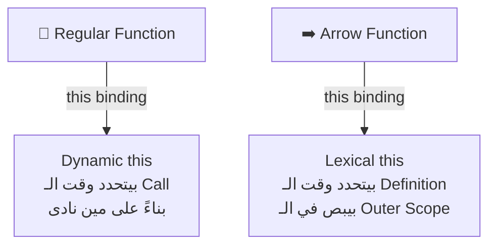

### الميكانيكا

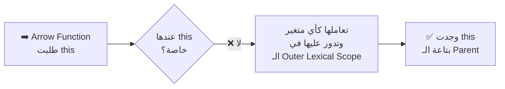

> [!example] المشكلة الكلاسيكية وحلها
> ```js
> const obj = {
>   name: "Ali",
>
>   // ❌ Regular Function — this بتتغير حسب الـ Call
>   greetRegular: function() {
>     setTimeout(function() {
>       console.log(this.name); // undefined! this هنا = window/undefined
>     }, 100);
>   },
>
>   // ✅ Arrow Function — this بتجيب من الـ Parent (obj)
>   greetArrow: function() {
>     setTimeout(() => {
>       console.log(this.name); // "Ali" ✅
>     }, 100);
>   }
> };
> ```

> [!warning] الـ Arrow Functions لا تملك
> - `this` خاصة بيها
> - `arguments` object
> - `super`
> - لا تصلح كـ Constructor (مش تقدر تعمل `new ArrowFn()`)

---

## 10. ⚠️ Eval Execution Context — الخيمة الدخيلة

> [!danger] eval is evil
> `eval()` بتاخد **String** وبتنفذه كأنه كود JS حقيقي. خطير جداً.

### ليه بيقولوا "eval is evil"؟

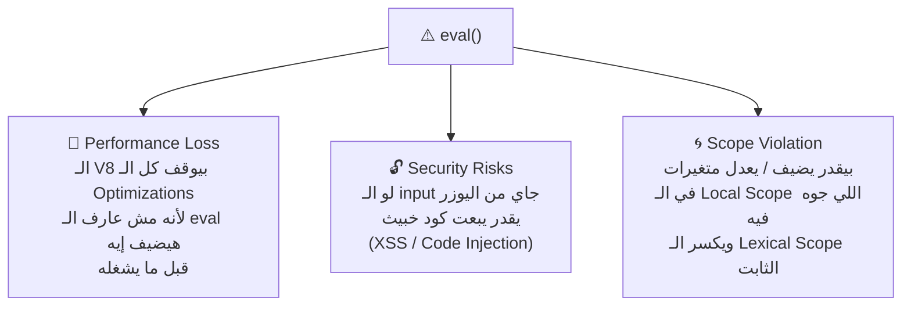

> [!tip] الـ Strict Mode بيحسن الموضوع شوية
> ```js
> 'use strict';
> eval("var secret = 42"); // في الـ Strict Mode بيعمل LE منفصل
> console.log(secret);     // ReferenceError ✅ — مش هيظهر بره
> ```

### الـ eval vs new Function()

| | `eval()` | `new Function()` |
|---|---|---|
| **الـ Outer Reference** | بيشاور على الـ Local Scope اللي جواه | دايماً بيشاور على الـ Global LE |
| **الخطورة** | أعلى — يقدر يعدل في المتغيرات المحلية | أأمن — معزول عن الـ Local |
| **الاستخدام** | تجنب تماماً | مقبول في أدوات محددة جداً |

> [!quote] القاعدة الذهبية
> "Never use eval unless you are building a compiler or a very specific dev tool."

---

## 11. 🍛 Currying Functions — التقسيط البرمجي

> [!abstract] التعريف
> تحويل فانكشن بتاخد كذا Parameter: `f(a, b, c)`
> لسلسلة من الفانكشنز كل واحدة بتاخد **Parameter واحد بس**: `f(a)(b)(c)`

### الميكانيكا (مبنية على Closures)

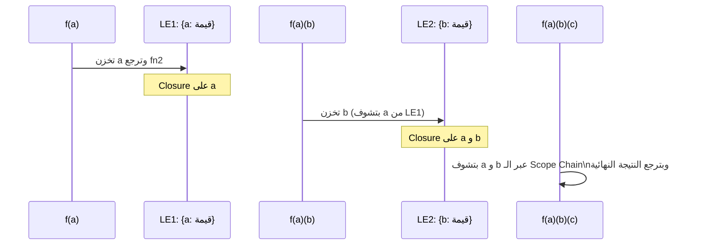

> [!example] مثال عملي — حساب الضرائب
> ```js
> // Curried Function
> const calculateTax = rate => price => price + (price * rate);
>
> // Partial Application — نثبت الـ rate
> const egyptTax = calculateTax(0.14); // Closure قفشت في 0.14
> const vatTax   = calculateTax(0.05); // Closure قفشت في 0.05
>
> // نستخدمهم بعدين براحتنا
> egyptTax(100); // 114
> vatTax(100);   // 105
> egyptTax(500); // 570
> ```

### Currying vs Partial Application

| | Currying | Partial Application |
|---|---|---|
| **التعريف** | كل فانكشن بتاخد **1** parameter بالظبط | بتثبت **أي عدد** من الـ parameters |
| **الشكل** | `f(a)(b)(c)` | `f(a, b)(c)` أو `f(a)(b, c)` |
| **الأصل** | مفهوم رياضي صارم | تطبيق عملي مرن |

### فوائد الـ Currying

| الفائدة | الشرح |
|---|---|
| **Code Reusability** | فانكشن عامة → دوال متخصصة |
| **Composition** | قطع ليغو تتركب مع بعض |
| **Declarative Code** | بتقول "إيه" مش "إزاي" |

> [!quote] زتونة الإنترفيو
> "الـ Currying هو تحويل دالة متعددة الوسائط لسلسلة من الدوال أحادية الوسيط. يعتمد كلياً على الـ Closures للحفاظ على الوسائط السابقة. فائدته في الـ Code Reusability وخلق دوال متخصصة من دوال عامة."

---

## 🗺️ الخريطة الكاملة — كل المفاهيم مع بعض

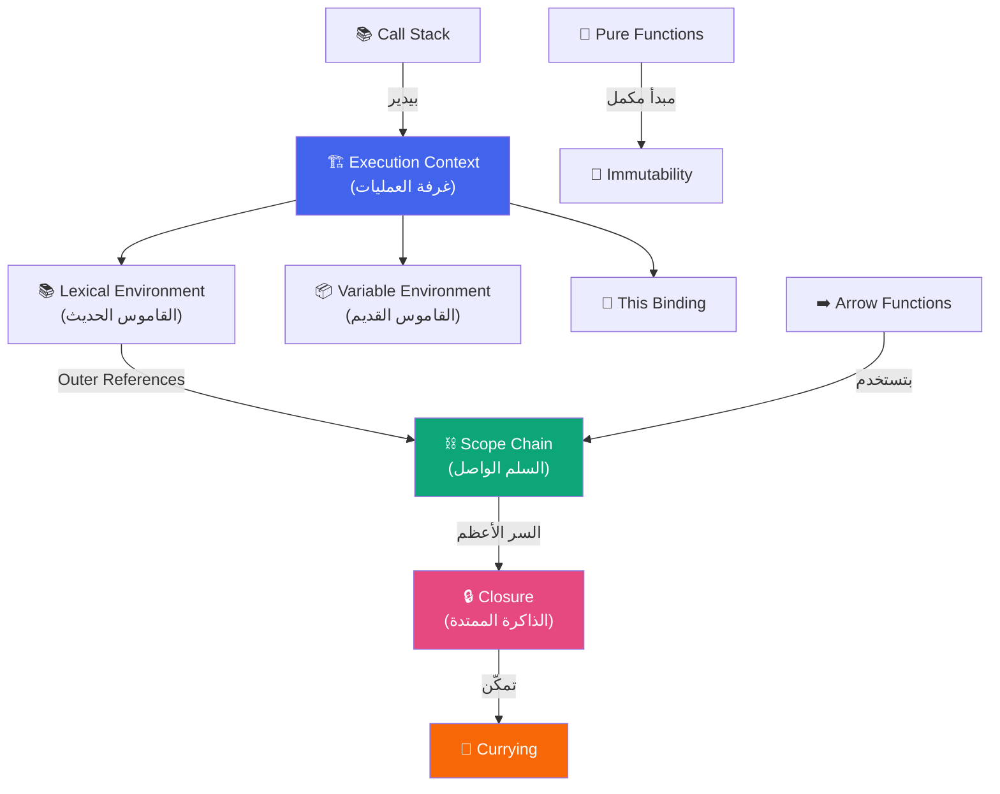

---

## 📋 ملخص الإنترفيو السريع

| المفهوم | الجملة السحرية |
|---|---|
| **LE** | قاموس المتغيرات = Environment Record + Outer Reference |
| **EC** | الحاوية = LE + VE + This Binding، بمرحلتين: Creation ثم Execution |
| **Scope Chain** | سلم الـ Outer References، مبني على مكان الكتابة مش النداء |
| **Closure** | الدالة الداخلية تحافظ على الـ LE بتاع الـ Parent حتى بعد موته |
| **Pure Functions** | نفس Input → نفس Output، من غير Side Effects |
| **Immutability** | بدل الـ Mutation، خد نسخة جديدة بالـ Spread Operator |
| **Arrow + this** | مفيش this خاصة — بتجيبها من الـ Outer Scope |
| **eval** | بيكسر الـ Lexical Scope ويوقف الـ Optimizations — تجنبه |
| **Currying** | `f(a,b,c)` → `f(a)(b)(c)` بالاعتماد على الـ Closures |

---

*📌 لينكات ذات صلة:*
- [[Node.js Interview Prep]]
- [[AWS CLF-C02 Notes]]
- [[DSA Roadmap]]
