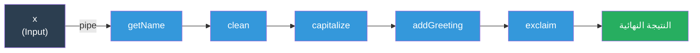
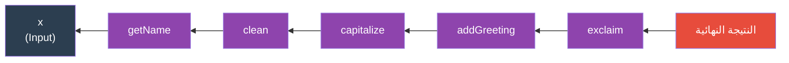
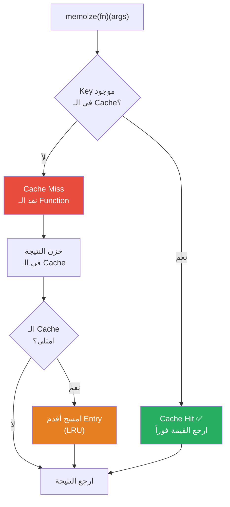
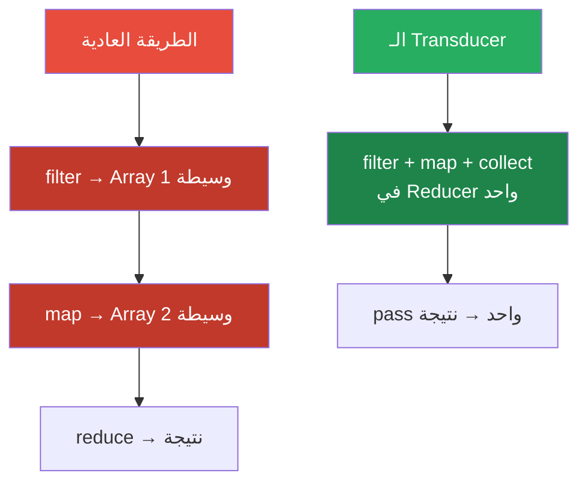
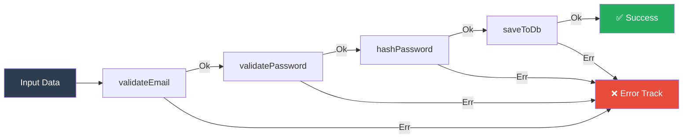
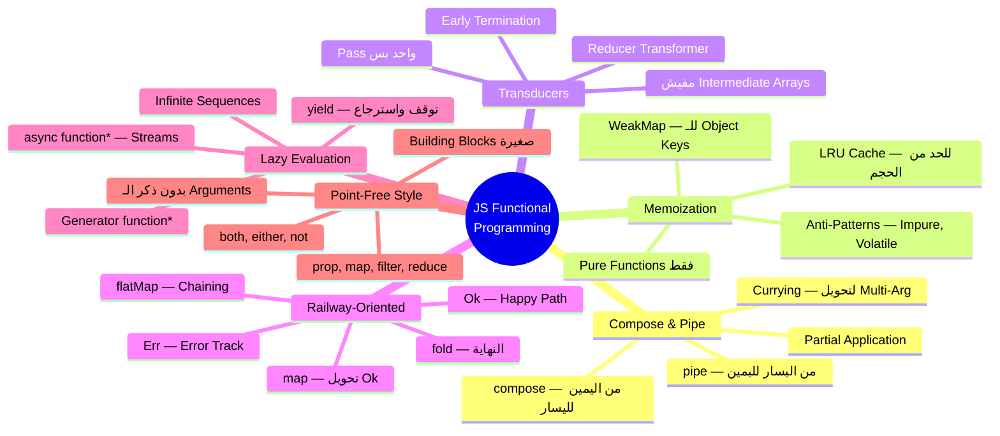

# 🎯 JS Functional Programming: الكود اللي بيفكر صح

> **الهدف من الملف ده:** إنك تفهم Functional Programming مش كـ"أسلوب كتابة كود"، لكن كـ"طريقة تفكير كاملة". لما تخلص الملف ده، هتقدر تبني كود مش بس شغال — لكن compose-able، predictable، و testable بشكل مبهجل. وهتفهم ليه شركات زي Jane Street وImperva بتسأل عن الـ Either Monad في الإنترفيو.

---

## الفهرس

1. [Compose vs Pipe — الـ Pipeline الصح](#1-compose-vs-pipe)
2. [Memoization — الكاش اللي بيتعلم](#2-memoization-deep-dive)
3. [Transducers — الـ Performance السرية](#3-transducers)
4. [Railway-Oriented Programming — الـ Error Handling الحضاري](#4-railway-oriented-programming)
5. [Lazy Evaluation & Infinite Sequences — الـ Generators السرية](#5-lazy-evaluation--infinite-sequences)
6. [Point-Free Style — الكود اللي بيختفي](#6-point-free-style)
7. [Interview Survival Kit 🎯](#7-interview-survival-kit)

---

## 1. Compose vs Pipe

### المشكلة: الكود المتداخل اللي بيجنن

تخيّل معايا إنك شغال على نظام بيعالج بيانات المستخدمين. عندك سلسلة من العمليات: تاخد اسم المستخدم، تنضفه، تعمله capitalize، تضيف greeting، وتعمله trim.

```javascript
// الطريقة العادية — nested hell 😱
const result = trim(
    addGreeting(
        capitalize(
            clean(
                getName(user)
            )
        )
    )
);
// قرأت ده من جوا لبره؟ طب ليه الكود بيكتب من بره لجوا لو هو هيتنفذ من جوا لبره؟
```

ده مش بس قبيح — هو صعب القراءة، صعب الـ debug، وصعب الإضافة. الـ Functional Programming عندها حل اسمه **Function Composition**.

### الـ Compose: من اليمين لليسار

تخيّل الـ `compose` زي رياضيات المدرسة. في الرياضيات، `f(g(x))` بتنفذ `g` الأول وبعدين `f`. الـ `compose` بتعمل نفس الكلام:

```
compose(f, g, h)(x)
        ↑  ↑  ↑
        │  │  └── h بتشتغل أول (على x)
        │  └───── g بتشتغل تاني (على نتيجة h)
        └──────── f بتشتغل أخيراً (على نتيجة g)
```

```javascript
// ── بناء compose من الصفر ────────────────────────────────────
const compose = (...fns) => (x) =>
    fns.reduceRight((acc, fn) => fn(acc), x);
    //    ↑
    //    reduceRight عشان نشتغل من اليمين لليسار

// ── الـ Functions البسيطة ─────────────────────────────────────
const getName    = (user)  => user.name;
const clean      = (str)   => str.trim().replace(/\s+/g, ' ');
const capitalize = (str)   => str.charAt(0).toUpperCase() + str.slice(1).toLowerCase();
const addGreeting= (str)   => `مرحباً يا ${str}!`;
const exclaim    = (str)   => str + ' 🎉';

// ── Compose بيربطهم ───────────────────────────────────────────
const greetUser = compose(
    exclaim,       // 5. آخر حاجة تشتغل
    addGreeting,   // 4.
    capitalize,    // 3.
    clean,         // 2.
    getName        // 1. أول حاجة تشتغل (على الـ input)
);

const user = { name: "  ahmed hassan  " };
console.log(greetUser(user));
// "مرحباً يا Ahmed hassan! 🎉"
```

### الـ Pipe: من اليسار لليمين (الأسهل في القراءة)

الـ `pipe` هو نفس الـ `compose` بس عكسه — الترتيب بتكتبه زي ما بيتنفذ. معظم الـ Developers بيفضلوا الـ `pipe` لأنه أقرب لطريقة تفكيرنا:

```javascript
// ── بناء pipe من الصفر ─────────────────────────────────────────
const pipe = (...fns) => (x) =>
    fns.reduce((acc, fn) => fn(acc), x);
    //  ↑
    //  reduce عادي — من اليسار لليمين

// ── نفس المثال بـ pipe ─────────────────────────────────────────
const greetUser = pipe(
    getName,       // 1. أول حاجة
    clean,         // 2. تاني
    capitalize,    // 3. تالت
    addGreeting,   // 4. رابع
    exclaim        // 5. آخر حاجة
);

// الترتيب بيتقرأ عادي من فوق لتحت ✅
```





### الـ Arity Problem: لما Function بتاخد أكتر من Argument واحد

المشكلة الكبيرة في الـ Composition إن كل Function لازم تاخد **argument واحد بس** وترجع **قيمة واحدة**. طب لو عندي Function بتاخد اتنين؟ هنا بييجي دور الـ **Currying**:

```javascript
// ── Currying بيحل مشكلة الـ Multi-Argument Functions ──────────
const curry = (fn) => {
    const arity = fn.length; // عدد الـ Arguments المتوقعة
    return function curried(...args) {
        if (args.length >= arity) {
            return fn.apply(this, args); // عندنا كفاية — نشتغل
        }
        return (...moreArgs) => curried(...args, ...moreArgs); // لسه ناقص — نستنى
    };
};

// ── Functions بتاخد أكتر من Argument ─────────────────────────
const add        = curry((a, b) => a + b);
const multiply   = curry((a, b) => a * b);
const filter_    = curry((pred, arr) => arr.filter(pred));
const map_       = curry((fn, arr) => arr.map(fn));

// ── Partial Application — نطبق Argument واحد ونوصل Function ──
const add10      = add(10);        // ← function بتاخد رقم وتضيفله 10
const double     = multiply(2);    // ← function بتضاعف
const isEven     = (n) => n % 2 === 0;
const getEvens   = filter_(isEven); // ← function بتفلتر الأرقام الزوجية

// ── النتيجة في Pipe ────────────────────────────────────────────
const processNumbers = pipe(
    getEvens,            // نفلتر الزوجية
    map_(double),        // نضاعف
    map_(add10),         // نضيف 10
);

console.log(processNumbers([1, 2, 3, 4, 5, 6]));
// [14, 18, 22]
// الـ [2,4,6] → [4,8,12] → [14,18,22]
```

### مثال واقعي: Data Pipeline في API

```javascript
// ── سيناريو: بنبني Pipeline لمعالجة بيانات المستخدمين من API ──

const pipe = (...fns) => (x) => fns.reduce((acc, fn) => fn(acc), x);
const curry = (fn) => {
    const arity = fn.length;
    return function curried(...args) {
        return args.length >= arity
            ? fn(...args)
            : (...more) => curried(...args, ...more);
    };
};

// ── الـ Pure Functions الصغيرة ────────────────────────────────
const filterActive    = (users)     => users.filter(u => u.isActive);
const sortByName      = (users)     => [...users].sort((a, b) => a.name.localeCompare(b.name));
const take            = curry((n, arr) => arr.slice(0, n));
const pluck           = curry((key, arr) => arr.map(u => u[key]));
const formatUserName  = (name)      => name.trim().toLowerCase();
const mapOver         = curry((fn, arr) => arr.map(fn));

// ── الـ Pipeline ───────────────────────────────────────────────
const getTopActiveUserNames = pipe(
    filterActive,               // نفلتر المفعلين فقط
    sortByName,                 // نرتب أبجدياً
    take(5),                    // أول 5 بس
    pluck('name'),              // نجيب الأسماء فقط
    mapOver(formatUserName),    // ننضف الأسماء
);

// ── البيانات ──────────────────────────────────────────────────
const users = [
    { name: "Ahmed Hassan", isActive: true },
    { name: "  Mona Ali  ", isActive: false },
    { name: "Youssef Saad", isActive: true },
    { name: "Sara Khaled ", isActive: true },
    { name: "Omar Tarek",   isActive: true },
    { name: "Nada Fathy",   isActive: true },
    { name: "Kareem Mostafa", isActive: false },
];

console.log(getTopActiveUserNames(users));
// ["ahmed hassan", "nada fathy", "omar tarek", "sara khaled", "youssef saad"]
```

> **نصيحة الخبراء:** الـ `pipe` مش بس جمال — هو مسموح بيه في طريقة التفكير. كل Function في الـ Pipeline بتقدر تـ test عليها لوحدها، وبتقدر تحذف أو تضيف خطوة من غير ما تلمس الخطوات التانية. ده اللي بيسموه **Open/Closed Principle** في الـ Functional World.

---

## 2. Memoization Deep Dive

### المشكلة: Function بتتنفذ ألف مرة وبترجع نفس النتيجة

تخيّل معايا إنك عندك Function بتحسب نتيجة معقدة — Fibonacci مثلاً. كل مرة بتنادي عليها بنفس الـ input، بتتنفذ من الأول. ده زي إنك كل يوم بتقوم تحل نفس المعادلة الرياضية بدل ما تكتب الإجابة على ورقة وتبص عليها.

```javascript
// ── المشكلة ────────────────────────────────────────────────────
function fibonacci(n) {
    if (n <= 1) return n;
    return fibonacci(n - 1) + fibonacci(n - 2);
    // fibonacci(40) = ~100 مليون عملية حسابية! 😱
}

console.time('no-memo');
fibonacci(40); // جرب وشوف
console.timeEnd('no-memo'); // ممكن تاخد ثوان
```

### الـ Memoization: الكراسة اللي بتكتب فيها الإجابات

الـ Memoization هي تقنية بتخزن نتيجة Function call عشان لو اتنادت تاني بنفس الـ Arguments، ترجع الـ Cached Result على طول من غير ما تحسبها تاني.

```javascript
// ── Generic Memoize Function ───────────────────────────────────
function memoize(fn) {
    const cache = new Map(); // ← الكراسة بتاعتنا
    
    return function memoized(...args) {
        // بنعمل key من الـ Arguments
        const key = JSON.stringify(args);
        
        if (cache.has(key)) {
            console.log(`Cache hit لـ: ${key} ✅`);
            return cache.get(key); // ← رجع من الكراسة فوراً
        }
        
        const result = fn.apply(this, args); // ← احسب للمرة الأولى
        cache.set(key, result);               // ← اكتب في الكراسة
        return result;
    };
}

// ── مع Fibonacci ───────────────────────────────────────────────
const fastFib = memoize(function fibonacci(n) {
    if (n <= 1) return n;
    return fastFib(n - 1) + fastFib(n - 2); // ← بننادي على النسخة الـ memoized
});

console.time('with-memo');
fastFib(40); // أسرع بكتير
console.timeEnd('with-memo');

fastFib(40); // تانية؟ فورية — من الكاش على طول
```

### مشكلة الـ JSON.stringify كـ Key

الـ `JSON.stringify` مش دايماً بيشتغل صح:

```javascript
// ── مشاكل الـ JSON.stringify ────────────────────────────────────
JSON.stringify([undefined])      // "[null]"    ← غلط
JSON.stringify([function(){}])   // "[null]"    ← غلط
JSON.stringify([NaN])            // "[null]"    ← غلط
JSON.stringify([Symbol()])       // "[null]"    ← غلط
// لو Function بتاخد Objects ديناميكية، ممكن يتضرب

// ── مشكلة تانية: الـ Object Reference ───────────────────────────
const obj = { x: 1 };
const memoFn = memoize((o) => o.x * 2);

memoFn(obj);   // cache key: '{"x":1}'
obj.x = 2;     // غيرنا الـ Object!
memoFn(obj);   // cache key: '{"x":2}' — مش نفس الـ key! لو كان ref-based كان هيتعلق
```

### Memoize أقوى: مع WeakMap للـ Objects

```javascript
// ── Memoize ذكي بيفصل بين Primitives وObjects ─────────────────
function smartMemoize(fn) {
    // للـ Primitive Arguments
    const primitiveCache = new Map();
    
    // للـ Object Arguments (WeakMap مش بيمنع الـ GC)
    const objectCache = new WeakMap();
    
    return function memoized(...args) {
        // لو Argument واحد بس وهو Object — استخدم WeakMap
        if (args.length === 1 && typeof args[0] === 'object' && args[0] !== null) {
            if (objectCache.has(args[0])) {
                return objectCache.get(args[0]);
            }
            const result = fn.apply(this, args);
            objectCache.set(args[0], result);
            return result;
        }
        
        // غير ده — استخدم JSON.stringify
        const key = JSON.stringify(args);
        if (primitiveCache.has(key)) return primitiveCache.get(key);
        
        const result = fn.apply(this, args);
        primitiveCache.set(key, result);
        return result;
    };
}
```

### ⚠️ متى الـ Memoization تبقى Anti-Pattern؟

ده من أهم أسئلة الإنترفيو — الـ Memoization مش دايماً حل:

```javascript
// ── ❌ Anti-Pattern 1: Function مش Pure ──────────────────────
let callCount = 0;

const impureCalc = memoize((x) => {
    callCount++; // ← Side Effect! الـ Function مش Pure
    return x * 2;
});

impureCalc(5); // callCount = 1
impureCalc(5); // callCount = 1 لسه — الـ Side Effect ما اتنفذش!
// ده bug مش optimization

// ── ❌ Anti-Pattern 2: Function بتاخد Random أو Time ────────
const getTimestamp = memoize(() => Date.now());
// كل المرات هترجع نفس الـ Timestamp — كارثة!

// ── ❌ Anti-Pattern 3: Cache بيكبر من غير حدود ──────────────
const memoizeNaive = (fn) => {
    const cache = {};
    return (...args) => {
        const key = JSON.stringify(args);
        if (key in cache) return cache[key];
        return (cache[key] = fn(...args));
    };
};

// لو بتنادي بـ inputs مختلفة دايماً — الـ Cache هيكبر لحد ما الـ Memory تخلص!
// محتاج LRU Cache أو حد أقصى للكاش
```

### Memoize مع LRU Cache (الاحترافي)

```javascript
// ── LRU Cache — بيمسح الأقدم لما الكاش يمتلي ─────────────────
class LRUCache {
    #capacity;
    #cache = new Map(); // ← Map بيحافظ على ترتيب الإدراج

    constructor(capacity = 100) {
        this.#capacity = capacity;
    }

    get(key) {
        if (!this.#cache.has(key)) return undefined;
        
        // نقل للنهاية عشان يبان إنه "Least Recently Used" مش
        const value = this.#cache.get(key);
        this.#cache.delete(key);
        this.#cache.set(key, value);
        return value;
    }

    set(key, value) {
        if (this.#cache.has(key)) {
            this.#cache.delete(key); // نوضع في النهاية
        } else if (this.#cache.size >= this.#capacity) {
            // امسح أول عنصر (الأقدم)
            const firstKey = this.#cache.keys().next().value;
            this.#cache.delete(firstKey);
        }
        this.#cache.set(key, value);
    }

    has(key) {
        return this.#cache.has(key);
    }
}

// ── Memoize بـ LRU ─────────────────────────────────────────────
function memoizeWithLRU(fn, capacity = 100) {
    const cache = new LRUCache(capacity);

    return function memoized(...args) {
        const key = JSON.stringify(args);

        if (cache.has(key)) {
            return cache.get(key);
        }

        const result = fn.apply(this, args);
        cache.set(key, result);
        return result;
    };
}

// ── الاستخدام ──────────────────────────────────────────────────
const expensiveCalc = memoizeWithLRU((n) => {
    // حساب معقد
    let result = 0;
    for (let i = 0; i < n * 1000; i++) result += Math.sqrt(i);
    return result;
}, 50); // نخزن آخر 50 نتيجة بس

expensiveCalc(100); // بيحسب
expensiveCalc(100); // من الكاش ✅
expensiveCalc(200); // بيحسب
// لو الكاش امتلى، أقدم entry اتمسح أوتوماتيك
```



> **نصيحة الخبراء:** الـ Memoization بتشتغل بشكل صح بس مع **Pure Functions** — يعني Functions اللي:
> - لو نادتيها بنفس الـ Input، دايماً بترجع نفس الـ Output
> - مش بتعمل أي Side Effects (مش بتغير في الـ DB، مش بتكتب في الـ DOM، مش بتبعت Network Request)
>
> لو الـ Function مش Pure — الـ Memoization مش بس مش مفيدة، هي فعلاً خطيرة.

---

## 3. Transducers

### المشكلة: الـ map/filter/reduce بتعمل Arrays وسيطة بتاكل ميموري

تخيّل معايا إن عندك Array فيها مليون User. بتعمل عليها `filter` وبعدين `map` وبعدين `reduce`. الكود بيبان كده:

```javascript
const users = [/* مليون user */];

const result = users
    .filter(isActive)      // ← بيعمل Array جديدة فيها مثلاً 600,000 عنصر
    .filter(isAdult)       // ← Array تانية فيها 400,000 عنصر
    .map(getEmail)         // ← Array تالتة فيها 400,000 email
    .reduce(collectUnique, new Set()); // ← هنا بنجمع
```

المشكلة إن كل خطوة **بتقرأ Array كاملة وبتعمل Array جديدة**. ده:
- بياكل ميموري كتير (لو البيانات كبيرة)
- بيعمل Garbage Collection كتير
- مش لازم! نقدر نعمل كل ده في pass واحد

### الـ reduce: الأساس اللي كل حاجة بتتبنى عليه

قبل ما نتكلم عن Transducers، لازم تعرف حقيقة مهمة: **كل `map` وكل `filter` ممكن تتعمل بـ `reduce`**:

```javascript
// ── map كـ reduce ────────────────────────────────────────────
const mapAsReduce = (fn, arr) =>
    arr.reduce((acc, x) => [...acc, fn(x)], []);
    // بنجمع النتيجة في Array جديدة

// ── filter كـ reduce ─────────────────────────────────────────
const filterAsReduce = (pred, arr) =>
    arr.reduce((acc, x) => pred(x) ? [...acc, x] : acc, []);
    // بنضيف بس لو الشرط اتحقق

// شايل إيه؟ كل Function بتاخد: accumulator، element، وبترجع accumulator جديد
// ده الـ Reducer!
```

### الـ Transducer: الفكرة الجوهرية

الـ Transducer هو **Transformer للـ Reducers نفسها** — مش بيشتغل على الـ Data مباشرة، هو بيشتغل على الـ Function اللي بتشتغل على الـ Data. ده بيخليك تدمج كل الـ Transformations في Reducer واحد بيشتغل في pass واحد.



```javascript
// ── بناء Transducers خطوة بخطوة ──────────────────────────────

// الـ Mapping Transducer
const mapping = (fn) => (reducer) => (acc, x) => reducer(acc, fn(x));
//              ↑            ↑           ↑
//              fn = التحويل  reducer = المرحلة الجاية   acc, x = العناصر

// الـ Filtering Transducer
const filtering = (pred) => (reducer) => (acc, x) =>
    pred(x) ? reducer(acc, x) : acc;
//  ↑
//  لو الشرط مش متحقق — ارجع الـ accumulator من غير ما تضيف حاجة

// الـ Collecting Reducer (النهاية)
const append = (acc, x) => [...acc, x]; // بيجمع في Array
const addToSet = (acc, x) => new Set([...acc, x]); // بيجمع في Set

// ── Compose الـ Transducers ────────────────────────────────────
const compose = (...fns) => (x) => fns.reduceRight((acc, fn) => fn(acc), x);

// بنبني الـ Transducer Pipeline
const xf = compose(
    filtering(x => x % 2 === 0), // 1. فلتر الزوجية
    mapping(x => x * x),         // 2. تربيع
    mapping(x => x + 1),         // 3. ضيف 1
);

// xf ده Transducer — مش بيشتغل لسه على الـ Data
// بناخده ونطبقه على الـ Collecting Reducer
const transducedReducer = xf(append);

// الآن نعمل reduce واحد بس على الـ Data الأصلية
const result = [1, 2, 3, 4, 5, 6, 7, 8, 9, 10].reduce(transducedReducer, []);

console.log(result);
// [5, 17, 37, 65, 101]
// الـ Evens: [2,4,6,8,10] → Squared: [4,16,36,64,100] → +1: [5,17,37,65,101]
// كل ده في pass واحد! ✅
```

### مثال واقعي كامل: مع Array كبيرة

```javascript
// ── بناء مكتبة Transducers صغيرة ─────────────────────────────

const compose = (...fns) => (x) => fns.reduceRight((v, f) => f(v), x);

// الـ Transducer Combinators
const map     = (fn)   => (reducer) => (acc, x) => reducer(acc, fn(x));
const filter  = (pred) => (reducer) => (acc, x) => pred(x) ? reducer(acc, x) : acc;
const take    = (n)    => (reducer) => {
    let count = 0;
    return (acc, x) => {
        if (count >= n) return acc; // وقف — خدنا كفاية
        count++;
        return reducer(acc, x);
    };
};

// الـ Collectors
const into    = (to, xf, from) => from.reduce(xf(append), to);
const append  = (acc, x) => { acc.push(x); return acc; }; // متغير للسرعة

// ── سيناريو: معالجة بيانات Orders من متجر ───────────────────
const orders = Array.from({ length: 1_000_000 }, (_, i) => ({
    id: i + 1,
    amount: Math.random() * 1000,
    status: Math.random() > 0.3 ? 'completed' : 'pending',
    userId: Math.floor(Math.random() * 1000),
}));

// ── الطريقة العادية (3 intermediate arrays) ───────────────────
console.time('normal');
const normalResult = orders
    .filter(o => o.status === 'completed')  // Array وسيطة 1
    .map(o => o.amount)                     // Array وسيطة 2
    .filter(a => a > 500)                   // Array وسيطة 3
    .slice(0, 10);                          // أخذنا 10
console.timeEnd('normal');

// ── الطريقة بـ Transducers (pass واحد، مش بياخد كل الـ Array) ─
console.time('transducer');
const xf = compose(
    filter(o => o.status === 'completed'),
    map(o => o.amount),
    filter(a => a > 500),
    take(10),                               // بيوقف لما ياخد 10
);

const transducerResult = into([], xf, orders);
console.timeEnd('transducer');

// الـ Transducer أسرع بكتير — وكمان بيوقف أول ما ياخد 10 (early termination)!
```

> ⚠️ **انتبه:** الـ Transducers معقدة — متستخدمش في كل حاجة. استخدمها لما عندك:
> - Arrays/Streams كبيرة جداً (+100k عنصر)
> - سلسلة طويلة من `map/filter`
> - محتاج Early Termination (زي `take`)
>
> للـ Use Cases العادية — الـ `map().filter()` العادية أوضح وأبسط.

---

## 4. Railway-Oriented Programming

### المشكلة: الـ Error Handling بالـ try/catch قبيح ومش Composable

تخيّل إنك بتكتب Function بتعمل Validation للـ User Registration. الطريقة العادية:

```javascript
// ── الطريقة العادية — try/catch جحيم ─────────────────────────
async function registerUser(data) {
    try {
        const validated = validateEmail(data.email);
        // لو فشل — Exception
        
        try {
            const hashed = await hashPassword(data.password);
            // لو فشل — Exception تانية
            
            try {
                const user = await saveToDB({ ...validated, password: hashed });
                // لو فشل — Exception تالتة
                
                try {
                    await sendWelcomeEmail(user.email);
                    return user;
                } catch (emailErr) {
                    // إيه اللي نعمله؟ الـ User اتسجل بس الإيميل ما وصلش
                    // هنرجع error؟ هنكمل؟ 😱
                }
            } catch (dbErr) {
                // الـ DB فشل — إيه اللي نعمله بالـ hash؟
            }
        } catch (hashErr) {
            // ...
        }
    } catch (validationErr) {
        // ...
    }
}
// ده مش كود — ده Callback Hell نسخة جديدة
```

### الفكرة: السكة الحديد

تخيّل معايا إن الكود بتاعك زي قطر على سكة حديد. عندك خطين:
- **الخط الأخضر (Happy Path)**: الكود بيشتغل صح وبيمشي للأمام
- **الخط الأحمر (Error Track)**: لو حصل error، القطر بيتحول لخط الـ Error وبيفضل ماشي من غير ما يوقف الـ Pipeline

```
Input → [Validate] → [Hash] → [Save] → [Email] → Output ✅
              ↓           ↓        ↓        ↓
           Error       Error    Error    Error
              ↓           ↓        ↓        ↓
         [Error Track ←←←←←←←←←←←←←←←←←←←] → Error Output ❌
```

### بناء الـ Result Type (Either Monad)

```javascript
// ── الـ Result Type — Box بيلف نتيجة أو Error ─────────────────

class Ok {
    #value;
    constructor(value) { this.#value = value; }
    
    // بنطبق Function لو الـ Result ناجح
    map(fn) {
        try {
            return new Ok(fn(this.#value));
        } catch (err) {
            return new Err(err.message);
        }
    }
    
    // زي map بس الـ fn بترجع Result هي كمان
    flatMap(fn) {
        try {
            return fn(this.#value);
        } catch (err) {
            return new Err(err.message);
        }
    }
    
    // لو بتستخدم مع Async Functions
    async asyncFlatMap(fn) {
        try {
            return await fn(this.#value);
        } catch (err) {
            return new Err(err.message);
        }
    }
    
    isOk()  { return true;  }
    isErr() { return false; }
    
    // اخرج من الـ Box
    getOrElse(_default)  { return this.#value; }
    getOrThrow()         { return this.#value; }
    
    // اختار: لو Ok نفذ fnOk، لو Err نفذ fnErr
    fold(fnOk, _fnErr) { return fnOk(this.#value); }
    
    toString() { return `Ok(${JSON.stringify(this.#value)})`; }
}

class Err {
    #error;
    constructor(error) { this.#error = error; }
    
    // لو Error — map مش بتعمل حاجة، بترجع نفس الـ Err
    map(_fn)        { return this; }
    flatMap(_fn)    { return this; }
    async asyncFlatMap(_fn) { return this; }
    
    isOk()  { return false; }
    isErr() { return true;  }
    
    getOrElse(defaultValue) { return defaultValue; }
    getOrThrow()            { throw new Error(this.#error); }
    
    fold(_fnOk, fnErr) { return fnErr(this.#error); }
    
    toString() { return `Err(${this.#error})`; }
}

// ── Factory Functions ─────────────────────────────────────────
const ok  = (value) => new Ok(value);
const err = (error) => new Err(error);
```

### Railway في العمل

```javascript
// ── Validation Functions ترجع Result ──────────────────────────

function validateEmail(email) {
    if (!email) return err('الإيميل مطلوب');
    if (!email.includes('@')) return err('الإيميل مش صح');
    if (email.length < 5) return err('الإيميل قصير جداً');
    return ok(email.trim().toLowerCase());
}

function validatePassword(password) {
    if (!password) return err('الباسورد مطلوب');
    if (password.length < 8) return err('الباسورد لازم يكون 8 حروف على الأقل');
    if (!/\d/.test(password)) return err('الباسورد لازم يحتوي على رقم');
    return ok(password);
}

function validateAge(age) {
    const n = parseInt(age);
    if (isNaN(n)) return err('السن لازم يكون رقم');
    if (n < 18) return err('لازم تكون عندك 18 سنة على الأقل');
    if (n > 120) return err('السن غير منطقي');
    return ok(n);
}

// ── Async Operations ترجع Result كمان ────────────────────────
async function hashPassword(password) {
    // Simulate async hashing
    await new Promise(r => setTimeout(r, 100));
    if (Math.random() < 0.01) return err('Hashing service down');
    return ok(`hashed_${password}_${Date.now()}`);
}

async function saveUserToDB(userData) {
    await new Promise(r => setTimeout(r, 100));
    if (userData.email === 'existing@example.com') {
        return err('الإيميل ده مسجل قبل كده');
    }
    return ok({ id: Math.random().toString(36).slice(2), ...userData, createdAt: new Date() });
}

// ── الـ Pipeline النظيف بالـ Railway ─────────────────────────
async function registerUser({ email, password, age }) {
    return validateEmail(email)
        .flatMap(validEmail =>
            validatePassword(password)
                .flatMap(validPass =>
                    validateAge(age)
                        .map(validAge => ({
                            email: validEmail,
                            password: validPass,
                            age: validAge,
                        }))
                )
        )
        .asyncFlatMap(hashPassword) // Async step
        .then(r => r.asyncFlatMap(saveUserToDB));
}

// ── الاستخدام ─────────────────────────────────────────────────
async function main() {
    const result = await registerUser({
        email: "ahmed@example.com",
        password: "pass123456",
        age: "25",
    });

    result.fold(
        (user) => console.log('✅ تسجيل ناجح:', user),
        (error) => console.log('❌ خطأ:', error),
    );

    // ── لو الـ Validation فشل ─────────────────────────────────
    const failResult = await registerUser({
        email: "not-an-email",
        password: "123",
        age: "15",
    });

    failResult.fold(
        (user)  => console.log('✅', user),
        (error) => console.log('❌', error), // "الإيميل مش صح" — أول error
    );
}

main();
```

### Pipe مع Railway

```javascript
// ── makeResult: بتحول Function عادية لـ Function بترجع Result ─
const safeRun = (fn) => (...args) => {
    try {
        return ok(fn(...args));
    } catch (e) {
        return err(e.message);
    }
};

// ── Pipeline هيمشي على الـ Railway ────────────────────────────
const parseJSON = safeRun(JSON.parse);
const getUsers  = safeRun((data) => {
    if (!Array.isArray(data.users)) throw new Error('مفيش users في الـ JSON');
    return data.users;
});
const filterAdults = safeRun((users) => {
    const adults = users.filter(u => u.age >= 18);
    if (adults.length === 0) throw new Error('مفيش بالغين في البيانات');
    return adults;
});

// ── الاستخدام ─────────────────────────────────────────────────
const processInput = (jsonString) =>
    parseJSON(jsonString)
        .flatMap(getUsers)
        .flatMap(filterAdults)
        .fold(
            (users) => `تم معالجة ${users.length} مستخدم`,
            (error) => `خطأ: ${error}`,
        );

console.log(processInput('{"users": [{"name": "Ahmed", "age": 25}, {"name": "Sara", "age": 16}]}'));
// "تم معالجة 1 مستخدم"

console.log(processInput('invalid json'));
// "خطأ: Unexpected token 'i', "invalid json" is not valid JSON"

console.log(processInput('{"products": []}'));
// "خطأ: مفيش users في الـ JSON"
```



> **نصيحة الخبراء:** الـ Railway-Oriented Programming بيجعل الـ Error Handling **Composable**. مش محتاج تفكر في "هنعمل إيه لو فشل" في كل خطوة — الـ `Err` بيمشي على الـ Track الأحمر لوحده من غير ما يأثر على باقي الـ Pipeline.

---

## 5. Lazy Evaluation & Infinite Sequences

### المشكلة: محتاج تتعامل مع بيانات لا نهائية أو كبيرة جداً

تخيّل معايا إنك بتبني System بيولد أرقام Fibonacci. عايز تاخد أول 10 أرقام منها. الطريقة العادية؟

```javascript
// ── الطريقة العادية — مستحيلة مع اللانهائي ──────────────────
function getAllFibonacci() {
    const result = [];
    let a = 0, b = 1;
    while (true) {  // ← اللوب ده هيروح لفين؟ لا نهاية!
        result.push(a);
        [a, b] = [b, a + b];
    }
    return result; // ← ما هيوصلش هنا أبداً
}
```

الحل هو **Lazy Evaluation** — بنحسب القيم فقط لما نطلبها، مش كلها دفعة واحدة.

### الـ Generator Functions: المصنع اللي بيشتغل عند الطلب

الـ Generator هو function خاصة بتستخدم `function*` وبتعمل `yield` بدل `return`. كل مرة بتطلب منه value، بيتنفذ لحد أول `yield` وبعدين بيقف ويستنى لما تطلبه تاني:

```javascript
// ── أبسط Generator ────────────────────────────────────────────
function* simpleGen() {
    console.log('قبل أول yield');
    yield 1;
    console.log('بين الأول والتاني');
    yield 2;
    console.log('قبل التالت');
    yield 3;
    console.log('خلصنا');
}

const gen = simpleGen();
// لسه ما اشتغلش! الـ Generator مش بيشتغل لحد ما تطلبه

console.log(gen.next()); // "قبل أول yield" ثم { value: 1, done: false }
console.log(gen.next()); // "بين الأول والتاني" ثم { value: 2, done: false }
console.log(gen.next()); // "قبل التالت" ثم { value: 3, done: false }
console.log(gen.next()); // "خلصنا" ثم { value: undefined, done: true }
```

### Infinite Sequences: التسلسل اللانهائي

```javascript
// ── Fibonacci لا نهائي ────────────────────────────────────────
function* fibonacci() {
    let a = 0, b = 1;
    while (true) { // ← ده OK! الـ Generator بيتوقف بين الـ yields
        yield a;
        [a, b] = [b, a + b];
    }
}

// ── Range لا نهائي ────────────────────────────────────────────
function* range(start = 0, end = Infinity, step = 1) {
    for (let i = start; i < end; i += step) {
        yield i;
    }
}

// ── Natural Numbers ────────────────────────────────────────────
function* naturals(from = 1) {
    while (true) yield from++;
}
```

### مكتبة Lazy Operations كاملة

```javascript
// ── take: خد N عناصر من أي Generator ─────────────────────────
function* take(n, iterable) {
    let count = 0;
    for (const x of iterable) {
        if (count >= n) return; // ← وقف
        yield x;
        count++;
    }
}

// ── map: طبق Function على كل عنصر (Lazy) ────────────────────
function* lazyMap(fn, iterable) {
    for (const x of iterable) {
        yield fn(x); // ← مش بيحسب كلها — بيحسب واحدة واحدة
    }
}

// ── filter: فلتر Lazy ─────────────────────────────────────────
function* lazyFilter(pred, iterable) {
    for (const x of iterable) {
        if (pred(x)) yield x;
    }
}

// ── zip: ادمج اتنين Iterables ─────────────────────────────────
function* zip(iter1, iter2) {
    const it1 = iter1[Symbol.iterator]();
    const it2 = iter2[Symbol.iterator]();
    while (true) {
        const { value: v1, done: d1 } = it1.next();
        const { value: v2, done: d2 } = it2.next();
        if (d1 || d2) return;
        yield [v1, v2];
    }
}

// ── flatten: افرد الـ Nested Iterables ───────────────────────
function* flatten(iterable, depth = 1) {
    for (const x of iterable) {
        if (depth > 0 && x != null && typeof x[Symbol.iterator] === 'function' && typeof x !== 'string') {
            yield* flatten(x, depth - 1);
        } else {
            yield x;
        }
    }
}

// ── collect: حول Generator لـ Array لما تبقى جاهز ────────────
const toArray = (iterable) => [...iterable];
const toSet   = (iterable) => new Set(iterable);
const toMap   = (keyFn, iterable) => new Map([...iterable].map(x => [keyFn(x), x]));

// ── sum: جمع كل عناصر الـ Generator ─────────────────────────
const sum = (iterable) => {
    let total = 0;
    for (const x of iterable) total += x;
    return total;
};
```

### تطبيقات عملية

```javascript
// ── مثال 1: أول 10 أرقام Fibonacci الزوجية ──────────────────
const result1 = toArray(
    take(10,
        lazyFilter(
            n => n % 2 === 0,
            fibonacci()
        )
    )
);

console.log(result1);
// [0, 2, 8, 34, 144, 610, 2584, 10946, 46368, 196418]
// من تسلسل لا نهائي — بحسبنا بس اللي محتاجناه!

// ── مثال 2: مجموع أول 1000 مربع فردي ─────────────────────────
const result2 = sum(
    lazyMap(
        n => n * n,
        lazyFilter(
            n => n % 2 !== 0,
            take(1000, naturals())
        )
    )
);

console.log(result2); // مجموع [1, 9, 25, 49, ...] لأول 1000 رقم فردي

// ── مثال 3: Paginated API (جلب الصفحات وقت الطلب) ────────────
async function* fetchPages(baseUrl) {
    let page = 1;
    while (true) {
        const response = await fetch(`${baseUrl}?page=${page}`);
        const data = await response.json();
        
        if (data.items.length === 0) return; // خلصت الصفحات
        
        yield* data.items; // ← كل عنصر بيتوصل فوراً
        page++;
    }
}

// استخدام: بناخد أول 50 item من الـ API من غير ما نجيب كل الصفحات
async function getFirst50Items(url) {
    const items = [];
    for await (const item of fetchPages(url)) {
        items.push(item);
        if (items.length >= 50) break; // ← بنوقف من غير ما نجيب بقية الـ Pages!
    }
    return items;
}

// ── مثال 4: Sliding Window ────────────────────────────────────
function* slidingWindow(size, iterable) {
    const window = [];
    for (const x of iterable) {
        window.push(x);
        if (window.length > size) window.shift();
        if (window.length === size) yield [...window];
    }
}

// Moving average
const prices = [10, 12, 11, 14, 13, 15, 16, 14, 17, 19];
const movingAvg = toArray(
    lazyMap(
        window => window.reduce((a, b) => a + b, 0) / window.length,
        slidingWindow(3, prices)
    )
);

console.log(movingAvg);
// [11, 12.33, 12.67, 14, 14.67, 15, 15.67, 16.67]
```

### Lazy Pipeline بـ Chaining

```javascript
// ── بناء Lazy Pipeline Class ───────────────────────────────────
class LazyPipeline {
    #generator;

    constructor(iterable) {
        this.#generator = (function* () { yield* iterable; })();
    }

    static from(iterable) {
        return new LazyPipeline(iterable);
    }

    map(fn) {
        const gen = this.#generator;
        return new LazyPipeline((function* () {
            for (const x of gen) yield fn(x);
        })());
    }

    filter(pred) {
        const gen = this.#generator;
        return new LazyPipeline((function* () {
            for (const x of gen) if (pred(x)) yield x;
        })());
    }

    take(n) {
        const gen = this.#generator;
        return new LazyPipeline((function* () {
            let count = 0;
            for (const x of gen) {
                if (count++ >= n) return;
                yield x;
            }
        })());
    }

    // Terminal operations (بيجمع النتيجة)
    toArray()       { return [...this.#generator]; }
    first()         { return this.#generator.next().value; }
    sum()           { let t = 0; for (const x of this.#generator) t += x; return t; }
    count()         { let c = 0; for (const _ of this.#generator) c++; return c; }
    forEach(fn)     { for (const x of this.#generator) fn(x); }
}

// ── الاستخدام الجميل ──────────────────────────────────────────
function* primes() {
    const isPrime = (n) => {
        if (n < 2) return false;
        for (let i = 2; i <= Math.sqrt(n); i++) {
            if (n % i === 0) return false;
        }
        return true;
    };
    yield* LazyPipeline.from(naturals(2)).filter(isPrime).#generator;
}

// أول 10 أعداد أولية أكبر من 100
const bigPrimes = LazyPipeline
    .from(naturals(101))
    .filter(n => {
        for (let i = 2; i <= Math.sqrt(n); i++) if (n % i === 0) return false;
        return true;
    })
    .take(10)
    .toArray();

console.log(bigPrimes);
// [101, 103, 107, 109, 113, 127, 131, 137, 139, 149]
```

> **نصيحة الخبراء:** الـ Lazy Evaluation ذكية جداً في ثلاث حالات:
> 1. **Infinite Sequences** — زي Fibonacci أو Prime Numbers
> 2. **Large Datasets** — لما مش محتاج كل البيانات
> 3. **Expensive Computations** — لما العملية غالية وممكن ما تحتاجهاش
>
> أما لو الـ Dataset صغير وبتحتاج كل العناصر — الـ Array العادية أوضح وأبسط.

---

## 6. Point-Free Style

### المشكلة: الكود المتكرر اللي بيذكر الـ Arguments من غير ما يضيف value

"Point-Free" — الـ "Point" هنا مش نقطة، هي **الـ Argument** (زي ما بيُقال في الرياضيات). "Point-Free" تعني: بنكتب Functions من غير ما نذكر الـ Arguments صراحة.

```javascript
// ── مش Point-Free ────────────────────────────────────────────
const doubleAll    = (arr) => arr.map((x) => x * 2);
const filterEvens  = (arr) => arr.filter((x) => x % 2 === 0);
const sumAll       = (arr) => arr.reduce((acc, x) => acc + x, 0);

// ── Point-Free (نفس الكلام بدون ذكر الـ Arguments) ───────────
const double      = (x) => x * 2;
const isEven      = (x) => x % 2 === 0;
const add         = (a, b) => a + b;

const doubleAll2   = map(double);       // ← ذكرنا الـ fn بس مش الـ arr
const filterEvens2 = filter(isEven);    // ← نفس الموضوع
const sumAll2      = reduce(add, 0);    // ← مش ذكرنا الـ arr

// الاتنين بيعملوا نفس الكلام تماماً
console.log(doubleAll([1, 2, 3]));      // [2, 4, 6]
console.log(doubleAll2([1, 2, 3]));     // [2, 4, 6]
```

### البناء المدرجي للـ Point-Free

```javascript
// ── الأدوات الأساسية ──────────────────────────────────────────
const curry  = (fn) => {
    const arity = fn.length;
    return function curried(...args) {
        return args.length >= arity
            ? fn(...args)
            : (...more) => curried(...args, ...more);
    };
};

const pipe   = (...fns) => (x) => fns.reduce((acc, fn) => fn(acc), x);
const map    = curry((fn, arr) => arr.map(fn));
const filter = curry((pred, arr) => arr.filter(pred));
const reduce = curry((fn, init, arr) => arr.reduce(fn, init));
const prop   = curry((key, obj) => obj[key]);
const eq     = curry((a, b) => a === b);
const gt     = curry((a, b) => b > a);
const lt     = curry((a, b) => b < a);
const not    = (fn) => (...args) => !fn(...args);
const both   = (f, g) => (x) => f(x) && g(x);
const either = (f, g) => (x) => f(x) || g(x);
const always = (x) => () => x;

// ── أمثلة ────────────────────────────────────────────────────

// الطريقة الـ Not Point-Free
const getActiveAdultUsers = (users) =>
    users.filter(u => u.isActive && u.age >= 18);

// الطريقة الـ Point-Free
const isActive  = prop('isActive');
const getAge    = prop('age');
const isAdult   = (u) => getAge(u) >= 18;
const isActiveAdult = both(isActive, isAdult);

const getActiveAdultUsers_pf = filter(isActiveAdult);

// نفس النتيجة!
const users = [
    { name: 'Ahmed', isActive: true, age: 25 },
    { name: 'Sara', isActive: false, age: 30 },
    { name: 'Omar', isActive: true, age: 16 },
    { name: 'Nada', isActive: true, age: 22 },
];

console.log(getActiveAdultUsers(users));
console.log(getActiveAdultUsers_pf(users));
// [{ name: 'Ahmed', ... }, { name: 'Nada', ... }]
```

### مثال متكامل: Data Processing Pipeline بأسلوب Point-Free

```javascript
// ── الـ Building Blocks ───────────────────────────────────────
const split   = curry((sep, str)  => str.split(sep));
const join    = curry((sep, arr)  => arr.join(sep));
const trim    = (str)  => str.trim();
const toLower = (str)  => str.toLowerCase();
const toUpper = (str)  => str.toUpperCase();
const replace = curry((regex, replacement, str) => str.replace(regex, replacement));
const head    = (arr)  => arr[0];
const tail    = (arr)  => arr.slice(1);
const length  = (arr)  => arr.length;
const append  = curry((item, arr) => [...arr, item]);

// ── Pipeline لمعالجة CSV Data ─────────────────────────────────

// تحويل سطر CSV لـ Object
const parseCSVLine = pipe(
    trim,
    split(','),
    map(trim),
);

// تحويل String لـ Slug
const toSlug = pipe(
    trim,
    toLower,
    replace(/\s+/g, '-'),
    replace(/[^a-z0-9-]/g, ''),
);

// تحويل اسم لـ Initials
const toInitials = pipe(
    trim,
    split(' '),
    map(head),
    map(toUpper),
    join(''),
);

// ── الاستخدام ─────────────────────────────────────────────────
console.log(parseCSVLine('  Ahmed Hassan , 25 , Cairo  '));
// ['Ahmed Hassan', '25', 'Cairo']

console.log(toSlug('Hello World & JS!'));
// 'hello-world--js'

console.log(toInitials('Ahmed Hassan Mohamed'));
// 'AHM'

// ── Pipeline أكبر: معالجة قائمة مستخدمين ─────────────────────
const getName     = prop('name');
const getEmail    = prop('email');
const getIsActive = prop('isActive');

const formatUser  = (user) => ({
    ...user,
    slug:     toSlug(user.name),
    initials: toInitials(user.name),
    email:    toLower(user.email),
});

const processUsers = pipe(
    filter(getIsActive),           // فلتر الـ active
    map(formatUser),               // نضيف slug وinitials
    map(u => ({ ...u, name: u.name.trim() })), // ننضف الاسم
);

const rawUsers = [
    { name: '  Ahmed Hassan  ', email: 'AHMED@EXAMPLE.COM', isActive: true },
    { name: 'Sara Ali',         email: 'sara@example.com',  isActive: false },
    { name: 'Omar Saad',        email: 'OMAR@EXAMPLE.COM',  isActive: true },
];

console.log(processUsers(rawUsers));
/*
[
    { name: 'Ahmed Hassan', email: 'ahmed@example.com', slug: 'ahmed-hassan', initials: 'AH', isActive: true },
    { name: 'Omar Saad',   email: 'omar@example.com',  slug: 'omar-saad',    initials: 'OS', isActive: true },
]
*/
```

### Point-Free vs الكود العادي: مقارنة

```javascript
// ── نفس العملية بالطريقتين ────────────────────────────────────

const orders = [
    { id: 1, status: 'completed', amount: 150, userId: 1 },
    { id: 2, status: 'pending',   amount: 200, userId: 2 },
    { id: 3, status: 'completed', amount: 50,  userId: 1 },
    { id: 4, status: 'completed', amount: 300, userId: 3 },
];

// الطريقة العادية
const totalRevenue_normal = orders
    .filter(order => order.status === 'completed')
    .map(order => order.amount)
    .reduce((sum, amount) => sum + amount, 0);

// الطريقة Point-Free
const isCompleted   = pipe(prop('status'), eq('completed'));
const getAmount     = prop('amount');
const addNumbers    = (a, b) => a + b;

const totalRevenue_pf = pipe(
    filter(isCompleted),
    map(getAmount),
    reduce(addNumbers, 0),
)(orders);

console.log(totalRevenue_normal); // 500
console.log(totalRevenue_pf);     // 500
```

| | الطريقة العادية | Point-Free |
|---|---|---|
| قابلية القراءة | أوضح للـ Beginners | أوضح بعد الخبرة |
| إعادة الاستخدام | محدودة | عالية جداً |
| الـ Testing | بتـtest الكل مع بعض | بتـtest كل Building Block |
| الـ Composability | صعبة | سهلة جداً |
| مناسب لـ | مشاريع صغيرة | Functional Codebases كبيرة |

> ⚠️ **انتبه:** الـ Point-Free مش هدف في حد نفسه — هو أسلوب. لو الكود Point-Free بيبقى أصعب في القراءة، ارجع للطريقة العادية. الهدف هو الوضوح مش الـ Style.

---

## 7. Interview Survival Kit 🎯

### 🔗 Compose vs Pipe

---

**Q: إيه الفرق بين `compose` و`pipe`؟**

> كلاهم بيربطوا Functions مع بعض. الفرق في الترتيب فقط:
> - `compose(f, g, h)(x)` بتنفذ `h(x)` الأول، بعدين `g`، بعدين `f` — من اليمين لليسار (زي رياضيات المدرسة)
> - `pipe(f, g, h)(x)` بتنفذ `f(x)` الأول، بعدين `g`، بعدين `h` — من اليسار لليمين (زي قراءة الكود)
>
> بنبنيهم بـ `reduceRight` (compose) و `reduce` (pipe).

---

**Q: إيه الـ Currying وعلاقته بالـ Composition؟**

> الـ Currying بيحول Function بتاخد `n` Arguments لسلسلة من Functions كل واحدة بتاخد Argument واحد. ده مهم للـ Composition لأن الـ compose/pipe بتتوقع Functions بـ Arity 1 (argument واحد). الـ Curry بيخليك تعمل Partial Application — تطبق بعض الـ Arguments وتوصّل Function جاهزة للـ Pipeline.

---

**Q: إزاي تبني `compose` من الصفر؟**

> ```javascript
> const compose = (...fns) => (x) =>
>     fns.reduceRight((acc, fn) => fn(acc), x);
> ```
>
> `reduceRight` بتبدأ من آخر الـ Array — ده اللي بيخلي الـ Functions تتنفذ من اليمين لليسار.

---

### 🧠 Memoization

---

**Q: إيه الـ Memoization وإمتى بتبقى Anti-Pattern؟**

> الـ Memoization هي Caching نتيجة Function call عشان لو اتنادت بنفس الـ Input ترجع الـ Cached Result بدل ما تعيد الحساب. بتبقى Anti-Pattern لما:
> - الـ Function مش Pure (بترجع نتائج مختلفة لنفس الـ Input)
> - الـ Function بيها Side Effects (بتكتب في DB مثلاً)
> - الـ Inputs متنوعة جداً (الـ Cache بيكبر بدون فايدة)
> - النتيجة بتعتمد على الوقت أو State خارجي

---

**Q: ليه بنستخدم `WeakMap` بدل `Map` في الـ Memoization؟**

> لو الـ Keys هي Objects، الـ `Map` بيمسك Reference لها — يعني الـ GC ما يقدرش يمسحها حتى لو محدش بيستخدمها. الـ `WeakMap` بيمسك Weak Reference، يعني لو الـ Object اتمسح من مكان تاني، الـ GC يقدر يمسحه من الـ `WeakMap` تلقائياً — مش هنعمل Memory Leak.

---

**Q: إزاي تبني Generic Memoize Function؟**

> ```javascript
> function memoize(fn) {
>     const cache = new Map();
>     return (...args) => {
>         const key = JSON.stringify(args);
>         if (cache.has(key)) return cache.get(key);
>         const result = fn(...args);
>         cache.set(key, result);
>         return result;
>     };
> }
> ```
>
> المشكلة في `JSON.stringify` إنه ما بيتعاملش مع `undefined`، `Symbol`، `Function` صح. للـ Production — استخدم مكتبة زي `fast-memoize` أو اعمل serializer أفضل.

---

### 🚆 Transducers

---

**Q: إيه الـ Transducer وليه بيكون أسرع من `map().filter()`؟**

> الـ Transducer هو Reducer Transformer — بدل ما تعمل `map` تنتج Array وسيطة وبعدين `filter` تعمل Array تانية، الـ Transducer بيدمج كل العمليات في Reducer واحد. ده بيعني:
> 1. **Pass واحد بس** على الـ Data
> 2. **مفيش Intermediate Arrays** — توفير ميموري
> 3. **Early Termination** — ممكن توقف في النص (زي `take`)

---

**Q: إيه الـ Arity في الـ Functional Programming؟**

> الـ Arity هو عدد الـ Arguments اللي Function بتاخدها. Function بـ Arity 1 = Unary، بـ Arity 2 = Binary، وهكذا. مهم في الـ Composition لأن الـ `compose/pipe` بيتوقع Unary Functions. الـ Currying بيحول أي Function لـ Unary.

---

### 🚃 Railway-Oriented Programming

---

**Q: إيه الـ Either Monad ولماذا أفضل من try/catch؟**

> الـ Either Monad هو Wrapper بيلف القيمة في `Ok` لو الحاجة نجحت أو في `Err` لو فشلت. الفرق عن `try/catch`:
> - **Composable**: ممكن تعمل `map` و`flatMap` على النتيجة من غير ما تتشعب
> - **Explicit**: الـ Error جزء من الـ Type — مش surprise
> - **Pipeline-friendly**: بيشتغل مع `compose` و`pipe` مباشرة
> - **مش Control Flow**: الـ `try/catch` بيكسر الـ Flow — الـ Monad بيحافظ عليه

---

**Q: إيه الـ Happy Path وإيه الـ Error Track؟**

> في الـ Railway-Oriented Programming:
> - **Happy Path**: سلسلة الـ `Ok` — الكود بيمشي للأمام من غير انقطاع
> - **Error Track**: لما يحصل `Err`، الـ Error بيمشي على خط منفصل. كل الـ `map` و`flatMap` التالية بيتجاهلوه لحد ما توصل لـ `fold` أو `getOrElse` في النهاية

---

### 💤 Lazy Evaluation

---

**Q: إيه الـ Generator Function وإزاي بتعمل Lazy Evaluation؟**

> الـ Generator Function (`function*`) بتنتج Iterator. لما بتعمل `yield`، الـ Function بتوقف وبترجع القيمة للـ Consumer. بعدين بتكمل من نفس المكان لما يطلبوا القيمة الجاية. ده Lazy لأن:
> - الكود مش بيشتغل كله من أول
> - بيشتغل خطوة خطوة بس لما تطلب
> - ممكن تعمل Sequences لا نهائية من غير ما الميموري تخلص

---

**Q: إيه الفرق بين `function*` عادية وـ `async function*`؟**

> - `function*`: Synchronous Generator — بيعمل `yield` لقيم عادية
> - `async function*`: Async Generator — بيعمل `yield` لـ Promises. بتستخدمه مع `for await...of`. مثالي لـ Paginated API calls أو Streams.

---

### ☁️ Point-Free Style

---

**Q: إيه الـ Point-Free Style وإيه مزاياه وعيوبه؟**

> Point-Free Style هو كتابة Functions من غير ذكر الـ Arguments الوسيطة. المزايا:
> - **Composability أعلى**: الـ Functions مبنية من Blocks صغيرة
> - **Reusability**: كل Building Block مستقل
> - **Test-friendly**: بتـtest كل حاجة بشكل منفصل
>
> العيوب:
> - صعب للـ Beginners
> - Debugging أصعب أحياناً
> - ممكن يبقى غير واضح لو أفرطت فيه

---

### 📋 جدول المراجعة السريعة

| السؤال | الإجابة الجوهرية |
|---------|-----------------|
| `compose` vs `pipe` | نفس الشيء — الـ `compose` من اليمين، الـ `pipe` من اليسار |
| ليه Currying مهم؟ | يحول Multi-Arg Functions لـ Unary للـ Composition |
| Memoization متى؟ | بس مع Pure Functions |
| ليه LRU Cache؟ | عشان الكاش ما يكبرش بلا حدود |
| WeakMap في Memoize | عشان Objects Keys ما تمنعش الـ GC |
| Transducer ليه أسرع؟ | Pass واحد، مفيش Intermediate Arrays |
| Either Monad إيه؟ | Wrapper للـ Success/Error بيكون Composable |
| Happy Path إيه؟ | سلسلة الـ `Ok` في الـ Railway |
| Generator متى؟ | Infinite Sequences, Large Data, Async Streams |
| `yield` بيعمل إيه؟ | بيوقف الـ Generator وبيرجع القيمة للـ Consumer |
| Point-Free إيه؟ | كتابة Functions من غير ذكر الـ Arguments |
| `prop` بيعمل إيه؟ | بيجيب Property من Object بشكل Curried |
| `both` و `either` | &&  و \|\| بأسلوب Functional |
| Transducer متى؟ | Arrays كبيرة، سلاسل map/filter طويلة |

---



---

🫒 **زتونة الإنترفيو:**

الـ Functional Programming في JavaScript مش مجرد `map` و`filter`. هو طريقة تفكير كاملة قايمة على أربع مبادئ: **Pure Functions** (نفس الـ Input → نفس الـ Output)، **Immutability** (ما بنغيرش البيانات الأصلية)، **Composition** (بنبني الكود من Blocks صغيرة)، و**Declarative Style** (بنقول "إيه" مش "إزاي"). الـ `compose/pipe` بيخليك تبني Pipelines واضحة. الـ `Memoization` بتحسن الـ Performance بس بشروط — Pure Functions فقط. الـ `Transducers` بيجمع كل الـ Map/Filter في Pass واحد. الـ `Railway` بيعمل Error Handling من غير ما يكسر الـ Flow. الـ `Generators` بيخليك تتعامل مع البيانات اللانهائية. والـ `Point-Free` بيخلي الكود Composable في أعلى مستوياته. اللي يفهم الفكر ده بيكتب كود أسهل في الـ Test، أقل في الـ Bugs، وأجمل في القراءة — وده اللي بيميز الـ Senior عن الـ Junior في أي إنترفيو.

---

*آخر تحديث: 2025 | مصادر: "Professor Frisby's Mostly Adequate Guide to FP" + "Functional-Light JavaScript" + ECMAScript Spec + Ramda.js Docs*
