# 🧠 JS Internals: تحت جلد V8

> **الهدف من الملف ده:** إنك تفهم مش بس "إزاي" JavaScript شغالة، لكن "ليه" بتتصرف بالطريقة دي. لما تخلص الملف ده، هتبص على أي Object وتعرف إنه شايل مكان في الـ Heap، وهتعرف ليه ترتيب الـ Properties في الـ Object بيأثر على سرعة الكود، وهتعرف ليه الـ GC أحياناً بيوقف العالم.

---

## الفهرس

1. [Memory Model العميق — فين كل حاجة في الميموري](#1-memory-model-العميق)
2. [V8 Hidden Classes & Inline Caching — السر الخطير](#2-v8-hidden-classes--inline-caching)
3. [Garbage Collection — إزاي V8 بيمسح الميت](#3-garbage-collection-algorithms)
4. [WeakRef & FinalizationRegistry — ES2021 الـ Memory Tools](#4-weakref--finalizationregistry)
5. [Symbols — البروتوكولات الخفية للغة](#5-symbols--well-known-protocols)
6. [Interview Survival Kit 🎯](#6-interview-survival-kit)

---

## 1. Memory Model العميق

### المشكلة: الجافاسكريبت بتتكلم عن الـ Heap والـ Stack — بس مين يروح فين بالظبط؟

معظم الشروحات بتقولك "Primitives في الـ Stack، Objects في الـ Heap" وبعدين بتسيبك. بس ده مش الصورة الكاملة. خلينا نبني الفهم من الصفر.

### الكمبيوتر عنده كذا طبقة ميموري

قبل ما نتكلم عن JS، لازم تعرف إن الميموري مش "حاجة واحدة". الجهاز عنده كذا طبقة بيتعامل معاها:

```
CPU Registers     ← أسرع حاجة، بس عدد محدود جداً (8-16 register)
L1/L2/L3 Cache   ← فيهم الـ Hot Data اللي CPU محتاجها دلوقتي
RAM               ← الـ Working Memory — فيها برامجك الشغالة
Hard Disk/SSD     ← التخزين الدائم — أبطأ بكتير
```

الـ **RAM** هي اللي بيشتغل فيها JS Code بتاعك. وجوه الـ RAM، V8 بيقسم الميموري لمناطق كل منطقة ليها وظيفة مختلفة.

### المناطق التلاتة الأساسية

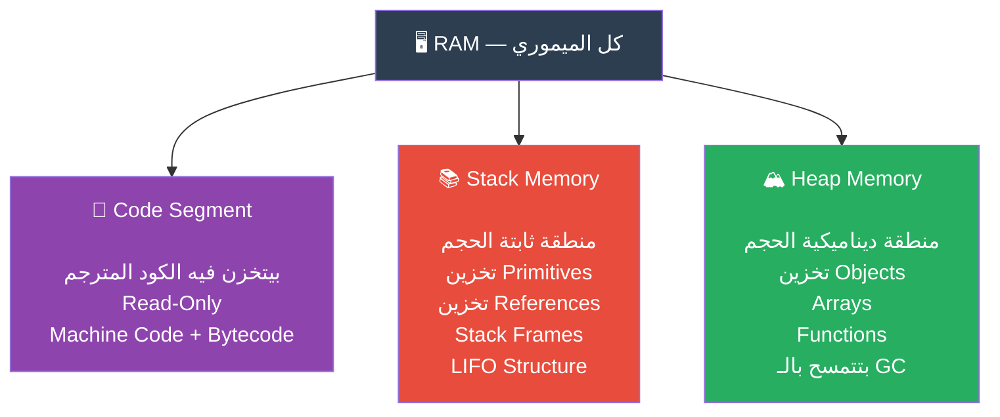

### الـ Stack: الطابق المنظم

الـ **Stack** هي منطقة ميموري بتشتغل بنظام صارم جداً — **LIFO** (Last In, First Out). تخيلها زي برواز الصحون، الصحن اللي حطيته آخر هو اللي هتاخده أول.

```
Stack (من فوق لتحت):

┌─────────────────────────────┐
│ greet() Frame               │ ← آخر حاجة اتحطت، أول حاجة هتطلع
│   name: "Ahmed" (value)     │
│   greeting: ref→Heap#0042   │
├─────────────────────────────┤
│ main() Frame                │
│   x: 42 (value)             │
│   isActive: true (value)    │
│   user: ref→Heap#0001       │ ← مش الـ Object نفسه، بس العنوان
├─────────────────────────────┤
│ Global Frame                │ ← أول حاجة اتحطت، آخر حاجة هتطلع
│   PI: 3.14 (value)          │
└─────────────────────────────┘
```

**إيه اللي بيروح في الـ Stack؟**

- **Primitive Values مباشرة**: `number`, `string`, `boolean`, `null`, `undefined`, `bigint`, `symbol`
- **References (Pointers)**: العنوان في الـ Heap اللي الـ Object موجود فيه — مش الـ Object نفسه
- **Stack Frame بتاع كل Function**: يعني الـ Local Variables وعنوان الرجوع

**الـ Stack Frame:** كل مرة بتنادي Function، V8 بيخلق "Frame" في الـ Stack بيتخزن فيه:

```javascript
function calculateArea(width, height) {
    // ┌─── Stack Frame لـ calculateArea ───────────────────┐
    // │ width: 10       (primitive — القيمة نفسها هنا)      │
    // │ height: 5       (primitive — القيمة نفسها هنا)      │
    // │ area: undefined (primitive — الأول)                 │
    // │ return address: عنوان السطر اللي بعد الـ call      │
    // └────────────────────────────────────────────────────┘
    
    const area = width * height;  // area اتحطت في الـ Frame
    return area;
    
    // لما الـ function تخلص، الـ Frame كله بيتشال من الـ Stack فوراً
    // مفيش GC محتاج — الـ Stack بتتمسح أوتوماتيك
}

const result = calculateArea(10, 5);
// result: 50 — اتحطت في الـ Frame بتاع Global
```

### الـ Heap: المدينة الفوضوية

الـ **Heap** بخلاف الـ Stack مش بيشتغل بنظام ثابت. هو منطقة ميموري ديناميكية — يعني ممكن تخزن فيها أي حجم في أي مكان. الـ Heap ممكن ينكبر ويتصغر وقت التشغيل.

```javascript
// كل ده بيروح في الـ Heap:

const user = { name: "Ahmed", age: 25 };
// ↑ Object في الـ Heap في عنوان مثلاً Heap#0x4A2F

const numbers = [1, 2, 3, 4, 5];
// ↑ Array في الـ Heap في عنوان تاني

function greet(name) { return `Hello ${name}`; }
// ↑ حتى الـ Function نفسها بتتخزن كـ Object في الـ Heap!

const user2 = user;
// ↑ user2 في الـ Stack بيشاور على نفس العنوان Heap#0x4A2F
//   مش نسخة جديدة — نفس الـ Object في الـ Heap
```

### الفرق الجوهري: Value vs Reference Semantics

```javascript
// ── Primitive: Copy by Value ──────────────────────────────
let a = 42;
let b = a;   // نسخة تانية مستقلة في الـ Stack

b = 100;
console.log(a); // 42 — مش اتأثر
console.log(b); // 100

// ── Object: Copy by Reference ─────────────────────────────
let obj1 = { score: 42 };
let obj2 = obj1;  // كلاهم بيشاوروا على نفس الـ Object في الـ Heap

obj2.score = 100;
console.log(obj1.score); // 100 — اتأثر! لأنهم نفس الـ Object
console.log(obj2.score); // 100
```

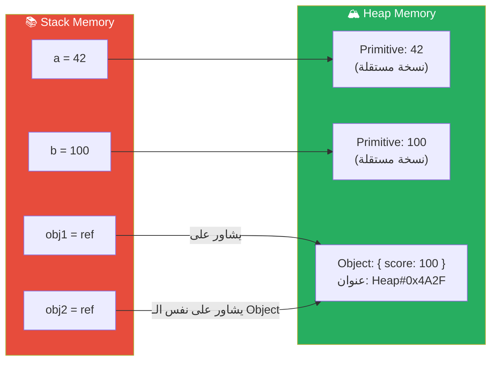

### الـ Stack Frame بالتفصيل: Call Stack ومنطقة الإعدام

```javascript
function outer() {
    const x = 10;            // x: Stack Frame of outer

    function inner() {
        const y = 20;         // y: Stack Frame of inner
        return x + y;         // inner يقرأ x من الـ Closure — Heap!
    }

    return inner();
}

outer();
```

لما الكود ده بيشتغل، الـ Call Stack بيبدو كده:

```
Step 1: قبل أي حاجة
┌─────────────────┐
│   Global Frame  │
└─────────────────┘

Step 2: لما بنادي outer()
┌─────────────────┐
│  outer() Frame  │  ← x = 10 هنا
│   x: 10         │
├─────────────────┤
│   Global Frame  │
└─────────────────┘

Step 3: لما outer بتنادي inner()
┌─────────────────┐
│  inner() Frame  │  ← y = 20 هنا
│   y: 20         │
├─────────────────┤
│  outer() Frame  │
│   x: 10         │
├─────────────────┤
│   Global Frame  │
└─────────────────┘

Step 4: inner بترجع 30، Frame بيتشال
┌─────────────────┐
│  outer() Frame  │
│   x: 10         │
├─────────────────┤
│   Global Frame  │
└─────────────────┘

Step 5: outer بترجع، Frame بيتشال
┌─────────────────┐
│   Global Frame  │
└─────────────────┘
```

> **الـ Closure والـ Heap:** في المثال فوق، لو `inner` اترجعت للبره ومتنفذتش فوراً، الـ `x` مش هيتشال من الـ Stack. بدل كده، V8 بيحول الـ `x` لـ Object في الـ Heap عشان الـ Closure تفضل قادرة توصله. ده بيحصل أوتوماتيك.

### إيه اللي بيروح Stack وإيه اللي بيروح Heap؟ — الجدول النهائي

| البيانات | فين؟ | ليه؟ |
|---------|------|------|
| `number` (مثلاً `42`) | Stack | Primitive، حجم ثابت (64 bit) |
| `string` (قصير) | Stack | V8 بيحط الـ Small Strings جوا الـ Stack أحياناً |
| `string` (طويل) | Heap | V8 بيحطها في الـ Heap ويسيب Reference في الـ Stack |
| `boolean` | Stack | حجم ثابت (1 bit فعلياً) |
| `null` / `undefined` | Stack | قيم Primitive |
| `bigint` | Heap | حجم متغير — محتاج Heap |
| `symbol` | Heap | Object تحت الكبوت |
| `object` `{}` | Heap | حجم متغير — المحتوى في الـ Heap، الـ Reference في الـ Stack |
| `array` `[]` | Heap | Special Object في الـ Heap |
| `function` | Heap | Function Object في الـ Heap |
| Reference / Pointer | Stack | عنوان الـ Object في الـ Heap |
| Local Variable (Primitive) | Stack | جزء من الـ Stack Frame |
| Closure Variable | Heap | V8 بيحولها لـ Heap عشان تعيش |

### الـ V8 Heap من جوه — مش Heap واحد!

اللي كتيير ناس مش عارفينه: V8 مش عنده Heap واحد. هو بيقسم الـ Heap لمناطق مختلفة لأسباب كلها أداء:

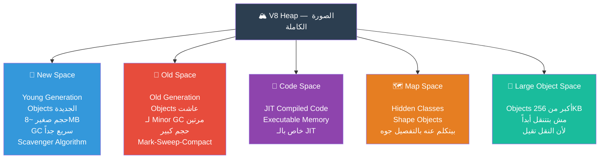

---

## 2. V8 Hidden Classes & Inline Caching

### السؤال اللي Senior بيسألك عليه وانت مش متوقعه

"ليه الـ Object ده أبطأ من ده رغم إنهم نفس الـ Object بالظبط؟"

```javascript
// Object A — سريع
const fast = { x: 1, y: 2 };

// Object B — أبطأ (بنفس القيم!)
const slow = {};
slow.x = 1;
slow.y = 2;
```

الإجابة كلها في حاجة اسمها **Hidden Classes** (أو **Shapes** أو **Maps** — نفس المفهوم بأسماء مختلفة).

### V8 مش بيعمل Dynamic Lookup

في JavaScript، المفروض كل مرة بتاخد `obj.x`، V8 يدور على `x` في الـ Object من أوله. ده سلوك Dynamic اللغة. بس ده **بطيء جداً** على النطاق الكبير.

بدل كده، V8 عنده خدعة عبقرية: **بيتظاهر إن JavaScript Static اللغة.**

### الـ Hidden Class — نسخة خفية من الـ Class

لما بتعمل Object، V8 مش بيخزن بس الـ Properties. هو بيخلق "صورة داخلية" اسمها **Hidden Class** (بيخزنها في الـ Map Space اللي اتكلمنا عنه). الـ Hidden Class بيوصف "شكل" الـ Object — إيه الـ Properties الموجودة وفين كل واحدة في الميموري.

```javascript
// لما بتكتب:
const point = { x: 1, y: 2 };

// V8 بيعمل:
// Hidden Class HC0: { x: offset+0, y: offset+8 }
// point ─► HC0
// point.x ─► offset+0
// point.y ─► offset+8
```

### الـ Transition Chain — سلسلة التحولات

كل ما بتضيف Property، V8 بيعمل Hidden Class جديدة ويعمل "Transition" من القديمة للجديدة:

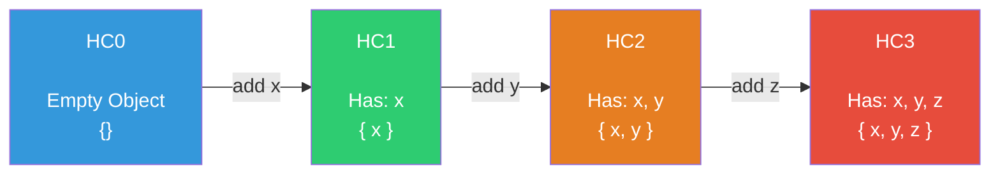

**الجمال هنا:** لو عملت الـ Objects بنفس الترتيب، بيشاوروا على نفس الـ Hidden Classes! V8 ما بيعملش Hidden Class جديدة لكل Object:

```javascript
const p1 = { x: 1, y: 2 };  // بيعمل HC0 → HC1 → HC2
const p2 = { x: 3, y: 4 };  // بيشاور مباشرة على HC2 — مفيش عمل جديد!
const p3 = { x: 5, y: 6 };  // نفس الكلام

// الـ 3 Objects بيشاوروا على نفس الـ HC2
// V8 عارف إن x في offset+0 وy في offset+8
// Property Lookup بيبقى O(1) مباشرة بدون بحث!
```

### الكارثة: لما الـ Shape بتتكسر

```javascript
// ❌ Deoptimization في الحصول
const a = {};
a.x = 1;   // HC0 → HC1 (x)

const b = {};
b.y = 1;   // HC0 → HC_y (y) — Transition مختلفة تماماً!
b.x = 2;   // HC_y → HC_yx (y, x)

// a ── HC1 (x)
// b ── HC_yx (y, x)
// رغم إن الاتنين عندهم x وy، بيشاوروا على Hidden Classes مختلفة!
// V8 مش هيقدر يعمل Optimization مشتركة
```

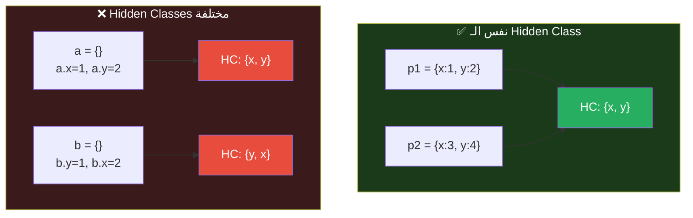

### Inline Caching (IC) — الخدعة الأسرع

الـ Hidden Classes هي الجزء الأول من الخدعة. الجزء التاني هو **Inline Caching**.

الفكرة: V8 مش بس بيفهم الشكل — هو **بيتذكر** نتيجة كل Property Access في نفس مكان الكود.

```javascript
function getX(obj) {
    return obj.x;  // ← V8 بيعمل IC هنا
}
```

أول مرة بيتنادى `getX(point1)`:
- V8 بيدور على `x` ← بيلاقيه في HC2 في offset+0
- **بيخزن** في الـ IC: "لو الـ Object شكله HC2، اتجه لـ offset+0 مباشرة"

تاني مرة بيتنادى `getX(point2)`:
- V8 بيشوف إن `point2` شكله HC2
- **مباشرة** بيروح لـ offset+0 — مفيش lookup خالص!

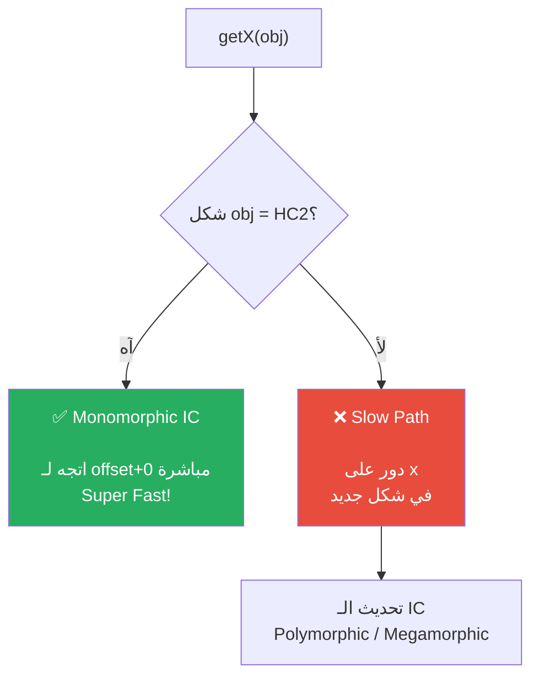

### أنواع الـ IC

| النوع | المعنى | الأداء |
|------|---------|--------|
| **Uninitialized** | أول مرة — لسه مفيش معلومات | بطيء |
| **Monomorphic** | دايماً نفس الـ Shape | 🚀 الأسرع |
| **Polymorphic** | 2-4 Shapes مختلفة | معقول |
| **Megamorphic** | أكتر من 4 Shapes | 🐢 الأبطأ — V8 استسلم |

### العواقب العملية — قواعد الـ Architect

```javascript
// ✅ قاعدة 1: عرّف كل الـ Properties في الـ Constructor
class Good {
    constructor(x, y) {
        this.x = x;      // ← كل الـ Properties موجودة من الأول
        this.y = y;      // ← V8 بيعمل HC واحد ثابت
        this.visible = true;
    }
}

// ❌ ضد القاعدة: إضافة Properties بعدين
class Bad {
    constructor(x, y) {
        this.x = x;
        this.y = y;
    }
    
    show() {
        this.visible = true;  // ← بيكسر الـ HC بعد الـ Constructor!
    }
}
```

```javascript
// ✅ قاعدة 2: نفس الترتيب دايماً
function createPoint(x, y) {
    return { x, y };  // ترتيب ثابت
}

// ❌ ضد القاعدة: ترتيب مختلف حسب conditions
function createConfig(options) {
    const config = {};
    if (options.debug) config.debug = true;  // أحياناً موجودة أحياناً لأ
    config.host = options.host;
    config.port = options.port;
    // كل Object هيبقى ليه HC مختلفة!
    return config;
}

// ✅ الحل:
function createConfigGood(options) {
    return {
        debug: options.debug || false,  // دايماً موجودة (قيمتها false لو مش موجودة)
        host: options.host,
        port: options.port,
    };
}
```

```javascript
// ✅ قاعدة 3: متعدلش Type الـ Property
const obj = { count: 0 };     // count: number ← V8 بيعمل optimization
obj.count = "five";            // ❌ اتغير من number لـ string — Deoptimization!

// ✅ خليها نفس الـ Type دايماً
obj.count = 5;                 // ← كويس، لسه number
```

### ليه `{}` Literal أسرع من Object.create؟

```javascript
// سريع — V8 بيعمل HC فوراً
const a = { x: 1, y: 2 };

// أبطأ شوية — إنشاء Prototype Chain تقيل
const b = Object.create(proto);
b.x = 1;
b.y = 2;

// الأسرع على الإطلاق لمصفوفة من Objects متشابهة
class Point {
    constructor(x, y) { this.x = x; this.y = y; }
}
// ← كل الـ Instances بيشاروا على نفس الـ HC
```

### Debugging: إزاي تشوف الـ Hidden Classes

```javascript
// Node.js: شغّل بـ --allow-natives-syntax
// ثم:
%DebugPrint(obj);  // بيطبع معلومات الـ HC
%OptimizeFunctionOnNextCall(fn);  // بيجبر V8 يعمل Optimize
%GetOptimizationStatus(fn);       // بيقولك هل اتعمل Optimize ولا لأ
```

---

## 3. Garbage Collection Algorithms

### مين بيمسح الـ Objects الميتة؟

لما بتعمل Object وما بتحتاجهوش تاني، V8 محتاج يشيله من الـ Heap. ده الـ **Garbage Collector**. المشكلة: V8 مش يعرف إنت تعبت من الـ Object ولا لأ إلا بطريقة واحدة — **يشوف مين لسه شايل Reference ليه**.

### المفهوم الأساسي: Reachability

الفكرة بسيطة جداً: Object "حي" لو فيه طريق وصال ليه من الـ **GC Roots**. Object "ميت" لو محدش بيشاور عليه.

**الـ GC Roots هي:**
- الـ Global Variables
- الـ Call Stack (المتغيرات المحلية في الـ Functions الشغالة)
- الـ CPU Registers
- الـ Built-in Objects

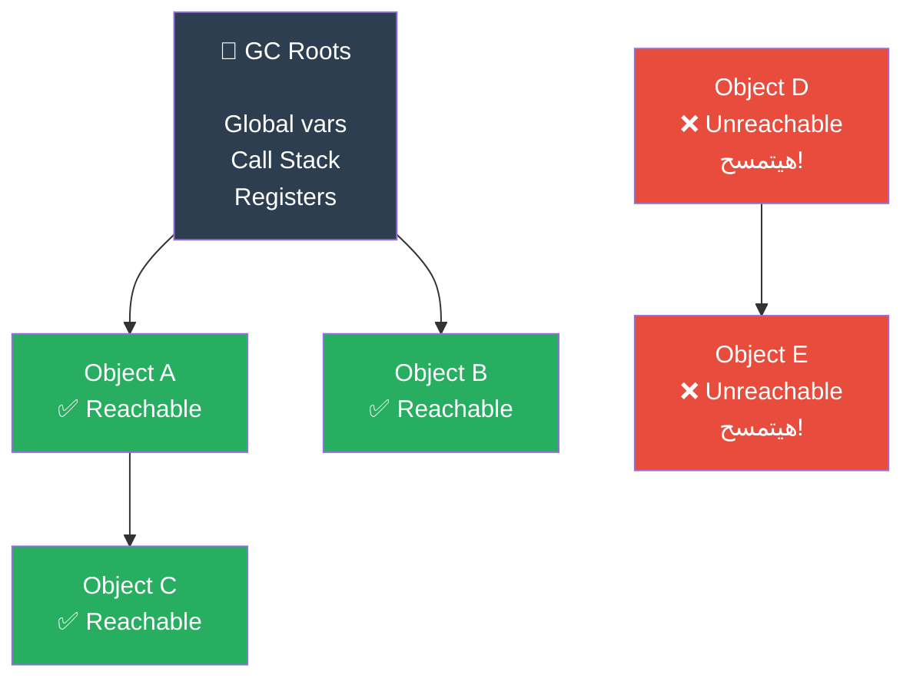

### الـ Algorithm الأساسي: Mark & Sweep

الـ Mark & Sweep هو أقدم وأشهر GC Algorithm. بيشتغل في مرحلتين:

**المرحلة الأولى: Mark (التعليم)**

V8 بيبدأ من الـ GC Roots وبيعمل Graph Traversal (زي BFS أو DFS) على كل الـ Objects. كل Object بيوصله بيعلم عليه "Alive".

**المرحلة التانية: Sweep (الكنس)**

V8 بيعدي على كل الـ Heap. كل Object مش معلم عليه "Alive" — بيتمسح. المكان اللي اتفرغ بيتحط في "Free List" عشان يتملي بـ Objects جديدة.

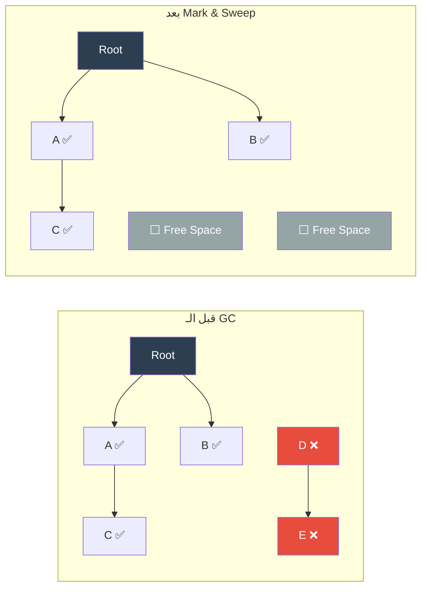

**المشكلة مع Mark & Sweep:** بعد فترة، الـ Heap بيبقى "مثقوب" — فراغات هنا وهناك. الـ **Fragmentation** دي بتخلي V8 يصعب عليه يلاقي مكان متواصل لـ Object كبير. الحل هو إضافة مرحلة تالتة:

**المرحلة التالتة: Compact (الضغط)**

V8 بيحرك الـ Objects الحية لتكون جنب بعض وبيمسح الـ Fragmentation. بس النقل ده تقيل — محتاج يحدّث كل الـ References اللي بتشاور على الـ Objects دي.

### الـ Generational GC: الخدعة العبقرية

المشاهدة: **معظم الـ Objects بتموت بسرعة جداً.**

```javascript
function processRequest(req) {
    const temp = { data: req.body };    // ← هيموت في نفس الـ function
    const result = transform(temp);     // ← هيموت بعد السطر ده
    return result;
}
// temp و result بيتخلقوا ويموتوا في ثواني
```

الـ **Generational Hypothesis** بتقول: لو Object عاش لفترة، الأرجح هيعيش أطول. ومعظم الـ Objects بتموت شابة.

V8 استغل ده بتقسيم الـ Heap لـ **جيلين**:

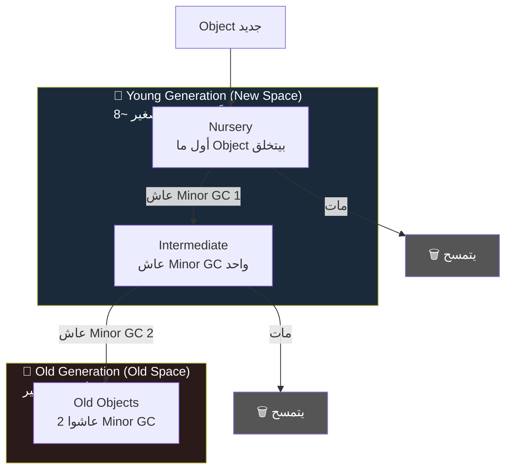

### Minor GC — الـ Scavenger: السريع والعنيف

الـ **Minor GC** (أو Scavenger) بيشتغل على الـ Young Generation بس. الـ Algorithm المستخدم هو **Cheney's Algorithm** وهو عبقري جداً:

**الفكرة:** عندك مساحتين (From-Space و To-Space). Objects الجديدة بتتخلق في الـ From-Space. لما بيتملى، الـ GC بيعدي على الـ Live Objects بس وبينقلهم لـ To-Space. بعدين بيمسح الـ From-Space كله مرة واحدة (مش بيتبعر في الـ Fragmentation). بعدين From وTo بيتبادلوا.

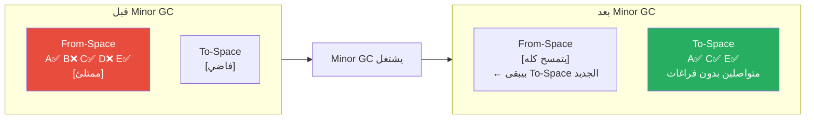

**ليه ده عبقري؟**
- **سريع جداً:** بس بيشتغل على Objects الحية (اللي غالباً قليلة)
- **مش فيه Fragmentation:** الـ To-Space بيبقى متواصل
- **Stop-The-World أقل:** الـ Young Generation صغير → GC بيخلص بسرعة → الكود بيوقف لأقل وقت

### Major GC — Mark-Sweep-Compact: البطيء والشامل

الـ **Major GC** بيشتغل على الـ Old Generation. هنا الـ Objects كبيرة وكتير، فالـ GC بياخد وقت أطول.

المشكلة الكبيرة: **Stop-The-World (STW)**. أثناء الـ GC، الـ Main Thread بيوقف كله — مفيش JS بيشتغل. في Old Generation الكبيرة، ده ممكن يكون بالمللي ثانية الكتير.

V8 حل ده بعدة تقنيات:

#### Incremental Marking
بدل ما يعمل الـ Mark خطوة واحدة ويوقف العالم، V8 بيعمل الـ Marking على شرايح صغيرة — بين كل شريحة بيدي للـ JS وقت يشتغل.

```
قديماً: ────────────────GC──────────────────►
                        ↑ Stop-The-World طويل

بـ Incremental:
────JS────[GC]────JS────[GC]────JS────[GC]────►
           ↑ شرايح صغيرة — توقف قصير لكل واحدة
```

#### Concurrent Marking (V8 الحديث)
V8 بدأ يعمل الـ Marking على Background Threads بالتوازي مع الـ JS! يعني الـ Main Thread مستمر وفي نفس الوقت Thread تانية بتعلم على الـ Objects.

```
Main Thread:   ────────────JS شغال بالكامل────────────►
GC Thread:     ─────────[Marking في الخلفية]──────────►
الدمج: بيوقف بس لفترة قصيرة في النهاية عشان يتحقق
```

### الـ Write Barrier — ضمان الصحة

لما الـ Concurrent Marking شغال، ممكن الـ JS يغير References وهو شغال:

```javascript
// GC يكون عملها Mark على obj1 إنها "Live"
// JS بعدين بيعمل:
obj1.ref = null;        // فصل Reference
obj2.ref = liveObject;  // ضاف Reference جديدة

// GC الـ liveObject شافه من أول؟ ولا مش شايفه بعدين؟
```

الحل هو **Write Barrier** — كود صغير جداً بيشتغل مع كل Write Operation ويبلغ الـ GC إن في Reference اتغيرت. V8 يحتاج يرجع يفحص التغييرات دي.

### الـ Tri-Color Marking

علشان يتعامل مع الـ Incremental والـ Concurrent Marking، V8 بيستخدم **Tri-Color Algorithm**:

| اللون | المعنى |
|------|---------|
| ⬜ White | مش اتزارش بعد — ميت لحد ما يثبت العكس |
| 🔵 Gray | اتزار بس الـ References بتاعته لسه متفحصتش |
| ⬛ Black | اتزار وكل الـ References بتاعته اتفحصت |

```
البداية: كل Objects بـ White

GC Roots ─► تتحول لـ Gray (ضفها لـ Queue)

Loop:
  خد Gray Object من الـ Queue
  ضيفه References (Children) لـ Gray
  حوله لـ Black

النهاية: White Objects = ميتة → تتمسح
         Black Objects = حية → تفضل
```

### مثال كامل: من الكود للـ GC

```javascript
function createOrder(userId) {
    // ── كل ده بيتخلق في الـ Young Generation ──
    const items = [];                    // Array في الـ Heap
    const user = fetchUser(userId);     // Object في الـ Heap
    const discount = calculateDiscount(user); // Primitive في الـ Stack

    for (let i = 0; i < 100; i++) {
        const item = { id: i, price: 10 * i }; // 100 Object في الـ Young Gen
        items.push(item);
    }

    const order = {
        userId,
        items,
        total: items.reduce((s, i) => s + i.price, 0),
        createdAt: new Date()  // Date Object في الـ Heap
    };

    return order;
    // لما الـ function تخلص:
    // - items reference بيتشال من الـ Stack
    // - user reference بيتشال من الـ Stack
    // - الـ items Array نفسها ← لو order.items بيشاور عليها = حية
    // - الـ 100 item Objects ← حية لأن order.items بيشاور عليها
    // - user Object ← مش محدش بيشاور عليه = ميت في الـ Minor GC الجاي
    // - discount ← Primitive في الـ Stack، اتشال مع الـ Frame
}

const myOrder = createOrder("user123");
// myOrder في الـ Global Scope → مش هيتمسح
// بعد فترة لو عملت:
// myOrder = null;
// ← Order Object ومحتوياته هيبقوا Unreachable → GC هيمسحهم
```

---

## 4. WeakRef & FinalizationRegistry

### المشكلة اللي ES2021 جاي يحلها

تخيل الـ Scenario ده:

```javascript
// بتبني Image Editor
const imageCache = new Map();

function loadImage(url) {
    if (imageCache.has(url)) return imageCache.get(url);
    
    const image = new Image(url);  // بياخد ذاكرة كبيرة
    imageCache.set(url, image);    // بيحتفظ بيه في الـ Map
    return image;
}

// المشكلة: الـ Map بيعمل Strong Reference على الـ Images
// حتى لو محدش بيستخدم الـ Image دي تاني، الـ Map لسه شايلاها
// ← Memory Leak كلاسيك!
```

الـ `WeakMap` حلت جزء من المشكلة، لكن مش كل حاجة. الـ **WeakRef** و**FinalizationRegistry** جاءوا يكملوا الصورة.

### WeakRef — Reference الضعيفة

الـ `WeakRef` بيخليك تشاور على Object من غير ما تمنع الـ GC من مسحه. يعني "أنا عايز أشاور على ده، بس لو الـ GC قرر يمسحه — عادي خليه يمسحه."

```javascript
// بدون WeakRef — Strong Reference تمنع GC
let user = { name: "Ahmed", data: new Array(1000000) };
const ref = user;  // ref بيمنع GC حتى لو user = null

user = null;
// Object لسه حي! ref لسه بيشاور عليه
```

```javascript
// مع WeakRef — Weak Reference مش بتمنع GC
let user = { name: "Ahmed", data: new Array(1000000) };
const weakRef = new WeakRef(user);

user = null;  // الـ user Object بقى Unreachable
// GC حر يمسحه في أي وقت

// عشان توصل للـ Object:
const userObj = weakRef.deref();
if (userObj !== undefined) {
    // Object لسه موجود
    console.log(userObj.name);
} else {
    // Object اتمسح من الـ GC
    console.log("اتمسح!");
}
```

**القاعدة الذهبية:** دايماً افحص الـ `deref()` قبل ما تستخدمه. الـ Object ممكن يكون اتمسح في أي لحظة.

### مثال عملي: Smart Cache بـ WeakRef

```javascript
class ImageCache {
    #cache = new Map();
    
    get(url) {
        const ref = this.#cache.get(url);
        if (!ref) return null;
        
        const image = ref.deref();
        if (image === undefined) {
            // Image اتمسح من الـ GC، نضف الـ Cache
            this.#cache.delete(url);
            return null;
        }
        
        return image;  // لسه موجودة
    }
    
    set(url, image) {
        // بنخزن WeakRef مش الـ Object نفسه
        this.#cache.set(url, new WeakRef(image));
    }
}

const cache = new ImageCache();

// استخدام
let bigImage = loadHeavyImage("photo.jpg");
cache.set("photo.jpg", bigImage);

// بعدين
bigImage = null;  // مش محتاجينه
// الـ GC هيمسحه، وأول ما نطلبه من الـ Cache هيرجع null

const img = cache.get("photo.jpg");
if (img) {
    display(img);
} else {
    bigImage = loadHeavyImage("photo.jpg");  // يعيد التحميل
    cache.set("photo.jpg", bigImage);
}
```

### FinalizationRegistry — "خبّرني لما تمسحه"

الـ `FinalizationRegistry` بيخليك تسجّل **Callback** هيتنادى لما Object معين يتمسح من الـ GC.

```javascript
const registry = new FinalizationRegistry((heldValue) => {
    // ده بيتنادى بعد ما الـ Object يتمسح
    console.log(`Object اتمسح: ${heldValue}`);
});

let obj = { name: "Ahmed" };
registry.register(obj, "Ahmed's Object");  // "Ahmed's Object" هو الـ heldValue

obj = null;  // مفيش References تانية
// في الـ GC الجاي:
// → "Object اتمسح: Ahmed's Object"
```

**تحذير مهم:** مش هتعرف إمتى بالظبط هيتنادى الـ Callback. الـ GC مش Deterministic — ممكن يأجل المسح. مش استخدمه لحاجات Timing-Sensitive.

### مثال متقدم: Resource Cleanup

```javascript
// مشكلة: Managing External Resources اللي JS مش مسيطر عليها
class DatabaseConnection {
    #handle;        // Native handle (C++ Resource)
    #registry;      // FinalizationRegistry
    
    constructor(connectionString) {
        this.#handle = openNativeConnection(connectionString);
        
        // نسجل Cleanup Callback
        this.#registry = new FinalizationRegistry((handle) => {
            console.warn("⚠️ Connection اتمسح من الـ GC من غير ما تتقفل يدوي!");
            closeNativeConnection(handle);  // نقفل الـ Native Resource
        });
        
        this.#registry.register(this, this.#handle);
    }
    
    query(sql) {
        if (!this.#handle) throw new Error("Connection مقفولة");
        return executeQuery(this.#handle, sql);
    }
    
    close() {
        if (this.#handle) {
            closeNativeConnection(this.#handle);
            this.#handle = null;
        }
    }
}

// الاستخدام الصح: دايماً اقفل يدوي
const conn = new DatabaseConnection("postgres://...");
try {
    await conn.query("SELECT * FROM users");
} finally {
    conn.close();  // ← دايماً اعمل ده
}

// لو نسيت تقفل، الـ FinalizationRegistry هيقفل بس مش هتعرف إمتى!
```

### WeakRef vs WeakMap — إمتى تستخدم إيه؟

```javascript
// WeakMap: بتخزن داتا إضافية مرتبطة بـ Object
// لو الـ Object اتمسح، الـ Entry اتمسحت أوتوماتيك
const extraData = new WeakMap();
extraData.set(user, { permissions: ["read", "write"] });

// WeakRef: بتشاور على Object ممكن يتمسح
// لازم تفحص deref() قبل الاستخدام
const ref = new WeakRef(user);
const u = ref.deref(); // ممكن undefined

// القاعدة:
// WeakMap  → بتربط داتا بـ Object (مش محتاج deref)
// WeakRef  → بتشاور على Object ممكن يمشي (محتاج deref + check)
```

### الـ Limitations المهمة

```javascript
// ❌ Primitives مش بتشتغل مع WeakRef
const weakNum = new WeakRef(42);      // TypeError!
const weakStr = new WeakRef("hello"); // TypeError!

// ✅ Objects فقط
const weakObj = new WeakRef({ x: 1 }); // OK

// ❌ مش هتعمل WeakRef لـ WeakRef
// ❌ لا تعتمد على الـ Timing — الـ GC مش Deterministic
// ❌ في بعض الـ Environments الـ GC ممكن ما يشتغلش أصلاً!
```

---

## 5. Symbols — البروتوكولات الخفية للغة

### Symbol مش بس "Unique ID"

معظم الناس بتتعلم إن `Symbol()` بينتج "Unique Key مضمون مش هيتكرر". ده صح، بس ده أضعف 10% من قوة الـ Symbol. الـ 90% التانية هم الـ **Well-Known Symbols** — البروتوكولات الخفية اللي بتتحكم في سلوك اللغة نفسها.

### الـ Symbol الأساسي

```javascript
// كل Symbol فريد حتى لو نفس الـ Description
const s1 = Symbol("user");
const s2 = Symbol("user");
console.log(s1 === s2); // false — فريدين تماماً

// لاستخدامه كـ Key في Object
const ID = Symbol("id");
const user = {
    [ID]: 123,           // ← مش بيظهر في for...in
    name: "Ahmed",
};

console.log(user[ID]);  // 123
console.log(user.ID);   // undefined — مش String

// بيظهر بس بـ:
Object.getOwnPropertySymbols(user); // [Symbol(id)]
Reflect.ownKeys(user);              // ["name", Symbol(id)]
```

### الـ Global Symbol Registry

```javascript
// Symbol.for() بيعمل أو يرجع نفس الـ Symbol من Registry عالمي
const s1 = Symbol.for("shared");
const s2 = Symbol.for("shared");
console.log(s1 === s2); // true! — نفس الـ Symbol

// مفيد لمشاركة Symbols بين Modules أو Libraries
// Symbol.keyFor() بيرجع الـ Key
console.log(Symbol.keyFor(s1)); // "shared"
console.log(Symbol.keyFor(Symbol())); // undefined — مش في الـ Registry
```

### Well-Known Symbols — لغة تتكلم مع نفسها

الـ **Well-Known Symbols** هم Symbols موجودة في `Symbol` كـ Properties ثابتة. V8 بيبص عليهم في Objects عشان يحدد السلوك.

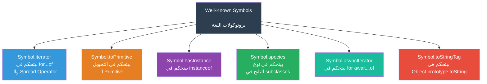

### Symbol.iterator — اعمل حاجة Iterable

كل Object بيعمل `for...of` عليه لازم يكون Iterable. الـ Arrays والـ Strings والـ Maps والـ Sets كلها Iterable لأنها عندها `Symbol.iterator`.

```javascript
// ── إزاي بيشتغل for...of ──────────────────────────────────
const arr = [1, 2, 3];

// الـ for...of بيعمل:
const iterator = arr[Symbol.iterator](); // بيجيب الـ Iterator
let result = iterator.next();
while (!result.done) {
    console.log(result.value); // 1, 2, 3
    result = iterator.next();
}

// ── بناء Iterable من الصفر ────────────────────────────────
class Range {
    constructor(start, end, step = 1) {
        this.start = start;
        this.end = end;
        this.step = step;
    }

    [Symbol.iterator]() {
        // لازم يرجع Iterator object
        let current = this.start;
        const end = this.end;
        const step = this.step;
        
        return {
            next() {
                if (current <= end) {
                    const value = current;
                    current += step;
                    return { value, done: false };
                }
                return { value: undefined, done: true };
            }
        };
    }
}

const range = new Range(1, 10, 2);
for (const num of range) {
    console.log(num); // 1, 3, 5, 7, 9
}

// بيشتغل مع Spread
console.log([...new Range(1, 5)]); // [1, 2, 3, 4, 5]

// بيشتغل مع Destructuring
const [first, second, ...rest] = new Range(1, 10);
console.log(first);  // 1
console.log(second); // 2
console.log(rest);   // [3, 4, 5, 6, 7, 8, 9, 10]
```

```javascript
// ── Generator كـ Iterator (الطريقة الأسهل) ────────────────
class InfiniteCounter {
    constructor(start = 0) {
        this.start = start;
    }
    
    *[Symbol.iterator]() {  // ← * = Generator Function
        let n = this.start;
        while (true) {
            yield n++;
        }
    }
}

const counter = new InfiniteCounter(5);
const first10 = [...counter].slice(0, 10);  // ❌ هيلف للأبد!

// بدل كده:
for (const n of counter) {
    if (n > 15) break;  // ← لازم يكون عندك break condition
    console.log(n);  // 5, 6, 7, 8, 9, 10, 11, 12, 13, 14, 15
}
```

### Symbol.toPrimitive — تحكم في التحويل

```javascript
// ── المشكلة بدون toPrimitive ──────────────────────────────
class Temperature {
    constructor(celsius) {
        this.celsius = celsius;
    }
}

const t = new Temperature(25);
console.log(t + 5);   // "[object Object]5" — مش مفيد
console.log(t > 20);  // true بس بطريقة غلط

// ── الحل بـ Symbol.toPrimitive ────────────────────────────
class Temperature {
    constructor(celsius) {
        this.celsius = celsius;
    }
    
    [Symbol.toPrimitive](hint) {
        // hint = "number" | "string" | "default"
        if (hint === "number") {
            return this.celsius;  // للعمليات الحسابية
        }
        if (hint === "string") {
            return `${this.celsius}°C`;  // للطباعة
        }
        // "default": للـ == والـ +
        return this.celsius;
    }
}

const temp = new Temperature(25);

// "number" hint:
console.log(temp + 5);   // 30
console.log(temp * 2);   // 50
console.log(temp > 20);  // true

// "string" hint:
console.log(`درجة الحرارة: ${temp}`);  // "درجة الحرارة: 25°C"
console.log(String(temp));              // "25°C"

// "default" hint:
console.log(temp == 25);  // true
```

```javascript
// ── مثال أقوى: Money Class ────────────────────────────────
class Money {
    constructor(amount, currency = "EGP") {
        this.amount = amount;
        this.currency = currency;
    }
    
    [Symbol.toPrimitive](hint) {
        if (hint === "number") return this.amount;
        if (hint === "string") return `${this.amount} ${this.currency}`;
        return this.amount;
    }
    
    add(other) {
        if (this.currency !== other.currency) {
            throw new Error("مش نفس العملة!");
        }
        return new Money(this.amount + other.amount, this.currency);
    }
    
    toString() {
        return `${this.amount} ${this.currency}`;
    }
}

const price = new Money(100);
const tax = new Money(14);
const total = price.add(tax);

console.log(total.toString());    // "114 EGP"
console.log(total > 100);        // true (number hint)
console.log(`الإجمالي: ${total}`); // "الإجمالي: 114 EGP" (string hint)
```

### Symbol.hasInstance — تحكم في instanceof

```javascript
class EvenNumber {
    // ← لاحظ: static method
    static [Symbol.hasInstance](num) {
        return Number.isInteger(num) && num % 2 === 0;
    }
}

console.log(2 instanceof EvenNumber);   // true
console.log(3 instanceof EvenNumber);   // false
console.log(4 instanceof EvenNumber);   // true
console.log("hello" instanceof EvenNumber); // false
```

```javascript
// مثال أقوى: Type Checking Library
class TypeChecker {
    #validator;
    
    constructor(validator) {
        this.#validator = validator;
    }
    
    [Symbol.hasInstance](value) {
        return this.#validator(value);
    }
}

const isPositiveNumber = new TypeChecker(
    v => typeof v === "number" && v > 0
);

const isNonEmptyString = new TypeChecker(
    v => typeof v === "string" && v.length > 0
);

console.log(42 instanceof isPositiveNumber);     // true
console.log(-5 instanceof isPositiveNumber);     // false
console.log("hello" instanceof isNonEmptyString); // true
console.log("" instanceof isNonEmptyString);     // false
```

### Symbol.asyncIterator — لـ Async Streams

```javascript
class AsyncDataStream {
    constructor(data, delay = 100) {
        this.data = data;
        this.delay = delay;
    }
    
    async *[Symbol.asyncIterator]() {
        for (const item of this.data) {
            // محاكاة جلب Async
            await new Promise(resolve => setTimeout(resolve, this.delay));
            yield item;
        }
    }
}

const stream = new AsyncDataStream([
    { id: 1, name: "Ahmed" },
    { id: 2, name: "Sara" },
    { id: 3, name: "Ali" },
]);

async function processStream() {
    for await (const user of stream) {
        console.log(`جالي User: ${user.name}`);
    }
    console.log("خلصنا!");
}

processStream();
// بعد 100ms: "جالي User: Ahmed"
// بعد 200ms: "جالي User: Sara"
// بعد 300ms: "جالي User: Ali"
// "خلصنا!"
```

```javascript
// Real-world مثال: Paginated API
class PaginatedAPI {
    constructor(endpoint, pageSize = 20) {
        this.endpoint = endpoint;
        this.pageSize = pageSize;
    }
    
    async *[Symbol.asyncIterator]() {
        let page = 1;
        let hasMore = true;
        
        while (hasMore) {
            const response = await fetch(
                `${this.endpoint}?page=${page}&size=${this.pageSize}`
            );
            const { data, total } = await response.json();
            
            for (const item of data) {
                yield item;
            }
            
            hasMore = page * this.pageSize < total;
            page++;
        }
    }
}

// الاستخدام:
const api = new PaginatedAPI("https://api.example.com/users");

for await (const user of api) {
    await processUser(user);  // بيعمل Pagination أوتوماتيك
}
```

### Symbol.toStringTag — تغيير اسم الـ Type

```javascript
// المشكلة:
class UserService {}
const service = new UserService();
Object.prototype.toString.call(service);  // "[object Object]" — مش مفيد

// الحل:
class UserService {
    get [Symbol.toStringTag]() {
        return "UserService";
    }
}

const service = new UserService();
Object.prototype.toString.call(service);  // "[object UserService]"
console.log(`${service}`);  // بعض المحيطات بتستخدمه

// مفيد جداً في الـ Debugging
```

### Symbol.species — تحكم في نوع الناتج

```javascript
// المشكلة: subclass بيورث methods بيرجعوا الـ parent class!
class SpecialArray extends Array {
    sum() {
        return this.reduce((a, b) => a + b, 0);
    }
}

const special = new SpecialArray(1, 2, 3, 4, 5);
const doubled = special.map(x => x * 2);

console.log(doubled instanceof SpecialArray);  // true — بيرجع SpecialArray
console.log(doubled.sum());                    // 30 — الـ sum method موجودة

// ── تغيير السلوك بـ Symbol.species ──────────────────────────
class MyArray extends Array {
    static get [Symbol.species]() {
        return Array;  // ← map/filter/slice هترجع Array عادية، مش MyArray
    }
    
    sum() {
        return this.reduce((a, b) => a + b, 0);
    }
}

const myArr = new MyArray(1, 2, 3);
const mapped = myArr.map(x => x * 2);

console.log(mapped instanceof MyArray); // false! — رجع Array عادية
console.log(mapped instanceof Array);   // true
// mapped.sum() ← undefined — مش موجودة في Array عادية
```

### تركيب الـ Symbols مع بعض: بناء Protocol كامل

```javascript
// بنبني Collection Class ليها Protocol كامل
class SortedList {
    #items = [];
    #compareFn;
    
    constructor(compareFn = (a, b) => a - b) {
        this.#compareFn = compareFn;
    }
    
    add(item) {
        this.#items.push(item);
        this.#items.sort(this.#compareFn);
        return this;
    }
    
    remove(item) {
        const idx = this.#items.indexOf(item);
        if (idx !== -1) this.#items.splice(idx, 1);
        return this;
    }
    
    // ── Iterable Protocol ──────────────────────────────────
    [Symbol.iterator]() {
        return this.#items[Symbol.iterator]();
    }
    
    // ── Primitive Conversion ───────────────────────────────
    [Symbol.toPrimitive](hint) {
        if (hint === "number") return this.#items.length;
        if (hint === "string") return `SortedList[${this.#items}]`;
        return this.#items.length;
    }
    
    // ── instanceof check ───────────────────────────────────
    static [Symbol.hasInstance](obj) {
        return obj instanceof SortedList;
    }
    
    // ── toString tag ───────────────────────────────────────
    get [Symbol.toStringTag]() {
        return "SortedList";
    }
    
    get size() {
        return this.#items.length;
    }
}

// الاستخدام
const list = new SortedList();
list.add(5).add(3).add(8).add(1).add(4);

// Iteration
for (const item of list) {
    process.stdout.write(item + " ");
}
// 1 3 4 5 8

// Spread
console.log([...list]);  // [1, 3, 4, 5, 8]

// Destructuring
const [min, , , , max] = list;
console.log(min, max);  // 1 8

// Primitive conversion
console.log(`الـ List عندها ${list} عنصر`);  // "الـ List عندها 5 عنصر"
console.log(list > 3);                         // true (5 > 3)

// Type check
console.log(list instanceof SortedList);  // true
console.log(Object.prototype.toString.call(list));  // "[object SortedList]"
```

---

## 6. Interview Survival Kit 🎯

### 🏗️ Memory Model

---

**Q: إيه الفرق بين الـ Stack والـ Heap في JavaScript؟**

> **Stack:** ميموري منظمة بنظام LIFO. بيتخزن فيها الـ Primitive Values مباشرة والـ References (Pointers) للـ Objects والـ Stack Frames بتاعة الـ Functions. بتتمسح أوتوماتيك لما الـ Function تخلص — مفيش GC محتاج.
>
> **Heap:** ميموري ديناميكية فوضوية. بيتخزن فيها الـ Objects والـ Arrays والـ Functions والـ Closures. بتتمسح بالـ GC بس لما يعرف إن محدش بيشاور على الـ Object.

---

**Q: لو عملت `const a = { x: 1 }` وبعدين `const b = a` — هل `b` نسخة من `a`؟**

> لأ. الاتنين بيشاوروا على **نفس الـ Object في الـ Heap**. `a` و`b` كلاهم References (Pointers) موجودين في الـ Stack بيشاوروا على نفس العنوان في الـ Heap. لو غيرت `b.x = 2`، هتلاقي `a.x` بقت `2` برضو.

---

**Q: ليه الـ GC مش بيمسح Object فيه Circular Reference؟**

> في الـ Modern GC (Mark & Sweep)، الـ Circular Reference مش مشكلة. الـ GC مش بيعتمد على "عدد الـ References" (Reference Counting — الطريقة القديمة اللي كانت بتتعلق بالـ Circular). هو بيسأل سؤال واحد: هل في طريق من الـ GC Roots للـ Object ده؟ لو أ وب بيشاوروا على بعض ومحدش تاني بيشاور عليهم من الـ Roots — الاتنين هيتمسحوا.

---

### ⚙️ V8 Hidden Classes & IC

---

**Q: إيه هو Hidden Class وليه V8 بيستخدمه؟**

> الـ Hidden Class (أو Shape) هو تمثيل داخلي بيوصف "شكل" الـ Object — إيه الـ Properties الموجودة وفين كل واحدة في الميموري. V8 بيستخدمه عشان يتجنب الـ Dynamic Lookup مع كل Property Access. لو كل الـ Objects اللي بتتعامل معاهم في نفس الـ Function عندهم نفس الـ Hidden Class، V8 بيعرف مكان كل Property بالـ Offset مباشرة — O(1) من غير بحث.

---

**Q: ليه إضافة Properties بعد الـ Constructor بتبطئ الكود؟**

> لأنها بتكسر الـ Hidden Class. كل Object اتخلق بنفس الـ Constructor ليه نفس الـ Hidden Class — V8 بيتشاور على الـ IC (Inline Cache) اللي بيقوله "offset كذا". لما بتضيف Property بعدين، V8 بيعمل Hidden Class جديدة للـ Object ده بس. دلوقتي مش كل الـ Objects من نفس الـ Constructor بيشاروا على نفس الـ HC — V8 بيفقد القدرة على الـ Monomorphic IC وبيتحول لـ Polymorphic أو Megamorphic (أبطأ).

---

**Q: إيه الفرق بين Monomorphic وMegamorphic IC؟**

> - **Monomorphic:** كل الـ Calls لنفس الـ Function بتيجي من Object بنفس الـ Hidden Class. V8 بيعمل أقوى Optimization — Machine Code مباشر.
> - **Polymorphic:** 2-4 Shapes مختلفة. V8 بيعمل small lookup table.
> - **Megamorphic:** أكتر من 4 Shapes. V8 استسلم — بيعمل Dynamic Lookup في كل مرة زي JavaScript عادية.

---

### 🗑️ Garbage Collection

---

**Q: إيه الفرق بين Minor GC وMajor GC في V8؟**

> - **Minor GC (Scavenger):** بيشتغل على الـ Young Generation (Objects الجديدة). سريع جداً — بيستخدم Cheney's Algorithm (Copy المعيشين لمكان تاني، امسح القديم كله دفعة واحدة). بيحصل كتير.
> - **Major GC (Mark-Sweep-Compact):** بيشتغل على الـ Old Generation (Objects اللي عاشت فترة). أبطأ لأن الـ Old Gen أكبر. بيستخدم Tri-Color Marking + Incremental/Concurrent للتقليل من الـ Stop-The-World.

---

**Q: إيه هو الـ Stop-The-World وإزاي V8 بيقللهوله؟**

> الـ Stop-The-World (STW) هو الفترة اللي الـ GC بيوقف فيها تنفيذ الـ JS خالص عشان يقدر يعمل Heap Traversal بأمان (مش هينتقل Object وهو بيحسب عليه). V8 بيقلله بـ: **Incremental Marking** (الـ Marking على شرايح صغيرة بدل دفعة واحدة) + **Concurrent Marking** (Thread تانية بتعمل الـ Marking في الخلفية جنب الـ JS).

---

**Q: إيه هو الـ Write Barrier ولماذا موجود؟**

> الـ Write Barrier هو كود صغير جداً بيشتغل مع كل عملية كتابة Object Reference. وظيفته: لما الـ Concurrent GC شغال ومتعلم على Objects، والـ JS في نفس الوقت بيغير Reference، الـ Write Barrier بيخبر الـ GC إن في تغيير حصل عشان يرجع يفحص. بدونه، الـ GC ممكن يعمل Mark Object إنه "Live" وبعدين الـ JS يقطع الـ Reference الوحيدة ليه — الـ Object يعمل Dead بس الـ GC مش عارف.

---

### 🔗 WeakRef & FinalizationRegistry

---

**Q: إمتى تستخدم WeakRef بدل WeakMap؟**

> - **WeakMap:** لما بتربط داتا إضافية بـ Object ومحتاجها تتمسح أوتوماتيك لو الـ Object مات. الـ WeakMap نفسه هو الـ Owner.
> - **WeakRef:** لما محتاج تشاور على Object من جهة تانية، وعايز الشارور ده ما يمنعش الـ GC. بتبقى عايز تستخدم الـ Object لو موجود، وتتعامل مع غيابه لو اتمسح.

---

**Q: ليه مش تستخدم FinalizationRegistry للـ Resource Cleanup المضمون؟**

> لأن الـ FinalizationRegistry مش Deterministic — مش هتعرف إمتى هيتنادى الـ Callback. ممكن يتأخر أو حتى مايتنادش في بعض الـ Environments. الـ Resource Cleanup المضمون محتاج يكون Explicit — `close()`, `dispose()`, `try/finally`, أو الـ `using` keyword الجديد (Explicit Resource Management). الـ FinalizationRegistry هو خط دفاع أخير للناسين يقفلوا يدوياً.

---

### 🔣 Symbols

---

**Q: إيه الفرق بين `Symbol()` و`Symbol.for()`؟**

> - `Symbol()`: بيعمل Symbol فريد في كل مرة — حتى بنفس الـ Description مش بيساووا بعض.
> - `Symbol.for("key")`: بيدور في Global Symbol Registry. لو الـ key موجود — بيرجع نفس الـ Symbol. لو مش موجود — بيعمل واحد ويحطه في الـ Registry. مفيد لمشاركة Symbols بين Modules.

---

**Q: إزاي تعمل Object يشتغل معاه `for...of`؟**

> بتضيف `[Symbol.iterator]()` method بترجع Iterator Object. الـ Iterator Object لازم يكون عنده `next()` method بترجع `{ value, done }`.
>
> ```javascript
> class MyRange {
>     constructor(n) { this.n = n; }
>     [Symbol.iterator]() {
>         let i = 0;
>         const n = this.n;
>         return {
>             next() {
>                 return i < n
>                     ? { value: i++, done: false }
>                     : { value: undefined, done: true };
>             }
>         };
>     }
> }
> for (const x of new MyRange(3)) console.log(x); // 0, 1, 2
> ```

---

**Q: إيه هو Symbol.toPrimitive وإمتى بيُستدعى؟**

> `Symbol.toPrimitive` method بتتنادى لما JavaScript محتاجة تحول Object لـ Primitive. بتاخد `hint` بيكون `"number"` أو `"string"` أو `"default"`:
> - `"number"`: في الـ Math Operations (`+obj`, `obj * 2`, `obj > 5`)
> - `"string"`: في `String(obj)`, Template Literals, `console.log`
> - `"default"`: في `==` و `+` مع String

---

### 📋 جدول المراجعة السريعة

| السؤال | الإجابة الجوهرية |
|---------|-----------------|
| Primitives فين؟ | Stack (Value مباشر) |
| Objects فين؟ | Heap (Reference في الـ Stack) |
| Hidden Class إيه؟ | صورة داخلية بتوصف "شكل" الـ Object |
| ليه ترتيب Properties مهم؟ | عشان نفس الـ Hidden Class = أسرع IC |
| Monomorphic يعني إيه؟ | كل الـ Calls بنفس الـ Shape — أسرع Optimization |
| Minor GC سريع ليه؟ | Young Gen صغير + Scavenger سريع |
| Major GC أبطأ ليه؟ | Old Gen كبير + Mark-Sweep-Compact |
| Stop-The-World إيه؟ | JS بيوقف أثناء الـ GC |
| Incremental Marking إيه؟ | GC بيشتغل على شرايح بدل دفعة واحدة |
| WeakRef مش بيمنع إيه؟ | مش بيمنع الـ GC من المسح |
| deref() ممكن يرجع إيه؟ | الـ Object لو موجود، أو `undefined` لو اتمسح |
| Symbol.iterator بيعمل إيه؟ | بيخلي الـ Object يشتغل مع `for...of` |
| Symbol.toPrimitive hint إيه؟ | "number", "string", "default" |
| Symbol.hasInstance بيتحكم في إيه؟ | نتيجة `instanceof` |
| Symbol.for() بيرجع إيه؟ | نفس الـ Symbol لو الـ Key موجود في الـ Registry |

---

*آخر تحديث: 2025 | مصادر: V8 Blog + ECMAScript Spec + Mdn Web Docs + JavaScript: The New Hard Parts*
