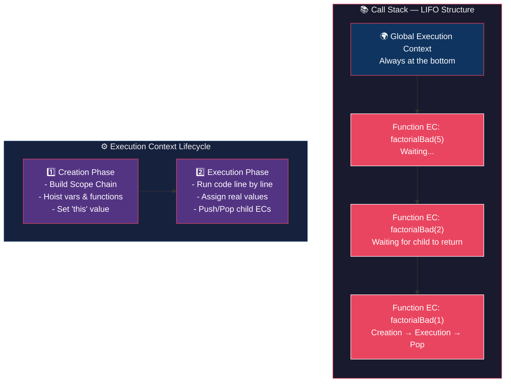
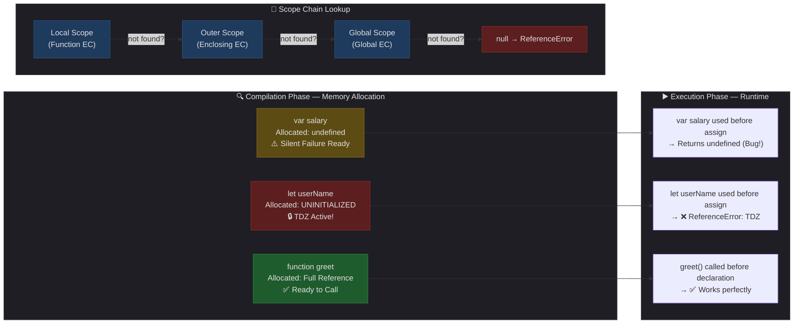
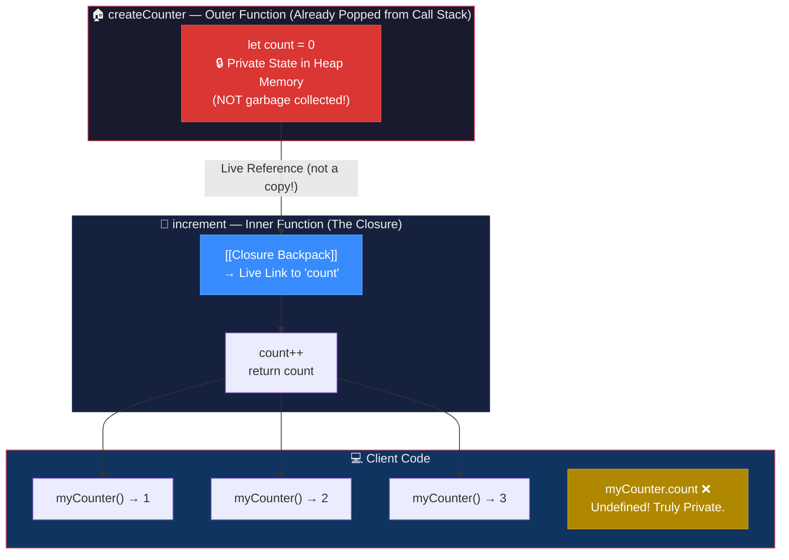
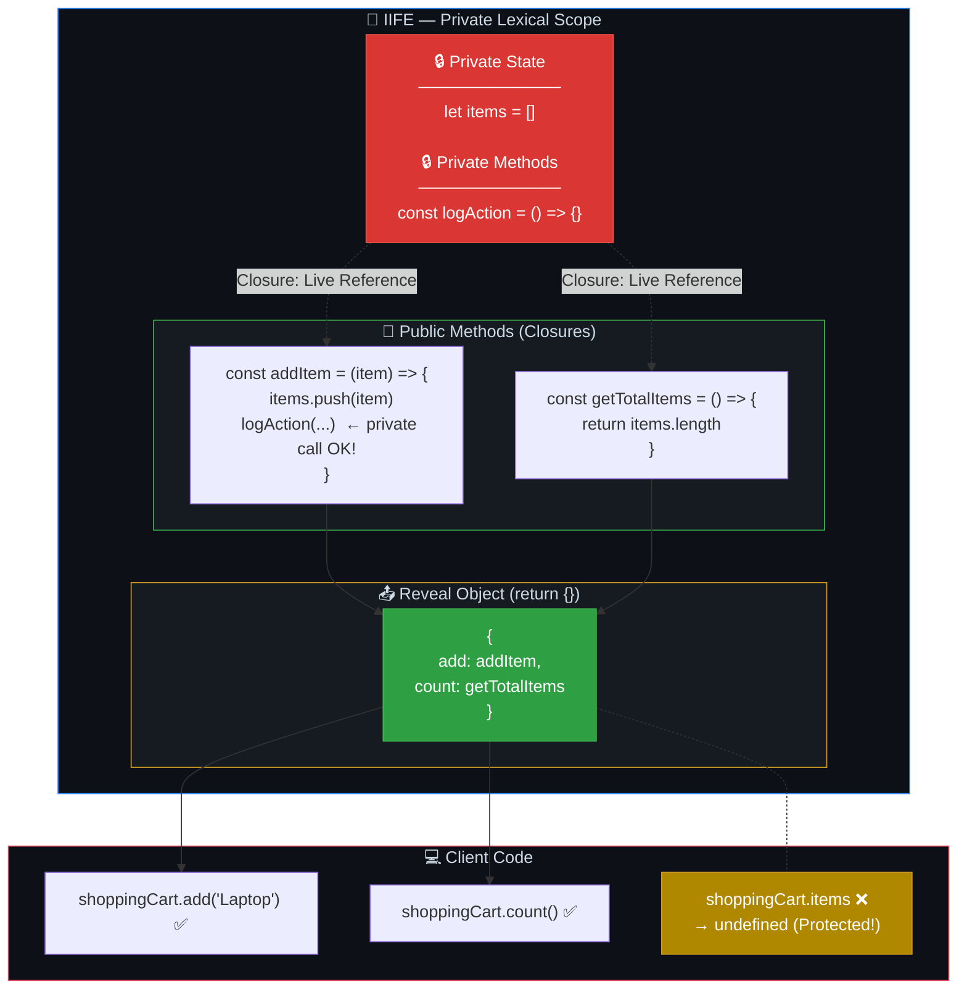
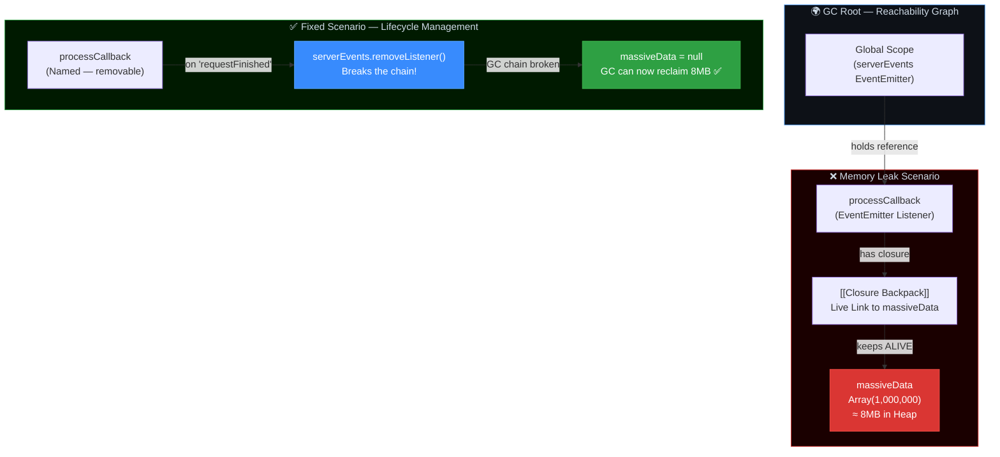

# 🚀 JavaScript Mastery Roadmap — بالعامية المصرية التقنية
> **للـ Junior → Mid-level Developers** | مستوى الـ Big Tech Interview
> ✍️ **المنتور:** Senior Egyptian JS Architect | ⚙️ Engine: V8 | 🌍 Runtime: Node.js

---

# 📦 Module 1: The Execution Engine — بيئة التنفيذ وذاكرة المحرك

> *"الفرق بين المبرمج والـ Architect مش في عدد السطور. في إنه عارف إيه اللي بيحصل تحت الكبوت."*

---

## 1.1 Execution Context & Call Stack
### بيئة التنفيذ وكيف المحرك بيدير الذاكرة

---

> [!bug] 🕵️ فخ الانترفيو
>
> في الانترفيوهات التقيلة، مش هيسألك إيه هو الـ Call Stack لأن أي حد عارف إنه نظام Last In First Out. السؤال الخبيث بيكون:
>
> *"بما إن جافاسكريبت شغالة على مسار تشغيل واحد أو Single Thread، إزاي المحرك بيقدر يدير المتغيرات جوه الوظائف المتداخلة؟ وإيه اللي بيحصل بالظبط في مرحلة الـ Creation ومرحلة الـ Execution لأي بيئة تنفيذ؟ وليه لو نسينا نقطة التوقف في الـ Recursion السيرفر بيضرب خطأ Maximum call stack size exceeded؟"*
>
> الهدف هنا يشوفك فاهم هياكل البيانات اللي بتبني بيئة التشغيل، مش مجرد واحد بيكتب كود وخلاص.

---

> [!abstract] 🧠 المفهوم المعماري
>
> في لغات زي سي بلس بلس و جافا، نظام التشغيل هو اللي بيخصص Thread Stack لكل مسار عشان يتتبع تنفيذ الدوال في الميموري.
>
> في جافاسكريبت، محرك V8 بيعمل ده بنفسه عن طريق هيكل بيانات اسمه Call Stack، واللي بيعتبر نظام صارم بيتبع قاعدة Last In First Out.
>
> كل مرة بتشغل فيها الكود، المحرك بيكريت بيئة تنفيذ اسمها Execution Context. البيئة دي ليها نوعين أساسيين:
>
> **النوع الأول:** Global Execution Context وهو السياق الافتراضي اللي بيتخلق أول ما الفايل يشتغل، وكل الكود اللي بره أي دالة بيشتغل جواه.
>
> **النوع التاني:** Function Execution Context وده بيتخلق في كل مرة بتعمل فيها استدعاء لأي دالة.
>
> أي بيئة تنفيذ بتمر بمرحلتين أساسيتين قبل ما تطلع الناتج:
>
> **1. مرحلة الخلق Creation Phase:** المحرك بيمسح الكود الأول، بيكريت نطاق الرؤية Scope Chain، بيحجز أماكن المتغيرات والدوال في الميموري (وهنا بيحصل الـ Hoisting)، وبيحدد قيمة الكلمة المفتاحية this.
>
> **2. مرحلة التنفيذ Execution Phase:** هنا الكود بيشتغل سطر بسطر، والقيم الحقيقية بتتعين للمتغيرات، والدوال بتتنفذ بشكل فعلي.
>
> لو عملت استدعاء ذاتي Recursion من غير شرط توقف Base case، المحرك هيفضل يعمل Push لبيئات تنفيذ جديدة جوه الـ Call Stack لحد ما المساحة المخصصة تتملي، وساعتها بيضرب خطأ Stack Overflow وبيوقع السيرفر.

---



---

> [!success] ✅ الإجابة النموذجية — الـ Architecture Link
>
> إزاي ده بيفيدنا كـ مهندسين معمارين للسوفت وير؟
>
> في Node.js، إنت شغال على Thread واحد. لو كتبت كود بيعمل عمليات حسابية تقيلة جداً بشكل متزامن، إنت كده بتعمل Block للـ Call Stack.
>
> السيرفر المعماري الصح بيتبني على مبدأ إن الـ Call Stack لازم يفضل فاضي أو بيخلص شغله بسرعة جداً، عشان يقدر يخدم باقي المستخدمين ومايعملش تعطيل للـ Event Loop.
>
> كمان فهمك للـ Call Stack بيخليك تستخدم تقنيات معمارية متقدمة زي **Proper Tail Calls** أو اختصاراً **PTC**، ودي تقنية بتخلي المحرك يعيد استخدام نفس مساحة الميموري للدالة لو كان استدعاء الدالة دي هو آخر خطوة فيها، وده بيوفر استهلاك الميموري بشكل جذري بيوصل لـ **O(1)**.

---

> [!example] 💻 كود الجونيور vs كود المهندس
>
> خلينا نشوف كود مبرمج مبتدئ بيعمل استدعاء ذاتي غبي ممكن يملى الـ Call Stack، وكود مهندس خبير بيستخدم تقنية الـ PTC عشان يخلي الـ Call Stack خفيف وميستهلكش ميموري:
>
> **❌ الكود السيء** — بيستهلك مساحة جديدة في الـ Call Stack لكل لفة:

```javascript
function factorialBad(n) {
    if (n === 0) {
        return 1;
    }
    // The multiplication happens AFTER the recursive call returns.
    // So the Call Stack MUST keep all frames in memory!
    return n * factorialBad(n - 1);
}
console.log(factorialBad(5));
```

> **✅ الكود المعماري** — يستخدم Proper Tail Calls:

```javascript
function factorialArchitect(n, total = 1) {
    if (n === 0) {
        return total;
    }
    // The recursive call is the ABSOLUTE LAST action.
    // The V8 Engine can reuse the same Call Stack frame!
    return factorialArchitect(n - 1, n * total);
}
console.log(factorialArchitect(5));
```

---

> [!tip] 🔍 ابحث أكتر عن:
> - `"V8 Engine Execution Context Creation Phase"`
> - `"Proper Tail Call Optimization JavaScript"`
> - `"Call Stack Stack Overflow Node.js"`

---

> [!question] 🔗 Bridge للدرس الجاي
>
> عظيم جداً. إحنا كده فهمنا بيئة التنفيذ بمرحلتينها، وإزاي الـ Call Stack بيرص البيئات دي فوق بعضها وبيفضيها.
>
> لكن في مرحلة الـ Creation Phase بيحصل حاجة غريبة جداً لبعض المتغيرات.
>
> **سؤال الانترفيو الخبيث اللي بيمهد لدرسنا الجاي:**
>
> *"لو حاولنا نستخدم متغير قبل ما نعمله إعلان صريح، ليه لو كان متعرف بـ الكلمة المفتاحية `var` بيدينا قيمة `undefined`، لكن لو متعرف بـ `let` أو `const` بيضرب Error بسبب حاجة اسمها Temporal Dead Zone؟ وإزاي سياق الرؤية Scope Chain بيربط بيئات التنفيذ ببعضها؟"*

---

## 1.2 Hoisting & Scope Chain
### الـ Temporal Dead Zone (TDZ) والـ Lexical Environment

هنغوص فوراً في واحد من أهم المواضيع اللي بتفصل بين المبرمج العادي والـ Architect الفاهم محركه بيشتغل إزاي.

---

> [!bug] 🕵️ فخ الانترفيو
>
> الإنترفيور الخبيث في الجزء ده مش هيقولك "إيه هو الـ Hoisting؟"، لأنه عارف إنك حافظ إنه "رفع المتغيرات لفوق". لكنه هيسألك سؤال مركب يوقعك:
>
> *"كلنا عارفين إن الـ `var` بيحصلها Hoisting، بس هل الـ `let` والـ `const` بيحصلهم Hoisting كمان؟ لو لأ، ليه الـ JS Engine بيضرب Error لو استخدمناهم قبل الإعلان عنهم بدل ما يدور عليهم في الـ Global Scope؟ ولو آه بيحصلهم Hoisting، ليه بيضربوا ReferenceError بسبب حاجة اسمها الـ Temporal Dead Zone (TDZ)؟ وإزاي سياق الرؤية (Lexical Scope) بيتحكم في الليلة دي كلها؟"*

---

> [!abstract] 🧠 المفهوم المعماري
>
> في لغات زي C++ أو Java، الـ Compiler صارم جداً (Static Typing & Block-Scoped strictly). لو حاولت تستخدم متغير قبل ما تعلن عنه (Declare)، الكود مش هيعمل Compile أصلاً. بيئة التشغيل بتعترف بالمتغير من لحظة كتابته فقط.
>
> في الجافاسكريبت، الموضوع مختلف تماماً، لأن الكود بيمر بمرحلتين: **الـ Compilation (Parsing) ثم الـ Execution**.
>
> **1. الـ Lexical Scope (سياق الرؤية المعجمي):** أثناء مرحلة الـ Compilation، المحرك (JS Engine) بيعمل مسح للكود، وبيخلق حاجة اسمها الـ Lexical Scope. هو بيحدد أماكن المتغيرات والدوال بناءً على "أماكن كتابتها في الكود" (Lexical placement). لو المحرك ملقاش المتغير في بيئة التنفيذ الحالية (Current Scope)، بيبدأ يدور في الـ Scope الأكبر منه، ويفضل يطلع لفوق في سلسلة متصلة اسمها الـ **Scope Chain** لحد ما يوصل للـ Global Scope. لو ملقاهوش، بيضرب ReferenceError.
>
> **2. الـ Hoisting (الرفع):** الـ Hoisting مش معناه إن الكود بيتنقل فيزيائياً من مكانه! ده مجرد "تشبيه" (Metaphor). الحقيقة هي إن في مرحلة الـ Compilation، المحرك بيحجز أماكن للمتغيرات والدوال في الميموري في بداية الـ Scope بتاعهم.
>
> - **الـ Functions:** بتتحجز في الميموري *وبيتم إعطاؤها القيمة الحقيقية بتاعتها* (Function Reference). عشان كده تقدر تستدعي دالة قبل سطر كتابتها.
> - **الـ `var`:** بتتحجز في الميموري *وبيتم إعطاؤها قيمة مبدئية `undefined`*.
>
> **3. الـ Temporal Dead Zone (TDZ) للـ `let` & `const`:** إجابة الفخ: **آه، الـ `let` والـ `const` بيحصلهم Hoisting**. المحرك بيبقى عارف إنهم موجودين في الـ Scope. لكن الفرق الجوهري إنهم **لا يتم إعطاؤهم أي قيمة مبدئية** (Not Initialized). الفترة الزمنية (والمكانية) من بداية الـ Scope لحد السطر اللي بتعمل فيه Initialization للمتغير، بتتسمى الـ **Temporal Dead Zone (TDZ)**. لو حاولت تلمس المتغير في الـ Zone دي، المحرك هيضرب Error في وشك لأنه موجود بس لسه "ميت" أو "غير مهيأ".

---



---

> [!success] ✅ الإجابة النموذجية — الـ Architecture Link
>
> إزاي ده بيفيدنا معمارياً (Architecture & SOLID)؟
>
> استخدام الـ `var` كان بيخلق حالة من الـ Unpredictability (عدم التوقع) ومشاكل زي الـ Variable Leaking وتلويث الـ Global Scope، وده بيضرب مبدأ الـ Encapsulation.
>
> لما ES6 قدمت الـ `let` والـ `const` مع مفهوم الـ **TDZ**، ده كان تطبيق مباشر لمبدأ **POLE (Principle of Least Exposure)** والـ **Fail-Fast**. كمهندس معماري، إنت عايز الكود يضرب Error فوراً لو فيه State أو Data بيتم استخدامها قبل ما تتجهز، بدل ما يكمل بقيمة صامتة زي `undefined` (زي ما الـ `var` بتعمل) وتكتشف الـ Bug بعدين في الـ Production. الـ Lexical Scoping النضيف بيضمن إن كل دالة أو Block مقفول على نفسه (Encapsulated) ومابيتأثرش باللي بره غير بقواعد الـ Scope Chain الصارمة.

---

> [!example] 💻 كود الجونيور vs كود المهندس
>
> خلينا نشوف كود سيء بيعتمد على الـ `var` والـ Hoisting القديم، وكود Architect بيفهم إزاي يسيطر على الـ Scope ويتجنب الـ TDZ:
>
> **❌ الكود السيء** — Hoisting Trap with `var`:

```javascript
// Bad Code: Relying on var hoisting leads to unpredictable state.
function calculateSalaryBad() {
    // salary is accessible here due to hoisting, but initialized to undefined.
    console.log(salary); // Output: undefined (Silent failure/Bug)

    if (true) {
        var salary = 5000; // Leaks out of the if-block!
    }

    console.log(salary); // Output: 5000
}
calculateSalaryBad();
```

> **✅ الكود المعماري** — Strict Lexical Scoping & TDZ:

```javascript
// Architect Code: Fail-Fast using const/let and strict block scoping.
function calculateSalaryArchitect() {
    // console.log(salary); // Throws ReferenceError (TDZ) - Prevents bugs!

    if (true) {
        // Enforcing Principle of Least Exposure (POLE)
        const salary = 5000;
        console.log(salary); // Output: 5000
    }

    // console.log(salary); // Throws ReferenceError (salary is completely encapsulated in the if-block)
}
calculateSalaryArchitect();
```

---

> [!tip] 🔍 ابحث أكتر عن:
> - `"JavaScript Temporal Dead Zone TDZ explained"`
> - `"Lexical Scope vs Dynamic Scope JavaScript"`
> - `"POLE Principle of Least Exposure Kyle Simpson YDKJS"`

---

> [!question] 🔗 Bridge للدرس الجاي
>
> إحنا كده فهمنا الـ Lexical Scope وإزاي المحرك بيربط المتغيرات بأماكنها، وإزاي الـ Scope Chain بيطلع لفوق لحد ما يلاقي الداتا بتاعته، وعرفنا نحمي نفسنا من الـ TDZ.
>
> **سؤال الانترفيو الخبيث اللي بيمهد لدرسنا الجاي:** *"لو الدالة بتدور في الـ Scope Chain بتاعها على المتغيرات وهي بتشتغل.. إيه اللي يحصل لو خلينا دالة (Outer Function) تعمل `return` لدالة تانية (Inner Function) بتستخدم متغيرات من الدالة الأب؟ هل لما الدالة الأب تخلص تنفيذ وتتمسح من الـ Call Stack، المتغيرات بتاعتها هتضيع مع الـ Garbage Collector؟ ولّا الدالة الابن هتحتفظ بـ 'شنطة ذكريات' وتفضل ماسكة فيها؟ وإزاي نقدر نستخدم الحركة دي عشان نبني Data Privacy حقيقية زي الـ `private` في الجافا؟"*

---

## 1.3 Closures — شنطة الذكريات
### الـ Memory Backpack وإزاي الدالة تفتكر اللي مات

لما الدالة الأب بتخلص تنفيذ، الـ Execution Context بتاعها بيتمسح فعلاً من الـ Call Stack، لكن لو الدالة دي رجّعت دالة تانية (Inner Function) بتستخدم متغيرات من الدالة الأب، الـ Garbage Collector مش بيمسح المتغيرات دي! المحرك بيحتفظ بيهم في الميموري كأن الدالة الابن واخداهم في "شنطة ذكريات" (Backpack) وهي خارجة.

خلينا نغوص في أسرار الـ Closures.

---

> [!bug] 🕵️ فخ الانترفيو
>
> في الانترفيو التقيل، مستحيل يسألك "يعني إيه Closure؟". هيجيبلك كود فيه `setTimeout` جوه `for` loop مبنية باستخدام `var`، ويسألك: *"ليه الكود ده بيطبع آخر رقم من اللوب بس في كل المرات؟ وهل الـ Closure بيخزن نسخة (Snapshot) من القيمة وقت ما الدالة اتكريتت، ولّا بيخزن Reference للمتغير نفسه؟ وإزاي نصلح المشكلة دي؟"*
>
> الهدف إنه يتأكد إنك مش مجرد باصم الكود، لكنك فاهم إن الـ Closure هو Live Link بيربط الدالة بالمتغير نفسه، مش مجرد Value Copy.

---

> [!abstract] 🧠 المفهوم المعماري
>
> في الـ C++ أو الـ Java، إنت بتحتفظ بحالة الأوبجيكت (State) جوه Private Properties، وبتقدر توصلها من خلال الـ Methods الخاصة بالكلاس. الأوبجيكت بيفضل عايش في الـ Heap مع كل الداتا بتاعته طول ما إنت عامل منه Instance.
>
> في الجافاسكريبت، الدوال بتتعامل معاملة الـ First-Class Citizens (يعني ينفع تتباصى كـ Argument أو ترجع كـ Return Value). المحرك بيستخدم الـ **Closure** عشان يحقق نفس فكرة الـ State Retention. الـ Closure ببساطة هو قدرة الدالة إنها تفتكر وتفضل قادرة توصل للمتغيرات اللي في الـ Lexical Scope اللي اتعرفت فيه، حتى لو الدالة دي تم استدعاؤها في Scope تاني خالص بعد ما الدالة الأب خلصت شغل.
>
> **السر الخطير هنا (Live Link):** الـ Closure مش بياخد لقطة (Snapshot) من المتغير وهو ماشي. الـ Closure بيعمل رابط حي (Live Link) بالمتغير نفسه في الـ Memory. عشان كده لو المتغير قيمته اتغيرت بعدين، الدالة اللي معاها الـ Closure هتشوف القيمة الجديدة فوراً.

---



---

> [!success] ✅ الإجابة النموذجية — الـ Architecture Link
>
> معمارياً، الـ Closures هي الأساس اللي بنبني عليه مبدأ الـ **Encapsulation** (التغليف) وإخفاء البيانات في الجافاسكريبت. إنت بتقدر تخلق بيئة مغلقة محدش من بره يقدر يشوفها أو يعدل عليها بشكل مباشر، وتدي للـ Client فقط الـ Public API اللي مسموحله يتعامل معاه.
>
> لكن مع القوة دي بتيجي مسؤولية الـ **Memory Leaks**. الـ Garbage Collector مش هيقدر ينضف المتغيرات اللي الـ Closure ماسك فيها طول ما الدالة الابن لسه عايشة ولها Reference في الميموري. لو الدالة دي مربوطة بـ Event Listener أو Timer (زي `setInterval`) ونسيت تعملهم Clear، إنت كده بتعمل احتجاز للميموري (Retention) وممكن توقع سيرفر الـ Node.js بتاعك بمرور الوقت.

---

> [!example] 💻 كود الجونيور vs كود المهندس
>
> خلينا نشوف الكود الكارثي اللي بيقع فيه الـ Juniors، وإزاي الـ Architect بيستخدم الـ Closures صح:
>
> **❌ الكود السيء** — The Snapshot Trap with `var`:

```javascript
// Bad Code: Due to 'var', there is only one shared 'i' variable in the entire scope.
// All 3 closures hold a live link to the EXACT SAME 'i' variable.
var keeps = [];
for (var i = 0; i < 3; i++) {
    keeps[i] = function() {
        // This will print 3, 3, 3 because the loop finishes (i becomes 3)
        // before the functions are ever invoked.
        console.log(i);
    };
}
keeps[0](); // 3
keeps[1](); // 3
keeps[2](); // 3
```

> **✅ الكود المعماري** — Proper Closures using `let` & Encapsulation:

```javascript
// Architect Code 1: Using 'let' creates a NEW lexical environment (new variable)
// for each iteration of the loop.
const keepsSafe = [];
for (let j = 0; j < 3; j++) {
    keepsSafe[j] = function() {
        // Each closure gets a live link to its own separate 'j' variable.
        console.log(j);
    };
}
keepsSafe[0](); // 0
keepsSafe[1](); // 1
keepsSafe[2](); // 2

// Architect Code 2: Using Closure for OOP Encapsulation (State Privacy)
function createCounter() {
    let count = 0; // Private State (Hidden inside the closure backpack)
    return function increment() {
        count++; // Live link mutation
        return count;
    };
}
const myCounter = createCounter();
console.log(myCounter()); // 1
console.log(myCounter()); // 2
// There is absolutely no way to mutate 'count' from the outside!
```

---

> [!tip] 🔍 ابحث أكتر عن:
> - `"JavaScript Closures MDN"`
> - `"Closure Memory Leak Node.js"`
> - `"JavaScript Closures YDKJS Kyle Simpson"`

---

> [!question] 🔗 Bridge لـ Module 2
>
> عظيم جداً، إحنا كده فهمنا إن الـ Closure هو الشنطة اللي الدالة بتاخدها معاها وبتخزن فيها الـ Live References للمتغيرات الأب، وإنها البديل المعماري الشرعي للـ Objects في إدارة الـ State وإخفائها.
>
> **سؤال الانترفيو الخبيث اللي بيمهد لدرسنا الجاي:** *"بما إننا نقدر نستخدم الـ Closures عشان نحتفظ بـ State ونخبيها.. إزاي نقدر نبني Design Pattern كامل في الجافاسكريبت يحاكي فكرة الـ Classes والـ Access Modifiers زي (Public / Private) الموجودة في C++ أو Java بدون ما نستخدم الكلمة المفتاحية `class` أصلاً؟ وإيه هو الـ Revealing Module Pattern؟"*

---

# 📦 Module 2: Encapsulation & Memory Architecture
### الـ Module Pattern والـ Memory Leaks اللي بتوقع السيرفر

> *"لو الداتا بتاعتك مكشوفة، إنت مش بتبني سيستم. إنت بتدعو الكوارث."*

---

## 2.1 The Module Pattern
### Achieving True C++/Java `private` Variables & Encapsulation

عشان نحقق فكرة الـ `private` الموجودة في C++ و Java جوه الجافاسكريبت (من غير ما نستخدم الـ Classes الجديدة)، بنستخدم دمج عبقري بين الـ **Closures** والـ **IIFE** (Immediately Invoked Function Expression). الدمج ده بيخلق لنا الـ **Module Pattern** أو نسخته الأحدث **Revealing Module Pattern**.

خلينا نغوص في المعمارية دي بالتفصيل.

---

> [!bug] 🕵️ فخ الانترفيو
>
> في الانترفيو الثقيل، الانترفيور هيديك كود عبارة عن Object عادي جواه State (زي `count`) و Methods بتعدل عليه، ويقولك: *"إزاي تقدر تمنع أي مبرمج تاني إنه يعدل على قيمة الـ `count` من بره الـ Object بشكل مباشر (Direct Mutation)؟ ممنوع تستخدم الـ ES6 Classes وممنوع تستخدم علامة الـ `#` الخاصة بالـ Private Fields. عايزك تحلها بالـ Core JS!"*
>
> الهدف هنا مش إنه يعقدك، الهدف إنه يشوفك فاهم إزاي تبني Scope معزول تماماً، وإزاي تستخدم الـ Closures عشان تتحكم في الـ Visibility بتاعة الداتا بتاعتك.

---

> [!abstract] 🧠 المفهوم المعماري
>
> في الـ C++ والـ Java، الـ Encapsulation (التغليف) بييجي جاهز. بتكتب `private int count;` والـ Compiler بيتكفل بالباقي، مستحيل حد يلمسها من بره الـ Class.
>
> في الـ JavaScript (قبل ما يضيفوا الـ Private class fields مؤخراً)، أي Object Properties هي `public` باي ديفولت. عشان كده المبرمجين لجأوا لـ الـ **Module Pattern** اللي بيتبني على خطوتين:
>
> **1. الـ IIFE (Immediately Invoked Function Expression):** بنعمل Function ونشغلها فوراً `(function() { ... })();`. الدالة دي بتخلق بيئة تنفيذ معزولة (Private Lexical Environment). أي متغيرات هتعرفها جوه الدالة دي باستخدام `let` أو `const` هي حرفياً مخفية عن الـ Global Scope ومحدش يقدر يشوفها.
>
> **2. الـ Closures (الباب الخلفي الشرعي):** الـ IIFE بتعمل `return` لـ Object. الـ Object ده جواه الدوال (Methods) اللي إنت عايز تخليها `public`. الدوال دي اتولدت جوه الـ IIFE، فبالتالي معاها Closure (شنطة ذكريات) فيها Reference حي للـ Private variables.
>
> **ما هو الـ Revealing Module Pattern؟** هو تحسين معماري ابتكره Christian Heilmann (واشتهر جداً في Node.js). بدل ما نكتب الدوال الـ Public جوه الـ `return` مباشرة، إحنا بنعرف كل الدوال والمتغيرات (الـ Private والـ Public) جوه الـ IIFE، وفي النهاية بنعمل `return` لـ Object بيكشف (Reveals) فقط الـ References للدوال اللي عايزينها تبقى Public. ده بيخلي الكود مقروء أكتر وبيسهل على الدوال الداخلية إنها تنادي بعضها.

---



---

> [!success] ✅ الإجابة النموذجية — الـ Architecture Link
>
> إزاي الـ Module Pattern بيرتبط بمبادئ هندسة البرمجيات؟
>
> **1. الـ POLE (Principle of Least Exposure):** الـ Pattern ده هو التطبيق الحرفي لمبدأ الـ POLE في السيكيوريتي وهندسة البرمجيات. إنت بتخفي كل تفاصيل الـ Implementation بتاعتك (Information Hiding) ومش بتكشف (Expose) للـ Client كود غير الحد الأدنى المطلوب لشغله (Public API). ده بيمنع الـ Naming Collisions (تضارب الأسماء) وبيمنع الـ Unexpected Behavior لو حد عدل في الـ State بالغلط.
>
> **2. الـ Singleton Design Pattern:** لما بتستخدم IIFE، الدالة بتشتغل مرة واحدة بس وبتطلع Object واحد. الـ Object ده بيشير لـ State واحدة موجودة في الـ Closure. ده بيخلقلك **Singleton** طبيعي جداً من غير تعقيدات الـ Classes. لو عايز تعمل منه نسخ كتير (Instances)، بتستخدم Module Factory (يعني دالة عادية بترجع الـ Object بدل الـ IIFE).
>
> **3. أساس الـ Node.js Modules (CommonJS):** محرك Node.js نفسه بيستخدم فكرة شبيهة جداً تحت الكبوت. لما بتكتب كود في فايل Node.js، المحرك بيغلف الكود بتاعك كله في دالة كبيرة (Wrapper Function) عشان يعزله ويخليه Private، وبعدين بيكشف بس اللي إنت بتعمله `module.exports`.

---

> [!example] 💻 كود الجونيور vs كود المهندس
>
> خلينا نشوف الكود اللي بيسيب الـ State مفتوحة، وإزاي الـ Architect بيقفلها بالـ Revealing Module Pattern:
>
> **❌ الكود السيء** — Public & Mutable State:

```javascript
// Any developer can accidentally or maliciously override the state.
const shoppingCartBad = {
    items: [], // Public!
    addItem(item) {
        this.items.push(item);
    },
    getTotalItems() {
        return this.items.length;
    }
};

shoppingCartBad.addItem("Laptop");
shoppingCartBad.items = null; // System crash! The state is completely compromised.
```

> **✅ الكود المعماري** — Revealing Module Pattern — Strict Encapsulation:

```javascript
// Using IIFE to create a private scope
const shoppingCartArchitect = (function() {
    // 1. Private State (Hidden inside the lexical scope)
    let items = []; // Cannot be accessed directly from outside

    // 2. Private Methods (Helper functions, hidden from outside)
    const logAction = (action) => {
        console.log(`Action performed: ${action} at ${new Date().toISOString()}`);
    };

    // 3. Public Methods
    const addItem = (item) => {
        items.push(item); // Closure keeps this reference alive
        logAction(`Added ${item}`);
    };

    const getTotalItems = () => {
        return items.length;
    };

    // 4. The "Reveal" (Returning the Public API)
    return {
        add: addItem,
        count: getTotalItems
    };
})();

shoppingCartArchitect.add("Laptop");
console.log(shoppingCartArchitect.count()); // 1
console.log(shoppingCartArchitect.items); // undefined (Data Privacy Achieved!)
```

---

> [!tip] 🔍 ابحث أكتر عن:
> - `"Revealing Module Pattern JavaScript"`
> - `"IIFE JavaScript Design Pattern"`
> - `"Node.js CommonJS Module Wrapper Function"`

---

> [!question] 🔗 Bridge للدرس الجاي
>
> رائع جداً، إحنا كده فهمنا إزاي ندمج الـ IIFE مع الـ Closures عشان نبني Module Pattern قوي بيحقق الـ Encapsulation التام، ويخفي الـ State في "الشنطة" بعيد عن أي عبث خارجي.
>
> **سؤال الانترفيو الخبيث اللي بيمهد لدرسنا الجاي:** *"بما إن الـ Closure بتمنع الـ Garbage Collector إنه يمسح الـ Private Variables عشان تفضل عايشة طول ما الـ Public Methods عايشة... لو استخدمنا الـ Closures بشكل مكثف عشان نبني Modules معقدة، وفي Module فيهم بيحتفظ بـ Reference لـ Array ضخمة أو لـ Event Listener مبنعملوش Clear... إزاي ده بيأثر على الـ Memory Heap؟ وإيه هي أشهر أنواع الـ Memory Leaks في Node.js بسبب الـ Closures وإزاي نقدر نكتشفها ونمنعها كـ Architects؟"*

---

## 2.2 Memory Leaks & Closures
### The Hidden Heap Killer — اللي بيوقع السيرفر بصمت

لما بنستخدم الـ Closures بشكل مكثف عشان نحتفظ بـ State، الـ Garbage Collector بيشوف إن فيه Reference لسه "حي" بيشاور على الداتا دي عن طريق الـ Lexical Scope، فبيرفض يمسحها من الـ Memory Heap. لو الـ Closure ده مربوط بـ Event Listener أو Timer (زي `setInterval`) ماتعملوش Clear، الـ Memory بتفضل تتراكم وتتملي لحد ما السيرفر يضرب (Out of Memory). أشهر أنواع الـ Memory Leaks في Node.js هي الـ Unreleased Event Listeners اللي بتحتفظ بـ References لـ Objects كبيرة.

خلينا نغوص في التفاصيل ونقفل الـ Module ده.

---

> [!bug] 🕵️ فخ الانترفيو
>
> في الإنترفيوهات التقيلة، الانترفيور مش هيقولك "إيه هو الـ Memory Leak؟" لأنه سؤال مباشر جداً. هيجيبلك كود Node.js فيه `EventEmitter` أو `setInterval` بيستخدم Closure، ويسألك:
>
> *"السيرفر ده شغال بقاله يومين وفجأة بدأ يستهلك 2GB رام وبعدين وقع. مع إننا مابنخزنش داتا في الـ Global Scope.. تقدر تقولي الـ Closure هنا إزاي منع الـ Garbage Collector إنه يقوم بشغله؟ وإيه هو مفهوم الـ Reachability؟"*
>
> الهدف هنا إنه يشوفك فاهم العلاقة بين الـ Scope Chain والـ Heap Memory، وإنك مش مجرد مبرمج بيكتب كود بيسرب ميموري في الخفاء.

---

> [!abstract] 🧠 المفهوم المعماري
>
> في الـ C++، إنت كمهندس عندك تحكم كامل في الميموري، بتحجز بـ `new` وتمسح بـ `delete`، ولو نسيت تمسح بيحصلك Memory Leak صريح.
>
> في الجافاسكريبت، الـ V8 Engine بيعتمد على حاجة اسمها الـ Garbage Collector (GC). الـ GC بيشتغل بمبدأ الـ **Reachability** (إمكانية الوصول). طول ما الـ Object أو المتغير فيه أي "طريق" يوصله من الـ Root (الـ Global Scope أو الـ Call Stack الحالي)، الـ GC بيعتبره "مهم ومستخدم" ومستحيل يمسحه.
>
> هنا بتيجي خطورة الـ Closures. الـ Closure بيخلق "رابط حي" (Live Link) بين الدالة الابن والـ Lexical Scope بتاع الدالة الأب. لو الدالة الابن دي اتعملها Pass لـ Callback، زي Event Listener أو Timer، وفضلت عايشة في الميموري، كل المتغيرات اللي هي عاملالها Capture هتفضل عايشة معاها.
>
> الأسوأ من كده، إن حتى لو الدالة الابن مابتستخدمش متغير معين من الدالة الأب، بعض الـ Engines القديمة كانت بتحتفظ بكل الـ Scope. الـ V8 الحديث بيحاول يعمل Optimization ويمسح اللي مش مستخدم، بس لو المتغير ده كبير جداً واتعمله Capture (حتى لو بطريق غير مباشر)، الميموري هتتملي وتوقع السيرفر.

---



---

> [!success] ✅ الإجابة النموذجية — الـ Architecture Link
>
> إزاي نربط ده بهندسة النظم (Architecture) في Node.js؟
>
> في Node.js، إحنا بنعتمد بشكل أساسي على الـ **Observer Pattern** (عن طريق `EventEmitter`). تخيل إنك بتبني خدمة (Service) بتعمل Subscribe لـ Global Event، والـ Callback بتاع الـ Subscribe ده عبارة عن Closure بيحتفظ بـ Reference لـ Request Object تقيل جداً.
>
> طول ما الـ Listener ده موجود ومتعملوش `removeListener`، الـ Request Object عمره ما هيتمسح، حتى لو الـ HTTP Request نفسه خلص! كـ Architect، لازم تطبق مبدأ الـ **Lifecycle Management**. أي Resource بتعملها Allocate أو Subscribe لازم يكون ليها مرحلة Teardown أو Cleanup، وده بيحقق مبدأ الـ Deterministic Destruction اللي بنفتقده في اللغات اللي بتعتمد على الـ Garbage Collection.

---

> [!example] 💻 كود الجونيور vs كود المهندس
>
> خلينا نشوف كود Junior بيعمل Memory Leak كارثي في Node.js باستخدام الـ Closures والـ EventEmitter، وكود Architect بينضف وراه لضمان استقرار السيرفر:
>
> **❌ الكود السيء** — The Memory Leak Trap:

```javascript
const EventEmitter = require('events');
const serverEvents = new EventEmitter();

function handleRequestBad(reqData) {
    // Massive object allocated in the Heap
    const massiveData = new Array(1000000).fill(reqData);

    // This closure is registered globally.
    // It captures 'massiveData' and keeps it alive forever!
    serverEvents.on('process', function processCallback() {
        console.log("Processing elements:", massiveData.length);
    });

    // The request finishes, but 'massiveData' is NEVER garbage collected
    // because 'processCallback' is still referenced by 'serverEvents'.
}
```

> **✅ الكود المعماري** — Proper Teardown & Safe Closures:

```javascript
const EventEmitter = require('events');
const serverEvents = new EventEmitter();

function handleRequestArchitect(reqData) {
    let massiveData = new Array(1000000).fill(reqData);

    // Named function for easy removal later
    function processCallback() {
        console.log("Processing elements:", massiveData ? massiveData.length : 0);
    }

    serverEvents.on('process', processCallback);

    // Architect Rule: Always clean up!
    // Either remove the listener when done, or explicitly nullify the data
    // so the Garbage Collector can free the Heap memory.
    serverEvents.on('requestFinished', () => {
        serverEvents.removeListener('process', processCallback);
        // Explicitly cutting the reference (Safety net for GC)
        massiveData = null;
    });
}
```

---

> [!tip] 🔍 ابحث أكتر عن:
> - `"Node.js Memory Leak EventEmitter Closure"`
> - `"V8 Garbage Collector Reachability"`
> - `"Node.js Heap Snapshot Chrome DevTools"`

---

> [!question] 🔗 Bridge لـ Module 3
>
> ممتاز جداً. إحنا كده قفلنا ملف الـ Closures بالكامل، وفهمنا إزاي الدالة بتحتفظ ببيئتها وإزاي نحمي السيرفر من الـ Memory Leaks الناتجة عن الـ References الحية.
>
> إحنا اتكلمنا قبل كده إن الجافاسكريبت بتستخدم الـ Closures عشان تحاكي الـ Private Data في الـ OOP. لكن إيه أخبار الـ Inheritance (الوراثة)؟
>
> **سؤال الانترفيو الخبيث اللي بيمهد لـ Module 3:** *"في الجافا أو الـ C++، الكلاس بيورث من كلاس تاني عن طريق الـ Blueprints في مرحلة الـ Compile-time. لكن في الجافاسكريبت، مفيش حاجة اسمها كلاس حقيقي أصلاً! إزاي الـ JavaScript بتحقق مبدأ الـ Inheritance؟ وإيه هي سلسلة الـ Prototype Chain؟ وليه لو غيرت خاصية في الـ Prototype بتاع Object، كل الأوبجيكتات التانية اللي وارثة منه بتحس بالتغيير ده فوراً في الـ Runtime؟"*

---

> 📌 **انسخ أول موديولين في أوبسيديان، وقولي "كمل" عشان أنسقلك Module 3 و 4 بنفس التفاصيل الكاملة. مستنيك! 🚀**
