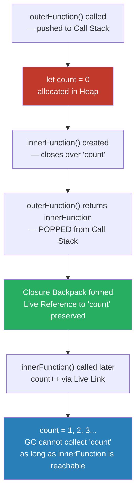
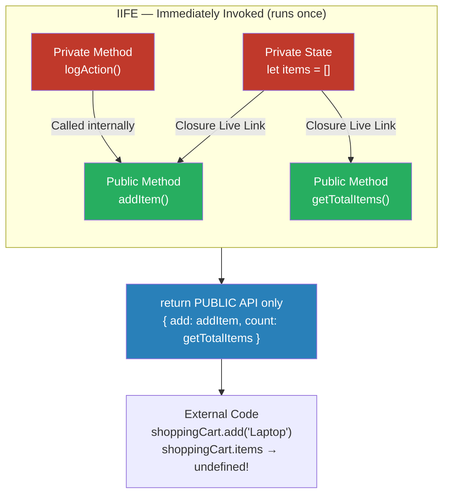
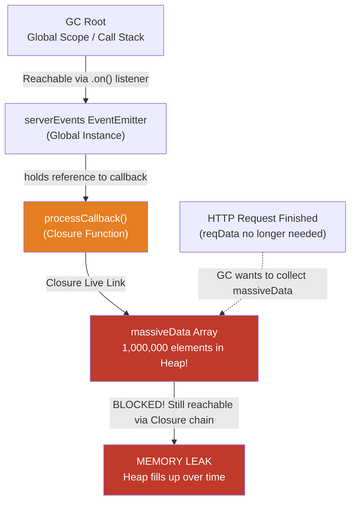
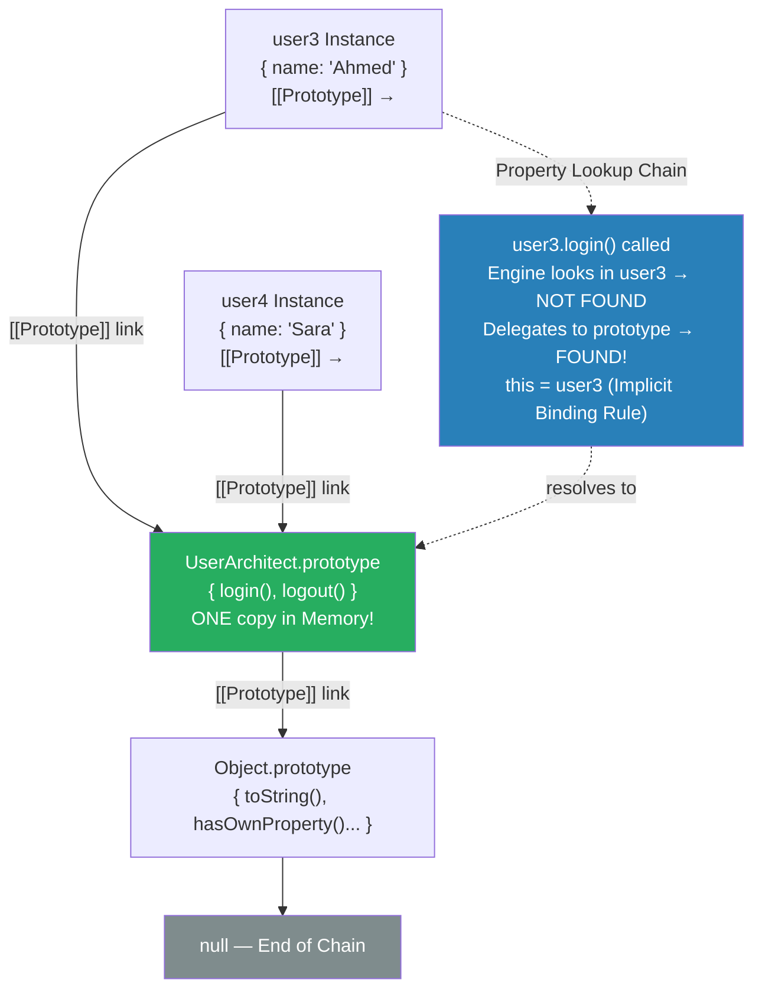
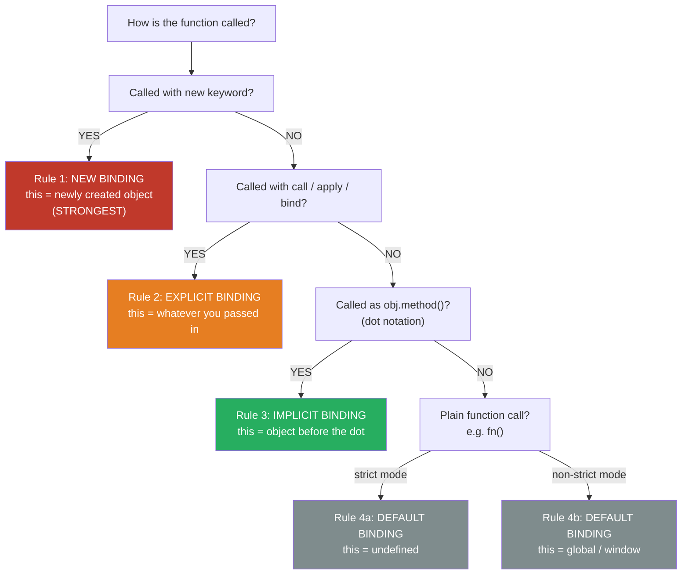
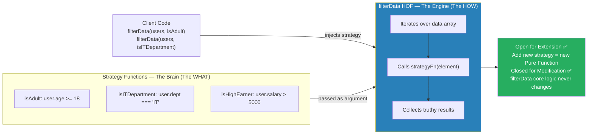

# 🏛️ JavaScript & Node.js — The Elite Interview Vault
## الجزء التاني: Module 3 & Module 4

---

> [!abstract] 🗺️ إنت فين دلوقتي في الـ Vault؟
>
> ✅ Module 1 — Call Stack & Execution Context *(خلصنا)*
> ✅ Module 2 — Hoisting, Scope Chain & TDZ *(خلصنا)*
> 👉 **Module 3** — Closures, Module Pattern & Memory Management *(إحنا هنا)*
> 👉 **Module 4** — Functional Programming: Pure Functions & Higher-Order Functions *(إحنا هنا)*
> ⏳ Module 5 — The Asynchronous Brain *(جاي)*

---

# 🎒 Module 3: Closures, Module Pattern & Memory Management

## الشنطة السحرية — لما الدالة بتموت وذكرياتها بتفضل عايشة

لما الدالة الأب بتخلص تنفيذ، الـ Execution Context بتاعها بيتمسح فعلاً من الـ Call Stack، لكن لو الدالة دي رجّعت دالة تانية (Inner Function) بتستخدم متغيرات من الدالة الأب، الـ Garbage Collector مش بيمسح المتغيرات دي! المحرك بيحتفظ بيهم في الميموري كأن الدالة الابن واخداهم في "شنطة ذكريات" (Backpack) وهي خارجة.

خلينا نغوص في أسرار الـ Closures.

---

## 3.1 Closures: The Live Link & The Snapshot Trap

> [!bug] 🕵️ فخ الانترفيو — Closures
>
> في الانترفيو التقيل، مستحيل يسألك "يعني إيه Closure؟". هيجيبلك كود فيه `setTimeout` جوه `for` loop مبنية باستخدام `var`، ويسألك:
>
> _"ليه الكود ده بيطبع آخر رقم من اللوب بس في كل المرات؟ وهل الـ Closure بيخزن نسخة (Snapshot) من القيمة وقت ما الدالة اتكريتت، ولّا بيخزن Reference للمتغير نفسه؟ وإزاي نصلح المشكلة دي؟"_
>
> الهدف إنه يتأكد إنك مش مجرد باصم الكود، لكنك فاهم إن الـ Closure هو Live Link بيربط الدالة بالمتغير نفسه، مش مجرد Value Copy.

---

> [!abstract] 🧠 المفهوم المعماري — ما هو الـ Closure حقيقةً؟
>
> في الـ C++ أو الـ Java، إنت بتحتفظ بحالة الأوبجيكت (State) جوه Private Properties، وبتقدر توصلها من خلال الـ Methods الخاصة بالكلاس. الأوبجيكت بيفضل عايش في الـ Heap مع كل الداتا بتاعته طول ما إنت عامل منه Instance.
>
> في الجافاسكريبت، الدوال بتتعامل معاملة الـ First-Class Citizens (يعني ينفع تتباصى كـ Argument أو ترجع كـ Return Value). المحرك بيستخدم الـ **Closure** عشان يحقق نفس فكرة الـ State Retention. الـ Closure ببساطة هو قدرة الدالة إنها تفتكر وتفضل قادرة توصل للمتغيرات اللي في الـ Lexical Scope اللي اتعرفت فيه، حتى لو الدالة دي تم استدعاؤها في Scope تاني خالص بعد ما الدالة الأب خلصت شغل.
>
> **السر الخطير هنا (Live Link):** الـ Closure مش بياخد لقطة (Snapshot) من المتغير وهو ماشي. الـ Closure بيعمل رابط حي (Live Link) بالمتغير نفسه في الـ Memory. عشان كده لو المتغير قيمته اتغيرت بعدين، الدالة اللي معاها الـ Closure هتشوف القيمة الجديدة فوراً.

---



---

> [!success] ✅ الإجابة النموذجية — The Architecture Link
>
> معمارياً، الـ Closures هي الأساس اللي بنبني عليه مبدأ الـ **Encapsulation** (التغليف) وإخفاء البيانات في الجافاسكريبت. إنت بتقدر تخلق بيئة مغلقة محدش من بره يقدر يشوفها أو يعدل عليها بشكل مباشر، وتدي للـ Client فقط الـ Public API اللي مسموحله يتعامل معاه.
>
> لكن مع القوة دي بتيجي مسؤولية الـ **Memory Leaks**. الـ Garbage Collector مش هيقدر ينضف المتغيرات اللي الـ Closure ماسك فيها طول ما الدالة الابن لسه عايشة ولها Reference في الميموري. لو الدالة دي مربوطة بـ Event Listener أو Timer (زي `setInterval`) ونسيت تعملهم Clear، إنت كده بتعمل احتجاز للميموري (Retention) وممكن توقع سيرفر الـ Node.js بتاعك بمرور الوقت.

---

> [!example] 💻 كود الجونيور vs كود المهندس — The Snapshot Trap
>
> خلينا نشوف الكود الكارثي اللي بيقع فيه الـ Juniors، وإزاي الـ Architect بيستخدم الـ Closures صح:
>
> **❌ الكود السيء (The Snapshot Trap with `var`):**

```javascript
// Bad Code: Due to 'var', there is only one shared 'i' variable in the entire scope.
// All 3 closures hold a live link to the EXACT SAME 'i' variable.
var keeps = [];
for (var i = 0; i < 3; i++) {
    keeps[i] = function() {
        // This will print 3, 3, 3 because the loop finishes (i becomes 3)
        // before the functions are ever invoked.
        console.log(i);
    };
}
keeps[0](); // 3
keeps[1](); // 3
keeps[2](); // 3
```

> **✅ الكود المعماري (Proper Closures using `let` & Encapsulation):**

```javascript
// Architect Code 1: Using 'let' creates a NEW lexical environment (new variable)
// for each iteration of the loop.
const keepsSafe = [];
for (let j = 0; j < 3; j++) {
    keepsSafe[j] = function() {
        // Each closure gets a live link to its own separate 'j' variable.
        console.log(j);
    };
}
keepsSafe[0](); // 0
keepsSafe[1](); // 1
keepsSafe[2](); // 2

// Architect Code 2: Using Closure for OOP Encapsulation (State Privacy)
function createCounter() {
    let count = 0; // Private State (Hidden inside the closure backpack)
    return function increment() {
        count++; // Live link mutation
        return count;
    };
}
const myCounter = createCounter();
console.log(myCounter()); // 1
console.log(myCounter()); // 2
// There is absolutely no way to mutate 'count' from the outside!
```

---

> [!question] 🔗 الجسر للدرس الجاي
>
> عظيم جداً، إحنا كده فهمنا إن الـ Closure هو الشنطة اللي الدالة بتاخدها معاها وبتخزن فيها الـ Live References للمتغيرات الأب، وإنها البديل المعماري الشرعي للـ Objects في إدارة الـ State وإخفائها.
>
> **سؤال الانترفيو الخبيث اللي بيمهد لدرسنا الجاي:** _"بما إننا نقدر نستخدم الـ Closures عشان نحتفظ بـ State ونخبيها.. إزاي نقدر نبني Design Pattern كامل في الجافاسكريبت يحاكي فكرة الـ Classes والـ Access Modifiers زي (Public / Private) الموجودة في C++ أو Java بدون ما نستخدم الكلمة المفتاحية `class` أصلاً؟ وإيه هو الـ Revealing Module Pattern؟"_

---

## 3.2 The Module Pattern: Achieving true C++/Java private variables and Encapsulation

عشان نحقق فكرة الـ `private` الموجودة في C++ و Java جوه الجافاسكريبت (من غير ما نستخدم الـ Classes الجديدة)، بنستخدم دمج عبقري بين الـ **Closures** والـ **IIFE** (Immediately Invoked Function Expression). الدمج ده بيخلق لنا الـ **Module Pattern** أو نسخته الأحدث **Revealing Module Pattern**.

خلينا نغوص في المعمارية دي بالتفصيل.

---

> [!bug] 🕵️ فخ الانترفيو — Module Pattern
>
> في الانترفيو الثقيل، الانترفيور هيديك كود عبارة عن Object عادي جواه State (زي `count`) و Methods بتعدل عليه، ويقولك:
>
> _"إزاي تقدر تمنع أي مبرمج تاني إنه يعدل على قيمة الـ `count` من بره الـ Object بشكل مباشر (Direct Mutation)؟ ممنوع تستخدم الـ ES6 Classes وممنوع تستخدم علامة الـ `#` الخاصة بالـ Private Fields. عايزك تحلها بالـ Core JS!"_
>
> الهدف هنا مش إنه يعقدك، الهدف إنه يشوفك فاهم إزاي تبني Scope معزول تماماً، وإزاي تستخدم الـ Closures عشان تتحكم في الـ Visibility بتاعة الداتا بتاعتك.

---

> [!abstract] 🧠 المفهوم المعماري — IIFE + Closures = Module Pattern
>
> في الـ C++ والـ Java، الـ Encapsulation (التغليف) بييجي جاهز. بتكتب `private int count;` والـ Compiler بيتكفل بالباقي، مستحيل حد يلمسها من بره الـ Class.
>
> في الـ JavaScript (قبل ما يضيفوا الـ Private class fields مؤخراً)، أي Object Properties هي `public` باي ديفولت. عشان كده المبرمجين لجأوا لـ الـ **Module Pattern** اللي بيتبني على خطوتين:
>
> **1. الـ IIFE (Immediately Invoked Function Expression):** بنعمل Function ونشغلها فوراً `(function() { ... })();`. الدالة دي بتخلق بيئة تنفيذ معزولة (Private Lexical Environment). أي متغيرات هتعرفها جوه الدالة دي باستخدام `let` أو `const` هي حرفياً مخفية عن الـ Global Scope ومحدش يقدر يشوفها.
>
> **2. الـ Closures (الباب الخلفي الشرعي):** الـ IIFE بتعمل `return` لـ Object. الـ Object ده جواه الدوال (Methods) اللي إنت عايز تخليها `public`. الدوال دي اتولدت جوه الـ IIFE، فبالتالي معاها Closure (شنطة ذكريات) فيها Reference حي للـ Private variables.
>
> **ما هو الـ Revealing Module Pattern؟** هو تحسين معماري ابتكره Christian Heilmann (واشتهر جداً في Node.js). بدل ما نكتب الدوال الـ Public جوه الـ `return` مباشرة، إحنا بنعرف كل الدوال والمتغيرات (الـ Private والـ Public) جوه الـ IIFE، وفي النهاية بنعمل `return` لـ Object بيكشف (Reveals) فقط الـ References للدوال اللي عايزينها تبقى Public. ده بيخلي الكود مقروء أكتر وبيسهل على الدوال الداخلية إنها تنادي بعضها.

---



---

> [!success] ✅ الإجابة النموذجية — Architecture & SOLID Link
>
> إزاي الـ Module Pattern بيرتبط بمبادئ هندسة البرمجيات؟
>
> 1. **الـ POLE (Principle of Least Exposure):** الـ Pattern ده هو التطبيق الحرفي لمبدأ الـ POLE في السيكيوريتي وهندسة البرمجيات. إنت بتخفي كل تفاصيل الـ Implementation بتاعتك (Information Hiding) ومش بتكشف (Expose) للـ Client كود غير الحد الأدنى المطلوب لشغله (Public API). ده بيمنع الـ Naming Collisions (تضارب الأسماء) وبيمنع الـ Unexpected Behavior لو حد عدل في الـ State بالغلط.
>
> 2. **الـ Singleton Design Pattern:** لما بتستخدم IIFE، الدالة بتشتغل مرة واحدة بس وبتطلع Object واحد. الـ Object ده بيشير لـ State واحدة موجودة في الـ Closure. ده بيخلقلك **Singleton** طبيعي جداً من غير تعقيدات الـ Classes. لو عايز تعمل منه نسخ كتير (Instances)، بتستخدم Module Factory (يعني دالة عادية بترجع الـ Object بدل الـ IIFE).
>
> 3. **أساس الـ Node.js Modules (CommonJS):** محرك Node.js نفسه بيستخدم فكرة شبيهة جداً تحت الكبوت. لما بتكتب كود في فايل Node.js، المحرك بيغلف الكود بتاعك كله في دالة كبيرة (Wrapper Function) عشان يعزله ويخليه Private، وبعدين بيكشف بس اللي إنت بتعمله `module.exports`.

---

> [!example] 💻 كود الجونيور vs كود المهندس — Revealing Module Pattern
>
> خلينا نشوف الكود اللي بيسيب الـ State مفتوحة، وإزاي الـ Architect بيقفلها بالـ Revealing Module Pattern:
>
> **❌ The Bad Code (Public & Mutable State):**

```javascript
// Any developer can accidentally or maliciously override the state.
const shoppingCartBad = {
    items: [], // Public!
    addItem(item) {
        this.items.push(item);
    },
    getTotalItems() {
        return this.items.length;
    }
};

shoppingCartBad.addItem("Laptop");
shoppingCartBad.items = null; // System crash! The state is completely compromised.
```

> **✅ The Architect Code (Revealing Module Pattern - Strict Encapsulation):**

```javascript
// Using IIFE to create a private scope
const shoppingCartArchitect = (function() {
    // 1. Private State (Hidden inside the lexical scope)
    let items = []; // Cannot be accessed directly from outside

    // 2. Private Methods (Helper functions, hidden from outside)
    const logAction = (action) => {
        console.log(`Action performed: ${action} at ${new Date().toISOString()}`);
    };

    // 3. Public Methods
    const addItem = (item) => {
        items.push(item); // Closure keeps this reference alive
        logAction(`Added ${item}`);
    };

    const getTotalItems = () => {
        return items.length;
    };

    // 4. The "Reveal" (Returning the Public API)
    return {
        add: addItem,
        count: getTotalItems
    };
})();

shoppingCartArchitect.add("Laptop");
console.log(shoppingCartArchitect.count()); // 1
console.log(shoppingCartArchitect.items); // undefined (Data Privacy Achieved!)
```

---

> [!question] 🔗 الجسر للدرس الجاي
>
> رائع جداً، إحنا كده فهمنا إزاي ندمج الـ IIFE مع الـ Closures عشان نبني Module Pattern قوي بيحقق الـ Encapsulation التام، ويخفي الـ State في "الشنطة" بعيد عن أي عبث خارجي.
>
> **سؤال الانترفيو الخبيث اللي بيمهد لدرسنا الجاي:** _"بما إن الـ Closure بتمنع الـ Garbage Collector إنه يمسح الـ Private Variables عشان تفضل عايشة طول ما الـ Public Methods عايشة... لو استخدمنا الـ Closures بشكل مكثف عشان نبني Modules معقدة، وفي Module فيهم بيحتفظ بـ Reference لـ Array ضخمة أو لـ Event Listener مبنعملوش Clear... إزاي ده بيأثر على الـ Memory Heap؟ وإيه هي أشهر أنواع الـ Memory Leaks في Node.js بسبب الـ Closures وإزاي نقدر نكتشفها ونمنعها كـ Architects؟"_

---

## 3.3 Closures & Memory Leaks: The Reachability Trap in Node.js

لما بنستخدم الـ Closures بشكل مكثف عشان نحتفظ بـ State، الـ Garbage Collector بيشوف إن فيه Reference لسه "حي" بيشاور على الداتا دي عن طريق الـ Lexical Scope، فبيرفض يمسحها من الـ Memory Heap. لو الـ Closure ده مربوط بـ Event Listener أو Timer (زي `setInterval`) ماتعملوش Clear، الـ Memory بتفضل تتراكم وتتملي لحد ما السيرفر يضرب (Out of Memory). أشهر أنواع الـ Memory Leaks في Node.js هي الـ Unreleased Event Listeners اللي بتحتفظ بـ References لـ Objects كبيرة.

خلينا نغوص في التفاصيل ونقفل الـ Module ده.

---

> [!bug] 🕵️ فخ الانترفيو — Memory Leaks & Reachability
>
> في الإنترفيوهات التقيلة، الانترفيور مش هيقولك "إيه هو الـ Memory Leak؟" لأنه سؤال مباشر جداً. هيجيبلك كود Node.js فيه `EventEmitter` أو `setInterval` بيستخدم Closure، ويسألك:
>
> _"السيرفر ده شغال بقاله يومين وفجأة بدأ يستهلك 2GB رام وبعدين وقع. مع إننا مابنخزنش داتا في الـ Global Scope.. تقدر تقولي الـ Closure هنا إزاي منع الـ Garbage Collector إنه يقوم بشغله؟ وإيه هو مفهوم الـ Reachability؟"_
>
> الهدف هنا إنه يشوفك فاهم العلاقة بين الـ Scope Chain والـ Heap Memory، وإنك مش مجرد مبرمج بيكتب كود بيسرب ميموري في الخفاء.

---

> [!abstract] 🧠 المفهوم المعماري — V8 Garbage Collector & Reachability
>
> في الـ C++، إنت كمهندس عندك تحكم كامل في الميموري، بتحجز بـ `new` وتمسح بـ `delete`، ولو نسيت تمسح بيحصلك Memory Leak صريح.
>
> في الجافاسكريبت، الـ V8 Engine بيعتمد على حاجة اسمها الـ Garbage Collector (GC). الـ GC بيشتغل بمبدأ الـ **Reachability** (إمكانية الوصول). طول ما الـ Object أو المتغير فيه أي "طريق" يوصله من الـ Root (الـ Global Scope أو الـ Call Stack الحالي)، الـ GC بيعتبره "مهم ومستخدم" ومستحيل يمسحه.
>
> هنا بتيجي خطورة الـ Closures. الـ Closure بيخلق "رابط حي" (Live Link) بين الدالة الابن والـ Lexical Scope بتاع الدالة الأب. لو الدالة الابن دي اتعملها Pass لـ Callback، زي Event Listener أو Timer، وفضلت عايشة في الميموري، كل المتغيرات اللي هي عاملالها Capture هتفضل عايشة معاها.
>
> الأسوأ من كده، إن حتى لو الدالة الابن مابتستخدمش متغير معين من الدالة الأب، بعض الـ Engines القديمة كانت بتحتفظ بكل الـ Scope. الـ V8 الحديث بيحاول يعمل Optimization ويمسح اللي مش مستخدم، بس لو المتغير ده كبير جداً واتعمله Capture (حتى لو بطريق غير مباشر)، الميموري هتتملي وتوقع السيرفر.

---



---

> [!success] ✅ الإجابة النموذجية — Lifecycle Management Architecture
>
> إزاي نربط ده بهندسة النظم (Architecture) في Node.js؟
>
> في Node.js، إحنا بنعتمد بشكل أساسي على الـ **Observer Pattern** (عن طريق `EventEmitter`). تخيل إنك بتبني خدمة (Service) بتعمل Subscribe لـ Global Event، والـ Callback بتاع الـ Subscribe ده عبارة عن Closure بيحتفظ بـ Reference لـ Request Object تقيل جداً.
>
> طول ما الـ Listener ده موجود ومتعملوش `removeListener`، الـ Request Object عمره ما هيتمسح، حتى لو الـ HTTP Request نفسه خلص! كـ Architect، لازم تطبق مبدأ الـ **Lifecycle Management**. أي Resource بتعملها Allocate أو Subscribe لازم يكون ليها مرحلة Teardown أو Cleanup، وده بيحقق مبدأ الـ Deterministic Destruction اللي بنفتقده في اللغات اللي بتعتمد على الـ Garbage Collection.

---

> [!example] 💻 كود الجونيور vs كود المهندس — Memory Leak Fix
>
> خلينا نشوف كود Junior بيعمل Memory Leak كارثي في Node.js باستخدام الـ Closures والـ EventEmitter، وكود Architect بينضف وراه لضمان استقرار السيرفر:
>
> **❌ الكود السيء (The Memory Leak Trap):**

```javascript
const EventEmitter = require('events');
const serverEvents = new EventEmitter();

function handleRequestBad(reqData) {
    // Massive object allocated in the Heap
    const massiveData = new Array(1000000).fill(reqData);

    // This closure is registered globally.
    // It captures 'massiveData' and keeps it alive forever!
    serverEvents.on('process', function processCallback() {
        console.log("Processing elements:", massiveData.length);
    });

    // The request finishes, but 'massiveData' is NEVER garbage collected
    // because 'processCallback' is still referenced by 'serverEvents'.
}
```

> **✅ الكود المعماري (Proper Teardown & Safe Closures):**

```javascript
const EventEmitter = require('events');
const serverEvents = new EventEmitter();

function handleRequestArchitect(reqData) {
    let massiveData = new Array(1000000).fill(reqData);

    // Named function for easy removal later
    function processCallback() {
        console.log("Processing elements:", massiveData ? massiveData.length : 0);
    }

    serverEvents.on('process', processCallback);

    // Architect Rule: Always clean up!
    // Either remove the listener when done, or explicitly nullify the data
    // so the Garbage Collector can free the Heap memory.
    serverEvents.on('requestFinished', () => {
        serverEvents.removeListener('process', processCallback);
        // Explicitly cutting the reference (Safety net for GC)
        massiveData = null;
    });
}
```

---

> [!tip] 🔍 ابحث أكتر عن:
>
> - `"JavaScript Closure memory leak EventEmitter Node.js"`
> - `"V8 Garbage Collector mark and sweep reachability"`
> - `"Node.js heap snapshot Chrome DevTools memory profiling"`

---

> [!question] 🔗 الجسر للـ Module 4
>
> ممتاز جداً. إحنا كده قفلنا ملف الـ Closures بالكامل، وفهمنا إزاي الدالة بتحتفظ ببيئتها وإزاي نحمي السيرفر من الـ Memory Leaks الناتجة عن الـ References الحية.
>
> إحنا اتكلمنا قبل كده إن الجافاسكريبت بتستخدم الـ Closures عشان تحاكي الـ Private Data في الـ OOP. لكن إيه أخبار الـ Inheritance (الوراثة)?
>
> **سؤال الانترفيو الخبيث اللي بيمهد لـ Module 3 (Prototypal OOP):** _"في الجافا أو الـ C++، الكلاس بيورث من كلاس تاني عن طريق الـ Blueprints في مرحلة الـ Compile-time. لكن في الجافاسكريبت، مفيش حاجة اسمها كلاس حقيقي أصلاً! إزاي الـ JavaScript بتحقق مبدأ الـ Inheritance؟ وإيه هي سلسلة الـ Prototype Chain؟ وليه لو غيرت خاصية في الـ Prototype بتاع Object، كل الأوبجيكتات التانية اللي وارثة منه بتحس بالتغيير ده فوراً في الـ Runtime؟"_

---

## 3.4 Prototypal Inheritance vs Classical Inheritance: The Prototype Chain

إحنا كده بنبدأ ندخل في الجزء ده من الموديول، وده من أكتر الأجزاء اللي بتعمل صدمة حضارية لأي حد جاي من خلفية Java أو C++. الجافاسكريبت مفيهاش كلاسات حقيقية، كل اللي بتشوفه ده مجرد "سكر نحوي" (Syntactic Sugar) عشان يريحوا بيه المبرمجين.

في الجافا أو الـ C++، الوراثة (Inheritance) بتحصل في مرحلة الـ Compile-time والـ Class بيكون عبارة عن Blueprint (رسم هندسي) بتنسخ منه Object. لكن في الجافاسكريبت، الأوبجيكت بيورث من أوبجيكت تاني مباشرة في الـ Runtime عن طريق رابط حي (Live Link) اسمه الـ Prototype Chain. لو غيرت خاصية في الـ Prototype، كل الأوبجيكتات اللي مرتبطة بيه هتشوف التغيير فوراً لأنهم مش واخدين نسخة، هم بيشاوروا على نفس المكان في الميموري!

خلينا نغوص في التفاصيل.

---

> [!bug] 🕵️ فخ الانترفيو — Prototype Chain
>
> في الانترفيوهات التقيلة جداً، الانترفيور هيرميلك فخ مركب ويقولك:
>
> _"بما إن الـ ES6 قدمت الكلمة المفتاحية `class`، هل الجافاسكريبت بقت Object-Oriented زي الجافا؟ وإيه الفرق الجوهري بين الـ `[[Prototype]]` المخفي والخاصية اللي اسمها `.prototype`؟ وليه لو ضفت Method جديدة للـ Prototype في نص تشغيل السيرفر، كل الـ Instances القديمة والجديدة بتقدر تستخدمها فوراً؟"_
>
> الهدف هنا مش إنه يختبرك في الـ Syntax بتاع الـ Classes، الهدف إنه يعريك ويشوفك فاهم إن الـ Class في الجافاسكريبت مجرد وهم، وإن الأساس هو الـ Delegation والـ Object Linking.

---

> [!abstract] 🧠 المفهوم المعماري — [[Prototype]] vs .prototype
>
> في الـ Java والـ C++ (Classical Inheritance)، الـ Class هو مجرد "تصميم" (Blueprint). لما بتعمل `new`، الـ Engine بياخد التصميم ده ويبني منه Object جديد في الميموري، بينسخ كل الـ Properties والـ Methods جواه. العلاقة دي ثابتة ومبنية على الـ Copying.
>
> في الـ JavaScript (Prototypal Inheritance)، مفيش نسخ بيحصل أبداً. العملية هنا اسمها **Behavior Delegation** (تفويض السلوك).
>
> المحرك بيستخدم خاصية داخلية مخفية اسمها `[[Prototype]]` (وكان زمان بيتم الوصول ليها بـ `__proto__`) عشان يربط أي Object جديد بـ Object تاني موجود بالفعل في الميموري. السلسلة دي اسمها **Prototype Chain**.
>
> **إيه الفرق بين `[[Prototype]]` و `.prototype`؟**
>
> - **`[[Prototype]]` (أو `__proto__`)**: ده الرابط الداخلي اللي جوه الـ Object بتاعك، اللي بيشاور على الأب الروحي بتاعه.
> - **`.prototype`**: دي خاصية موجودة **فقط** على الـ Functions (بما فيها الـ Constructor Functions والـ Classes). وظيفتها إنها بتقول للـ Engine: "لما حد يعمل مني Instance باستخدام `new`، اربط الـ `[[Prototype]]` بتاع الـ Instance الجديد بالأوبجيكت اللي أنا شايلاه هنا".
>
> لما بتحاول تقرأ خاصية أو Method من Object، الـ Engine بيدور جواه الأول. لو ملقاهاش، مابيضربش Error، لكنه بيمشي ورا رابط الـ `[[Prototype]]` ويروح للأب يسأله، ويفضل يطلع في السلسلة دي لحد ما يوصل لـ `Object.prototype`، ولو ملقاش بيرجع `null` وبعدها `undefined`.

---



---

> [!success] ✅ الإجابة النموذجية — Memory Optimization & OLOO
>
> معمارياً، ده بيحقق مبدأ الـ **Memory Optimization** بشكل عبقري، وبيقدم أسلوب أقوى من الـ Inheritance العادي وهو الـ **Composition / Delegation** (OLOO: Objects Linked to Other Objects).
>
> بدل ما ننسخ نفس الـ Method لمليون Instance في الـ Heap (زي ما بيحصل لو عرفنا الدالة جوه الـ Constructor)، إحنا بنرمي الـ Method دي مرة واحدة بس في الميموري على الـ Prototype Object. والمليون Instance بيعملوا "تفويض" (Delegate) للأوبجيكت ده عشان ينفذوا الدالة. ده بيخلي الـ Memory Footprint بتاع السيرفر خفيف جداً، وبيسمحلك تعمل Runtime Extension (إنك تضيف ميزة جديدة للسيستم كله بمجرد إضافتها في الـ Prototype بدون ما تعمل Restart أو Re-instantiate).

---

> [!example] 💻 كود الجونيور vs كود المهندس — Prototype Chain
>
> خلينا نشوف كود Junior بيستهلك الميموري لأنه بيفكر بعقلية الـ Copying، وكود Architect بيستخدم الـ Prototype Delegation صح (سواء بالطريقة القديمة أو بـ ES6 Classes):
>
> **❌ كود الـ Junior (Memory Waste - Anti-pattern):**

```javascript
// Bad Code: The function is redefined and physically copied
// into memory for EVERY new instance created.
function UserBad(name) {
    this.name = name;
    // Massive memory leak if you create 1,000,000 users
    this.login = function() {
        console.log(this.name + " has logged in.");
    };
}

const user1 = new UserBad("Ahmed");
const user2 = new UserBad("Sara");
console.log(user1.login === user2.login); // false! Two different functions in memory!
```

> **✅ كود الـ Architect (Prototypal Delegation & Memory Optimized):**

```javascript
// Architect Code: Using ES6 classes which under the hood
// wires up the Prototype Chain beautifully.
class UserArchitect {
    constructor(name) {
        this.name = name; // Instance specific data
    }

    // This method is NOT copied. It is stored exactly ONCE
    // on UserArchitect.prototype.
    login() {
        console.log(this.name + " has logged in.");
    }
}

const user3 = new UserArchitect("Ahmed");
const user4 = new UserArchitect("Sara");

// true! Both instances DELEGATE to the exact same function in memory.
console.log(user3.login === user4.login);

// Proving the Live Link (Runtime modification):
UserArchitect.prototype.logout = function() {
    console.log(this.name + " has logged out.");
};
// user3 instantly has access to logout() through the Prototype Chain!
user3.logout();
```

---

> [!question] 🔗 الجسر للدرس الجاي
>
> إحنا كده استوعبنا إن الأوبجيكتات في الجافاسكريبت مش بتورث بالمعنى الحرفي، لكنها بتعمل Link لبعضها، ولما بنستدعي Method، الأوبجيكت بيفوض الأب بتاعه لتنفيذها.
>
> **سؤال الانترفيو الخبيث اللي بيمهد لدرسنا الجاي:** _"بما إن الـ Method موجودة في الميموري مرة واحدة بس عند الأب (الـ Prototype).. لما الأوبجيكت الابن بيعملها استدعاء (زي `user3.login()`)، إزاي الـ Method دي بتعرف إنها المفروض تطبع اسم `user3` تحديداً وماتطبعش اسم الأب أو اسم أوبجيكت تاني؟ إيه هو ميكانيزم الـ `this` اللي بيسمح للـ Delegation إنه يشتغل صح؟ وإيه هي الـ 4 قواعد الصارمة لتحديد قيمة الـ `this` في الجافاسكريبت؟"_

---

## 3.5 The 'this' Keyword: The 4 Rules (Implicit, Explicit, New, Default)

إحنا دلوقتي هنفتح الصندوق الأسود للـ `this` في الجافاسكريبت. الموضوع ده هو أكتر حاجة بتعمل "صدمة حضارية" لأي حد جاي من خلفية C++ أو Java، لأنه بيضرب كل الثوابت اللي اتعلمناها عن الـ Context في مقتل.

---

> [!bug] 🕵️ فخ الانترفيو — The Lost `this`
>
> في الانترفيوهات، الفخ الكلاسيكي هو إنه يجيبلك Object جواه Method، وبعدين يباصي الـ Method دي كـ Callback لـ `setTimeout` أو لـ Event Listener، ويسألك:
>
> _"ليه لما الـ Method دي اشتغلت طبعت `undefined` بدل الداتا بتاعة الـ Object؟ وهل الـ `this` بيتحدد وقت كتابة الكود (Compile-time) ولا وقت التشغيل (Runtime)؟ وإزاي نصلح المشكلة دي؟"_
>
> الهدف هنا مش مجرد إنه يختبرك في الـ Syntax، الهدف إنه يوقعك في فخ الـ "Lexical Scope" ويتأكد إنك فاهم إن الـ `this` ملوش أي علاقة بمكان كتابة الدالة، لكنه مرتبط حصرياً بـ "طريقة استدعاء الدالة" (Call-site).

---

> [!abstract] 🧠 المفهوم المعماري — القواعد الـ 4 لـ `this`
>
> في عالم الـ Java والـ C++، الكلمة المفتاحية `this` هي Static Reference (مؤشر ثابت) بيشاور على الـ Instance الحالي من الـ Class اللي إنت جواه. مكان كتابة الكود بيحدد الـ `this` للأبد.
>
> لكن في الـ JavaScript، الـ `this` هو عبارة عن **Dynamic Context** (سياق ديناميكي) أو نقدر نعتبره "باراميتر مخفي" (Implicit Parameter) بيتباصى للدالة وقت تشغيلها. قيمته بتتحدد وقت الـ Execution بناءً على 4 قواعد صارمة بالترتيب ده (حسب الأولوية):
>
> **1. الـ New Binding (الأقوى):** لو الدالة تم استدعاؤها باستخدام الكلمة المفتاحية `new`، المحرك بيكريت Object جديد فاضي تماماً، وبيربط الـ `this` جوه الدالة بالـ Object الجديد ده.
>
> **2. الـ Explicit Binding (الربط الصريح):** لو استدعينا الدالة باستخدام `call()` أو `apply()` أو `bind()`. هنا إنت كمهندس بتجبر المحرك إنه يربط الـ `this` بـ Object معين إنت اللي بتحدده صراحة في الباراميترز.
>
> **3. الـ Implicit Binding (الربط الضمني):** لو الدالة تم استدعاؤها كـ Method جوا Object، يعني كان فيه (نقطة) قبل الاستدعاء زي `user.login()`. هنا الـ `this` بيشاور على الـ Object اللي قبل النقطة مباشرة (يعني `user` في الحالة دي).
>
> **4. الـ Default Binding (الربط الافتراضي - الأضعف):** لو استدعيت الدالة بشكل مجرد تماماً زي `login()`. هنا الـ Engine بيبص: لو إنت شغال في الـ `strict mode`، الـ `this` هيكون `undefined` (ودي حماية ليك). ولو مش شغال بيه، الـ `this` هيشاور على الـ Global Object (اللي هو `window` في المتصفح أو `global` في Node.js) وده بيعمل مصايب.

---



---

> [!success] ✅ الإجابة النموذجية — Dynamic `this` & Code Reusability
>
> إزاي الديناميكية الغريبة دي بتفيدنا كـ Architects؟
>
> معمارياً، الـ Dynamic `this` هو المحرك الأساسي لنمط الـ **Delegation** اللي اتكلمنا عنه في الـ Prototype Chain.
>
> تخيل لو الـ `this` كان ثابت (Static) زي الجافا. مكناش هنقدر نحط دالة واحدة في الـ Memory على الـ Prototype، ونخلي ملايين الـ Instances تعملها Shared وتستدعيها. الديناميكية بتاعت الـ `implicit binding` هي اللي بتخلي الدالة الأب (الموجودة في الـ Prototype) لما تُستدعى من أوبجيكت ابن، تفهم إن الـ `this` دلوقتي بيشاور على الابن مش الأب!. ده بيحقق مبدأ الـ **Code Reusability** بأعلى كفاءة ممكنة للميموري (Memory Footprint Optimization).

---

> [!example] 💻 كود الجونيور vs كود المهندس — The Lost `this` Fix
>
> خلينا نشوف فخ الانترفيو المشهور (ضياع الـ context)، وإزاي الـ Architect بيحله باستخدام قاعدة الـ Explicit Binding `bind()`:
>
> **❌ كود الـ Junior (The Lost 'this' Trap):**

```javascript
const database = {
    name: "MongoDB",
    connect() {
        // 'this' is expected to be the database object
        console.log(`Connecting to ${this.name}...`);
    }
};

// Trap: Passing the method as a callback (Function reference without execution)
// Inside setTimeout, it's executed as a plain function call (Default Binding rule).
// In non-strict mode, 'this' becomes window/global. In strict mode, undefined!
setTimeout(database.connect, 1000);
// Output: Connecting to undefined... (or throws TypeError in strict mode)
```

> **✅ كود الـ Architect (Fixing with Explicit Hard Binding):**

```javascript
const databaseSafe = {
    name: "PostgreSQL",
    connect() {
        console.log(`Connecting to ${this.name}...`);
    }
};

// Architect solution: Using .bind() to create a new function
// where 'this' is permanently hard-bound to the databaseSafe object.
// Rule #2 (Explicit Binding) overrides Rule #4 (Default Binding).
setTimeout(databaseSafe.connect.bind(databaseSafe), 1000);
// Output: Connecting to PostgreSQL...
```

---

> [!question] 🔗 الجسر للدرس الجاي داخل نفس الـ Module
>
> إحنا كده فهمنا القواعد الـ 4 الصارمة اللي الجافاسكريبت بتحدد بيهم قيمة الـ `this` وقت التشغيل (Runtime)، وإزاي نعالج مشكلة ضياع الـ Context عن طريق الـ `bind()`.
>
> لكن، ES6 قدمت الـ **Arrow Functions** اللي ملهاش `this` أصلاً، وبتاخد الـ `this` بتاعها من البيئة اللي حواليها (Lexical this). كتير من المبرمجين بيفرحوا بيها وبيستخدموها في كل حاجة عشان يهربوا من مشاكل الـ binding.
>
> **سؤال الانترفيو الخبيث اللي بيمهد لدرسنا الجاي:** _"لو الـ Arrow Functions بتحل مشكلة ضياع الـ `this` بسهولة، ليه الـ Senior Architects بيعتبروا استخدامها كـ Method جوه JS Class أو Object هو **Anti-Pattern** خطير جداً؟ إيه اللي بيحصل للـ Prototype Chain والميموري (Memory Heap) لما بتعرف الـ Method كـ Arrow Function بدل الدالة العادية؟ وليه مابنقدرش نستخدم معاها الكلمة المفتاحية `super` أو `new`؟"_

---

## 3.6 Arrow Functions as Class Methods: The Anti-Pattern That Destroys Memory

سبب إن الـ Senior Architects بيعتبروا استخدام الـ Arrow Functions كـ Methods جوه الـ Class جريمة (Anti-Pattern)، هو إن الـ Arrow Function مش بتتحط على الـ Prototype Chain نهائياً. المحرك بيعتبرها Instance Property عادية جداً، وبالتالي بيكريت نسخة فعلية منها في الـ Memory Heap لكل Object جديد بتعمله. لو عندك 10,000 مستخدم، هيبقى عندك 10,000 نسخة من نفس الدالة في الميموري بدل ما يكونوا بيشاوروا على نسخة واحدة في الأب! ده غير إن الـ Arrow Functions معندهاش `super` ولا `new` ولا `arguments` أصلاً.

خلينا نغوص في تفاصيل الموضوع ده ونقفل موديول الـ OOP تماماً.

---

> [!bug] 🕵️ فخ الانترفيو — Arrow Function Anti-Pattern
>
> في الانترفيو، هيجيبلك كود لـ ES6 Class كل الـ Methods اللي فيه مكتوبة كـ Arrow Functions، ويسألك:
>
> _"المبرمج ده استخدم الـ Arrow Functions عشان يهرب من مشاكل ضياع الـ `this` جوه الـ Callbacks.. هل اللي هو عمله ده صح معمارياً؟ وإيه اللي هيحصل للـ Memory Heap وللـ Prototype Chain لو عملنا `new` للكلاس ده مليون مرة؟ وليه لو حاولنا نورث (Inherit) الكلاس ده ونستخدم `super` عشان ننادي على الـ Method دي الكود هيضرب Error؟"_
>
> الهدف هنا يوقعك في فخ الـ "Syntax Sugar". هو عايز يتأكد إنك فاهم إن الـ Arrow Function مش مجرد طريقة مختصرة لكتابة الدالة، وإنها بتغير طريقة تعامل محرك V8 مع الميموري وسياق التنفيذ بالكامل.

---

> [!abstract] 🧠 المفهوم المعماري — ليه الـ Arrow Function مش Method مواطن شرعي؟
>
> في الـ Java والـ C++، الـ Methods بتبقى جزء من تصميم الكلاس نفسه، والكومبايلر بيتعامل معاها بكفاءة. في الجافاسكريبت، الدوال العادية (Regular Functions) جوا الكلاس بتتحط تلقائياً على الـ `Prototype`، وده بيحقق مبدأ الـ Delegation اللي اتكلمنا عنه، وبيوفر الميموري لأنها بتتخزن مرة واحدة بس.
>
> **إيه هي بقى الـ Arrow Functions؟** هي دوال اتخلقت بهدف أساسي واحد: **الـ Lexical `this`**. الـ Arrow Function معندهاش الكلمة المفتاحية `this` أصلاً. المحرك بيعامل الـ `this` جواها كأنه متغير (Variable) عادي جداً بيدور عليه في سياق الرؤية اللي حواليه (Lexical Scope). عشان كده هي بتحل مشكلة ضياع الـ `this` جوه الـ Callbacks، لأنها بتاخد الـ Context من الدالة الأب اللي هي مكتوبة جواها.
>
> **ليه هي مش معمولة عشان تكون Methods؟**
>
> 1. **ملهاش `this` خاص بيها:** بتاخده من البيئة المحيطة.
> 2. **ملهاش `prototype`:** مستحيل تستخدم معاها الكلمة المفتاحية `new` عشان تعمل منها Object، ولو حاولت المحرك هيضرب Error.
> 3. **ملهاش `super`:** لو استخدمتها كـ Method، الكلاس الابن مش هيقدر يعمل `super.methodName()` لأنها مش موجودة على الـ Prototype Chain.
> 4. **ملهاش `arguments`:** مفيهاش الـ Arguments Object الافتراضي بتاع الدوال العادية.

---

> [!success] ✅ الإجابة النموذجية — Flyweight Pattern & Memory
>
> كـ Architect، إنت بتبني سيستم بيتحمل Scale عالي. استخدام الـ Arrow Functions كـ Class Methods بيضرب مبدأ الـ **Flyweight Pattern** في مقتل. الـ Flyweight بيهدف لتقليل استهلاك الميموري عن طريق مشاركة الداتا أو السلوك (Sharing Behavior). الـ Prototype Chain هو التطبيق الطبيعي للباترن ده في الـ JS.
>
> لما بتكتب `myMethod = () => {}` جوه الكلاس، إنت بتحولها لـ Class Field (أو Instance Property). المحرك بيحقن الدالة دي جوه الـ `constructor` غصب عنك، وبينسخها في الميموري (Memory Allocation) لكل Instance جديد بيتكريت. لو بتعمل Processing لداتا ضخمة، إنت كده بتعمل Memory Leak بطيء ومخفي بيستهلك الـ Heap بدون أي داعي.

---

> [!example] 💻 كود الجونيور vs كود المهندس — Arrow vs Regular Methods
>
> خلينا نشوف كود Junior دمر الميموري بسبب استسهال الـ Arrow Functions، وكود Architect بيستخدم الأداة الصح في المكان الصح:
>
> **❌ كود الـ Junior (Anti-Pattern - Memory Waste):**

```javascript
class UserBad {
    constructor(name) {
        this.name = name;
    }

    // Anti-Pattern: This is an instance property, NOT a prototype method!
    // A physically new copy of this function is created in the Heap for every user.
    login = () => {
        console.log(`User ${this.name} logged in.`);
    };
}

const user1 = new UserBad("Ahmed");
const user2 = new UserBad("Sara");

// false! They do not share the same memory reference. Memory wasted!
console.log(user1.login === user2.login);
```

> **✅ كود الـ Architect (Prototype Delegation + Lexical Arrow for Callbacks):**

```javascript
class UserArchitect {
    constructor(name) {
        this.name = name;
    }

    // Architect Code: Regular method goes to the Prototype. Shared in memory!
    login() {
        console.log(`User ${this.name} logged in.`);

        // Correct use of Arrow Function: Inside a callback to preserve lexical 'this'
        setTimeout(() => {
            // 'this' is lexically inherited from the 'login' regular method's execution context
            console.log(`Sending welcome email to ${this.name}...`);
        }, 1000);
    }
}

const user3 = new UserArchitect("Ahmed");
const user4 = new UserArchitect("Sara");

// true! Both delegate to the EXACT same function in the Memory Heap.
console.log(user3.login === user4.login);
```

---

> [!tip] 🔍 ابحث أكتر عن:
>
> - `"JavaScript Prototype Chain explained visually"`
> - `"Arrow function vs regular function class method memory"`
> - `"JavaScript this keyword 4 rules Kyle Simpson"`

---

> [!question] 🔗 الجسر للـ Module 4
>
> إحنا كده قفلنا موديول الـ OOP، وفهمنا إزاي الجافاسكريبت بتدير الميموري، وإزاي الـ Prototype والـ `this` بيشتغلوا مع بعض، وإمتى نستخدم الـ Arrow Functions كـ أداة لحفظ الـ Context مش كـ Methods.
>
> دلوقتي هنغير تفكيرنا تماماً ونبدأ ندخل في موديول جديد وهو **Module 4: Functional Programming**.
>
> **سؤال الانترفيو الخبيث اللي بيمهد لأول درس في الـ FP:** _"في الـ OOP إحنا متعودين إن الـ Methods بتعدل في الـ State بتاعة الـ Object الداخلي (Mutation). لكن في الـ Functional Programming، إحنا بنمنع الـ Side Effects تماماً. تقدر تقولي إيه هي الشروط الصارمة اللي بتخلي أي دالة تتقال عليها 'Pure Function'؟ وليه لو باصيت Array لدالة وعدلت فيها، ده بيكسر مبدأ خطير اسمه 'Referential Transparency'؟ وإزاي ده بيأثر على التوقع (Predictability) بتاع السيستم؟"_

---

# ⚗️ Module 4: Functional Programming & Architecture

## المدرسة التانية — لما تكره الـ Mutation وتعشق الـ Pure Functions

إحنا كده دخلنا في الموديول الرابع: **Functional Programming & Architecture**.

بناءً على طلبك، أنا في وضع الاستقبال، وبجاوبك فوراً على السؤال المعماري الخطير اللي قفلنا بيه الجزء اللي فات: عشان أي دالة يتقال عليها **Pure Function**، لازم تحقق شرطين صارمين مفيش فيهم فصال: أولاً، الناتج بتاعها (Output) لازم يعتمد حصرياً على المدخلات (Inputs) بتاعتها بس. ثانياً، ممنوع تماماً تعمل أي **Side Effects** (زي إنها تعدل في متغير خارجي، أو تطبع في الكونسول، أو تكلم API، أو حتى تستخدم `Math.random`). لو باصيت Array لدالة وعدلت فيها (Pass-by-reference mutation)، إنت كده خلقت Side Effect خفي بيغير الـ State الخارجية. ده بيكسر مبدأ الـ **Referential Transparency** (الشفافية المرجعية)، واللي معناه إنك المفروض تقدر تشيل استدعاء الدالة من الكود وتحط مكانها "الناتج" بتاعها بدون ما سلوك البرنامج يتغير. الكسر ده بيدمر التوقع (Predictability) وبيخلي تتبع الباجز كابوس.

خلينا نغوص في تفاصيل أول درس في الـ FP.

---

## 4.1 Pure Functions & Side Effects: The Foundation of FP

> [!bug] 🕵️ فخ الانترفيو — Pure Function
>
> الإنترفيور الخبيث هنا مش هيسألك "إيه هي الـ Pure Function؟". هيجيبلك كود بسيط جداً لدالة بتحسب ضريبة، وجواها سطر بريء جداً `console.log("Calculating tax...")`، ويسألك:
>
> _"هل الدالة دي Pure؟ ولو لأ، ليه مجرد طباعة رسالة في الكونسول بتعتبر Side Effect؟ وإزاي ده بيأثر على الـ Unit Testing والـ Memoization؟"_
>
> الهدف هنا إنه يشوفك فاهم إن الـ Side Effects مش بس تدمير للداتا، لكنها أي تفاعل (I/O) مع العالم الخارجي خارج حدود الدالة.

---

> [!abstract] 🧠 المفهوم المعماري — Mutation vs Transformation
>
> في الـ OOP (زي C++ و Java)، إنت متعود إن الـ Objects بتحتفظ بـ State، والـ Methods بتعدل في الـ State دي مباشرة (مثلاً `this.balance += amount`). التعديل المباشر ده اسمه **Mutation**، وهو أساس الـ OOP.
>
> في الـ Functional Programming، الـ Mutation هو "الشر الأعظم". الـ FP بيعتمد على تحويل الداتا من شكل للتاني عن طريق سلسلة من الـ Pure Functions، بدون ما نعدل في الداتا الأصلية.
>
> **إيه هي الـ Side Effects اللي بتخلي الدالة Impure؟**
>
> - تعديل متغير خارجي (Global Variable أو Outer Scope).
> - تعديل الـ Arguments اللي مبعوتة للدالة (زي إنك تعمل `push` لـ Array مبعوتلك).
> - الـ DOM Manipulations (تعديل الـ HTML).
> - الـ HTTP Requests (عشان النتيجة مش مضمونة وممكن تفشل).
> - الـ `console.log` (لأنه بيتعامل مع الـ I/O stream بتاع الـ System).
> - استخدام `Math.random()` أو `Date.now()` (لأن الناتج هيتغير في كل مرة، وده بيكسر شرط إن نفس المدخلات تديك نفس المخرجات دايماً).

---

> [!success] ✅ الإجابة النموذجية — Why Pure Functions Matter Architecturally
>
> إزاي الـ Pure Functions بتخدم هندسة السوفت وير (Software Architecture)؟
>
> 1. **الـ Predictability (التوقع):** لما السيستم بتاعك يكون مبني على دوال مابتتأثرش غير بمدخلاتها، بيبقى عندك ثقة عمياء في الكود (Confidence). مفيش دالة هتضرب لك داتا في حتة تانية فجأة.
> 2. **الـ Testability (سهولة الاختبار):** الـ Pure functions أسهل حاجة يتعملها Unit Test. مش محتاج تعمل Mocking لـ Database أو لـ Global State. إنت بتباصي Input وتتأكد من الـ Output.
> 3. **الـ Memoization (الكاشينج):** بما إن الـ Pure Function دايماً بترجع نفس الناتج لنفس المدخلات، نقدر بسهولة نعمل Cache للناتج ده بناءً على المدخلات، وده بيوفر Processing تقيل جداً.
> 4. **الـ Concurrency:** رغم إن الـ JS شغالة على Single Thread، لكن غياب الـ Shared Mutable State (الحالة المشتركة القابلة للتعديل) بيخلي التعامل مع الـ Async Data (زي الـ Promises) خالي من الـ Race Conditions.

---

> [!example] 💻 كود الجونيور vs كود المهندس — Pure vs Impure
>
> خلينا نشوف كود Junior بيعمل Side Effects بتدمر الداتا بدون قصد، وكود Architect بيفصل الـ State عن طريق الـ Pure Functions:
>
> **❌ كود الـ Junior (Impure Function - Mutating Input & Side Effects):**

```javascript
// Impure: Modifies the external array AND relies on console.log (I/O)
const shoppingCart = ['Laptop', 'Mouse'];

function addItemBad(cart, item) {
    cart.push(item); // Side Effect: Mutating the passed reference!
    console.log(`${item} added!`); // Side Effect: I/O operation
    return cart.length;
}

addItemBad(shoppingCart, 'Keyboard');
// The external state is now unexpectedly altered for the rest of the app!
console.log(shoppingCart); // ['Laptop', 'Mouse', 'Keyboard']
```

> **✅ كود الـ Architect (Pure Function - Referential Transparency):**

```javascript
// Pure: Does not mutate inputs, has no side effects, returns a new state.
const shoppingCartSafe = ['Laptop', 'Mouse'];

function addItemArchitect(cart, item) {
    // Returning a completely new array using the spread operator
    return [...cart, item];
}

const updatedCart = addItemArchitect(shoppingCartSafe, 'Keyboard');

// Predictable! Original state is preserved.
console.log(shoppingCartSafe); // ['Laptop', 'Mouse']
console.log(updatedCart);      // ['Laptop', 'Mouse', 'Keyboard']
```

---

> [!question] 🔗 الجسر للدرس الجاي
>
> إحنا كده حطينا الأساس للـ Functional Programming، وفهمنا ليه الـ Mutation هو العدو الأول للـ Predictability، وإننا لازم نرجع دايماً نسخة جديدة (Copy) من الداتا بدل ما نعدل عليها.
>
> **سؤال الانترفيو الخبيث اللي بيمهد لدرسنا الجاي:** _"في الكود اللي فات إحنا استخدمنا الـ Spread Operator `[...cart]` عشان نعمل Copy ونحافظ على الـ Immutability. لكن لو الـ Array دي جواها Objects معقدة ومتداخلة (Nested Objects)، ليه الـ Spread Operator بيفشل في حمايتها وبيعمل حاجة اسمها Shallow Copy؟ وإزاي نقدر نعمل Deep Copy حقيقي في الجافاسكريبت الحديثة بدون ما نستخدم مكتبات خارجية زي Lodash، وإيه دور دالة `structuredClone` في الموضوع ده؟"_

---

## 4.3 Higher-Order Functions (HOF): Passing Functions as Data

لما بنقول إن الـ Functions في الجافاسكريبت تعتبر **First-Class Citizens** (مواطنين من الدرجة الأولى)، ده معناه معمارياً إن الدالة بتتعامل معاملة أي Variable عادي جداً؛ تقدر تخزنها في متغير، تباصيها كـ Argument لدالة تانية، أو ترجعها كـ Return Value من دالة تالتة. القدرة دي هي اللي بتسمح لنا نبني الـ **Higher-Order Functions (HOF)**، وهي أي دالة بتستقبل دالة تانية كـ Input (بنسميها Callback) أو بترجع دالة كـ Output. دوال زي `map` و `filter` بتشتغل تحت الكبوت بإنها بتخفي عنك تفاصيل الـ Loop (الـ How)، وبتطلب منك تباصي لها دالة صغيرة بتشرح الـ Business Logic بتاعك (الـ What). ده هو التطبيق الحرفي لمبدأ **Open/Closed Principle**، إنت بتغير السلوك من غير ما تلمس الكود الأصلي للوب!

خلينا نغوص في المعمارية دي بالتفصيل.

---

> [!bug] 🕵️ فخ الانترفيو — HOF & Open/Closed
>
> في الانترفيو التقيل، الانترفيور مش هيقولك "اشرحلي الـ map والـ filter". هيجيبلك كود فيه `for` loop كبيرة بتعمل Filter لموظفين أكبر من 30 سنة، ويقولك:
>
> _"تخيل إن الـ Business طلب مننا نـ Filter الموظفين اللي شغالين في قسم الـ IT كمان، وبعدين طلبوا فلتر تالت للناس اللي مرتبها أعلى من 5000. إزاي تقدر تخلي دالة الفلترة دي تستوعب أي شرط في المستقبل من غير ما نعدل في الـ Core Logic بتاعها أبداً؟ وإزاي الـ First-Class Functions بتخلينا نطبق الـ Strategy Design Pattern من غير ما نعمل Classes؟"_
>
> الهدف هنا يشوفك بتفكر كـ Coder بينسخ الكود ويغير الشرط، ولا كـ Architect بيفصل الـ Control Flow عن الـ Business Logic.

---

> [!abstract] 🧠 المفهوم المعماري — First-Class Functions & HOF
>
> في الـ Java (قبل Java 8 والـ Lambdas) أو الـ C++، لو حبيت تباصي "سلوك" (Behavior) لدالة تانية، مكنش ينفع تباصي الدالة نفسها. كان لازم تعمل Interface (مثلاً `Predicate` أو `Comparator`)، وتعمل Class بيـ implement الـ Interface ده، وبعدين تباصي Object من الكلاس ده للدالة. لفة طويلة جداً!
>
> في الـ JavaScript، بما إن الدوال **First-Class Citizens**، الموضوع أبسط وأقوى بكتير. الـ **Higher-Order Function (HOF)** هي دالة بتقبل دالة تانية كـ Parameter أو بترجع دالة.
>
> لما بتستخدم `Array.prototype.filter(predicateFn)`، الدالة `filter` نفسها تعتبر HOF. هي مسؤولة عن الـ Iteration والـ Array creation (الـ Boilerplate)، ومستنية منك تباصي لها الـ `predicateFn` (دالة بترجع `true` أو `false`) عشان تقرر هتاخد الـ Element ده ولا لأ. الـ Callback ده في عالم الـ Architecture ساعات بنسميه "Inter-invoked function".

---



---

> [!success] ✅ الإجابة النموذجية — SOLID, Strategy Pattern & IoC
>
> إزاي ده بيرتبط بـ SOLID والـ Design Patterns؟
>
> 1. **مبدأ الـ Open/Closed Principle (OCP):** الـ HOF بتخلي الدالة بتاعتك مفتوحة للتوسع (Open for extension) ومقفولة للتعديل (Closed for modification). إنت كاتب كود الـ Loop مرة واحدة بس في الـ HOF. لو عايز تضيف أي شرط جديد، إنت بتكتب دالة صغيرة (Pure Function) وتباصيها، من غير ما تلمس كود الـ Loop الأساسي نهائياً.
>
> 2. **الـ Strategy Pattern:** في الـ OOP، الـ Strategy Pattern بيخليك تغير الـ Algorithm في الـ Runtime بناءً على الـ Context. في الـ JS، الـ HOF بتعمل ده بشكل طبيعي جداً بإنها بتستقبل الـ Algorithm كـ Parameter (دالة).
>
> 3. **الـ Inversion of Control (IoC) & Dependency Injection:** لما بتباصي Callback لـ `map`، إنت بتعمل Dependency Injection للـ Logic بتاعك جوه `map`. وإنت هنا مش بتنادي على الـ Logic بتاعك بنفسك، إنت بتدي الـ Control للـ HOF وهي اللي بتنادي عليه (Inversion of Control).

---

> [!example] 💻 كود الجونيور vs كود المهندس — HOF & Strategy Pattern
>
> خلينا نشوف كود Imperative بيكسر الـ OCP، وكود Architect بيستخدم الـ HOFs عشان يبني سيستم مرن جداً:
>
> **❌ كود الـ Junior (Imperative & Hardcoded - Violates OCP):**

```javascript
// Junior Code: Hardcoded logic inside the loop.
// If a new condition is needed, we have to duplicate the entire function!
function getAdults(users) {
    const result = [];
    for (let i = 0; i < users.length; i++) {
        // The business logic is tightly coupled with the iteration logic
        if (users[i].age >= 18) {
            result.push(users[i]);
        }
    }
    return result;
}
```

> **✅ كود الـ Architect (Declarative HOF & Strategy Pattern):**

```javascript
// Architect Code: The HOF extracts the iteration logic (The HOW).
function filterData(data, strategyFn) {
    const result = [];
    for (let i = 0; i < data.length; i++) {
        // Inversion of Control: The HOF calls the injected strategy
        if (strategyFn(data[i])) {
            result.push(data[i]);
        }
    }
    return result;
}

// Strategies (The WHAT) - Pure Functions
const isAdult = (user) => user.age >= 18;
const isITDepartment = (user) => user.department === 'IT';

// Composition & Usage (Open/Closed Principle achieved!)
const adults = filterData(usersArray, isAdult);
const itStaff = filterData(usersArray, isITDepartment);
```

---

> [!tip] 🔍 ابحث أكتر عن:
>
> - `"Higher Order Functions JavaScript explained"`
> - `"Strategy Design Pattern JavaScript functional programming"`
> - `"Inversion of Control JavaScript dependency injection"`

---

> [!question] 🔗 الجسر للـ Module 5
>
> إحنا كده فهمنا إزاي الـ Higher-Order Functions بتسمح لنا نباصي الدوال كداتا، وإزاي ده بيحقق الـ OCP والـ Strategy Pattern وبيفصل الـ Control Flow عن الـ Business Logic.
>
> لكن، كل ما السيستم بيكبر، بنلاقي نفسنا محتاجين نمرر الداتا عبر سلسلة طويلة جداً من الـ HOFs، وممكن نلاقي دالة بتستقبل 3 أو 4 باراميترز وإحنا معانا واحد بس دلوقتي والباقي هييجي بعدين في الـ Runtime.
>
> **سؤال الانترفيو الخبيث اللي بيمهد لدرسنا الجاي:** _"لو عندي دالة معقدة بتاخد 3 باراميترز `(a, b, c)`، إزاي أقدر أحولها لسلسلة من الدوال كل واحدة فيهم بتاخد باراميتر واحد بس `(a)(b)(c)` عن طريق الـ Closures؟ وإزاي مفهوم الـ 'Function Composition' (الـ `pipe` أو `compose`) بيعالج مشكلة الـ Nested Functions العميقة زي `a(b(c(x)))` عشان نبني Data Pipelines نظيفة ومقروءة؟"_

---

> [!success] ✅ Checkpoint — Module 3 & 4 Summary
>
> قبل ما تكمل، تأكد إنك مسيطر على الأسئلة دي:
>
> | السؤال | الإجابة الصح |
> |---|---|
> | الـ Closure بيخزن Snapshot ولا Live Link؟ | **Live Link** — بيشاور على المتغير نفسه مش نسخة منه |
> | إيه هو الـ Revealing Module Pattern؟ | IIFE بيخلق Private Scope، وبيرجع Object بيكشف بس الـ Public API |
> | إيه هو الـ Reachability في الـ GC؟ | أي Object فيه طريق للـ Root، الـ GC مش هيمسحه |
> | إيه الفرق بين `[[Prototype]]` و `.prototype`؟ | الأول رابط داخلي في كل Object، التاني خاصية على Functions بس |
> | امتى الـ Arrow Function تبقى Anti-Pattern؟ | لما تستخدمها كـ Class Method — بتنسخ في الـ Heap مش الـ Prototype |
> | إيه شرطين الـ Pure Function؟ | ١- Output يعتمد على Input بس، ٢- مفيش Side Effects |
> | إيه هو الـ HOF؟ | دالة بتاخد دالة كـ Parameter أو بترجع دالة |

---

انسخ الـ Module 3 و 4 دول في أوبسيديان، وقولي **"كمل"** عشان أنسقلك Module 5 و Module 6 بنفس التفاصيل الكاملة 🚀
