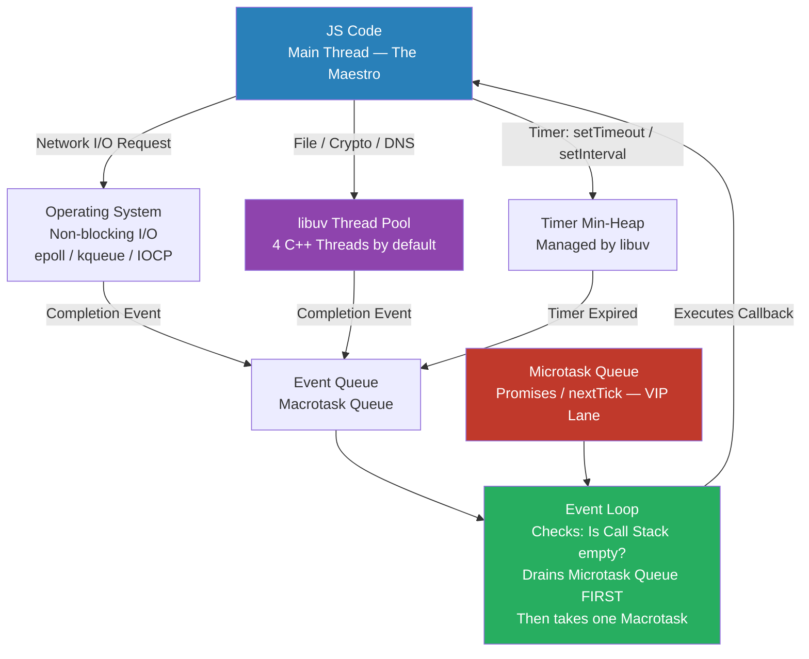
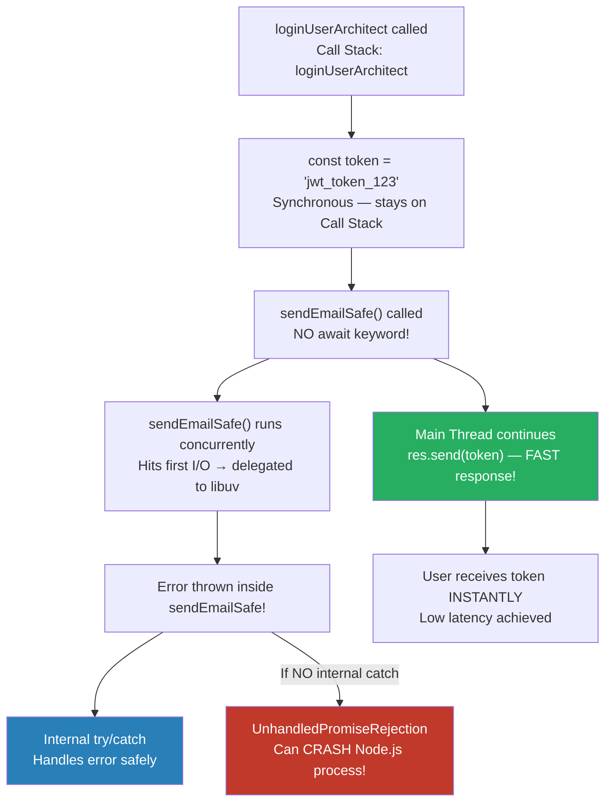
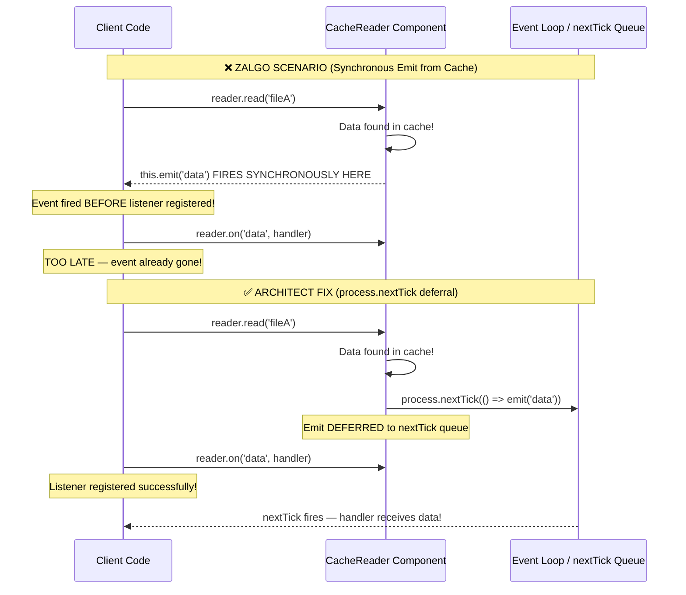
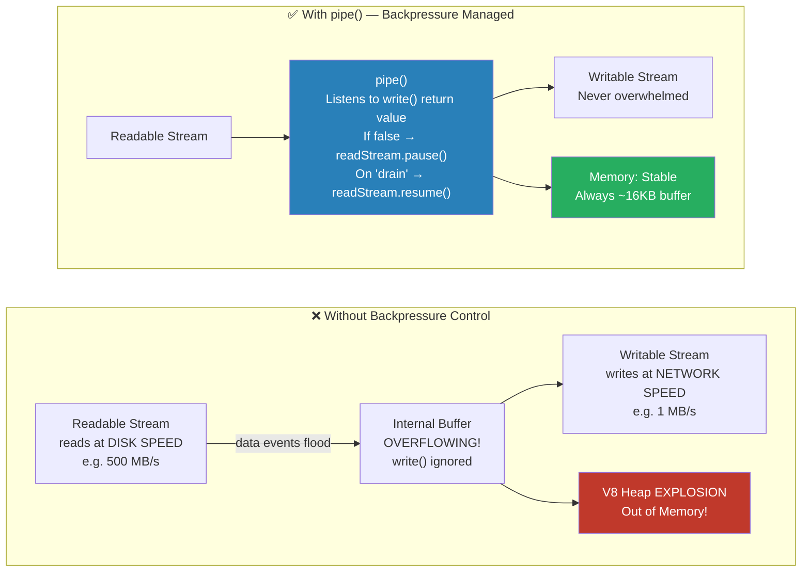

# 🏛️ JavaScript & Node.js — The Elite Interview Vault
## الجزء التالت: Module 5 & Module 6

---

> [!abstract] 🗺️ إنت فين دلوقتي في الـ Vault؟
>
> ✅ Module 1 — Call Stack & Execution Context *(خلصنا)*
> ✅ Module 2 — Hoisting, Scope Chain & TDZ *(خلصنا)*
> ✅ Module 3 — Closures, Module Pattern & Memory Management *(خلصنا)*
> ✅ Module 4 — Functional Programming: Pure Functions & HOF *(خلصنا)*
> 👉 **Module 5** — The Asynchronous Brain: libuv, Reactor Pattern & async/await *(إحنا هنا)*
> 👉 **Module 6** — Node.js Core Architecture: EventEmitter, Streams & Backpressure *(إحنا هنا)*
> ⏳ Module 7 — Node.js Design Patterns *(جاي)*

---

# ⚡ Module 5: The Asynchronous Brain (Event Loop & libuv)

## المايسترو الوحيد — إزاي Node.js بيخدم 10,000 مستخدم على Thread واحد

الجافاسكريبت فعلاً شغالة على مسار تشغيل واحد (Single Thread) جوه محرك V8، لكن Node.js كبيئة تشغيل (Runtime) مش Single Threaded بالكامل! السر كله يكمن في مكتبة مكتوبة بـ C++ اسمها **`libuv`**. المكتبة دي هي الـ I/O Engine بتاع Node.js، وهي اللي بتطبق نمط الـ **Reactor Pattern**. لما بتعمل طلب لملف أو قاعدة بيانات، المحرك بيفوض المهمة دي لـ `libuv`. لو نظام التشغيل بيدعم الـ Async I/O للعملية دي (زي الـ Network Sockets)، المكتبة بتستخدم الـ OS مباشرة (زي epoll أو kqueue). لكن لو العملية مفيهاش دعم مباشر من الـ OS (زي قراءة الملفات من الـ Filesystem)، المكتبة بتستخدم **C++ Thread Pool** مخفي (مكون من 4 مسارات تشغيل افتراضياً) عشان ينفذ المهمة في الخلفية، ولما يخلص، يبعت الناتج للـ Event Queue عشان الـ Main Thread يشتغل عليه.

خلينا نغوص في المعمارية دي ونفهمها بعمق.

---

## 5.1 The Reactor Pattern: libuv & Non-Blocking I/O

> [!bug] 🕵️ فخ الانترفيو — The Single Thread Myth
>
> في الانترفيوهات التقيلة، الانترفيور مستحيل يسألك "إيه هو الـ Single Thread؟". هيجيبلك كود بيقرأ ملف ضخم جداً، ويسألك:
>
> _"بما إن Node.js مبني على مسار تشغيل واحد (Single Thread)، إزاي بيقدر يخدم على 10,000 مستخدم في نفس اللحظة وهما بيعملوا Download لملفات؟ هل فيه مسارات تشغيل (Threads) تانية مخفية؟ وإيه الفرق بين الـ Blocking I/O اللي بيوقع السيرفر، والـ Non-blocking I/O؟"_
>
> الهدف هنا إنه يشوفك فاهم معمارية الـ Reactor Pattern والـ Event Demultiplexer، ولا مجرد مبرمج حافظ إن Node.js سريع وخلاص.

---

> [!abstract] 🧠 المفهوم المعماري — Thread-per-request vs Reactor Pattern
>
> في لغات زي Java و C++، السيرفرات التقليدية بتستخدم معمارية اسمها Thread-per-request. يعني كل مستخدم يدخل على السيرفر، نظام التشغيل بيحجزله Thread كامل في الميموري (بياخد حوالي 2MB من الـ RAM). لو الـ Thread ده طلب يقرأ داتا من الداتابيز، بيحصله Block (توقف) لحد ما الداتا ترجع. التوقف ده معناه إن الـ CPU عاطل ومبيعملش حاجة، وتغيير السياق (Context Switching) بين آلاف الـ Threads بيستهلك موارد السيرفر ويدمره.
>
> في Node.js، المعمارية مختلفة تماماً ومبنية على الـ **Reactor Pattern**: إحنا عندنا Thread واحد بس (Main Thread) بينفذ كود الجافاسكريبت. الـ Thread ده عامل زي "المايسترو". أول ما بيلاقي عملية I/O (قراءة ملف أو اتصال بشبكة)، مبيستناش! بياخد العملية دي مع الـ Callback بتاعها، ويرميها للـ **Event Demultiplexer** اللي بتديره مكتبة `libuv`.
>
> مكتبة `libuv` بتتصرف بطريقتين:
>
> 1. لو العملية Network (زي HTTP Request)، بتفوضها لنظام التشغيل لأنه بيدعم الـ Non-blocking I/O بشكل طبيعي.
> 2. لو العملية Filesystem (قراءة ملفات) أو Crypto (تشفير تقيل)، بتديها لـ **Thread Pool** مكتوب بـ C++ بيشتغل في الخلفية بدون ما يوقف المايسترو.
>
> ولما أي عملية من دول بتخلص، `libuv` بتاخد الـ Callback الخاص بيها وتحطه في طابور اسمه **Event Queue**. وهنا بييجي دور الـ Event Loop، اللي بياخد الـ Callbacks دي من الطابور ويديها للـ Main Thread ينفذها واحد ورا التاني.

---



---

> [!success] ✅ الإجابة النموذجية — Resource Optimization & The Golden Rule
>
> إزاي الفهم ده بيخليك Architect قوي؟
>
> فهمك للـ Reactor Pattern بيحقق مبدأ الـ **Resource Optimization** بأعلى كفاءة ممكنة. بدل ما نوزع الشغل على Threads كتير ونهدر الـ Memory في أوقات الانتظار (Idle Time)، Node.js بيوزع الشغل على "الوقت" (Spread over time) باستخدام مسار واحد مابيقفش أبداً.
>
> كـ Architect، القاعدة الذهبية بتاعتك هي **"لا توقف المايسترو أبداً" (Don't Block the Event Loop)**. أي عملية حسابية معقدة جداً (CPU-bound) أو استخدام دوال متزامنة (Synchronous APIs) هتعمل احتكار للمسار الوحيد ده، وبالتالي السيرفر كله هيقف ومفيش أي مستخدم تاني هيقدر يتصل بالسيرفر لحد ما العملية دي تخلص.

---

> [!example] 💻 كود الجونيور vs كود المهندس — Blocking vs Non-Blocking I/O
>
> خلينا نشوف كود Junior بيوقف السيرفر كله لأنه بيفكر بعقلية الـ Java القديمة (Blocking I/O)، وكود Architect بيستخدم قوة `libuv` والـ Reactor Pattern لضمان استقرار السيرفر:
>
> **❌ كود الـ Junior (Blocking I/O - Anti-Pattern):**

```javascript
import { readFileSync } from 'fs';

function handleRequestBad(req, res) {
    // ❌ DISASTER: This is synchronous and blocking!
    // The main thread halts here. No other users can connect
    // to the server until this massive 5GB file is fully loaded into memory.
    const data = readFileSync('/huge-video.mp4');
    res.send(data);
}
```

> **✅ كود الـ Architect (Non-Blocking I/O - Reactor Pattern):**

```javascript
import { readFile } from 'fs';

function handleRequestArchitect(req, res) {
    // ✅ PERFECT: The main thread offloads this to libuv's C++ Thread Pool.
    // The event loop immediately moves on to serve other thousands of users.
    readFile('/huge-video.mp4', (err, data) => {
        // This callback is pushed to the Event Queue when the thread pool finishes.
        if (err) return res.status(500).send('Error');
        res.send(data);
    });
}
```

---

> [!tip] 🔍 ابحث أكتر عن:
>
> - `"libuv Node.js architecture explained thread pool"`
> - `"Reactor Pattern Node.js event driven non-blocking I/O"`
> - `"Don't block the event loop Node.js best practices"`

---

> [!question] 🔗 الجسر للدرس الجاي
>
> عظيم جداً! إحنا كده فهمنا إن `libuv` هو الجندي المجهول اللي بيعالج الـ I/O في الخلفية، وإن الـ Event Loop هو اللي بياخد المخرجات من الـ Event Queue ويرجعها للمايسترو (Main Thread).
>
> **سؤال الانترفيو الخبيث اللي بيمهد لدرسنا الجاي:** _"إحنا بنقول إن الـ Callbacks بترجع تقف في الـ Event Queue.. بس الحقيقة إن Node.js معندوش طابور واحد، ده عنده عدة طوابير! لو عندك `setTimeout` و `fs.readFile` و `Promise` خلصوا كلهم في نفس اللحظة.. الـ Event Loop هيقرر يختار مين الأول ينفذه؟ إيه هي الـ Phases (المراحل) الداخلية للـ Event Loop وإزاي ترتيبها بيحدد سلوك السيرفر؟"_

---

## 5.2 Async/Await Under the Hood: Generators, Suspend & Resume

الـ `async/await` مش مجرد "سكر نحوي" (Syntactic Sugar) لتجميل شكل الكود، ده مبني تحت الكبوت على مفهوم الـ **Generators** والـ **Semicoroutines**. لما محرك V8 بيقابل الكلمة المفتاحية `await`، هو مابيعملش Block للـ Thread أبداً زي ما بيحصل في الـ C++ أو الـ Java. اللي بيحصل إنه بيعمل **Suspend (تعليق)** للـ Execution Context بتاع الدالة دي بس! المحرك بياخد بقية الكود اللي تحت سطر الـ `await` ويتعامل معاه كأنه Callback جوه `.then()`، ويرميه في الـ Microtask Queue. في اللحظة دي، السيطرة بترجع فوراً للـ Event Loop عشان يخدم على أي Requests تانية. ولما الـ Promise يخلص، المحرك بيرجع يعمل **Resume (استئناف)** للدالة من مكان ما وقفت بالظبط بالـ State بتاعتها.

خلينا نغوص في تفاصيل آخر درس في الـ Asynchronous Brain ونقفل الموديول ده تماماً.

---

> [!bug] 🕵️ فخ الانترفيو — Fire and Forget & Unhandled Rejections
>
> في الانترفيوهات التقيلة، هيجيبلك كود فيه دالة `async` بتنادي على دالة `async` تانية بس المبرمج نسي يكتب قبلها `await`، ويسألك:
>
> _"إيه اللي هيحصل هنا؟ هل الكود هيستنى الدالة دي تخلص؟ ولو الدالة دي ضربت Error أو Exception، هل بلوك الـ `try/catch` اللي بره هيمسكه؟ وإيه هو الـ 'Fire and Forget Pattern' وإزاي نستخدمه صح من غير ما نوقع السيرفر؟"_
>
> الهدف هنا إنه يشوفك فاهم الـ Control Flow وإزاي المحرك بيتعامل مع الـ Unhandled Promise Rejections.

---

> [!abstract] 🧠 المفهوم المعماري — Suspend, Resume & Fire and Forget
>
> في الـ OOP التقليدي، لو عندك مهمة بتاخد وقت (زي كتابة ملف أو إرسال إيميل)، إنت بتخلق لها Background Thread مخصوص عشان ماتعطلش الـ Main Thread.
>
> في الـ JavaScript، أي دالة مكتوب قبلها `async` هي دالة بتوعدك إنها هترجع Promise، حتى لو إنت عامل `return` لرقم عادي زي 10، المحرك بيغلفهولك في Promise implicitly.
>
> **الـ Fire and Forget Pattern (أطلق النيران وانسَ):** لو استدعينا دالة `async` من غير ما نحط قبلها `await`، المحرك بيشغل الدالة دي بشكل متوازي (Concurrent) في الخلفية. المايسترو (الـ Main Thread) بيبدأ تنفيذها، ولما بيخبط في أول عملية I/O جواها، بيفوضها لـ `libuv` وبيكمل هو تنفيذ باقي السطور اللي بعد استدعاء الدالة فوراً من غير ما يستناها. المشكلة الخطيرة هنا إن الدالة دي بقت شغالة في Execution Context منفصل تماماً عن السياق اللي استدعاها. لو ضربت Error، محدش هيحس بيها، وهتعمل مصيبة اسمها `UnhandledPromiseRejection`.

---



---

> [!success] ✅ الإجابة النموذجية — Fire and Forget Architecture in APIs
>
> معمارياً، الـ `async/await` بيحقق مبدأ الـ **Readability & Maintainability**. إنت بتحول كود مليان Callbacks و Chaining لكود شكله Imperative (من فوق لتحت) سهل القراءة والتتبع.
>
> لكن امتى الـ Architect بيتعمد يستخدم الـ **Fire and Forget** (يعني يشيل الـ await)؟ في هندسة الـ Microservices والـ APIs، تخيل إنك بتعمل Endpoint لتسجيل الدخول (Login). إنت عايز ترد على اليوزر بـ Token بأسرع وقت ممكن (Latency optimization). في نفس الوقت، إنت محتاج تبعت Welcome Email، وتسجل الـ Login Event في سيستم الـ Analytics.
>
> معمارياً، إنت مش المفروض تعمل `await` للإيميل والتحليلات وتأخر الـ Response بتاع اليوزر! إنت بتعملهم Fire and Forget عشان يشتغلوا في الخلفية. بس كـ Architect، لازم تأمن الـ Error Handling جوه الدوال دي نفسها، لأن الـ `try/catch` الخارجي بتاع الـ Request مش هيشوفهم.

---

> [!example] 💻 كود الجونيور vs كود المهندس — async/await & Fire and Forget
>
> خلينا نشوف كود Junior بيأخر السيرفر وبيمسك الـ Errors غلط، وكود Architect بيستخدم الـ Fire and Forget بأمان تام:
>
> **❌ كود الـ Junior (Slow Response & Unsafe Fire-and-Forget):**

```javascript
async function sendEmail() {
    // Simulating delay and a potential crash
    throw new Error("Email service is down!");
}

async function loginUserBad(req, res) {
    try {
        const token = "jwt_token_123";

        // Anti-pattern 1: Awaiting non-critical background tasks delays the response!
        // Anti-pattern 2: If we remove 'await' here, the catch block BELOW will NOT catch the error!
        sendEmail();

        return res.send({ token });
    } catch (error) {
        // This will NEVER catch the error from sendEmail() if 'await' is removed.
        // It leads to an Unhandled Promise Rejection crashing the Node process.
        console.log("Caught error:", error.message);
    }
}
```

> **✅ كود الـ Architect (Fast Response with Safe Fire-and-Forget):**

```javascript
async function sendEmailSafe() {
    try {
        // The task is securely wrapped in its own context
        throw new Error("Email service is down!");
    } catch (error) {
        // Handling the error internally so it doesn't crash the main process
        console.error("Background task failed silently:", error.message);
    }
}

async function loginUserArchitect(req, res) {
    const token = "jwt_token_123";

    // Architect Code: Fire and Forget!
    // No 'await', meaning the Main Thread moves instantly to the next line.
    // The user gets an immediate response, and the email processes concurrently.
    sendEmailSafe().catch(err => {
        // Extra safety net: Catching any untracked promise rejections directly attached to the call
        console.error("Failsafe catch:", err.message);
    });

    // Extremely fast response time!
    return res.send({ token });
}
```

---

> [!tip] 🔍 ابحث أكتر عن:
>
> - `"async await under the hood generators semicoroutines V8"`
> - `"Fire and Forget pattern Node.js unhandled promise rejection"`
> - `"Microtask queue vs Macrotask queue Node.js event loop phases"`

---

> [!question] 🔗 الجسر للـ Module 6
>
> إحنا كده قفلنا بالكامل موديول الـ **Asynchronous Brain**، وفهمنا إزاي Node.js بيدير المهام المتوازية، وإزاي الـ Event Loop والـ Microtasks والـ `async/await` بيشتغلوا بتناغم عشان يخدموا آلاف المستخدمين على Thread واحد.
>
> دلوقتي هنغير تركيزنا وندخل في قلب المعمارية الخاصة بـ Node.js: **Module 6: Node.js Core Architecture**.
>
> **سؤال الانترفيو الخبيث اللي بيمهد لدرسنا الجاي:** _"بما إن Node.js مبني بالكامل على فكرة الـ Events (Event-Driven Architecture).. إزاي الكلاس اللي اسمه `EventEmitter` بيطبق الـ 'Observer Design Pattern'؟ وليه يعتبر من الخطر جداً (Anti-Pattern معروف باسم Unleashing Zalgo) إننا نعمل `emit` لـ Event مرة بشكل متزامن (Synchronous) ومرة بشكل غير متزامن (Asynchronous) من نفس الـ Component بناءً على كاش مثلاً؟ وإزاي ده بيدمر توقعات الـ Client؟"_

---

# 🔌 Module 6: Node.js Core Architecture

## قلب Node.js — EventEmitter, Streams & Backpressure

الـ `EventEmitter` في Node.js هو التطبيق العملي (Native Implementation) للـ **Observer Design Pattern**. بيسمح لأوبجيكت (Subject) إنه يبلغ مجموعة من الـ Listeners (Observers) لما يحصل حدث معين. لكن المشكلة المعمارية الخطيرة المعروفة بـ "Unleashing Zalgo" بتحصل لما الـ Component يبعت Event بشكل متزامن (Synchronous) في حالات (زي لو الداتا موجودة في الكاش)، وبشكل غير متزامن (Asynchronous) في حالات تانية (زي لو بيقرأها من الداتابيز). ده بيدمر توقعات الـ Client، لأن لو الـ Event طلع بشكل متزامن، هيضرب (Fire) قبل ما الـ Client يلحق يعمل تسجيل للـ Listener بتاعه بـ `on('event')`، وبالتالي الـ Event هيضيع في الهوا! الحل دايماً إننا نوحد السلوك ونخليه Asynchronous باستخدام `process.nextTick()`.

خلينا نغوص في المعمارية دي بالتفصيل ونبدأ في **Module 6: Node.js Core Architecture**.

---

## 6.1 The EventEmitter: Observer Pattern & The Zalgo Anti-Pattern

> [!bug] 🕵️ فخ الانترفيو — Zalgo & EventEmitter
>
> في الانترفيوهات التقيلة، مش هيقولك "إزاي بتستخدم `EventEmitter`؟". هيجيبلك كلاس بيورث من `EventEmitter`، وجواه Method بتدور على داتا، ولو الداتا دي موجودة في الكاش بيبعت الـ Event فوراً من غير ما يقرأ من الداتابيز، ويسألك:
>
> _"ليه الكود ده بيشتغل صح أول مرة، ولما بننادي عليه تاني مرة (والداتا في الكاش) الـ Listener مابيطبعش حاجة؟ وإيه هو الـ Zalgo Anti-Pattern؟ وإزاي نحمي السيرفر من الـ Memory Leaks المرتبطة بالـ EventEmitter اللي ممكن توقع Node.js؟"_
>
> الهدف هنا إنه يتأكد إنك فاهم الـ Event Loop صح، وعارف إن الـ `EventEmitter` مش سحر، وإنه بيعتمد على توقيت التنفيذ (Execution Timing).

---

> [!abstract] 🧠 المفهوم المعماري — Observer Pattern & Zalgo
>
> في الـ OOP التقليدي (C++/Java)، الـ Observer Pattern بيتبني عن طريق Interfaces. الـ `Subject` بيحتفظ بليستة من الـ `Observers`، ولما يحصل حدث، بيلف عليهم (Loop) وينادي Method معينة جواهم (زي `update()`).
>
> في Node.js، الباترن ده مبني جوه الـ Core عن طريق كلاس `EventEmitter`. أي كلاس يقدر يورث منه بـ `extends EventEmitter` ويبقى قادر يعمل `emit` لأحداث، والـ Clients يعملوا `on` عشان يسمعوا الأحداث دي.
>
> **فخ الـ Zalgo والـ Synchronous Events:** لما بتعمل `this.emit('event')`، الـ `EventEmitter` بيلف على كل الـ Listeners وينفذهم **في نفس اللحظة (Synchronously)**. لو إنت كاتب كود بيعمل `emit` قبل ما الـ Client يلحق يكتب سطر الـ `.on('event')` (لأن الكود المتزامن بيخلص قبل ما ننزل للسطر اللي بعده)، الـ Event هيتفجر في الفراغ ومحدش هيسمعه.

---



---

> [!success] ✅ الإجابة النموذجية — Predictability & Memory Management
>
> إزاي ده بيفيدنا كـ Architects؟
>
> 1. **الـ Strict Predictability (التوقع الصارم):** الـ API بتاعك لازم يكون يا إما 100% Synchronous يا إما 100% Asynchronous. الخلط بينهم (Zalgo) بيكسر مبدأ الـ **Contract** بين الـ Component والـ Client، وبيخلق Bugs بتظهر وتختفي بشكل عشوائي (Race Conditions).
>
> 2. **الـ Memory Management (إدارة الميموري):** الـ `EventEmitter` هو أكبر مسبب للـ Memory Leaks في Node.js. لما بتعمل `.on('event', callback)`، الـ `EventEmitter` بيحتفظ بـ Reference للـ Callback ده (واللي هو في الغالب Closure ماسك في متغيرات كبيرة). لو الـ Event ده مربوط بـ Request، ونسيت تعمل `removeListener` بعد ما الـ Request يخلص، الـ Closure هيفضل عايش للأبد في الـ Heap، والميموري هتتملي لحد ما السيرفر يقع (Out of Memory). عشان كده الـ Architect الشاطر بيستخدم دايماً `once` لو هيسمع الحدث مرة واحدة، أو بينضف وراه بـ `removeListener`.

---

> [!example] 💻 كود الجونيور vs كود المهندس — Zalgo Fix with process.nextTick
>
> خلينا نشوف كود Junior بيعمل Unleash لـ Zalgo، وكود Architect بيحمي الـ Execution Flow عن طريق الـ Asynchronous Deferral:
>
> **❌ كود الـ Junior (Zalgo Anti-Pattern - Synchronous Emit):**

```javascript
import { EventEmitter } from 'events';

class CacheReaderBad extends EventEmitter {
    constructor() {
        super();
        this.cache = { fileA: "Cached Data" }; // Data already in memory
    }

    read(file) {
        if (this.cache[file]) {
            // ❌ ZALGO TRAP: Synchronous emit!
            // The event fires IMMEDIATELY before the function even returns.
            this.emit('data', this.cache[file]);
        } else {
            // Asynchronous emit (Simulating a database read)
            setTimeout(() => this.emit('data', "New Data"), 100);
        }
    }
}

const reader = new CacheReaderBad();
// Calling read() triggers the synchronous emit immediately.
reader.read('fileA');

// ❌ TOO LATE! The event already fired in the previous line.
// This listener will NEVER catch the 'data' event.
reader.on('data', data => console.log(data));
```

> **✅ كود الـ Architect (Taming Zalgo with process.nextTick):**

```javascript
import { EventEmitter } from 'events';

class CacheReaderArchitect extends EventEmitter {
    constructor() {
        super();
        this.cache = { fileA: "Cached Data" };
    }

    read(file) {
        if (this.cache[file]) {
            // ✅ ARCHITECT CODE: Forcing asynchronous behavior.
            // process.nextTick defers the emit to the Microtask queue.
            // This gives the outer scope time to attach the .on() listener!
            process.nextTick(() => this.emit('data', this.cache[file]));
        } else {
            setTimeout(() => this.emit('data', "New Data"), 100);
        }
    }
}

const readerSafe = new CacheReaderArchitect();
readerSafe.read('fileA');

// ✅ PERFECT! The current Call Stack finishes, this listener is registered,
// and THEN the Microtask queue executes the emitted event.
readerSafe.on('data', data => console.log("Safe:", data));
```

---

> [!question] 🔗 الجسر للدرس الجاي
>
> عظيم جداً، إحنا كده فهمنا إزاي الـ `EventEmitter` بيشتغل، وإزاي نحمي السيرفر من فخ الـ Zalgo والـ Memory Leaks، وبقينا قادرين نبني Event-Driven Components نظيفة.
>
> بما إننا نقدر نبعت داتا عن طريق الـ Events.. تخيل إننا بنقرأ فايل حجمه 5 جيجا وعايزين نبعته للـ Client.
>
> **سؤال الانترفيو الخبيث اللي بيمهد لدرسنا الجاي:** _"لو استخدمنا `fs.readFile` العادية اللي بتقرأ الفايل كله وتحطه في الميموري مرة واحدة.. إيه اللي هيحصل للـ V8 Heap Memory؟ وإيه هو الـ Buffer أصلاً وعلاقته بالـ C++؟ وإزاي الـ Streams في Node.js بتستخدم الـ EventEmitter عشان تقسم الفايل الضخم ده لقطع صغيرة (Chunks) وتبعتها للـ Client بكفاءة من غير ما السيرفر يقع؟"_

---

## 6.3 Piping & Backpressure: Connecting Streams Without Crashing the Server

لو الـ Readable Stream بيقرأ من الهارد ديسك بسرعة جداً، والـ Writable Stream (زي الـ HTTP Response لعميل بطيء) مابيلحقش يبعت الداتا دي، اللي بيحصل إن الـ Chunks دي بتتراكم في الـ Internal Buffer بتاع الـ Writable Stream لحد ما تعدي الحد الأقصى (الـ `highWaterMark`). لو استمرينا في القراءة، الميموري هتتملي والسيرفر هيقع (Out of Memory). هنا بيتدخل ميكانيزم عبقري في Node.js اسمه الـ **Backpressure** (الضغط العكسي). دالة `write()` مش مجرد بتبعت الداتا، دي بترجع Boolean. لو رجعت `false`، ده معناه إن الـ Buffer اتملى، ولازم الـ Readable Stream يعمل `pause()` وميقرأش داتا تانية لحد ما الـ Writable يفضي اللي عنده ويبعت حدث اسمه `drain`، ساعتها الـ Readable يعمل `resume()` ويكمل قراءة.

خلينا نغوص في المعمارية دي ونقفل **Module 6** تماماً.

---

> [!bug] 🕵️ فخ الانترفيو — Backpressure & pipe()
>
> في الانترفيوهات الثقيلة، هيجيبلك كود بيقرأ من فايل وبيكتب في فايل تاني، والمبرمج مستخدم الـ Events العادية كده: `readStream.on('data', chunk => writeStream.write(chunk))`، ويسألك:
>
> _"الكود ده شغال تمام في الـ Local، بس لما رفعناه على الـ Production والسيرفر عليه ضغط، بدأ يستهلك رام بشكل مرعب وبيعمل Crash. الكود ده بيعاني من مشكلة إيه؟ وليه دالة `write()` مصممة إنها ترجع `boolean`؟ وإزاي دالة `pipe()` بتحل الكارثة دي؟"_
>
> الهدف هنا إنه يتأكد إنك مش مجرد بتعرف تنقل داتا، لكنك فاهم إن الـ Streams ليها سرعات مختلفة، وإنك لازم تدير الـ Flow Control ده بنفسك أو تستخدم الأدوات الصح.

---

> [!abstract] 🧠 المفهوم المعماري — Backpressure & Flow Control
>
> في لغات زي C++ أو Java (في الـ Thread-based I/O)، لما بتكتب في Socket بطيء، الـ Thread نفسه بيحصله Block لحد ما الـ Buffer يفضى، وده بيخلق تزامن طبيعي (Natural pacing) بس بيهدر موارد.
>
> في Node.js (الـ Asynchronous I/O)، الـ Event Loop مابيقفش. الـ `readStream` هيفضل يضرب حدث `data` بأقصى سرعة ممكنة للهارد ديسك. لو عملت `writeStream.write(chunk)` من غير ما تراقب النتيجة، إنت كده بتعمل Flood للميموري.
>
> دالة `write()` في الـ Writable Stream هي دالة ذكية. لو الـ Buffer الداخلي عدى حاجز الـ `highWaterMark` (وهو عادة 16 كيلوبايت)، الدالة هترجع `false` كإشارة تحذير: _"أنا اتمليت، لو سمحت وقف بعت"_.
>
> لما الـ Writable Stream يفضى ويقدر يستقبل داتا تاني، بيضرب حدث اسمه `drain`.
>
> **الـ `pipe()`:** بدل ما تكتب اللوجيك بتاع الـ `pause` والـ `resume` والـ `drain` بإيدك، Node.js وفرلك دالة `pipe()`. الدالة دي بتاخد الـ Data اللي طالعة من الـ Readable تحطها في الـ Writable، وبتدير ميكانيزم الـ Backpressure بالكامل تحت الكبوت أوتوماتيكياً من غير أي تسريب للميموري.

---



---

> [!success] ✅ الإجابة النموذجية — Pipes and Filters Architecture Pattern
>
> إزاي الـ Piping بيخدم معمارية الـ Software؟
>
> الـ `pipe()` هو التطبيق الأمثل لـ **Pipes and Filters Architecture Pattern**. إنت بتبني السيستم بتاعك كقطع صغيرة ومستقلة (Single Responsibility Principle)، كل قطعة (Stream) بتعمل وظيفة واحدة (مثلاً فك ضغط، فلترة، تشفير، كتابة)، وتقدر توصلهم ببعض زي مكعبات الليجو.
>
> الأهم من كده إن الـ Backpressure بيحقق مبدأ الـ **System Resiliency** (مرونة النظام). السيرفر بتاعك مبيقعش تحت الضغط، لأنه بيعرف يقول للـ Source "هدي السرعة شوية" بناءً على قدرة الـ Destination، وده بيمنع الـ I/O Starvation وبيحافظ على استقرار الـ Memory Heap.

---

> [!example] 💻 كود الجونيور vs كود المهندس — Backpressure Fix
>
> خلينا نشوف كود الـ Junior اللي بيتجاهل الـ Backpressure وبيدمر الميموري، وكود الـ Architect اللي بيستخدم الـ `pipe()` عشان يبني Pipeline نظيف وآمن:
>
> **❌ كود الـ Junior (Ignoring Backpressure - Memory Crash):**

```javascript
import fs from 'fs';

const readStream = fs.createReadStream('massive-database.sql');
const writeStream = fs.createWriteStream('backup.sql');

// ❌ DISASTER: The Junior reads data as fast as the disk allows
// and blindly forces it into the writeStream.
// The boolean return value of .write() is completely ignored!
// Memory will explode if writing to a slow destination.
readStream.on('data', (chunk) => {
    writeStream.write(chunk);
});
```

> **✅ كود الـ Architect (Using pipe for automatic Backpressure management):**

```javascript
import fs from 'fs';

const readStream = fs.createReadStream('massive-database.sql');
const writeStream = fs.createWriteStream('backup.sql');

// ✅ ARCHITECT CODE: .pipe() automatically handles everything!
// It listens to 'data', writes it, checks the return value of .write().
// If false, it calls readStream.pause().
// When writeStream emits 'drain', it calls readStream.resume().
// Perfect memory management with zero boilerplate!
readStream.pipe(writeStream);
```

---

> [!tip] 🔍 ابحث أكتر عن:
>
> - `"Node.js Streams Backpressure explained pipe()"`
> - `"Node.js Readable Writable Transform Stream highWaterMark"`
> - `"Pipes and Filters architecture pattern Node.js"`

---

> [!question] 🔗 الجسر للـ Module 7
>
> عظيم جداً يا هندسة! إحنا كده قفلنا **Module 6 (Node.js Core Architecture)** بالكامل، وفهمنا إزاي الـ `EventEmitter` والـ `Buffers` والـ `Streams` والـ `Backpressure` بيشتغلوا مع بعض عشان يبنوا سيرفر قوي ومابيقعش.
>
> دلوقتي هننتقل للموديول الأخير وهو الـ Masterpiece بتاعنا: **Module 7: Node.js Design Patterns (The Architect Level)**.
>
> **سؤال الانترفيو الخبيث اللي بيمهد لأول درس في الموديول الجديد:** _"في الـ C++ أو الجافا، إحنا بنعتمد بشكل أساسي على الـ Classes والـ Constructors عشان نبني Objects معقدة خطوة بخطوة. لكن بما إننا عرفنا إن الجافاسكريبت بتستخدم الـ Closures والـ Duck Typing... إزاي نقدر نطبق الـ Factory Pattern والـ Builder Pattern في Node.js عشان نعزل عملية خلق الأوبجيكت (Creation) عن تفاصيله (Implementation) من غير ما نستخدم الكلمة المفتاحية `new` أو `class` أصلاً؟ وإيه علاقة ده بالـ Encapsulation الحقيقي؟"_

---

> [!success] ✅ Checkpoint — Module 5 & 6 Summary
>
> قبل ما تكمل، تأكد إنك مسيطر على الأسئلة دي:
>
> | السؤال | الإجابة الصح |
> |---|---|
> | ليه Node.js مش Single Threaded بالكامل؟ | `libuv` عندها Thread Pool بـ C++ للـ Filesystem والـ Crypto |
> | إيه هو الـ Reactor Pattern؟ | Main Thread يفوض الـ I/O لـ libuv وييجي Event Loop يرجع الـ Callback |
> | القاعدة الذهبية للـ Node.js Architect؟ | **Don't Block the Event Loop** — خلي الـ Call Stack يفضل خفيف |
> | إيه اللي بيحصل لما `async fn` تشتغل بدون `await`؟ | تشتغل concurrently — لو ضربت Error مش هيتمسك في الـ catch الخارجي |
> | إيه هو فخ الـ Zalgo؟ | Component بيعمل emit مرة sync ومرة async — بيدمر توقع الـ Client |
> | الحل لـ Zalgo؟ | `process.nextTick()` بيخلي الـ emit دايماً async |
> | إيه هو الـ Backpressure؟ | `write()` بترجع `false` لو الـ Buffer اتملى — وقف القراءة لحد `drain` |
> | الفرق بين قراءة ملف عادية والـ Streams؟ | الـ Streams بتقسم الداتا لـ Chunks وبتدير الـ Memory تلقائياً |

---

انسخ الـ Module 5 و 6 دول في أوبسيديان، وقولي **"كمل"** عشان أنسقلك Module 7 (Design Patterns) بنفس التفاصيل الكاملة 🚀
