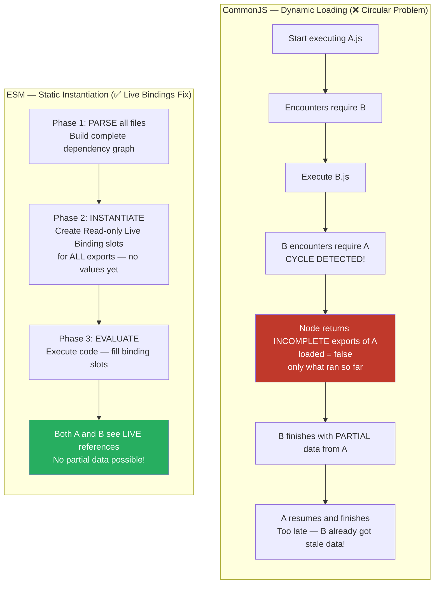
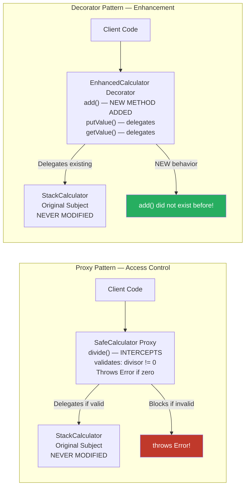
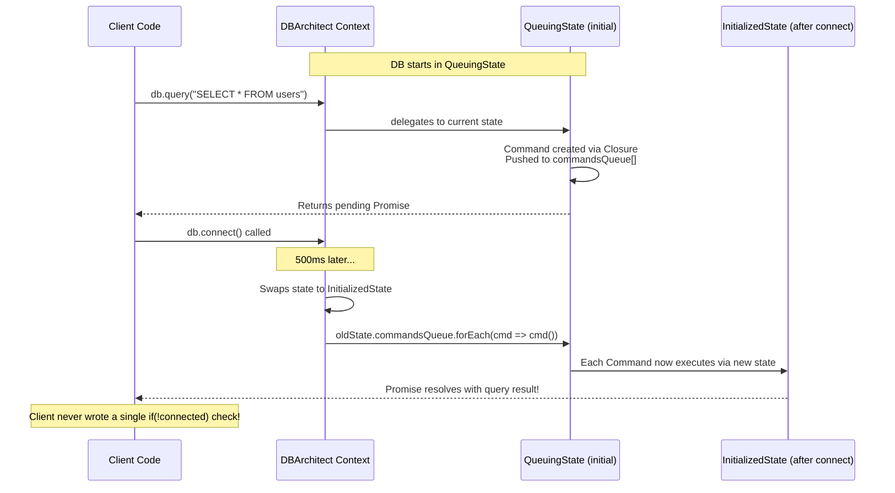
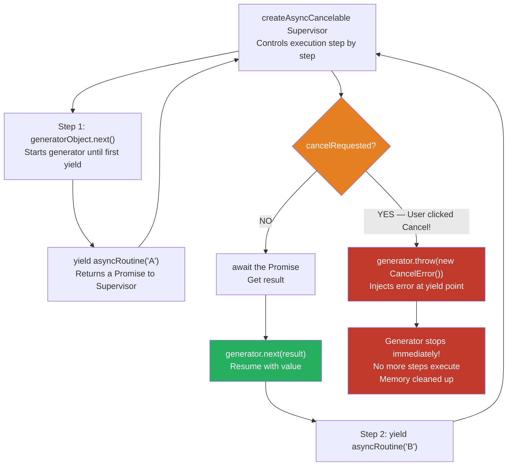

# 🏛️ JavaScript & Node.js — The Elite Interview Vault
## الجزء الرابع: Module 7 — Node.js Design Patterns

---

> [!abstract] 🗺️ إنت فين دلوقتي في الـ Vault؟
>
> ✅ Module 1 — Call Stack & Execution Context *(خلصنا)*
> ✅ Module 2 — Hoisting, Scope Chain & TDZ *(خلصنا)*
> ✅ Module 3 — Closures, Module Pattern & Memory Management *(خلصنا)*
> ✅ Module 4 — Functional Programming: Pure Functions & HOF *(خلصنا)*
> ✅ Module 5 — The Asynchronous Brain: libuv, Reactor Pattern & async/await *(خلصنا)*
> ✅ Module 6 — Node.js Core Architecture: EventEmitter, Streams & Backpressure *(خلصنا)*
> 👉 **Module 7** — Node.js Design Patterns: Factory, Singleton, Proxy, State, Generators, Worker Threads *(إحنا هنا)*

---

# 🏗️ Module 7: Node.js Design Patterns (The Architect Level)

## المستوى اللي بيفرق فعلاً بين Senior وArchitect

في لغات زي C++ أو Java، إحنا متكتفين بالكلمة المفتاحية `new` عشان نخلق (Instantiate) أوبجيكت من Class معين. لكن في الجافاسكريبت، بفضل مفهوم الـ **Duck Typing** (لو بيمشي زي البطة وبيكاكي زي البطة، يبقى بطة!)، إحنا مش محتاجين Classes أصلاً. نقدر نطبق الـ **Factory Pattern** عن طريق دالة عادية جداً بترجع Object Literal `{}`. وعشان نحقق الـ Encapsulation التام، بنعرف المتغيرات جوه الدالة دي بـ `let` أو `const`، والـ Methods اللي بنرجعها في الأوبجيكت بتحتفظ بـ Closure (شنطة ذكريات) للمتغيرات دي. كده إحنا فصلنا عملية الخلق عن التنفيذ، ومحدش يقدر يلمس الـ State من بره.

خلينا نغوص في المعمارية دي ونبدأ في **Module 7: Node.js Design Patterns**.

---

## 7.1 Factory, Builder & Revealing Constructor: Architecting Object Creation

> [!bug] 🕵️ فخ الانترفيو — Factory Pattern & Tight Coupling
>
> في الانترفيو التقيل، الانترفيور هيجيبلك كود بيستخدم `new DatabaseConnection()` في 50 فايل مختلف في المشروع، ويسألك:
>
> _"إيه هي الكارثة المعمارية اللي هتحصل لو قررنا في بيئة الـ Testing إننا نستخدم Mock Database بدل الحقيقية؟ وليه استخدام الـ `new` keyword بيعتبر Hardcoded Dependency (Tight Coupling)؟ وإزاي الـ Factory Pattern بيحل الأزمة دي وبيخلينا نرجع Mock Object من غير ما نغير سطر كود واحد في الـ 50 فايل؟"_
>
> الهدف هنا إنه يشوفك بتفكر بمبدأ الـ Dependency Inversion، وإنك فاهم إزاي تعزل عملية خلق الأوبجيكت (Creation) عن استخدامه (Consumption).

---

> [!abstract] 🧠 المفهوم المعماري — الـ 3 Creational Patterns الأساسية
>
> في الـ OOP التقليدي، إنت بتبني `class` وتعمل منه `new`. المشكلة إن `new` بتربط الكود بتاعك بـ Concrete Implementation (تنفيذ صريح). لو حبيت تغير الكلاس ده، لازم تلف على كل مكان عملت فيه `new` وتغيره.
>
> في Node.js، بنستخدم 3 باترنز أقوياء جداً للتحكم في خلق الأوبجيكتات:
>
> **1. الـ Factory Pattern:** الدالة الـ Factory هي دالة عادية (مش كلاس) وظيفتها إنها تبني الأوبجيكت وترجعه. الميزة الجبارة هنا إن الـ Factory يقدر يقرر في الـ Runtime يرجعلك أي نوع من الأوبجيكتات (سواء حقيقي أو Mock)، طالما ليهم نفس الـ Methods (وده الـ Duck Typing). كمان، المتغيرات اللي جوه الـ Factory بتبقى Private تماماً بفضل الـ Closures.
>
> **2. الـ Builder Pattern:** لما بيكون عندك أوبجيكت معقد بياخد باراميترز كتير جداً في الـ Constructor (ودي بنسميها Telescoping Constructor Anti-pattern). الـ Builder بيخليك تبني الأوبجيكت خطوة خطوة عن طريق Chaining Methods زي `obj.setHost().setPort().build()`. أشهر مثال لده هي مكتبة `superagent` لبناء الـ HTTP Requests.
>
> **3. الـ Revealing Constructor Pattern:** ده باترن ابتكره Domenic Denicola. فكرته إنك تخلق أوبجيكت يكون Immutable (غير قابل للتعديل) بعد ما يتكريت، لكنك بتسمح بتعديله **فقط** لحظة خلقه. أشهر تطبيق للباترن ده هو الـ `Promise`! إنت بتباصي دالة `(resolve, reject) => {...}` للكونستراكتور، وهو بيكشفلك (Reveals) أدوات التعديل دي جوه الدالة بس، لكن من بره الـ Promise مقفول.

---

> [!success] ✅ الإجابة النموذجية — SOLID Principles Link
>
> إزاي الباترنز دي بتحقق مبادئ الـ SOLID؟
>
> 1. **الـ Dependency Inversion Principle (DIP):** الـ Client كود بيعتمد على الـ Interface اللي راجع من الـ Factory (مجموعة دوال)، ومش مهتم خالص باسم الكلاس ولا طريقة خلقه. ده بيخلي السيستم Loosely Coupled.
> 2. **الـ Single Responsibility Principle (SRP):** إنت بتفصل اللوجيك المعقد بتاع "إزاي نجهز الأوبجيكت" وتلم الباراميترز بتاعته، وتحطه في الـ Factory أو الـ Builder، وتسيب الـ Client يركز بس في "إزاي يستخدم الأوبجيكت".
> 3. **الـ Encapsulation التام:** في الجافاسكريبت، الـ Factory مع الـ Closures هو أقوى وأأمن بديل للـ `private` properties، لأن الداتا بتستخبى في الـ Lexical Scope ومستحيل الوصول ليها غير عن طريق الـ Methods اللي الـ Factory كشفها بس.

---

> [!example] 💻 كود الجونيور vs كود المهندس — Factory Pattern & Duck Typing
>
> خلينا نشوف كود Junior بيعتمد على الـ `new` وبيفضح الـ State، وكود Architect بيستخدم الـ Factory Pattern والـ Duck Typing عشان يرجع Mock Object في بيئة التطوير:
>
> **❌ كود الـ Junior (Tight Coupling & Exposed State):**

```javascript
// Bad Code: Hardcoded class instantiation.
// If we want to disable profiling in production, we have to add
// 'if' statements everywhere in our app!
class ProfilerBad {
    constructor(label) {
        this.label = label;
        this.lastTime = null; // Publicly exposed state!
    }
    start() { this.lastTime = process.hrtime(); }
    end() { /* calculate diff */ }
}

// The client is tightly coupled to the concrete class
const profiler = new ProfilerBad("Database Query");
profiler.start();
```

> **✅ كود الـ Architect (Factory Pattern with Closures & Duck Typing):**

```javascript
// Architect Code: A Factory Function (No 'new', No 'class')
// Source adaptation for deep encapsulation.
export function createProfiler(label) {
    // Private State via Closure! Cannot be touched from the outside.
    let lastTime = null;

    // Duck Typing: In production, return a Mock object (No-op)
    // to save memory and CPU. The client won't know the difference!
    if (process.env.NODE_ENV === 'production') {
        return {
            start: () => {},
            end: () => {}
        };
    }

    // In development, return the real implementation
    return {
        start() {
            lastTime = process.hrtime();
        },
        end() {
            const diff = process.hrtime(lastTime);
            console.log(`Timer [${label}] took ${diff} seconds and ${diff} nanoseconds.`);
        }
    };
}

// The client code is fully decoupled. It just calls the factory.
const profilerSafe = createProfiler("Database Query");
profilerSafe.start(); // Works seamlessly in both environments!
```

---

> [!tip] 🔍 ابحث أكتر عن:
>
> - `"Factory Pattern JavaScript closures encapsulation"`
> - `"Revealing Constructor Pattern Promise JavaScript"`
> - `"Builder Pattern method chaining Node.js superagent"`

---

> [!question] 🔗 الجسر للدرس الجاي
>
> عظيم جداً يا هندسة! إحنا كده فهمنا قوة الـ Factory والـ Builder والـ Revealing Constructor، وإزاي بنعزل عملية بناء الأوبجيكت وبنحمي الـ State الداخلية باستخدام الـ Closures.
>
> لكن، ساعات بنحتاج الأوبجيكت ده (زي اتصال الداتابيز) يتكريت مرة واحدة بس (Singleton) ونشاركه بين كل الفايلات في السيرفر.
>
> **سؤال الانترفيو الخبيث اللي بيمهد لدرسنا الجاي:** _"إحنا عارفين إن دالة `require()` في الـ CommonJS بتعمل Cache للموديول بعد أول مرة بيتحمله. هل ده معناه إننا لو عملنا Export لـ Object Instance يبقى إحنا كده حققنا الـ 'Singleton Pattern' بأمان تام بنسبة 100%؟ وإيه هي الكارثة اللي ممكن تحصل للـ Module Cache لو عندنا Circular Dependencies (موديول A بيطلب B، و B بيطلب A)؟ وإزاي Node.js بيتصرف في الـ Loop دي؟"_

---

## 7.2 Singleton Pattern & Circular Dependencies (CommonJS vs ESM)

في Node.js، دالة `require()` فعلاً بتعمل Cache للموديول في أوبجيكت اسمه `require.cache` بعد أول مرة بيتعمله تحميل. ده بيضمن إن أي استدعاء تاني لنفس الموديول هيرجع نفس الـ Instance، وده بيخلق لنا **Singleton Pattern** طبيعي جداً من غير تعقيدات. لكن، الكارثة بتحصل لما يكون عندنا **Circular Dependencies** (اعتماد دائري). يعني موديول `a.js` بيعمل require لـ `b.js`، وفي نفس الوقت `b.js` بيعمل require لـ `a.js`. في بيئة CommonJS، المحرك مش بيدخل في Infinite Loop (حلقة مفرغة)، لكنه بيعمل حاجة أسوأ: بيرجع الـ `exports` object بتاع الموديول الأول وهو **غير مكتمل** (Incomplete State). ده بيخلي أجزاء من السيستم تشوف داتا ناقصة وتضرب Errors غريبة جداً في الـ Runtime!

خلينا نغوص في المعمارية دي بالتفصيل ونشوف إزاي الـ Architects بيحلوها.

---

> [!bug] 🕵️ فخ الانترفيو — Circular Dependencies & Module Cache
>
> في الانترفيو التقيل، الانترفيور هيجيبلك فايلين: الفايل الأول `auth.js` بيـ require `user.js`. الفايل التاني `user.js` بيـ require `auth.js`. ويسألك بابتسامة خبيثة:
>
> _"هل السيرفر هيضرب Stack Overflow بسبب الـ Infinite Loop؟ ولو لأ، ليه موديول `user` بيشوف الداتا اللي جاية من `auth` على إنها `{}` (أوبجيكت فاضي) أو `undefined`؟ وإزاي معمارية ESM (ECMAScript Modules) الحديثة حلت الكارثة دي من جذورها؟"_
>
> الهدف هنا إنه يشوفك فاهم الـ Module Loading Lifecycle والفرق الجوهري بين الـ Dynamic Evaluation في CommonJS والـ Static Analysis في ESM.

---

> [!abstract] 🧠 المفهوم المعماري — CommonJS Dynamic vs ESM Static Live Bindings
>
> في الـ C++ أو الجافا، عشان تعمل Singleton إنت بتعمل `private constructor` وتخلي الكلاس يرجع نفس الـ `static instance` كل مرة. الكومبايلر بيرفض تماماً الـ Circular Dependencies الصريحة في مرحلة الـ Compile-time.
>
> في Node.js، الـ `require()` بتشتغل في الـ Runtime (Dynamic). لما بتطلب موديول، المحرك بيقرأ الفايل (Synchronously)، بينفذ الكود، وبيحط الناتج في `require.cache`. لو حصل Circular Dependency (A بيطلب B، و B بيطلب A):
>
> 1. المحرك بيبدأ ينفذ `A`.
> 2. بيلاقي `require('B')`، فبيوقف تنفيذ `A` ويروح ينفذ `B`.
> 3. جوه `B` بيلاقي `require('A')`. هنا المحرك بيقول: "أنا مستحيل أبدأ `A` من الأول عشان معملش Infinite Loop".
> 4. فبيعمل إيه؟ بيدي لـ `B` النسخة **غير المكتملة** (Uninitialized) من الـ `exports` بتاعة `A` (اللي هي غالباً أوبجيكت فاضي).
> 5. `B` بيخلص ويرجع لـ `A` عشان يكمل. النتيجة إن `B` معاه داتا ناقصة من `A`!
>
> **الحل السحري في ESM:** الـ ES Modules (اللي بتستخدم `import / export`) بتشتغل على 3 مراحل: Parsing، Instantiation، و Evaluation. في مرحلة الـ Instantiation، المحرك بيبني "خريطة" لكل الـ Imports والـ Exports قبل ما ينفذ سطر كود واحد، وبيعمل حاجة اسمها **Read-only Live Bindings** (روابط حية للقراءة فقط). ده معناه إن حتى لو في Circular Dependency، الموديولين بيبقوا شايفين "رابط" للميموري، ولما الكود يتنفذ، الرابط ده بيتملي بالداتا الصح، ومفيش أي موديول بيشوف داتا ناقصة.

---



---

> [!success] ✅ الإجابة النموذجية — Dependency Architecture Link
>
> إزاي ده بيفيدنا في هندسة السوفت وير؟
>
> 1. **الـ Dependency Inversion & Tight Coupling:** وجود Circular Dependency هو جرس إنذار (Code Smell) معناه إن السيستم بتاعك Tightly Coupled (مرتبط ببعضه بشدة). كـ Architect، المفروض تفصل اللوجيك المشترك في موديول تالت (C)، وتخلي A و B يعتمدوا على C بدل ما يعتمدوا على بعض.
> 2. **الـ Static Analysis (التحليل الثابت):** استخدام ESM بيحقق مبدأ الـ Fail-Fast. لأن الـ Imports بتبقى Static وموجودة في أول الفايل، المحرك بيقدر يبني الـ Dependency Graph (شجرة الاعتماديات) بشكل كامل، وده بيسمح بأدوات زي Webpack أو Rollup إنها تعمل Tree-Shaking وتمسح الكود اللي مش مستخدم.

---

> [!example] 💻 كود الجونيور vs كود المهندس — CommonJS vs ESM Circular
>
> خلينا نشوف الكارثة في CommonJS، وإزاي الـ Architect بيستخدم الـ ESM عشان يحل المشكلة جذرياً باستخدام الـ Live Bindings:
>
> **❌ الكود السيء (CommonJS Circular Dependency Trap):**

```javascript
// a.js (CommonJS)
exports.loaded = false;
const b = require('./b'); // Execution pauses here! Goes to b.js
// By the time it comes back, 'b' has a partial copy of 'a'
exports.loaded = true;

// b.js (CommonJS)
const a = require('./a'); // Cycle! Returns the UNFINISHED exports of 'a'
exports.loaded = true;
console.log("From b.js, a is:", a);
// Output: From b.js, a is: { loaded: false } (INCOMPLETE STATE!)
```

> **✅ الكود المعماري (ESM Live Bindings Resolution):**

```javascript
// a.js (ESM)
import * as bModule from './b.js'; // Static resolution
export let loaded = false;
export const b = bModule;
loaded = true; // The live binding updates instantly everywhere!

// b.js (ESM)
import * as aModule from './a.js'; // Static resolution
export let loaded = false;
export const a = aModule;
loaded = true;

// When executed, ESM guarantees that 'a' and 'b' have the FULL, updated picture
// of each other thanks to read-only live bindings in the Memory Heap.
```

---

> [!tip] 🔍 ابحث أكتر عن:
>
> - `"CommonJS circular dependency Node.js incomplete exports"`
> - `"ESM live bindings vs CommonJS static analysis"`
> - `"Node.js module cache require.cache singleton pattern"`

---

> [!question] 🔗 الجسر للدرس الجاي
>
> عظيم جداً يا هندسة! إحنا كده قفلنا عالم الـ Creational Patterns (زي الـ Factory والـ Singleton) وفهمنا إزاي الموديولز بتتكريت وتتحمل في الميموري، وإزاي نهرب من فخ الـ Circular Dependencies.
>
> دلوقتي هننتقل لنوع تاني من الباترنز: **Structural Design Patterns** (إزاي نركب الأوبجيكتات مع بعض عشان نضيف سلوكيات جديدة من غير ما نعدل الكود الأصلي).
>
> **سؤال الانترفيو الخبيث اللي بيمهد لدرسنا الجاي:** _"في الجافاسكريبت، لو عندنا أوبجيكت `StackCalculator` جواه دالة `divide()`، والمبرمج نسي يهندل القسمة على صفر فبترجع `Infinity`. إزاي نقدر نستخدم الـ 'Proxy Design Pattern' عشان نعترض (Intercept) استدعاء الدالة دي، ونرمي Error صريح لو المقسوم عليه صفر، من غير ما نلمس الكود الأصلي بتاع الكلاس نهائياً؟ وإيه هو الفرق المعماري بين استخدام الـ 'Object Composition' وبين استخدام الـ 'Object Augmentation (Monkey Patching)' في بناء الـ Proxy ده؟"_

---

## 7.3 Structural Design Patterns: Proxy & Decorator (Composition over Inheritance)

في الجافاسكريبت، القسمة على صفر مش بتضرب Error زي لغات تانية، لكنها بترجع قيمة غريبة اسمها `Infinity`. عشان نعترض استدعاء دالة `divide()` ونعدل سلوكها من غير ما نلمس الكلاس الأصلي `StackCalculator`، بنستخدم الـ **Proxy Pattern**. عندنا طريقتين معماريين لبناء الـ Proxy ده:

1. **الـ Object Composition (التركيب):** بنكريت كلاس جديد (مثلاً `SafeCalculator`) بياخد الـ `calculator` الأصلي كـ Parameter في الـ Constructor ويحتفظ بـ Reference ليه. جواه، بنكتب دالة `divide()` الخاصة بينا اللي بتعمل Validation، وأي دالة تانية (زي `getValue` أو `putValue`) بنعملها Delegation (تفويض) للأوبجيكت الأصلي.
2. **الـ Object Augmentation أو الـ Monkey Patching (الترقيع):** هنا إحنا بنعدل الأوبجيكت الأصلي **مباشرة في الميموري**! بنحفظ نسخة من الدالة القديمة `const divideOrig = calculator.divide`، وبعدين نكتب فوقها الدالة الجديدة بتاعتنا، ولما نخلص الـ Validation بننادي على الدالة القديمة بـ `divideOrig.apply(calculator)`.

الـ Composition أأمن معمارياً لأنه مابيعملش Mutation (تعديل) للأوبجيكت الأصلي، بينما الـ Monkey Patching بيغير الـ State وممكن يضرب سيستم شغال لو حد تاني بيعتمد على السلوك القديم!

خلينا نغوص في تفاصيل المعمارية دي ونبدأ في فهم الـ Structural Patterns.

---

> [!bug] 🕵️ فخ الانترفيو — Proxy vs Decorator Intent
>
> في الانترفيوهات التقيلة، الانترفيور هيقولك:
>
> _"إحنا اتكلمنا عن الـ Proxy وإزاي بيغلف الأوبجيكت عشان يتحكم فيه. بس فيه Pattern تاني اسمه الـ Decorator بيغلف الأوبجيكت برضه بنفس الطريقة بالضبط (بالـ Composition)! إيه هو الفرق المعماري الجوهري بين الـ Proxy والـ Decorator؟ وليه كـ Architect بتفضل تستخدم الـ Composition Patterns دي بدل ما تستخدم الـ Inheritance (الوراثة) الصريحة؟"_
>
> الهدف هنا إنه يشوفك مش مجرد حافظ كود، لكنك فاهم الـ "Intent" أو النية وراء كل Pattern وإزاي بيطبق مبادئ SOLID.

---

> [!abstract] 🧠 المفهوم المعماري — Proxy vs Decorator: Same Code, Different Intent
>
> في الـ C++ أو Java، الوراثة (Inheritance) بتخلق تسلسل هرمي صلب (Tight Coupling). لو حبيت تضيف ميزة صغيرة لكلاس، هتضطر تورث منه، ولو حبيت تضيف ميزة تانية هتورث تاني، لحد ما تلاقي نفسك في فخ الـ "Deep Inheritance Hierarchy" اللي بيدمر الميموري وبيخلي الكود مستحيل يتعدل.
>
> في الـ JavaScript، الـ Architecture الحديث بيفضل مبدأ **"Composition over Inheritance"**. إحنا بنجيب الأوبجيكت، ونغلفه بأوبجيكت تاني (Wrapper) يضيفله ميزات جديدة من غير ما يعقد شجرة الوراثة.
>
> **إيه الفرق بين الـ Proxy والـ Decorator؟** فنياً، الاتنين بيتكتبوا بنفس الطريقة (كلاس بيغلف كلاس). لكن **النية المعمارية (Intent)** مختلفة تماماً:
>
> - **الـ Proxy Pattern:** هدفه **التحكم في الوصول (Access Control)**. الـ Proxy مابيضفش دوال جديدة للأوبجيكت، هو بس بيعترض (Intercept) الدوال الموجودة بالفعل عشان يضيف Validation، أو Caching، أو Security. (زي ما منعنا القسمة على صفر في `divide`).
> - **الـ Decorator Pattern:** هدفه **إضافة سلوك جديد (Augmentation/Enhancement)**. الـ Decorator بيضيف ميزات أو دوال جديدة مكنتش موجودة في الأوبجيكت الأصلي. مثلاً، `StackCalculator` الأصلي مكنش فيه دالة جمع `add()`. الـ Decorator هيغلفه ويضيفله دالة `add()`، ويفوض باقي الدوال للأصل.

---



---

> [!success] ✅ الإجابة النموذجية — OCP & SRP via Composition
>
> إزاي الباترنز دي بتحقق مبادئ الـ SOLID؟
>
> 1. **مبدأ الـ Open/Closed Principle (OCP):** الكلاس الأصلي (`StackCalculator`) مقفول للتعديل (Closed for modification). إحنا مش هنلمس الكود بتاعه أبداً. لكنه مفتوح للتوسع (Open for extension) عن طريق إننا بنغلفه بـ Proxy أو Decorator يضيف اللوجيك اللي إحنا عايزينه.
> 2. **مبدأ الـ Single Responsibility Principle (SRP):** بدل ما الكلاس الأصلي يكون فيه لوجيك الحسابات، ولوجيك الـ Validation، ولوجيك الـ Caching (ويبقى God Object)، إحنا بنفصل كل مسؤولية في Decorator مستقل، ونركبهم جوه بعض زي مكعبات الليجو.

---

> [!example] 💻 كود المهندس — Decorator via Composition
>
> خلينا نشوف إزاي الـ Architect بيبني **Decorator** باستخدام الـ Object Composition عشان يضيف دالة جديدة للأوبجيكت الأصلي بدون ما يلمسه:

```javascript
// The Original Subject (Closed for modification)
class StackCalculator {
    constructor() { this.stack = []; }
    putValue(value) { this.stack.push(value); }
    getValue() { return this.stack.pop(); }
    multiply() { /* ... */ }
}

// ✅ ARCHITECT CODE: The Decorator using Composition
class EnhancedCalculator {
    // 1. Store a reference to the original object
    constructor(calculator) {
        this.calculator = calculator;
    }

    // 2. ADDING NEW BEHAVIOR (Decorator Intent)
    add() {
        const addend2 = this.getValue();
        const addend1 = this.getValue();
        const result = addend1 + addend2;
        this.putValue(result);
        return result;
    }

    // 3. DELEGATING existing methods to the subject
    putValue(value) { return this.calculator.putValue(value); }
    getValue() { return this.calculator.getValue(); }
    multiply() { return this.calculator.multiply(); }
}

const calculator = new StackCalculator();
const enhancedCalculator = new EnhancedCalculator(calculator);

enhancedCalculator.putValue(4);
enhancedCalculator.putValue(3);
// The new feature works seamlessly!
console.log(enhancedCalculator.add()); // 4 + 3 = 7
```

---

> [!question] 🔗 الجسر للدرس الجاي
>
> عظيم جداً يا هندسة! إحنا كده فهمنا الـ Structural Patterns وإزاي بنغلف الأوبجيكتات عشان نتحكم فيها (Proxy) أو نزودها (Decorator) عن طريق الـ Composition.
>
> دلوقتي هننتقل للمستوى الأعلى: **Behavioral Patterns & Async Flow**.
>
> **سؤال الانترفيو الخبيث اللي بيمهد لدرسنا الجاي:** _"تخيل إن عندنا `DB` Component بيعمل اتصال بقاعدة البيانات، والاتصال ده بياخد وقت (Asynchronous Initialization) حوالي 500 ملي ثانية. لو الـ Client حاول يعمل `db.query()` قبل ما الـ 500 ملي ثانية يخلصوا، السيرفر هيضرب Error! إزاي نقدر نستخدم الـ **State Pattern** مع الـ **Command Pattern** (وتحديداً تقنية الـ Pre-initialization Queues) عشان نعترض الـ Queries دي، نخزنها في طابور، وننفذها أوتوماتيك أول ما الداتابيز تبقى جاهزة، من غير ما نجبر المبرمج اللي بيستخدم الـ DB إنه يكتب `if (!connected)` قبل كل Query؟"_

---

## 7.4 State & Command Patterns: Pre-initialization Queues (The Mongoose Secret)

لما بيكون عندنا Component بيحتاج وقت عشان يعمل (Asynchronous Initialization) زي الاتصال بقاعدة البيانات، الحل الساذج هو إننا نكتب `if (!connected)` جوه كل دالة ونرمي Error، وده بيدمر الـ Developer Experience (DX). الحل المعماري العبقري هو دمج الـ **State Pattern** مع الـ **Command Pattern**. بنخلي الأوبجيكت بتاعنا يبدأ في حالة اسمها `QueuingState`، أي استدعاء لدالة `query` بيتحول لـ Command (دالة مغلفة بـ Promise) وبيتحط في طابور (Queue). أول ما الداتابيز تفتح، الأوبجيكت بيغير حالته لـ `InitializedState`، وبينفذ كل الـ Commands اللي في الطابور، وأي استدعاء جديد بيتنفذ فوراً. المبرمج اللي بيستخدم الكلاس بتاعك مش هيحس بأي تأخير ولا هيكتب أي `if` statements!

خلينا نغوص في المعمارية دي بالتفصيل، لأنها من أجمل الـ Patterns في Node.js.

---

> [!bug] 🕵️ فخ الانترفيو — State Pattern & Async Init
>
> في الانترفيوهات التقيلة، هيجيبلك كلاس بيعمل Connect بـ Database، وبيقولك:
>
> _"المبرمجين في التيم بيشتكوا إنهم مضطرين يكتبوا لوجيك معقد عشان يستنوا الداتابيز تـ Connect قبل ما يبعتوا أي Query. كـ Senior Architect، إزاي تبني لهم API ذكي يستقبل الـ Queries بتاعتهم فوراً حتى لو الداتابيز لسه بتعمل Booting، وينفذها لوحده لما تخلص، زي ما مكتبة Mongoose بتعمل بالظبط؟"_
>
> الهدف هنا يشوفك بتعرف تفصل الـ State عن الـ Interface، وهل بتقدر تستخدم الـ Closures عشان تبني Commands تتنفذ في المستقبل ولا لأ.

---

> [!abstract] 🧠 المفهوم المعماري — State + Command = Pre-init Queue
>
> في الـ C++ أو Java، لو كلاس مش جاهز لسه، إما بتعمل Blocking للـ Thread بالكامل (وده مستحيل في Node.js)، أو بترمي Exception صريح للمستخدم وتجبره يعمل `try/catch` أو `while(!ready)`.
>
> في Node.js، إحنا بنستخدم نمطين مع بعض لحل الأزمة دي بشياكة:
>
> **1. الـ Command Pattern:** بدل ما ننفذ الـ Logic فوراً، إحنا بنغلف "نية التنفيذ" (Intent) جوه دالة (Command) وبنحطها في Array (Queue). الدالة دي معاها كل الداتا اللي محتاجاها بفضل الـ Closures، ولما ييجي وقتها، هننادي عليها.
>
> **2. الـ State Pattern:** الأوبجيكت نفسه مابيكونش فيه اللوجيك! الأوبجيكت بيعمل Delegation (تفويض) للوجيك ده لـ State Object داخلي. الأوبجيكت بيبدأ بـ `QueuingState` (اللي بيعمل Command Pattern ويخزن الطلبات)، وأول ما الاتصال ينجح، بنبدل الـ State دي بـ `InitializedState` (اللي بيبعت الـ Query للداتابيز مباشرة).

---



---

> [!success] ✅ الإجابة النموذجية — SOLID + Mongoose Architecture
>
> إزاي الدمج ده بيطبق الـ SOLID Principles بعبقرية؟
>
> 1. **الـ Single Responsibility Principle (SRP):** كلاس الـ `QueuingState` مسؤوليته الوحيدة هي الطابور. كلاس الـ `InitializedState` مسؤوليته الوحيدة هي التنفيذ الفعلي. الأوبجيكت الأساسي مسؤوليته بس إنه يبدل بينهم.
> 2. **الـ State Pattern & Polymorphism:** الأوبجيكت بيبان للمستخدم (Client) كأنه بيغير الكلاس بتاعه في الـ Runtime (Dynamically changing behavior).
> 3. **الـ Developer Experience (DX):** مكتبة **Mongoose** (الخاصة بـ MongoDB) مبنية بالكامل على الباترن ده. تقدر تكتب `User.find()` في الكود بتاعك قبل حتى ما تعمل `mongoose.connect()`، والمكتبة هتخزن طلبك وتنفذه بهدوء أول ما الكونكشن يفتح!

---

> [!example] 💻 كود الجونيور vs كود المهندس — State + Command Pattern
>
> خلينا نشوف الكود اللي بيعذب المبرمجين، وإزاي الـ Architect بيحوله لسحر باستخدام الـ State Pattern:
>
> **❌ الكود السيء (Forces Client to Handle Connection Delay):**

```javascript
// Junior Code: Forces the client to handle the connection delay!
class DBBad {
    constructor() { this.connected = false; }
    connect() {
        setTimeout(() => { this.connected = true; }, 500);
    }
    async query(queryString) {
        // The client must catch this error or write their own waiting logic!
        if (!this.connected) {
            throw new Error('Not connected yet');
        }
        console.log(`Query executed: ${queryString}`);
    }
}
```

> **✅ كود الـ Architect (State + Command Pattern via Pre-initialization Queues):**

```javascript
// 1. The Initialized State (Executes directly)
class InitializedState {
    async query(queryString) {
        console.log(`Query executed directly: ${queryString}`);
        return "Data from DB";
    }
}

// 2. The Queuing State (Builds Commands and queues them)
class QueuingState {
    constructor(db) {
        this.db = db;
        this.commandsQueue = [];
    }
    async query(queryString) {
        console.log(`Request queued: ${queryString}`);
        // Command Pattern: Encapsulate the request and return a Promise
        return new Promise((resolve, reject) => {
            const command = () => {
                // When executed, it forwards to the NEW state
                this.db.query(queryString).then(resolve, reject);
            };
            this.commandsQueue.push(command);
        });
    }
}

// 3. The Context Object (The Wrapper)
class DBArchitect {
    constructor() {
        // Starts with the Queuing state!
        this.state = new QueuingState(this);
    }

    async query(queryString) {
        // Delegation to the current state
        return this.state.query(queryString);
    }

    connect() {
        setTimeout(() => {
            // Swap the state!
            const oldState = this.state;
            this.state = new InitializedState();

            // Execute all queued commands!
            oldState.commandsQueue.forEach(command => command());
        }, 500);
    }
}

// Usage: The client doesn't care about the connection delay!
const db = new DBArchitect();
db.query("SELECT * FROM users").then(console.log); // Queued...
db.connect();
// After 500ms -> "Query executed directly: SELECT * FROM users"
```

---

> [!tip] 🔍 ابحث أكتر عن:
>
> - `"State Design Pattern Node.js async initialization"`
> - `"Command Pattern queue pre-initialization Mongoose"`
> - `"Node.js design patterns book Luciano Mammino"`

---

> [!question] 🔗 الجسر للدرس الجاي
>
> عظيم جداً! إحنا كده استخدمنا الـ Patterns عشان نخفي تعقيدات الـ Async Initialization عن الكلاينت ونبني API سلس جداً.
>
> بس تخيل معايا سيناريو تاني في بيئة الـ Production: لو عندنا API بيحسب إجمالي المبيعات (`totalSales`)، والعملية دي تقيلة جداً على الداتابيز. وفجأة، 100 مستخدم فتحوا الداش بورد في نفس الثانية، وطلبوا نفس الـ API بنفس الباراميترز!
>
> **سؤال الانترفيو الخبيث اللي بيمهد لدرسنا الجاي:** _"لو طلبنا نفس الـ Query التقيلة دي 100 مرة في نفس اللحظة.. إزاي نقدر نستخدم قوة الـ Promises في الجافاسكريبت عشان نطبق نمط اسمه 'Asynchronous Request Batching'؟ إزاي نخلي الـ 100 مستخدم دول يركبوا على نفس الـ Promise (Piggybacking) بحيث الداتابيز تتنفذ مرة واحدة بس، وكل الـ 100 يوزر يوصلهم الرد في نفس اللحظة بدون ما نستخدم Traditional Caching زي Redis؟ وإزاي ده بيعالج مشكلة الـ Race Conditions في الـ High Load؟"_

---

## 7.5 Asynchronous Request Batching: The Piggybacking Pattern

لما 100 مستخدم يطلبوا نفس الـ API التقيل في نفس اللحظة (High Load)، لو استخدمنا Caching عادي (زي Redis) والبيانات مكنتش في الكاش (Cache Miss)، الـ 100 طلب هيروحوا للداتابيز في نفس الوقت، وده بيعمل مصيبة اسمها "Cache Stampede". الحل العبقري في Node.js هو الـ **Asynchronous Request Batching** أو الـ **Piggybacking** (الركوب على ظهر الطلب). الفكرة بتعتمد على إن الـ Promise بيمثل "قيمة مستقبلية" (Future Value)، ونقدر نخلي أكتر من جهة تعمل `await` لنفس الـ Promise. بنعمل Map لتخزين الـ Promises الشغالة حالياً، ولو جه طلب جديد لنفس الداتا والـ Promise لسه مخلصش، بنرجعله نفس الـ Promise بدل ما نفتح اتصال جديد بالداتابيز. كده الـ 100 يوزر هيركبوا على نفس الـ Promise، والداتابيز هتتنفذ مرة واحدة بس، والكل هيستلم النتيجة في نفس اللحظة!

خلينا نغوص في المعمارية دي بالتفصيل لأنها بتفرق بين الـ Coder العادي والـ Architect التقيل.

---

> [!bug] 🕵️ فخ الانترفيو — Cache Stampede & Piggybacking
>
> في الانترفيو التقيل، الانترفيور هيجيبلك دالة بتعمل عملية حسابية أو Query تقيلة جداً `totalSales()` بتاخد 500 ملي ثانية، ويقولك:
>
> _"لو السيرفر جاله 1000 طلب في نفس الثانية للدالة دي، السيرفر هيقع أو الداتابيز هتضرب. لو قلتلي هستخدم Redis Cache هقولك إن في أول ثانية الكاش بيكون فاضي، والـ 1000 طلب هيضربوا الداتابيز برضه. إزاي تحمي الداتابيز من الـ Concurrent Requests دي باستخدام الـ Native Promises من غير أي مكاتب خارجية ومن غير ما تعطل الـ Event Loop؟"_
>
> الهدف هنا يشوفك فاهم طبيعة الـ Promise كـ Object في الميموري، وإنك تقدر تستخدمه كـ "نقطة تجمع" للطلبات المتزامنة.

---

> [!abstract] 🧠 المفهوم المعماري — Promises as Rendezvous Points
>
> في لغات الـ Multi-threading زي Java أو C++، لو عندك 100 Thread عايزين يقرأوا نفس الداتا، هتضطر تستخدم Locks و Mutexes عشان توقف 99 Thread وتخلي واحد بس يقرأ الداتا ويكتبها في الـ Shared Memory، وده بيهدر موارد الـ CPU جداً.
>
> في Node.js، إحنا بنستخدم ميكانيزم الـ **Piggybacking** (باترن الركوب):
>
> 1. بنعمل `Map` في الميموري نسميه `runningRequests`.
> 2. لما ييجي طلب لمنتج معين، بنبص في الـ Map. لو مفيش Promise شغال للمنتج ده، بننادي على دالة الداتابيز اللي بترجع Promise، ونحفظ الـ Promise ده جوه الـ Map.
> 3. لو في نفس اللحظة (قبل ما الداتابيز ترد)، جه 99 طلب تانيين لنفس المنتج.. هيبصوا في الـ Map هيلاقوا الـ Promise موجود، فهنرجعلهم نفس الـ Promise!
> 4. الـ 99 طلب كده بقوا "راكبين" (Piggybacking) على الطلب الأول.
> 5. أول ما الداتابيز ترد، الـ Promise هيعمل `resolve`، والـ 100 طلب هيستلموا النتيجة فوراً في نفس اللحظة، وبعدها نمسح الـ Promise من الـ Map عشان نخلي الميموري نظيفة.

---

> [!success] ✅ الإجابة النموذجية — Proxy Pattern + Open/Closed
>
> إزاي ده بيحقق مبادئ هندسة البرمجيات المعمارية؟
>
> 1. **الـ Proxy Design Pattern:** إحنا مش هنلمس دالة `totalSales()` الأصلية نهائياً. إحنا هنبني Proxy Function بتغلف الدالة الأصلية وتضيف عليها لوجيك الـ Batching. ده بيحقق مبدأ الـ **Open/Closed Principle**.
> 2. **الـ Resource Optimization:** الباترن ده بيوفر استهلاك الـ Connections بتاعة الداتابيز والـ CPU بشكل مرعب في أوقات الـ High Load، من غير ما نضطر نبني Cache Management معقد وندخل في مشاكل الـ Cache Invalidation.

---

> [!example] 💻 كود الجونيور vs كود المهندس — Piggybacking Pattern
>
> خلينا نشوف الكود السيء اللي بيضرب الداتابيز مع كل طلب، وكود الـ Architect اللي بيستخدم الـ Proxy والـ Map للـ Batching:
>
> **❌ الكود السيء (No Batching - DB Overload):**

```javascript
// totalSales.js (The raw, expensive API)
export async function totalSalesRaw(product) {
    console.log(`Executing expensive DB query for ${product}...`);
    // Simulating a heavy DB query taking 500ms
    await new Promise(resolve => setTimeout(resolve, 500));
    return 10000; // Fake total
}

// In app.js:
// 100 concurrent requests will trigger 100 expensive queries!
for(let i=0; i<100; i++) {
    totalSalesRaw('laptop');
}
```

> **✅ كود الـ Architect (The Batching Proxy):**

```javascript
// totalSalesBatch.js
import { totalSalesRaw } from './totalSales.js';

// 1. The State: Map to hold currently running Promises
const runningRequests = new Map();

export function totalSales(product) {
    // 2. Piggybacking: If a request is already running, return its Promise!
    if (runningRequests.has(product)) {
        console.log('Batching (Piggybacking) onto running request...');
        return runningRequests.get(product);
    }

    // 3. No running request? Launch the actual DB query
    const resultPromise = totalSalesRaw(product);

    // 4. Store it in the Map for subsequent concurrent requests
    runningRequests.set(product, resultPromise);

    // 5. Clean up the Map as soon as the request completes (success or fail)
    resultPromise.finally(() => {
        runningRequests.delete(product);
    });

    return resultPromise;
}

// In app.js:
// 100 concurrent requests will trigger ONLY ONE expensive query!
for(let i=0; i<100; i++) {
    totalSales('laptop');
}
```

---

> [!tip] 🔍 ابحث أكتر عن:
>
> - `"Asynchronous request batching Node.js piggybacking pattern"`
> - `"Cache stampede prevention Node.js Promise Map"`
> - `"Promise as rendezvous point concurrent requests"`

---

> [!question] 🔗 الجسر للدرس الجاي
>
> عظيم جداً يا هندسة! إحنا كده استخدمنا الـ Promises عشان ندمج الطلبات المتزامنة ونحمي السيرفر من غير ما نستهلك الميموري في كاش دائم.
>
> لكن، بما إننا شغالين Asynchronous، ساعات بنحتاج **نلغي** العملية اللي شغالة. في الـ Multi-threading إنت ببساطة بتقفل الـ Thread (Terminate). بس في بيئة Single-threaded زي Node.js، الـ Promises مفيهاش دالة `cancel()` أصلية!
>
> **سؤال الانترفيو الخبيث اللي بيمهد لدرسنا الجاي:** _"لو اليوزر داس على زرار بيعمل Download لريبورت تقيل (Async Operation)، وبعدين غير رأيه وقفل الصفحة.. إزاي نقدر نعمل 'Cancelation' للـ Async Task دي؟ وإزاي الـ 'Generators' (اللي بتستخدم `yield`) تعتبر هي الحل المعماري المثالي لبناء 'Supervisor' يقدر يوقف تنفيذ الدالة من بره ويرمي `CancelError` من غير ما نسرب ميموري؟"_

---

## 7.6 Canceling Async Operations: Generators as Supervisors

في لغات زي C++ أو Java اللي شغالة بـ Multi-threading، لو اليوزر لغى العملية إنت ببساطة بتعمل Terminate للـ Thread. لكن في Node.js إحنا شغالين على Single Thread، والـ Promises بطبيعتها بتمثل "قيمة مستقبلية" ملهاش دالة `cancel()` أصلية. عشان نحل ده معمارياً بدون ما نسرب ميموري أو نلوث الـ Business Logic، بنستخدم الـ **Generators** (`function*` و `yield`). الجينيريتورز بتسمح لنا نوقف (Suspend) تنفيذ الدالة. فبنبني دالة بتشتغل كـ **Supervisor** (مشرف) بتاخد الجينيريتور ده، وبتتحكم هي في إمتى تعمله Resume (بـ `.next()`)، ولو اليوزر طلب إلغاء، الـ Supervisor بيمتنع عن عمل Resume وبيحقن Error جوه الجينيريتور باستخدام `generatorObject.throw()`، وده بيوقف العملية فوراً وينضف الميموري بأمان تام!

خلينا نغوص في المعمارية دي بالتفصيل عشان دي من أمتع أجزاء المنهج.

---

> [!bug] 🕵️ فخ الانترفيو — Promise Cancelation & Generators
>
> في الانترفيوهات التقيلة، هيجيبلك كود فيه `await fetch(...)` وبعدين `await processData(...)`، ويقولك:
>
> _"لو الداتا دي بتاخد 10 ثواني عشان تجهز، واليوزر في الثانية التانية داس 'Cancel'.. إزاي توقف استكمال الدالة دي فوراً؟ لو قلتلي هعمل متغير `isCanceled` وأشيك عليه بعد كل سطر `await`، هقولك إنت كده دمرت الـ Clean Code وخلطت الـ Control Flow بالـ Business Logic. إزاي نبني Wrapper ذكي يفصل اللوجيك ده تماماً عن طريق الـ Generators؟"_
>
> الهدف هنا إنه يتأكد إنك فاهم إن الـ Promises مابتقبلش الإلغاء، وإنك بتعرف تستخدم الـ Generators كأداة معمارية مش مجرد Syntax.

---

> [!abstract] 🧠 المفهوم المعماري — Generators as Cooperative Coroutines
>
> في الـ OOP التقليدي، إحنا بنستخدم نمط اسمه **Cancellation Token**، بنمرر أوبجيكت لكل دالة عشان تتأكد منه، وده بيعمل تلوث للكود (Boilerplate).
>
> الجافاسكريبت قدمت الـ **Generators** (`function*`). الدالة دي مابتتنفذش مرة واحدة، دي بترجعلك Object وتقف. إنت اللي بتقولها كملي تنفيذ لحد الـ `yield` اللي جاي عن طريق دالة `next()`.
>
> الفكرة المعمارية هنا إننا هنستبدل الـ `async/await` بـ `function* / yield`. وبدل ما الـ Engine هو اللي يمشي الدالة، إحنا هنبني دالة **Supervisor** هي اللي تستقبل الجينيريتور وتمشيه خطوة خطوة. بعد كل خطوة (بعد كل Promise ما يخلص)، الـ Supervisor هيسأل نفسه: "هل اليوزر طلب إلغاء؟".
>
> - لو لأ: يدي النتيجة للجينيريتور ويقوله `next()`.
> - لو آه: يرمي Error جوه الجينيريتور بـ `throw(new CancelError())` عشان يوقفه تماماً وميكملش باقي الخطوات!

---



---

> [!success] ✅ الإجابة النموذجية — SRP + Decorator via Generators
>
> إزاي ده بيطبق مبادئ الـ SOLID؟
>
> 1. **الـ Single Responsibility Principle (SRP):** الدالة الأصلية (الـ Generator) بتركز بس على تسلسل العمليات (الداتا بتيجي، بتتعالج، بتتحفظ). دالة الـ Supervisor هي المسؤولة حصرياً عن فحص حالة الـ "الإلغاء". فصلنا مسؤولية الـ Business Logic عن مسؤولية الـ Flow Control.
> 2. **الـ Decorator Pattern:** الـ Supervisor بيعمل Wrap للدالة الأصلية، وبيزود عليها قدرة جديدة (الـ Cancelability) من غير ما يعدل في الكود الداخلي بتاعها، وده بيحقق الـ Open/Closed Principle.

---

> [!example] 💻 كود الجونيور vs كود المهندس — Generator Supervisor Pattern
>
> خلينا نشوف كود Junior بيلوث البيزنس لوجيك عشان يقدر يكنسل العملية، وكود Architect بيبني Supervisor ذكي باستخدام الـ Generators:
>
> **❌ كود الـ Junior (Manual Checking - Boilerplate & Dirty Code):**

```javascript
// The Junior mixes Business Logic with Cancelation Logic!
async function processDataBad(cancelObj) {
    const resA = await asyncRoutine('A');
    console.log(resA);
    // Boilerplate: Manual check after every single async step!
    if (cancelObj.cancelRequested) throw new CancelError();

    const resB = await asyncRoutine('B');
    console.log(resB);
    // Boilerplate again!
    if (cancelObj.cancelRequested) throw new CancelError();

    return "Done";
}
```

> **✅ كود الـ Architect (Generator Supervisor - Clean & Decoupled):**

```javascript
import { CancelError } from './cancelError.js';

// 1. The Architect builds a reusable Supervisor (Decorator)
function createAsyncCancelable(generatorFunction) {
    return function asyncCancelable(...args) {
        const generatorObject = generatorFunction(...args);
        let cancelRequested = false;

        // The exposed cancel API
        function cancel() { cancelRequested = true; }

        // The Controller Loop
        const promise = new Promise((resolve, reject) => {
            async function nextStep(prevResult) {
                // Centralized check! The business logic doesn't know about this.
                if (cancelRequested) {
                    return reject(new CancelError());
                }
                if (prevResult.done) {
                    return resolve(prevResult.value);
                }
                try {
                    // Advance the generator to the next yield
                    nextStep(generatorObject.next(await prevResult.value));
                } catch (err) {
                    try {
                        // Inject error into the generator to stop execution cleanly
                        nextStep(generatorObject.throw(err));
                    } catch (err2) { reject(err2); }
                }
            }
            nextStep({});
        });

        // Return both the promise and the cancel function
        return { promise, cancel };
    }
}

// 2. The Business Logic (Pure, no cancelation checks!)
const cancelableTask = createAsyncCancelable(function* () {
    const resA = yield asyncRoutine('A');
    console.log(resA);
    const resB = yield asyncRoutine('B');
    console.log(resB);
    return "Done";
});

// 3. Usage
const { promise, cancel } = cancelableTask();

// If the user clicks cancel after 100ms:
setTimeout(() => cancel(), 100);

promise.catch(err => {
    if (err instanceof CancelError) console.log('Function explicitly canceled!');
});
```

> _(ملحوظة معمارية: في الـ Production الحقيقي، بنستخدم مكتبات زي `caf` - Cancelable Async Flows اللي مبنية على نفس الباترن ده بالظبط)._

---

> [!tip] 🔍 ابحث أكتر عن:
>
> - `"JavaScript Generators as coroutines cancelable async"`
> - `"caf cancelable async flows Node.js Kyle Simpson"`
> - `"AbortController fetch API cancelation modern JavaScript"`

---

> [!question] 🔗 الجسر للدرس الجاي
>
> عظيم جداً يا هندسة! إحنا كده قفلنا ملف الـ Async Flow تماماً، وعرفنا إزاي ندير العمليات المتزامنة، نعملها Batching، ونعملها Cancelation وكل ده على Single Thread بدون ما نعطل الـ Event Loop.
>
> لكن، طول ما إحنا بنعمل عمليات I/O (زي الداتابيز أو الـ API)، الـ Event Loop شغال زي الفل لأن `libuv` شايل الحمل.
>
> **سؤال الانترفيو الخبيث اللي بيمهد لدرسنا الجاي (CPU-Bound Tasks):** _"تخيل إننا مطلوب مننا نبني خوارزمية بتحسب Hashsum معقد جداً (بتاخد 10 ثواني من الـ CPU المتواصل). لو حطينا الكود ده في Node.js، السيرفر هيقف تماماً (Block) لمدة 10 ثواني، وأي يوزر تاني بيحاول يعمل Login هيلاقي السيرفر واقع! معمارياً.. إزاي نقدر نحل مشكلة الـ CPU-Bound Tasks دي؟ إيه الفرق المعماري الجوهري بين حل الـ 'Interleaving with setImmediate'، وحل الـ 'Child Processes (fork)'، والحل الأحدث بـ 'Worker Threads'؟ وإزاي نبني Process Pool عشان نحمي السيرفر من هجمات الـ DoS (Denial of Service)؟"_

---

## 7.7 Taming the CPU: Worker Threads & The Thread Pool Pattern

مشكلة الـ **CPU-Bound Tasks** هي نقطة الضعف القاتلة في أي سيستم مبني على Node.js لو المبرمج مش فاهم المعمارية. بما إننا شغالين على Single Thread، لو عندك خوارزمية (زي الـ Subset Sum أو تشفير بـ Crypto) بتاخد 10 ثواني، المايسترو (الـ Main Thread) هيقف يعرق 10 ثواني، ومفيش أي عملية I/O هتتنفذ، والسيرفر كله هيقع للمستخدمين التانيين!

لمعالجة الكارثة دي، الـ Architects بيستخدموا 3 استراتيجيات:

1. **الـ Interleaving بـ `setImmediate`:** بنقسم الخوارزمية لخطوات صغيرة، ونحط كل خطوة في `setImmediate`. ده بيخلي المايسترو يفك الحصار ويروح يبص على الـ Event Loop يخدم الطلبات التانية، ويرجع يكمل الخوارزمية في الـ Check Phase.
2. **الـ Child Processes (`fork`):** بنخلق بروسيس جديدة تماماً (Node.js كامل جديد) ونتواصل معاها بـ Messages. عيبها إنها بتسحب ميموري عالية جداً.
3. **الـ Worker Threads:** الحل الأحدث والأمثل. بنخلق Thread جديد جوه نفس الـ Process. بيستهلك ميموري أقل بكتير، وبيقدر يشارك الميموري (SharedArrayBuffer) مع الـ Main Thread.

أما ليه لازم نبني **Process Pool** أو **Thread Pool**؟ لأن لو كل Request بيعمل `fork`، والهاكر بعتلك 1000 Request في ثانية، السيرفر هيعمل 1000 Process والميموري هتنفجر (وده نوع من الـ DoS Attack). الـ Pool بيحدد سقف (مثلاً 4 Workers)، وأي طلب زيادة بيتحط في طابور (Waiting Queue) لحد ما يفضى Worker.

---

> [!bug] 🕵️ فخ الانترفيو — CPU-Bound & The async Myth
>
> في الانترفيوهات التقيلة، هيجيبلك كود بيعمل حسابات معقدة زي `SubsetSum`، ويقولك:
>
> _"المبرمج ده حط الكود في `Promise` وعمل `await`، ففاكر إن الكود كده بقى Asynchronous ومش هيعطل السيرفر.. هل كلامه صح؟ وليه الـ Promise مابيحميش الـ Event Loop من الـ CPU-Bound tasks؟ وإيه هو الفرق المعماري بين تمرير الداتا لـ `child_process` وتمريرها لـ `worker_threads`؟"_
>
> الهدف هنا إنه يفضح فكرة إن `async/await` سحر بيحل كل حاجة. هو عايز يتأكد إنك فاهم إن الـ Promise بيتعمل له Execute على نفس الـ Main Thread، وإن الـ CPU Intensive logic هيفضل يعمل Block للسيرفر حتى لو جوه Promise!

---

> [!abstract] 🧠 المفهوم المعماري — 3 Strategies for CPU-Bound Tasks
>
> في الـ Java أو الـ C++، أول ما تلاقي كود تقيل، بتعمل `new Thread()` وترميه فيه، والـ OS Scheduler بيوزع وقت الـ CPU على الـ Threads.
>
> في Node.js، إحنا محكومين بالـ Event Loop. الـ `libuv` مسؤول عن الـ I/O بس، ملوش دعوة بالـ CPU-Bound Tasks بتاعتك! لو هتعمل Loop بياخد وقت، لازم إنت اللي تدير الـ Concurrency بتاعته:
>
> **1. الـ Interleaving (تقطيع الوقت):** إنت بتبرمج الـ Loop بتاعك إنه يقف كل شوية، ويستخدم `setImmediate` عشان يرمي اللفة اللي جاية في الـ Event Queue. ده بيدي فرصة للـ Event Loop إنه يتنفس ويشوف لو فيه Network Request جديد يخدمه.
>
> **2. الـ Child Processes (الاستنساخ):** باستخدام دالة `fork()`، إنت بتخلق نسخة كاملة من V8 Engine. التواصل بينهم بيتم عن طريق IPC (Inter-Process Communication) باستخدام أحداث زي `process.on('message')` و `process.send()`. العزل هنا (Isolation) تام 100%، بس استهلاك الموارد بشع.
>
> **3. الـ Worker Threads (الخيوط الحقيقية):** دي ثورة في Node.js. بتسمحلك تعمل Threads جوه نفس الـ Process. التواصل بيتم بـ `parentPort.postMessage`. الميزة الجبارة إنك ممكن تنقل داتا ضخمة بينهم في زيرو ثانية عن طريق تمرير الـ `ArrayBuffer`، أو تشارك الميموري بـ `SharedArrayBuffer` (اللي بتحتاج تتعامل معاها بـ `Atomics` عشان تمنع الـ Race Conditions).

---

> [!success] ✅ الإجابة النموذجية — Thread Pool + DoS Protection
>
> إزاي نحول الكلام ده لـ Enterprise Architecture؟
>
> كـ Architect، إنت عمرك ما بتستدعي `fork()` أو `new Worker()` مباشرة جوه الـ API Endpoint! ليه؟ لأن الـ Client ممكن يعملك **Denial of Service (DoS) Attack** بإنشاء آلاف العمليات لحد ما الـ RAM تخلص.
>
> إحنا بنطبق باترن الـ **Thread Pool** (أو Process Pool) مع الـ **Command Pattern**:
>
> 1. بنخلق عدد ثابت من الـ Workers (عادة بيكون مساوي لعدد الـ CPU Cores بـ `os.cpus().length`).
> 2. بنعمل طابور (`waiting` queue).
> 3. لما ييجي Request، بنطلب Worker من الـ Pool (`acquire`). لو فيه واحد فاضي، بياخد الشغل. لو كلهم مشغولين، الـ Request بيقف في الطابور لحد ما Worker يخلص ويبلغ الـ Pool إنه فاضي (`release`).

---

> [!example] 💻 كود الجونيور vs كود المهندس — Worker Threads + Pool
>
> خلينا نشوف كود Junior بيعمل Block للسيرفر وفاكر الـ Promise هيحميه، وكود Architect بيفصل اللوجيك لـ Worker Thread جوه Pool:
>
> **❌ كود الـ Junior (Event Loop Blocking Trap):**

```javascript
// Junior thinks 'async' magically moves CPU work to the background!
async function calculateHashBad(data) {
    return new Promise((resolve) => {
        // DISASTER: This is synchronous CPU work!
        // The Event loop is completely BLOCKED for 5 seconds here.
        // No other users can connect!
        const result = massiveCpuIntensiveCryptoHash(data);
        resolve(result);
    });
}
```

> **✅ كود الـ Architect (Worker Threads + Pool Pattern):**

```javascript
import { Worker } from 'worker_threads';

// 1. The Architect builds a Thread Pool to prevent DoS attacks
class ThreadPool {
    constructor(file, poolMax) {
        this.file = file;
        this.poolMax = poolMax;
        this.active = [];
        this.pool = [];
        this.waiting = []; // The queue for DoS protection
    }

    acquire() {
        return new Promise((resolve) => {
            // Reuse existing worker if available
            if (this.pool.length > 0) {
                const worker = this.pool.pop();
                this.active.push(worker);
                return resolve(worker);
            }
            // Queue if limit reached
            if (this.active.length >= this.poolMax) {
                return this.waiting.push({ resolve });
            }
            // Spin up a new worker up to the limit
            const worker = new Worker(this.file);
            worker.once('online', () => {
                this.active.push(worker);
                resolve(worker);
            });
        });
    }

    release(worker) {
        if (this.waiting.length > 0) {
            const { resolve } = this.waiting.shift();
            return resolve(worker); // Pass worker to the next in queue
        }
        this.active = this.active.filter(w => worker !== w);
        this.pool.push(worker);
    }
}

// 2. Usage in the API
const pool = new ThreadPool('./hashWorker.js', 4); // 4 CPU Cores max

async function calculateHashArchitect(data) {
    const worker = await pool.acquire(); // Safe, controlled access

    return new Promise((resolve) => {
        worker.once('message', (result) => {
            pool.release(worker); // Free the worker for others
            resolve(result);
        });
        // Send data to the background thread
        worker.postMessage(data);
    });
}
```

---

> [!tip] 🔍 ابحث أكتر عن:
>
> - `"Node.js Worker Threads vs Child Process fork"`
> - `"Thread Pool pattern Node.js DoS protection"`
> - `"SharedArrayBuffer Atomics Node.js Worker Threads"`

---

> [!success] ✅ Checkpoint — Module 7 Complete Summary
>
> قبل ما تكمل للـ Q&A Gauntlet، تأكد إنك مسيطر على الجدول ده:
>
> | الـ Pattern | الهدف | الأداة في JS |
> |---|---|---|
> | Factory | فصل الخلق عن الاستخدام | دالة عادية + Closures |
> | Singleton | instance واحدة للكل | `require.cache` أو ESM |
> | Proxy | التحكم في الوصول | Composition Wrapper |
> | Decorator | إضافة سلوك جديد | Composition + Delegation |
> | State + Command | Async Init Queue | QueuingState + commandsQueue[] |
> | Piggybacking | دمج الطلبات المتشابهة | Promise + Map |
> | Generator Supervisor | إلغاء العمليات | `function*` + `throw()` |
> | Thread Pool | حماية من DoS | Worker Threads + Waiting Queue |

---

انسخ Module 7 ده في أوبسيديان، وقولي **"كمل"** عشان أنسقلك الـ **Q&A Gauntlet (الـ 30 سؤال)** بنفس التفاصيل الكاملة 🚀
