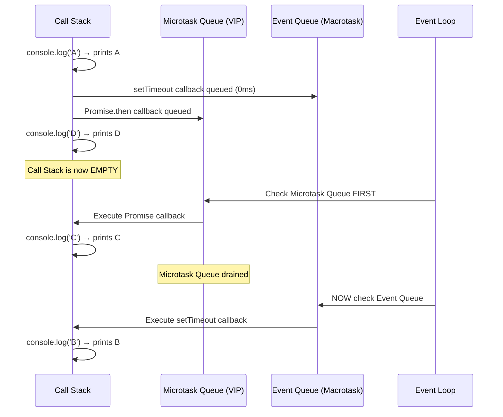

# 🏛️ JavaScript & Node.js — The Elite Interview Vault
## الجزء الخامس والأخير: The Ultimate Q&A Gauntlet (25 سؤال)

---

> [!abstract] 🗺️ إنت فين دلوقتي في الـ Vault؟
>
> ✅ Module 1 → 7 — كل الـ Modules *(خلصنا)*
> 👉 **Module 9** — The Ultimate Core JS & Async Gauntlet *(إحنا هنا — الجولة الأخيرة)*
>
> ده الاختبار الحقيقي. مش هنشرح من الصفر، هنرمي عليك الأسئلة زي ما الانترفيور بيرميها. كل سؤال فيه فخ، وكل إجابة فيها معلومة معمارية بتفرق.

---

# ⚔️ Module 9: The Ultimate Core JS & Async Gauntlet

## 🔴 Part 1: Type Coercion, JS Quirks, Truthy/Falsy & Memory Traps
### Questions 1 → 10

---

> [!bug] 🕵️ فخ الانترفيو — Q1: Hoisting & The Temporal Dead Zone (TDZ)
>
> الانترفيور هيقولك: تتبع الكود ده وقولي الـ Output إيه، وليه؟

```javascript
let userName = "Global Ahmed";

function printUser() {
    console.log(userName);
    let userName = "Local Ali";
}

printUser();
```

> [!success] ✅ الإجابة النموذجية
>
> **`ReferenceError: Cannot access 'userName' before initialization`**

> [!abstract] 🧠 Under the Hood — V8 Architecture
>
> الإجابة الساذجة هنا هي إن الكود هيطبع "Global Ahmed" لأن الـ `let` مابيحصلهاش Hoisting. **دي إجابة خاطئة تماماً بتنهي الانترفيو!**
>
> اللي بيحصل في V8 Engine كالتالي: الجافاسكريبت بتمر بمرحلتين: مرحلة الـ Parsing (الترجمة) ومرحلة الـ Execution (التنفيذ). في مرحلة الـ Parsing، المحرك بيدخل جوه الـ Block Scope بتاع دالة `printUser` وبيشوف سطر `let userName = "Local Ali"`. المحرك **بيعمل Hoisting (رفع) للمتغير ده** وبيحجزه في الميموري (Memory Allocation) جوه الـ Scope المحلي، وبيعلم عليه كـ "Uninitialized" (غير مهيأ).
>
> المنطقة من بداية فتحة القوس `{` لحد السطر اللي فيه الإعلان عن المتغير اسمها الـ **Temporal Dead Zone (TDZ)**. لما بنيجي في مرحلة الـ Execution وننفذ `console.log(userName)`، المحرك بيبدأ يدور في الـ Scope Chain (سلسلة النطاقات). بيبص في النطاق المحلي الأول، فبيلاقي `userName` محجوز فعلاً وموجود! وبالتالي **مابيطلعش للـ Global Scope أبداً**. لكن بما إن المتغير لسه في الـ TDZ ومخدش قيمة، المحرك بيضرب `ReferenceError`. الهدف المعماري من الـ TDZ هو إجبارك على كتابة كود نظيف وتجنب الـ Bugs المخفية اللي كانت بتحصل مع الـ `var` اللي بياخد قيمة افتراضية `undefined`.

---

> [!bug] 🕵️ فخ الانترفيو — Q2: Type Coercion & Order of Evaluation
>
> الانترفيور هيقولك: رتبلي نواتج الطباعة للسطور دي، وفهمني ليه الجافاسكريبت بتتصرف كده؟

```javascript
console.log(1 + 2 + '3');
console.log('3' + 1 + 2);
console.log(+(!(+[])));
```

> [!success] ✅ الإجابة النموذجية
>
> **`'33'`** — **`'312'`** — **`1`**

> [!abstract] 🧠 Under the Hood — V8 Architecture
>
> الجافاسكريبت لغة Dynamically Typed، وبتستخدم مفهوم الـ Coercion (التحويل القسري للأنواع) بناءً على قواعد صارمة جداً في الـ ECMAScript Spec.
>
> 1. السطر الأول `1 + 2 + '3'`: الـ Execution بيمشي من الشمال لليمين. `1 + 2` أرقام، فالناتج `3`. بعدين المحرك بيلاقي `3 + '3'`. علامة الـ `+` لما بتشوف String بتتحول فوراً لـ Concatenation Operator (دمج نصوص). فالناتج بيبقى النص `'33'`.
> 2. السطر التاني `'3' + 1 + 2`: من الشمال لليمين. النص `'3'` زائد الرقم `1` بيقلب دمج نصوص، فالناتج `'31'`. بعدين النص `'31'` زائد الرقم `2` بيقلب دمج تاني، فالناتج `'312'`.
> 3. السطر التالت `+(!(+[]))`: فخ قراءة مرعب! نفككه من جوه لبره زي ما V8 بيعمل:
>    - `+[]`: الـ Unary plus بيحاول يحول الـ Array لرقم. الـ Array الفاضية بتتحول لـ `""`، والنص الفاضي بيتحول لـ `0`.
>    - `!(0)`: الـ Not operator بيعكس الـ Falsy value `0` لـ `true`.
>    - `+(true)`: الـ Unary plus بيحول الـ `true` لرقم، فبتبقى `1`.

---

> [!bug] 🕵️ فخ الانترفيو — Q3: The Sparse Array & `delete` Memory Trap
>
> الانترفيور هيجيبلك كود بيحذف عنصر من Array باستخدام `delete`، ويسألك على حجم الـ Array والقيمة:

```javascript
const myChars = ['a', 'b', 'c', 'd'];
delete myChars[1];

console.log(myChars.length);
console.log(myChars[1]);
```

> [!success] ✅ الإجابة النموذجية
>
> **`4`** ثم **`undefined`**

> [!abstract] 🧠 Under the Hood — V8 Architecture
>
> المبرمج اللي متعود على لغات تانية بيفتكر إن `delete` بتشيل العنصر وتعمل Shift لباقي العناصر (Re-indexing)، وبالتالي الطول هيقل. ده مش حقيقي في الـ JS!
>
> في V8، الـ Arrays تحت الكبوت بتتعامل معاملة الـ Objects (الـ Keys بتاعتها هي الأرقام `0, 1, 2`). لما بتستخدم الكلمة المفتاحية `delete`، إنت بتمسح الـ Property من الـ Object، لكنك **مابتعدلش** الـ Descriptor بتاع الـ `length`.
>
> النتيجة إن V8 بيخلق حاجة اسمها **Sparse Array** (مصفوفة مخرومة). الاندكس رقم `1` مابقاش موجود في الميموري، فلو حاولت تطبعه هيرجعلك `undefined` (أو `empty` في بعض الـ Consoles الحديثة)، لكن الـ `length` هيفضل `4` زي ما هو. كـ Architect، لو عايز تمسح عنصر وتعمل Re-index صح من غير ما تبوظ الميموري، لازم تستخدم `myChars.splice(1, 1)`.

---

> [!bug] 🕵️ فخ الانترفيو — Q4: The Primitive Wrapper Object & Truthy Trap
>
> الانترفيور عايز يختبر فهمك للـ Memory Allocation والـ Objects، هيسألك الكود ده هيطبع إيه:

```javascript
const myNumber = new Number(0);

if (myNumber) {
    console.log(typeof myNumber);
} else {
    console.log("Falsy Value!");
}
```

> [!success] ✅ الإجابة النموذجية
>
> **`'object'`**

> [!abstract] 🧠 Under the Hood — V8 Architecture
>
> كل الـ Juniors هيشوفوا `Number(0)` هيقولوا الـ `0` ده Falsy Value فهيطبع `"Falsy Value!"`.
>
> لكن الـ Architect عينه بتلقط الكلمة المفتاحية `new`. في الجافاسكريبت، الـ Primitives (زي `0`، `""`، `false`) ملهاش Properties ولا Methods. لكن لما بتستخدم `new`، إنت بتأمر الـ V8 Engine إنه يخلق **Wrapper Object** (كائن غلاف) في الـ Heap Memory يشيل جواه القيمة دي.
>
> أي Object في الجافاسكريبت (حتى لو جواه `0` أو `false` أو Array فاضية) بيعتبر **Truthy Value** لما يدخل جوه `if` condition. ولما بنستخدم الـ `typeof` operator على الكائن ده، بيرجع `'object'` مش `'number'`. عشان كده استخدام `new Number()` أو `new String()` بيعتبر Anti-pattern خطير وبيهدر الميموري.

---

> [!bug] 🕵️ فخ الانترفيو — Q5: The `NaN` & IEEE 754 Spec Trap
>
> الانترفيور هيكتبلك كود بيحاول يلاقي مكان `NaN` جوه Array بطريقتين مختلفتين:

```javascript
const arr = [NaN];

console.log(arr.indexOf(NaN));
console.log(arr.includes(NaN));
```

> [!success] ✅ الإجابة النموذجية
>
> **`-1`** ثم **`true`**

> [!abstract] 🧠 Under the Hood — V8 Architecture
>
> الجافاسكريبت بتتبع معيار **IEEE 754** للأرقام العشرية. حسب المعيار ده، الـ `NaN` (Not a Number) هي القيمة الوحيدة في اللغة اللي **لا تساوي نفسها**! يعني `NaN === NaN` نتيجتها `false`.
>
> - الدالة القديمة `Array.prototype.indexOf()` مبنية تحت الكبوت على استخدام الـ Strict Equality Operator (`===`). وبما إن `NaN === NaN` بـ `false`، الدالة مابتلاقيش العنصر وبترجع `-1`.
> - الدالة الأحدث اللي نزلت في ES6 `Array.prototype.includes()` اتصممت عشان تحل الباج المعماري ده. تحت الكبوت، هي بتستخدم خوارزمية تانية اسمها **SameValueZero**. الخوارزمية دي بتستثني قاعدة الـ `NaN` وتعتبرهم بيساووا بعض، فبترجع `true`.

---

> [!question] 🔗 الجسر للـ Q6 → Q10
>
> إحنا كده سخنّا بـ 5 أسئلة بيختبروا الأساسيات العميقة في الميموري والـ Coercion.
>
> **سؤالي التمهيدي ليك للـ 5 أسئلة الجايين (ماتجاوبش عليه):** _"لو عندنا كود مكتوب فيه `console.log(typeof typeof 1)`، تفتكر الـ Output هيكون إيه؟ وليه سلسلة الـ `typeof` بتتصرف بالشكل الغريب ده تحت الكبوت؟ وإزاي نقدر نكتب دالة IIFE من غير أقواس خارجية باستخدام الـ Unary Operators؟"_

---

> [!bug] 🕵️ فخ الانترفيو — Q6: The `typeof typeof` & IIFE Parsing Trap
>
> الانترفيور الخبيث هيجيبلك السطرين دول، اللي شكلهم كأنهم Syntax Error، ويسألك: هل الكود ده هيشتغل؟ ولو اشتغل، إيه الـ Output بالظبط وليه؟

```javascript
console.log(typeof typeof 1);

+function() {
    console.log("Hidden IIFE Executed!");
}();
```

> [!success] ✅ الإجابة النموذجية
>
> **`'string'`** ثم **`"Hidden IIFE Executed!"`**

> [!abstract] 🧠 Under the Hood — V8 Architecture
>
> المبرمج العادي هيتلخبط من تكرار `typeof`. لكن كـ Architect، إنت عارف إن محرك V8 بيعمل Evaluation (تقييم) للـ Expressions من اليمين للشمال في حالة الـ Unary Operators.
>
> 1. المحرك بياخد `typeof 1` الأول، ودي بترجع النص `'number'`.
> 2. بعدين بينفذ `typeof 'number'`، وبما إن ده نص، النتيجة النهائية هترجع `'string'`.
>
> أما بالنسبة للسطر التاني، إحنا متعودين نكتب الـ IIFE (Immediately Invoked Function Expression) بين أقواس `(function(){})()`. ليه؟ لأن لو كتبنا `function` في أول السطر، الـ Parser بتاع V8 هيعتبرها "Declaration" (تعريف دالة) وهيطلب منك اسم للدالة وهيضرب Syntax Error. الهاك المعماري هنا إننا حطينا `+` (Unary Operator) قبل الـ `function`. ده بيكبر الـ Parser إنه يغير سياق القراءة (Execution Context) من Declaration لـ Expression. وبمجرد ما بقت Expression، نقدر نحط الأقواس `()` في الآخر ونعملها Invocation فوراً!

---

> [!bug] 🕵️ فخ الانترفيو — Q7: The ASI (Automatic Semicolon Insertion) Trap
>
> الانترفيور هيقولك: عندنا دالة بسيطة بترجع Object. إيه اللي هيطبع في الكونسول هنا؟

```javascript
function getConfig() {
    return
    {
        status: 'active'
    };
}

console.log(getConfig());
```

> [!success] ✅ الإجابة النموذجية
>
> **`undefined`**

> [!abstract] 🧠 Under the Hood — V8 Architecture
>
> الفخ ده بيدمر مبرمجين الـ C++ والـ Java اللي متعودين يفتحوا الـ Curly Braces `{` في سطر جديد كنوع من الـ Clean Code.
>
> اللي بيحصل تحت الكبوت في الـ V8 Parser هو ميكانيزم اسمه الـ **ASI (Automatic Semicolon Insertion)**. المحرك وهو بيعمل Parsing، لما بيلاقي الكلمة المفتاحية `return` وبعدها سطر جديد (Line Break)، بيفترض فوراً إنك نسيت الـ Semicolon، فبيحطها هو نيابة عنك!
>
> الكود في الميموري بيتحول لـ:
> `return;` ← ثم ← `{ status: 'active' };`
>
> الدالة بترجع `undefined` فوراً، والـ Object اللي تحت ده بيعتبره المحرك Unreachable Code (كود ميت). عشان كده كـ Architects، إحنا بنجبر التيم يستخدم Linter (زي ESLint) بقاعدة `No unexpected multiline` عشان نمنع الكوارث دي تماماً.

---

> [!bug] 🕵️ فخ الانترفيو — Q8: Primitive vs Wrapper Object Equality Trap
>
> الانترفيور هيجيبلك مقارنة بين متغيرين، واحد متعرف بـ `new` والتاني لأ، ويسألك:

```javascript
const objNum = new Number(10);
const primNum = 10;

console.log(objNum == primNum);
console.log(objNum === primNum);
```

> [!success] ✅ الإجابة النموذجية
>
> **`true`** ثم **`false`**

> [!abstract] 🧠 Under the Hood — V8 Architecture
>
> ده اختبار عميق للفرق بين الـ Stack والـ Heap والـ Coercion.
>
> 1. `primNum` هو Primitive Type، بيتخزن مباشرة في الـ Stack Memory وقيمته `10`.
> 2. `objNum` عشان استخدمنا معاه `new`، المحرك بيحجزله Memory Block كاملة في الـ Heap كـ Object (له Methods و Prototype).
>
> - **في الـ Loose Equality (`==`):** الـ V8 Engine بيشوف إن الطرفين مش من نفس النوع (Object و Number). فبيشغل خوارزمية اسمها `ToPrimitive()`. المحرك بينادي على دالة `valueOf()` اللي جوه الـ Object، واللي بترجع الرقم `10`. فبتبقى `10 == 10` وتطبع `true`.
> - **في الـ Strict Equality (`===`):** المحرك مابيعملش أي Coercion. بيقارن النوع الأول: `typeof objNum` هو `'object'`، و `typeof primNum` هو `'number'`. بما إن الأنواع مختلفة، بيرجع `false` فوراً.

---

> [!bug] 🕵️ فخ الانترفيو — Q9: The Primitive Immutability Trap
>
> هيجيبلك كود بيحاول يعدل حرف جوه String باستخدام Index، ويسألك على الناتج:

```javascript
let greeting = "Hello World!";
greeting[0] = "J";

console.log(greeting);
```

> [!success] ✅ الإجابة النموذجية
>
> **`"Hello World!"`** (بدون أي تغيير!)

> [!abstract] 🧠 Under the Hood — V8 Architecture
>
> اللي جاي من لغة زي C بيعتقد إن الـ String هو مجرد Array of Characters، ونقدر نعدل أي حرف فيه بـ Index.
>
> في الجافاسكريبت، الـ Primitive Values (زي النصوص والأرقام) هي **Immutable (غير قابلة للتعديل)**. مجرد ما اتخلقت في الميموري، مفيش أي قوة تقدر تغير محتواها.
>
> لما بتكتب `greeting[0] = "J"`، المحرك في الـ Non-strict mode بيتجاهل السطر ده تماماً (Silently fails) ومابيعملش أي Mutation، لأن مفيش Memory Address ينفع يتعدل جواه. لو كنت شغال في الـ Strict Mode، السطر ده كان هيضرب `TypeError: Cannot assign to read only property`. الطريقة الوحيدة لتغيير النص هي إعادة تعيين المتغير بالكامل (Reassignment) عشان المحرك يخلق Block جديد في الميموري.

---

> [!bug] 🕵️ فخ الانترفيو — Q10: The Sparse Array & V8 Engine Downgrade Trap
>
> الانترفيور عايز يختبر فهمك لمعمارية الـ Arrays في V8، فهيجيبلك الفخ ده:

```javascript
const arr = [1, 2, 3];
arr[10] = 99;

console.log(arr.length);
console.log(arr[5]);
```

> [!success] ✅ الإجابة النموذجية
>
> **`11`** ثم **`undefined`**

> [!abstract] 🧠 Under the Hood — V8 Architecture
>
> الجافاسكريبت معندهاش Arrays حقيقية زي الـ C++ (Contiguous memory blocks). الـ Arrays في الـ JS هي مجرد Objects عادية جداً، الأرقام فيها بتعتبر Keys.
>
> تحت الكبوت، محرك V8 بيحاول يعمل Optimize للـ Arrays وبيخزنها في الذاكرة بطريقة C++ Arrays اسمها **Fast Elements** طول ما العناصر ورا بعضها ومفيش فجوات.
>
> لكن، بمجرد ما إنت كتبت `arr[10] = 99`، إنت خلقت فجوة ضخمة (Hole). لو V8 حجز مكان فاضي في الميموري للعناصر دي، هيهدر الرام جداً. عشان كده المحرك بيعمل **Downgrade (تخفيض لمستوى الأداء)** للـ Array دي وبيحولها لنوع تاني اسمه **Dictionary Elements** (Hash Table).
>
> الـ Array دي بقى اسمها **Sparse Array** (مصفوفة مخرومة). طولها (`length`) بيتعدل ويبقى `11` (أكبر إندكس + 1)، لكن الأماكن من `3` لـ `9` مش موجودة أصلاً في الميموري! ولما بتحاول تطبع `arr[5]`، المحرك بيدور على الـ Key رقم `5` مابيلاقيهوش، فبيمشي في الـ Prototype Chain ومابيلاقيهوش برضه، فبيرجعلك `undefined`.

---

> [!question] 🔗 الجسر للـ Part 2
>
> إحنا كده قفلنا الـ 10 أسئلة بتوع Part 1 وهضمنا الـ Coercion والـ Memory Traps.
>
> دلوقتي هندخل في **Part 2: ES6+ Traps**، وهنا اللعب هيبقى على التحديثات المعمارية الحديثة.
>
> **سؤالي التمهيدي ليك للـ 5 أسئلة الجايين (ماتجاوبش عليه):** _"لو إحنا عارفين إن الـ Arrow Functions (`=>`) مفيهاش `this` خاصة بيها وبتاخدها من الـ Lexical Scope الأب.. إيه اللي هيحصل لو حاولنا نضحك على الـ V8 Engine ونعمل `arrowFunction.bind({ name: "Ahmed" })` أو `arrowFunction.call(...)`؟ هل المحرك هيسمح بتغيير الـ Context ولا هيتجاهلها؟"_

---

## 🟡 Part 2: ES6+ Traps, Lexical Environments & Memory
### Questions 11 → 20

---

> [!bug] 🕵️ فخ الانترفيو — Q11: Arrow Function & The Unbreakable Lexical `this`
>
> الانترفيور الخبيث هيجيبلك كود بيحاول يغير الـ `this` Context بتاع Arrow Function باستخدام دالة `bind`، ويسألك: الكود ده هيطبع إيه؟

```javascript
const obj = {
    name: "Architect",
    printName: () => {
        console.log(this.name);
    }
};

const boundPrint = obj.printName.bind({ name: "Junior" });
boundPrint();
```

> [!success] ✅ الإجابة النموذجية
>
> **`undefined`**

> [!abstract] 🧠 Under the Hood — V8 Architecture
>
> المبرمج العادي هيشوف `bind` هيقولك دي بتغير الـ Context، فهيطبع "Junior".
>
> لكن كـ Architect، إنت فاهم إن الـ Arrow Functions مابتتعرفش بكلمة `function`، ومفيش ليها `this` Binding خاص بيها أصلاً. تحت الكبوت في محرك V8، الـ Arrow Function بتورث الـ `this` من الـ Lexical Scope الأب وقت تعريفها (اللي هو هنا الـ Global Scope، لأن الـ Object `{}` مش بيعمل Scope جديد). ولما بنحاول نستخدم دوال زي `bind` أو `call` أو `apply` مع Arrow Function، محرك V8 بيتجاهل الـ Context الجديد ده تماماً وكأنه مش موجود. وبما إن الـ `name` مش متعرف في الـ Global Scope، هيطبع `undefined`.

---

> [!bug] 🕵️ فخ الانترفيو — Q12: Destructuring & Lost `this` Context Trap
>
> هيجيبلك كلاس بيعمل اتصال بقاعدة بيانات، ويعمل Destructuring (تفكيك) لدالة جواه، ويسألك عن النتيجة:

```javascript
class Database {
    constructor() {
        this.status = "Connected";
    }

    getStatus() {
        return this.status;
    }
}

const db = new Database();
const { getStatus } = db;

console.log(getStatus());
```

> [!success] ✅ الإجابة النموذجية
>
> **`TypeError: Cannot read properties of undefined (reading 'status')`**

> [!abstract] 🧠 Under the Hood — V8 Architecture
>
> الفخ ده بيوقع 90% من الـ Juniors اللي متعودين يفككوا الأوبجيكتات بعشوائية.
>
> لما بتعمل Destructuring لدالة `getStatus` من الـ `db`، إنت بتاخد Reference (مؤشر) للدالة دي وبترميه في متغير جديد، بس إنت كده **فصلت الدالة عن الأوبجيكت بتاعها**. لما بتيجي تنادي على الدالة كـ `getStatus()`، هي كده بتتنفذ كـ "Regular Function Call" بدون أي سياق. القاعدة في الجافاسكريبت إن الدالة لو اتنادت من غير Context، الـ `this` بيكون `undefined` في الـ Strict Mode. وبما إن كل الكلاسات في ES6 بتشتغل إجبارياً في الـ Strict Mode، الـ `this` هيكون بـ `undefined`، ولما المحرك يحاول يقرأ `undefined.status` هيضرب `TypeError` ويكراش السيرفر!

---

> [!bug] 🕵️ فخ الانترفيو — Q13: Rest Parameter Trailing Comma Trap
>
> الانترفيور عايز يختبر حفظك للـ Syntax Spec بتاعة ES6، فهيكتب السطرين دول:

```javascript
function processMetrics(firstId, ...restIds,) {
    console.log(restIds);
}

processMetrics(1, 2, 3, 4);
```

> [!success] ✅ الإجابة النموذجية
>
> **`SyntaxError: parameter after rest parameter`**

> [!abstract] 🧠 Under the Hood — V8 Architecture
>
> الجافاسكريبت الحديثة (ES2017+) بقت بتدعم الـ Trailing Commas (الفاصلة في نهاية الباراميترز) عشان تسهل الشغل مع الـ Version Control (زي Git).
>
> بس الـ Architect الشاطر عارف إن الـ **Rest Parameter** ليه قاعدة صارمة جداً في الـ Parsing Phase: لازم وحتماً يكون هو **آخر عنصر** في تعريف الدالة. لو حطيت بعده `comma` (فاصلة)، المحرك (V8 Parser) بيتوقع إن فيه باراميتر كمان جاي، وده بيكسر القاعدة الأساسية للـ Rest Operator، فالمحرك بيرفض الكود فوراً وبيضرب `SyntaxError` في مرحلة الـ Compilation وقبل حتى ما الكود يتنفذ.

---

> [!bug] 🕵️ فخ الانترفيو — Q14: The Classic Loop Closure Trap (`var` vs `let`)
>
> الفخ الكلاسيكي المرعب، هيطلب منك تتوقع الـ Output للحلقات التكرارية دي بعد ما الـ Call Stack يفضى:

```javascript
for (var i = 0; i < 3; i++) {
    setTimeout(() => console.log(`var: ${i}`), 0);
}

for (let j = 0; j < 3; j++) {
    setTimeout(() => console.log(`let: ${j}`), 0);
}
```

> [!success] ✅ الإجابة النموذجية
>
> **`var: 3`, `var: 3`, `var: 3`** — ثم — **`let: 0`, `let: 1`, `let: 2`**

> [!abstract] 🧠 Under the Hood — V8 Architecture
>
> السؤال ده بيقيس عمق فهمك للـ Lexical Scope مع الـ Event Loop.
>
> 1. **الـ `var` Loop:** الكلمة المفتاحية `var` بتعمل Function/Global Scope. يعني متغير `i` ده موجود كنسخة واحدة بس في الميموري لكل اللفات. الـ `setTimeout` بترمي الكول باك بتاعها في الـ Web APIs، ولما الـ Loop يخلص، قيمة `i` في الميموري هتبقى `3`. ولما الـ Event Loop يسحب الدوال وينفذها، كلهم هيقرأوا من نفس المكان في الميموري فهيطبعوا `3`.
> 2. **الـ `let` Loop:** الكلمة المفتاحية `let` بتعمل Block Scope. محرك V8 هنا بيعمل سحر تحت الكبوت: مع كل لفة في الـ Loop، المحرك **بيخلق Scope جديد تماماً** بـ Instance منفصلة من المتغير `j`. الكول باك بتاع `setTimeout` بيعمل Closure (تغليف) للـ Scope الجديد ده ويحتفظ بيه في الـ Heap. فكل دالة بتفتكر قيمة `j` الخاصة بيها هي بس، فهتطبع `0, 1, 2`.

---

> [!bug] 🕵️ فخ الانترفيو — Q15: The `const` Object Mutation Trap
>
> هيجيبلك كود بيعدل في أوبجيكت متعرف بـ `const`، ويسألك: هل المحرك هيسمح بالتعديل ده ولا هيضرب Error؟

```javascript
const serverConfig = {
    port: 8080,
    status: "active"
};

serverConfig.port = 3000;
console.log(serverConfig.port);
```

> [!success] ✅ الإجابة النموذجية
>
> **`3000`**

> [!abstract] 🧠 Under the Hood — V8 Architecture
>
> فخ الـ Juniors المفضل! الـ `const` في الجافاسكريبت مش معناها إن القيمة Immutable (غير قابلة للتعديل).
>
> كـ Architect إنت عارف الميموري متقسمة إزاي: المتغير `serverConfig` موجود في الـ **Stack**، وبيحتوي على Pointer (مؤشر) بيشاور على مكان الأوبجيكت في الـ **Heap**. الكلمة المفتاحية `const` بتمنع فقط إنك تغير الـ Pointer اللي في الـ Stack (يعني Reassignment)، لكنها **مابتمنعش نهائياً** تعديل الداتا اللي جوه الـ Heap.
>
> عشان كده تغيير `serverConfig.port` قانوني جداً والمحرك هيسمح بيه وهيطبع `3000`. لو حبيت تقفل الأوبجيكت وتمنع التعديل جواه، لازم تستخدم الباترن بتاع `Object.freeze()` اللي بيقفل الـ Properties.

---

> [!question] 🔗 الجسر للـ Q16 → Q20
>
> إحنا كده هضمنا أول 5 أسئلة في الـ ES6+ Traps، وفهمنا إزاي V8 بيدير الـ Scopes والـ `this`.
>
> **سؤالي التمهيدي ليك للـ 5 أسئلة الجايين (ماتجاوبش عليه):** _"بما إننا اتكلمنا عن الميموري والـ Objects.. إيه اللي يحصل للـ Garbage Collector لو خزنّا داتا ضخمة جوه `Map` عادية ونسينا نمسحها؟ وإزاي الـ `WeakMap` بتحل كارثة الـ Memory Leaks دي تحت الكبوت؟"_

---

> [!bug] 🕵️ فخ الانترفيو — Q16: `Map` vs `WeakMap` — The GC & Memory Leak Trap
>
> الانترفيور الخبيث هيجيبلك كود بيعمل Caching لداتا ضخمة، ويسألك: ليه الكود الأول بيعمل Memory Leak وبيوقع السيرفر، بينما التاني شغال بامتياز ومابيسحبش أي رام زيادة؟

```javascript
// Case A: The Memory Leak
let userA = { name: "Ahmed", data: new Array(1000000) };
const cacheA = new Map();
cacheA.set(userA, "Secret Data");
userA = null; // We deleted the user, right?

// Case B: The Architect Way
let userB = { name: "Ali", data: new Array(1000000) };
const cacheB = new WeakMap();
cacheB.set(userB, "Secret Data");
userB = null;
```

> [!success] ✅ الإجابة النموذجية
>
> **Case A:** الأوبجيكت هيفضل محجوز في الـ Heap والرام هتتملي **(Memory Leak!)**.
> **Case B:** الـ Garbage Collector هيمسح الأوبجيكت فوراً والرام هتفضى.

> [!abstract] 🧠 Under the Hood — V8 Architecture
>
> الفرق المعماري الجوهري بين الـ `Map` والـ `WeakMap` هو **قوة الإشارة (Reference Strength)**.
>
> في الـ `Map` العادية، الماب بتحتفظ بـ **Strong Reference** (إشارة قوية) للـ Keys بتاعتها. حتى لو إنت عملت `userA = null` ومسحت المتغير من الـ Stack، الـ V8 Garbage Collector هيروح للـ Heap هيلاقي إن الـ `Map` لسه ماسكة في الأوبجيكت، فمش هيقدر يمسحه، والسيرفر هيضرب Out of Memory.
>
> لكن الـ `WeakMap` متصممة خصيصاً للـ Caching المعماري النظيف. هي بتحتفظ بـ **Weak Reference** (إشارة ضعيفة) للـ Keys (واللي لازم وحتماً تكون Objects ومينفعش تكون Primitives). الـ GC لما بيلاقي إن مفيش أي Strong Reference بيشاور على الأوبجيكت ده غير الـ WeakMap، بيفرمه فوراً وينضف الميموري، والـ Key بيختفي أوتوماتيك من الـ WeakMap. ده بيحقق مبدأ الـ Safe Memory Management.

---

> [!bug] 🕵️ فخ الانترفيو — Q17: `new Number()` Wrapper vs Primitive Strict Equality
>
> الانترفيور هيختبر فهمك للـ Primitives والـ Objects في الجافاسكريبت بالسطرين دول:

```javascript
const a = new Number(10);
const b = 10;

console.log(a === b);
```

> [!success] ✅ الإجابة النموذجية
>
> **`false`**

> [!abstract] 🧠 Under the Hood — V8 Architecture
>
> الجونيور هيتسرع ويقول `true` لأن القيمتين 10.
>
> لكن كـ Architect، إنت فاهم إن الجافاسكريبت بتفرق جداً بين الـ Primitive Value وبين الـ Object Wrapper. لما بتستخدم الكلمة المفتاحية `new` مع `Number`، المحرك بيخلق كائن (Object) كامل في الـ Heap Memory، وبيكون الـ `typeof` بتاعه هو `'object'`.
>
> أما الإعلان التاني `const b = 10` فهو Primitive Assignment عادي جداً، والـ `typeof` بتاعه هو `'number'`. وبما إننا بنستخدم الـ Strict Equality Operator (`===`) اللي مابيعملش Type Coercion (تحويل قسري للأنواع)، المحرك بيقارن `'object' === 'number'` وبيرجع `false` فوراً. الخلاصة: إياك تستخدم `new` مع الـ Primitives!

---

> [!bug] 🕵️ فخ الانترفيو — Q18: `Object.seal()` vs `Object.freeze()` Trap
>
> هيجيبلك كود بيحاول يحمي أوبجيكت من التعديل، ويسألك عن الـ Output:

```javascript
const config = { mode: "prod" };
Object.seal(config);

config.mode = "dev";
config.port = 8080;

console.log(config.mode, config.port);
```

> [!success] ✅ الإجابة النموذجية
>
> **`"dev"`, `undefined`**

> [!abstract] 🧠 Under the Hood — V8 Architecture
>
> الفخ هنا هو الخلط بين مستويات الـ Immutability في V8.
>
> لما بنستخدم `Object.freeze()`، الأوبجيكت بيتحول لـ Immutable تماماً؛ لا تقدر تضيف، ولا تمسح، ولا تعدل الخصائص الموجودة.
>
> لكن `Object.seal()` أضعف درجة. هي بتعمل حاجتين بس: بتمنع إضافة خصائص جديدة (Not extensible)، وبتمنع مسح الخصائص أو تغيير الـ Descriptors بتاعتها (Non-configurable). **لكنها بتسمح بتعديل القيم الموجودة بالفعل (Writable)**!
>
> عشان كده، المحرك سمح بتعديل `mode` لـ `"dev"` بنجاح، لكنه رفض (في صمت، أو بـ TypeError في الـ Strict Mode) إنه يضيف الخاصية الجديدة `port`، فرجعت `undefined`.

---

> [!bug] 🕵️ فخ الانترفيو — Q19: The `async` Function Implicit Promise Wrap
>
> الانترفيور هيسألك: إيه اللي هيرجع من الدالة دي بالظبط لو طبعناه في الكونسول؟ هل هو رقم 10؟

```javascript
async function getScore() {
    return 10;
}

console.log(getScore());
```

> [!success] ✅ الإجابة النموذجية
>
> **`Promise {<fulfilled>: 10}`**

> [!abstract] 🧠 Under the Hood — V8 Architecture
>
> المبرمج اللي مش فاهم Async هيقولك هترجع 10.
>
> هندسياً، أي دالة بنكتب قبلها الكلمة المفتاحية `async` **لازم وحتماً ترجع Promise**. حتى لو إنت مش كاتب `return new Promise(...)`، أو حتى لو مش كاتب `return` أصلاً (هترجع `Promise` جواه `undefined`).
>
> محرك V8 بياخد القيمة اللي إنت عملتلها `return` (زي الرقم 10)، وبيعملها Implicit Wrapping (تغليف ضمني) جوه Promise معمول له Resolve. ده بيحقق مبدأ الـ Interface Consistency، عشان الـ Caller دايماً يكون متأكد إنه يقدر يستخدم `.then()` أو `await` على ناتج الدالة دي بدون ما يحصل Runtime Error.

---

> [!bug] 🕵️ فخ الانترفيو — Q20: `Promise.all` Short-Circuiting Trap
>
> هيجيبلك كود بينفذ عمليتين Async في نفس الوقت، واحدة نجحت والتانية فشلت، ويسألك:

```javascript
const p1 = Promise.resolve("User Data");
const p2 = Promise.reject("Connection Failed");

Promise.all([p1, p2])
    .then(res => console.log("Success:", res))
    .catch(err => console.log("Caught:", err));
```

> [!success] ✅ الإجابة النموذجية
>
> **`Caught: Connection Failed`**

> [!abstract] 🧠 Under the Hood — V8 Architecture
>
> دالة `Promise.all()` مبنية تحت الكبوت على خوارزمية **Short-circuiting** (الفصل السريع). هي بتستنى كل الـ Promises تنجح عشان ترجع Array بالنتائج. لكن، بمجرد ما **أي Promise واحد بس** يضرب `reject`، الـ `Promise.all` كلها بتتدمر فوراً وبترمي الـ Error ده لبره (للـ `catch` block)، وبتتجاهل تماماً أي Promises تانية نجحت أو لسه شغالة.
>
> كـ Architect، لو إنت محتاج تنفذ كذا Request وعايز تعرف حالة كل واحد فيهم (سواء نجح أو فشل) من غير ما العملية كلها تقع، لازم تستخدم الـ Pattern الأحدث: **`Promise.allSettled()`**. الدالة دي مابتعملش Short-circuit، وبتستنى كل حاجة تخلص، وبترجعلك Array من الأوبجيكتات فيها `status: 'fulfilled'` أو `status: 'rejected'`.

---

> [!question] 🔗 الجسر للـ Part 3
>
> إحنا كده دغدغنا فخاخ الـ ES6، والـ Memory، والـ Objects، وفهمنا طبيعة الـ Promises.
>
> دلوقتي إحنا داخلين على **Part 3 والأخير**، واللي هيختبر الـ Asynchronous Brain بتاعك لأقصى درجة.
>
> الجزء ده بيفصل حرفياً بين المبرمج اللي بيكتب كود بالبركة، وبين الـ Senior Architect اللي فاهم الـ Call Stack بيتنفس إزاي.
>
> **سؤالي التمهيدي ليك للـ 5 أسئلة الجايين (ماتجاوبش عليه):** _"لو كتبنا `console.log(1)`، وبعدها `setTimeout(() => console.log(2), 0)`، وبعدها `Promise.resolve().then(() => console.log(3))`... إزاي الـ Call Stack بيقرر يرمي إيه في الـ Event Queue (أو الـ Macrotask Queue) وإيه في الـ Microtask Queue؟ وليه الـ V8 بيدي أولوية الـ VIP للـ Promises؟"_

---

## 🔵 Part 3: Async, Event Loop, Microtasks & Macrotasks
### Questions 21 → 25

إحنا دلوقتي في أعمق وأخطر منطقة في محرك V8: الـ **Event Loop** وإدارة الـ **Asynchronous Execution**. اربط الحزام!

---

> [!bug] 🕵️ فخ الانترفيو — Q21: Event Loop Priority — Microtasks vs Macrotasks
>
> الانترفيور هيحطلك الكود ده ويقولك: رتبلي الـ Output، واشرحلي إزاي الـ V8 Engine والـ Event Loop بيقرروا مين يشتغل الأول رغم إن الـ `setTimeout` واخدة وقت 0؟

```javascript
console.log('A');

setTimeout(() => {
    console.log('B');
}, 0);

Promise.resolve().then(() => {
    console.log('C');
});

console.log('D');
```

> [!success] ✅ الإجابة النموذجية
>
> **`A` → `D` → `C` → `B`**

> [!abstract] 🧠 Under the Hood — V8 Architecture
>
> الجونيور هيقولك `B` هتنطبع قبل `C` لأنها مكتوبة الأول. دي إجابة بتنهي الانترفيو!
>
> معمارياً، الـ Event Loop بيلف عشان يراقب الـ Call Stack والـ Event Queue.
>
> 1. المحرك بينفذ الكود المتزامن (Synchronous) الأول في الـ Call Stack، فبيطبع `A` ثم `D`.
> 2. لما بيقابل `setTimeout`، بيبعتها للـ Web API (أو الـ C++ APIs في Node.js)، ولما بتخلص (بعد 0 ثانية)، الـ Callback بتاعها بيروح يقف في طابور اسمه الـ **Event Queue (Macrotask Queue)**.
> 3. لما بيقابل `Promise.resolve().then()`، الـ Callback بتاعها بيروح يقف في طابور تاني خالص للـ VIP اسمه الـ **Microtask Queue**.
> 4. القاعدة الذهبية للـ Event Loop: بمجرد ما الـ Call Stack يفضى، المحرك بيبص **أولاً** على الـ Microtask Queue وينفذ كل اللي فيه بالكامل (عشان كده بيطبع `C`)، قبل ما يسمح لنفسه إنه ياخد أي حاجة من الـ Event Queue العادي (اللي بيطبع `B`). طابور الـ Microtask ليه الأولوية القصوى دايماً!

---



---

> [!bug] 🕵️ فخ الانترفيو — Q22: The `async` Function Always Returns a Promise
>
> هيجيبلك دالة بسيطة جداً مكتوب قبلها `async` ومش بترجع غير رقم، ويسألك: إيه ناتج الطباعة ده بالظبط في الكونسول؟

```javascript
async function fetchScore() {
    return 10;
}

console.log(fetchScore());
```

> [!success] ✅ الإجابة النموذجية
>
> **`Promise {<fulfilled>: 10}`**

> [!abstract] 🧠 Under the Hood — V8 Architecture
>
> المبرمج اللي مش فاهم Async Architecture هيقولك هترجع الرقم `10`.
>
> هندسياً، أي دالة بنكتب قبلها الكلمة المفتاحية `async` **لازم وحتماً ترجع Promise**. حتى لو إنت مش كاتب `return new Promise(...)`, محرك V8 بياخد القيمة اللي إنت عملتلها `return` (زي الرقم 10)، وبيعملها Implicit Wrapping (تغليف ضمني) جوه Promise معمول له Resolve. ده بيحقق مبدأ الـ Interface Consistency، عشان الـ Caller دايماً يكون متأكد إنه يقدر يستخدم `.then()` أو `await` على ناتج الدالة دي بدون ما يحصل Runtime Error أو يضطر يتأكد من نوع الداتا اللي راجعة.

---

> [!bug] 🕵️ فخ الانترفيو — Q23: `Promise.all` vs `Promise.allSettled`
>
> الانترفيور عايز يختبر إزاي بتتعامل مع الـ Concurrent Promises. هيجيبلك الكود ده ويسألك: هل هيرجع Array فيها الداتا والـ Error، ولا هيضرب؟

```javascript
const p1 = Promise.resolve("User Data");
const p2 = Promise.reject(new Error("Connection Failed"));

Promise.all([p1, p2])
    .then(res => console.log("Success:", res))
    .catch(err => console.log("Caught:", err.message));
```

> [!success] ✅ الإجابة النموذجية
>
> **`Caught: Connection Failed`**

> [!abstract] 🧠 Under the Hood — V8 Architecture
>
> دالة `Promise.all()` مصممة معمارياً عشان تنفذ خوارزمية الـ **Short-circuiting** (الفصل السريع). هي بتستنى كل الـ Promises تنجح عشان ترجع Array بالنتائج. لكن، بمجرد ما **أي Promise واحد بس** يضرب `reject`، الـ `Promise.all` كلها بتتدمر فوراً وبترمي الـ Error ده لبره للـ `catch` block، وبتتجاهل تماماً أي Promises تانية نجحت!
>
> كـ Architect، لو محتاج تنفذ كذا Request وعايز تعرف حالة كل واحد فيهم بدون ما العملية كلها تقع لو واحد فشل، لازم تستخدم الباترن الأحدث: **`Promise.allSettled()`**. الدالة دي مابتعملش Short-circuit، وبتستنى كل حاجة تخلص، وبترجعلك Array من الأوبجيكتات فيها `status: 'fulfilled'` أو `status: 'rejected'`.

---

> [!bug] 🕵️ فخ الانترفيو — Q24: The Missing `return` in `await` Trap
>
> ده فخ خبيث بيجمع بين الـ Async والـ Default Return Values. إيه هو ناتج الدالة دي؟

```javascript
async function processData() {
    await Promise.resolve(10);
    // Notice: No return statement here!
}

console.log(processData());
```

> [!success] ✅ الإجابة النموذجية
>
> **`Promise {<fulfilled>: undefined}`**

> [!abstract] 🧠 Under the Hood — V8 Architecture
>
> المبرمج العادي هيتخيل إن بما إننا عملنا `await` لرقم 10، فالدالة هترجع Promise فيه 10.
>
> اللي بيحصل تحت الكبوت هو إن تعبير الـ `await` بيعمل Resolution للـ Promise ويرجع القيمة 10، والكود اللي تحت الـ `await` بيعتبر كأنه مكتوب جوه `.then()` Callback. لكن بما إن الدالة نفسها مفيهاش أي تعبير `return` في نهايتها، الجافاسكريبت بتطبق السلوك الافتراضي بتاع أي دالة وترجع `undefined`. وبما إن الدالة دي `async`، المحرك بياخد الـ `undefined` دي ويغلفها ضمنياً (Implicit Wrap) جوه Promise ناجح، فبترجع `Promise {<fulfilled>: undefined}`.

---

> [!bug] 🕵️ فخ الانترفيو — Q25: The `forEach` vs `async/await` Production Disaster
>
> ده من أشهر الكوارث اللي بتحصل في الـ Production. هيقولك: الكود ده بيحاول يطبع الأرقام ببطء وبعدين يطبع "Process completed!". هل الكود ده هيستنى الـ Promises تخلص؟

```javascript
const numbers = [1, 2, 3, 5];

numbers.forEach(async (num) => {
    await new Promise(resolve => setTimeout(resolve, 100));
    console.log(num);
});

console.log("Process completed!");
```

> [!success] ✅ الإجابة النموذجية
>
> **`Process completed!`** — ثم بعد 100ms — **`1`** `2` `3` `5`

> [!abstract] 🧠 Under the Hood — V8 Architecture
>
> الجونيور بيفترض إن الـ `forEach` هتحترم الـ `async/await` وتقف تستنى كل خطوة تخلص قبل ما تكمل!
>
> معمارياً، الـ `Array.prototype.forEach` مش مصممة للتعامل مع الـ Promises نهائياً. تحت الكبوت، هي عبارة عن Synchronous Loop بينادي على الـ Callback اللي إنت مديهوله (fire and forget) ومابيعملش `await` للـ Promise اللي بيرجع من الـ Callback ده. النتيجة إن الـ `forEach` بتشغل الـ 4 دوال Async بشكل متوازي (في الخلفية)، وتكمل شغلها فوراً وتطبع `Process completed!` في نفس اللحظة. بعد 100 ملي ثانية، الـ Promises كلها بتخلص وتطبع الأرقام.
>
> كـ Architect، عشان تـ Control الـ Async Sequence (التسلسل الزمني) جوه Loop، لازم وحتماً تستخدم `for...of` loop لأنه بيدعم الـ `await` جوه الـ Block Scope بتاعه بيوقف الـ Execution لحد ما الـ Promise يخلص.

---

> [!tip] ✅ الإصلاح المعماري — for...of بدل forEach

```javascript
const numbers = [1, 2, 3, 5];

async function processInOrder() {
    for (const num of numbers) {
        // ✅ ARCHITECT: for...of RESPECTS await
        // Each iteration WAITS for the previous one to finish
        await new Promise(resolve => setTimeout(resolve, 100));
        console.log(num);
    }
    console.log("Process completed!");
}

processInOrder();
// Output: 1, 2, 3, 5, "Process completed!" (in order, with 100ms delay each)
```

---

> [!question] 🔗 الجسر للـ Q26 → Q30 (السؤال التمهيدي)
>
> إحنا كده دمرنا ألغام الـ Event Loop، والـ Promises، وإزاي V8 بيدير طوابير التنفيذ.
>
> آخر 5 أسئلة في الـ Gauntlet وفي المنهج كله، هيكونوا عن الـ **Architecture & Module Systems** تحت الكبوت.
>
> **سؤالي التمهيدي ليك لآخر 5 أسئلة (ماتجاوبش عليه):** _"لو موديول `A` عمل `require('B')`، وفي نفس اللحظة موديول `B` عمل `require('A')` (Circular Dependency)... إزاي بيئة CommonJS بتتعامل مع الأزمة دي؟ وليه موديول `B` هيشوف الـ Exports بتاعة `A` كأنها كائن فاضي أو ناقص؟ وإزاي معمارية ECMAScript Modules (ESM) حلت الكارثة دي جذرياً عن طريق مرحلة الـ 'Instantiation' والـ 'Read-only Live Bindings'؟"_

---

> [!success] ✅ الـ Vault Complete — Final Summary Table
>
> إنت وصلت لآخر الـ Vault يا هندسة! 🎉 خلي دي مرجعك الأخير:
>
> | السؤال | الفخ | الإجابة الصح |
> |---|---|---|
> | Q1 — TDZ | `let` بيعمل Hoisting — بس من غير قيمة | `ReferenceError` من الـ TDZ |
> | Q2 — Coercion | `+` مع String بيتحول لـ Concatenation | `'33'`, `'312'`, `1` |
> | Q3 — delete Array | `delete` مش بيعمل re-index | `length = 4`, `undefined` |
> | Q4 — `new Number(0)` | الـ Object دايماً Truthy حتى لو جواه `0` | `typeof` = `'object'` |
> | Q5 — NaN | `NaN !== NaN` في الـ `===` | `indexOf = -1`, `includes = true` |
> | Q6 — typeof typeof | بيتقيّم من اليمين لليسار | `'string'` |
> | Q7 — ASI | `return` + newline = `return;` | `undefined` |
> | Q8 — == vs === | `==` بيعمل `valueOf()` coercion | `true`, `false` |
> | Q9 — String immutability | Strings مش قابلة للتعديل | بدون تغيير |
> | Q10 — Sparse Array | V8 بيعمل Downgrade لـ Dictionary | `length = 11`, `undefined` |
> | Q11 — Arrow + bind | `bind/call/apply` مش بتأثر على Arrow | `undefined` |
> | Q12 — Destructuring `this` | فصل الدالة عن الأوبجيكت = ضياع الـ `this` | `TypeError` |
> | Q13 — Rest + comma | Rest لازم يكون آخر باراميتر | `SyntaxError` |
> | Q14 — Loop Closure | `var` = نسخة واحدة، `let` = scope جديد لكل iteration | `3,3,3` و `0,1,2` |
> | Q15 — `const` Object | `const` بتحمي الـ Pointer مش الـ Heap | `3000` |
> | Q16 — WeakMap | Strong vs Weak Reference للـ GC | Map = Leak، WeakMap = Safe |
> | Q17 — `new Number` strict | `typeof new Number(10)` = `'object'` | `false` |
> | Q18 — seal vs freeze | `seal` بيسمح بتعديل القيم الموجودة | `"dev"`, `undefined` |
> | Q19 — async implicit | كل `async` function بترجع Promise | `Promise {<fulfilled>: 10}` |
> | Q20 — Promise.all | Short-circuits عند أول reject | `Caught: Connection Failed` |
> | Q21 — Event Loop Priority | Microtask Queue قبل Macrotask دايماً | `A D C B` |
> | Q22 — async return | Implicit Promise wrapping | `Promise {<fulfilled>: 10}` |
> | Q23 — Promise.all reject | Short-circuit + استخدم allSettled | `Caught: Connection Failed` |
> | Q24 — await no return | الدالة بترجع `undefined` implicitly | `Promise {<fulfilled>: undefined}` |
> | Q25 — forEach async | forEach مش Async-aware | `Process completed!` أول |

---

> [!abstract] 🏆 أنهيت الـ Vault كامل!
>
> **إحنا غطينا:**
>
> ✅ **Module 1** — Call Stack, Execution Context, PTC
> ✅ **Module 2** — Hoisting, Lexical Scope, TDZ
> ✅ **Module 3** — Closures, Module Pattern, Prototype Chain, `this`, Memory Leaks
> ✅ **Module 4** — Pure Functions, HOF, Strategy Pattern, OCP
> ✅ **Module 5** — libuv, Reactor Pattern, async/await under the hood, Fire & Forget
> ✅ **Module 6** — EventEmitter, Zalgo, Streams, Backpressure, pipe()
> ✅ **Module 7** — Factory, Singleton, Proxy, Decorator, State+Command, Piggybacking, Generators, Worker Threads
> ✅ **Module 9** — 25 سؤال Q&A Gauntlet كامل بالإجابات والـ Architecture
>
> **إنت دلوقتي جاهز للانترفيو يا هندسة. روح اتعين! 🚀**

---

*الـ Vault ده من إنتاج جلسات Claude × Mohamed — بيتحدث مع كل إضافة جديدة.*
