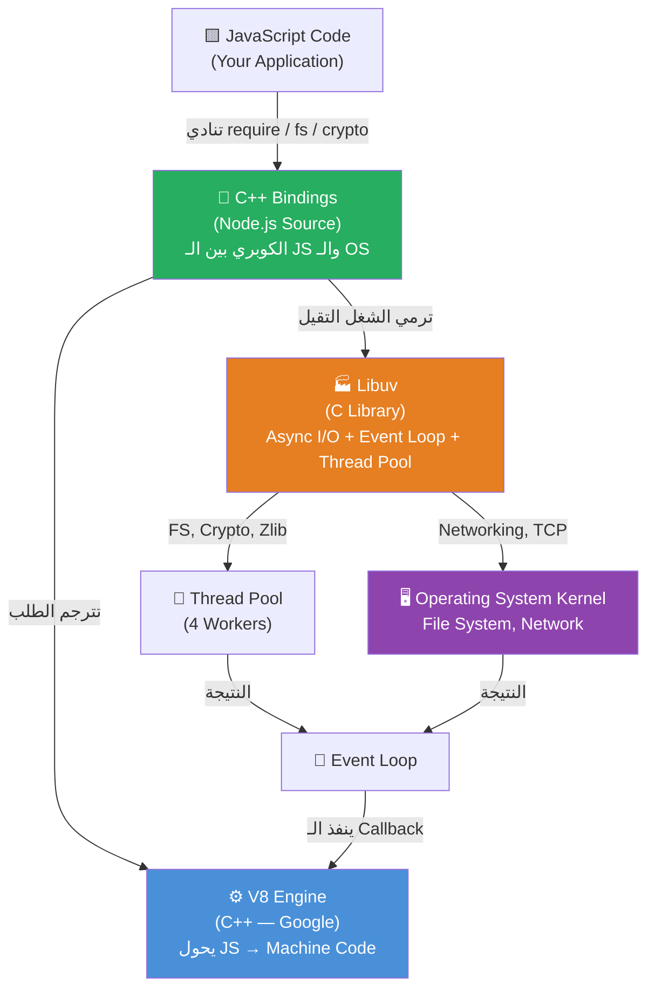
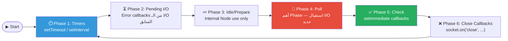
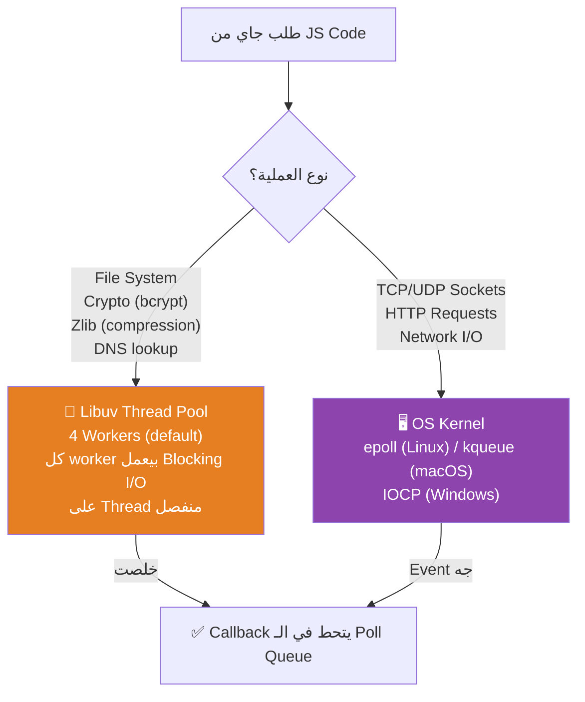
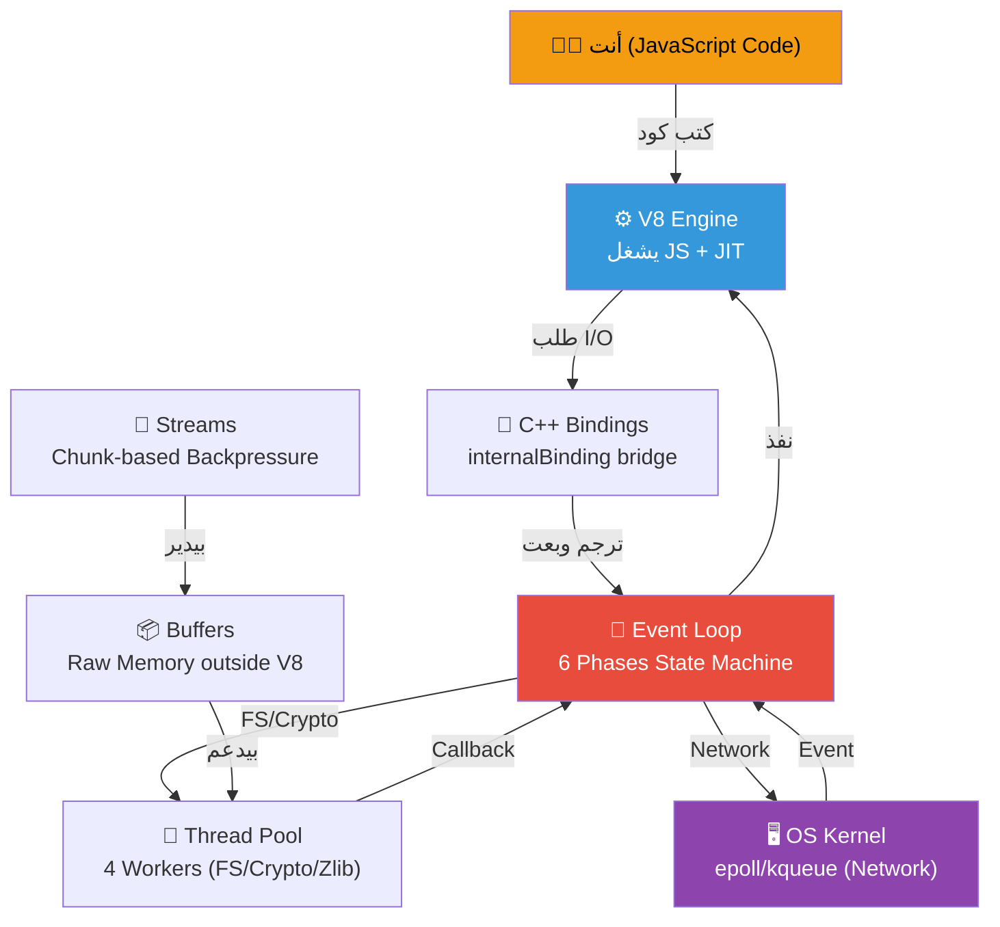

# 🧠 NodeJS Internals: من الجذور للعمارة

> **الهدف من الملف ده:** إنك تفهم Node.js مش كـ Framework بتستخدمه، لكن كـ System بيشتغل ليه منطق معماري محدد. لما تخلص الملف ده، هتبص على أي سطر `await fs.readFile(...)` وتعرف ورايه رحلة كاملة في الـ C++ والـ OS Kernel.

---

## الفهرس

1. [المشكلة الأصلية: C10K Problem](#1-المشكلة-الأصلية-c10k-problem)
2. [ليه JavaScript؟ قرار Ryan Dahl](#2-ليه-javascript-قرار-ryan-dahl)
3. [تشريح المفاعل: هيكل Node.js من جوه](#3-تشريح-المفاعل-هيكل-nodejs-من-جوه)
4. [V8 Engine: الجينيوس الأعمى](#4-v8-engine-الجينيوس-الأعمى)
5. [C++ Bindings: طبقة التهكير](#5-c-bindings-طبقة-التهكير)
6. [Libuv والـ Event Loop: المدير والعمال](#6-libuv-والـ-event-loop-المدير-والعمال)
7. [Thread Pool vs OS Kernel: مين بيشيل الشيلة؟](#7-thread-pool-vs-os-kernel-مين-بيشيل-الشيلة)
8. [Buffers والـ Streams: سباكة الداتا](#8-buffers-والـ-streams-سباكة-الداتا)
9. [الصورة الكاملة: ليه Node.js سريع؟](#9-الصورة-الكاملة-ليه-nodejs-سريع)
10. [Interview Survival Kit 🎯](#10-interview-survival-kit-)

---

## 1. المشكلة الأصلية: C10K Problem

### الكارثة اللي أنجبت نود

سنة 1999، واحد اسمه Dan Kegel كتب مقال شهير بعنوان "The C10K Problem". المقال كان بيقول ببساطة: **"ليه السيرفرات مش بتقدر تتعامل مع 10,000 connection في نفس الوقت؟"**

قبل ما نفهم المشكلة، لازم نفهم كلمتين أساسيتين:

**الـ Process** هو ببساطة "برنامج شغال في الـ RAM". لما بتفتح Chrome، الـ OS بيخلق Process ليه في الميموري. لما بتشغل VS Code، Process تانية. كل Process ليها مساحة ميموري **معزولة تماماً** عن باقي الـ Processes
— Chrome مش يقدر يقرأ ميموري VS Code. الـ **RAM** (Random Access Memory) هي الذاكرة السريعة المؤقتة اللي البرامج بتشتغل فيها.

**الـ Thread** هو "وحدة التنفيذ" جوه الـ Process. لو الـ Process هي المصنع، الـ Thread هو العامل جوه المصنع. الـ Process الواحدة ممكن يكون فيها Threads كتير بيشتغلوا في نفس الوقت وبيشاركوا نفس الميموري.

```
OS
├── Process: Chrome    ← ليها RAM معزولة
│   ├── Thread 1 (UI)
│   └── Thread 2 (Network)
├── Process: VS Code   ← ليها RAM معزولة
└── Process: Node.js   ← ليها RAM معزولة
    ├── Main Thread    ← بيشغل JS + Event Loop
    └── Thread Pool Workers (4 threads)
```

الوقت ده، الـ Web Server الملك كان **Apache HTTP Server**. وطريقة تفكيره كانت بسيطة وعاقلة تمامًا في ظاهرها:

> "جاله Connection جديد؟ يبقى هخلق له **Thread** جديد يخدمه."

```
Apache Model (Thread-per-Connection):

Client A ──► [Thread 1] ──► قرأ ملف ──► انتظر ──► رد
Client B ──► [Thread 2] ──► استعلم DB ──► انتظر ──► رد
Client C ──► [Thread 3] ──► انتظر Disk I/O ...
...
Client 10,000 ──► [Thread 10,000] ──► ❌ OUT OF MEMORY
```

المشكلة؟ كل **Thread** في Linux بياكل تقريبًا **8MB من الـ Stack Memory** كـ Default. الـ **Stack Memory** هي منطقة في الـ RAM مخصصة لكل Thread — بيتخزن فيها المتغيرات المحلية وسجل الـ Function Calls. يعني 10,000 Thread = ~80GB RAM بس في الـ Stack. ده غير الـ Context Switching Overhead — وده التقيل الحقيقي.

### الـ Context Switching: العدو الصامت

الـ **CPU** هو "عقل" الجهاز — هو اللي بينفذ التعليمات فعلًا. الـ CPU الحديث عنده عدة **Cores** وكل Core يقدر ينفذ تعليمات مستقلة. لو عندك 10,000 Thread وعندك 8 Cores بس، الـ OS محتاج يقسم وقت الـ Cores دي على الـ Threads كلهم.

كل شوية، الـ OS بيوقف Thread يحفظ حالته الكاملة (Registers، Stack Pointer، Program Counter) في الميموري، وبيجيب Thread تاني ويستأنف شغله من حيث وقف. العملية دي اسمها **Context Switch** — وهي مش مجانية. كل Switch بياخد من 1 لـ 10 ميكروثانية، والـ CPU Cache بيتمسح فيها. مع 10,000 Thread، الـ CPU يقضي نصف وقته في الـ Switching مش في الشغل الحقيقي.

> [!DEEP-DIVE]
> الـ **Kernel** — وهو الجزء الأعمق في نظام التشغيل اللي بيتكلم مع الـ Hardware مباشرة — بيحتاج يعمل **TLB Flush** (Translation Lookaside Buffer) مع كل Context Switch بين Processes مختلفة. ده بيخلي الـ CPU يعيد بناء الـ Virtual Memory Map من الأول، وهو من أغلى العمليات في الـ Modern CPU. الـ Threads داخل نفس الـ Process أرخص شوية لأنهم بيشاركوا الـ Address Space.

### الـ Blocking: المشكلة الجوهرية

فيه مفهوم مهم جداً هنا اسمه **Blocking** — يعني إن الـ Thread بيوقف تماماً ومش بيعمل أي حاجة وهو مستنى عملية تخلص.

لما Apache بيخلق Thread لكل Connection، والـ Thread ده بيطلب ملف من الـ Hard Disk — الـ **Hard Disk** أبطأ بكتير من الـ RAM والـ CPU، ممكن يستني ملي ثانية أو أكتر. خلال الوقت ده، الـ Thread **Blocking** — واقف مش بيعمل أي حاجة مفيدة، بس لسه شايل الـ 8MB بتاعته في الـ RAM.

النقيض هو **Non-Blocking** — يعني تبدأ العملية، والـ Thread يكمل شغله، ولما العملية تخلص "تيجي تقوله".

```javascript
// Blocking — Thread وقف هنا لحد ما الملف يتقرأ
const data = fs.readFileSync('file.txt');

// Non-Blocking — Thread كمل شغله، هيتنادى لما يخلص
fs.readFile('file.txt', (err, data) => {
    console.log('اتقرأ!');
});
console.log('أنا اتنفذت قبل ما الملف يخلص!'); // ← ده بيتطبع أول
```

### الحل المقترح

بدل ما تعمل Thread لكل Connection وتخليه **يستنى** (Blocking)، خلي **Thread واحد** يدير كل الـ Connections بطريقة **Non-Blocking**. لو الـ Thread طلب ملف، مش هيقعد مستني — هيروح يخدم حد تاني، ولما الملف يخلص هيرجعله.

المشكلة: معظم اللغات البرمجية Blocking في DNA بتاعتها. C++، Java، Python — لما بتكتب `readFile()` فيهم، الـ Thread بيوقف. **هنا دخل Ryan Dahl.**

---

## 2. ليه JavaScript؟ قرار Ryan Dahl

### 2009: الرجل والفكرة

Ryan Dahl كان بيتعذب مع حاجة اسمها **File Upload Progress Bar** في الـ Ruby on Rails. المشكلة كانت إن السيرفر Blocking وهو بيستقبل الـ Upload، فمكنش قادر يبعت للـ Client "اتحمل 20%... 40%..." في نفس الوقت.

فكرته الأولى كانت بـ C++، لكنها كانت **جحيم**. Callbacks على Callbacks، Memory Management يدوي، Compilation طويل.

### ليه JavaScript تحديدًا؟

JavaScript عندها خاصية **مش موجودة في أي لغة تانية** وقتها: **هي Single-Threaded بـ Design وعندها مفهوم الـ Callbacks مدمج في ثقافتها.**

الـ **Callback** هو فانكشن بتبعتها كـ Argument لفانكشن تانية، عشان تتنادى لما حاجة معينة تحصل. الـ JS Developers كانوا بيكتبوا `onclick(function() {...})` بشكل طبيعي من ساعة البراوزر — يعني الـ Async Mindset كان موجود بالفعل في ثقافة اللغة.

كمان، **V8** كان لسه طازج من Google (2008) وكانت سرعته جبارة. Ryan Dahl شاف في ده الفرصة:

> "أنا هاخد V8 (المحرك السريع)، أضيفله Libuv (العضلات الـ Async)، وأديه لـ JS Developers عشان يبنوا Non-Blocking Servers بـ Syntax هم عارفينه."

**وكدة ولد Node.js سنة 2009.**

---

## 3. تشريح المفاعل: هيكل Node.js من جوه

### الثالوث المقدس

Node.js مش "لغة برمجة" ومش "Framework". هو **Runtime Environment** — يعني "بيئة تشغيل". الـ **Runtime** هو الـ Layer اللي بتشتغل فيه البرامج وبيوفرلها الـ Services اللي محتاجاها — زي إدارة الميموري والـ I/O. Node.js مكوّن من 3 أجزاء:



### الفولدر Structure في Source Code بتاع Node

لو فتحت [github.com/nodejs/node](https://github.com/nodejs/node)، هتلاقي:

| Folder | اللغة | الوظيفة |
|--------|-------|---------|
| `lib/` | JavaScript | الـ API اللي أنت بتستخدمه (fs, http, crypto, ...) |
| `src/` | C++ | الـ Bindings اللي بتكلم الـ OS |
| `deps/v8/` | C++ | المحرك نفسه (مجيوب من Google) |
| `deps/uv/` | C | مكتبة Libuv |

يعني لما بتكتب `require('fs')`, أنت بتدخل `lib/fs.js`. وجوه `lib/fs.js` في نقطة معينة هيجيلك سطر زي:

```javascript
const binding = internalBinding('fs');
```

الـ `internalBinding` دي هي **بوابة النفق** اللي هتوديك من JavaScript لـ C++.

---

## 4. V8 Engine: الجينيوس الأعمى

### V8 هو برنامج C++ وظيفته الوحيدة: يفهم JS

تخيل إن V8 هو عالِم عبقري جالس في غرفة مغلقة. قادر يحل أي معادلة رياضية، يجمع arrays، يعمل closures معقدة — لكنه **أعمى تمامًا عن العالم خارج الغرفة**. مش يعرف إيه هو الـ Hard Disk، مش يعرف الـ Network، مش يعرف حتى إزاي يطبع على الشاشة.

```javascript
// V8 بيفهم ده كويس:
const result = [1, 2, 3].map(x => x * 2);
const hash = new Map();

// V8 مش عارف يفهم ده من غير مساعدة:
fs.readFile(...)   // ❌ مين هو fs ده؟
console.log(...)   // ❌ إيه معنى "اطبع على الشاشة"؟
setTimeout(...)    // ❌ الوقت؟ أنهي ساعة؟
```

### JIT: الجينيوس اللي بيتعلم وهو شغال

قديمًا، اللغات كانت يا **Compiled** — بتتحول كلها لـ Machine Code قبل التشغيل — يا **Interpreted** — بتتقرأ وتتنفذ سطر بسطر. الـ **Machine Code** هو اللغة اللي الـ CPU بيفهمها مباشرة — أصفار وحايد. الـ Compiled أسرع لكن بياخد وقت في الـ Build، والـ Interpreted بطيء في التنفيذ.

V8 عمل ثورة بحاجة اسمها **Just-In-Time Compilation (JIT)** — بيعمل الاتنين مع بعض:

#### المرحلة الأولى: Ignition (المُفسِّر السريع)

أول ما V8 يشوف كود JS، بيحوله لـ **Bytecode** — تنسيق وسطي أسرع من الـ JS الخام لكن أبطأ من الـ Machine Code الحقيقي. الهدف: تبدأ تشتغل **فورًا** من غير انتظار.

```
Source Code (JS)
      │
      ▼
   [Parser] ──► AST (Abstract Syntax Tree)
      │
      ▼
  [Ignition] ──► Bytecode
      │
      ▼
  ينفذ الكود بسرعة معقولة
```

#### المرحلة التانية: TurboFan (المُحسِّن)

جوه V8 فيه "جاسوس" اسمه **Profiler** بيراقب الكود وهو شغال. لو لقى إن فانكشن معينة بتتنادى كتير بنفس نوع الداتا (مثلًا بتجمع `number + number` دايمًا)، بيدي الأمر لـ **TurboFan**.

TurboFan بياخد الـ Bytecode ويحوله لـ **Optimized Machine Code** مخزن في الـ Memory. المرة الجاية لما الفانكشن دي تتنادى، V8 مش هيقرأها كـ JS — هو هينفذها كـ Machine Code مباشرة بسرعة البرق.

> [!DEEP-DIVE]
> **Deoptimization — لما TurboFan يتفاجأ:**
> لو V8 عمل Optimize لفانكشن بتشتغل على `numbers`، وفجأة جيتله بـ `string` — الـ Optimized Code بقى غلط. V8 بيعمل **Deoptimization**: بيرجع للـ Bytecode ويبدأ يراقب من الأول. ده سر الـ Performance degradation لما بتغير Types في فانكشنز كتيرة الاستخدام. TypeScript بتساعد V8 يعمل Optimize أحسن لأن الـ Types أثبت.

### Isolates والـ Contexts: غرف V8 المعزولة

الـ **Isolate** هو نسخة كاملة من V8 — ليها **Heap** وStack خاصين بيها. Node.js بيشغل Isolate واحد، يعني بيشتغل فعلًا على Thread واحد.

الـ **Heap** هو منطقة في الـ RAM بيخزن فيها V8 كل الـ Objects والـ Arrays والـ Strings اللي كودك بيخلقها وهو شغال. ليه حد أقصى (default ~1.5GB).

الـ **Context** هو "المحيط" اللي الكود بيعيش فيه — بيحدد الـ Global Variables المتاحة. في Browser = `window`. في Node = `global`.

### الـ Garbage Collector: شيّال الـ Heap

الـ **Garbage Collector (GC)** هو برنامج شغال في الخلفية جوه V8. وظيفته يلاقي الـ Objects اللي مفيش حاجة في الكود بتشير ليها تاني (**Memory Leak** بيحصل لما Object بيفضل موجود في الـ Heap رغم إنك مش محتاجه — GC ما بيعرفش يمسحه لأن في Reference لسه شايلاه في مكان تاني) ويمسحها من الـ Heap عشان يحرر الميموري. من غيره كنا محتاجين نعمل `free()` يدوي زي الـ C.

```
┌─────────────────────────────────────────────┐
│                V8 Heap                       │
│  ┌──────────────┐  ┌─────────────────────┐  │
│  │  New Space   │  │      Old Space      │  │
│  │ (Short-live) │  │  (Long-live objs)   │  │
│  └──────────────┘  └─────────────────────┘  │
│  ┌──────────────┐  ┌─────────────────────┐  │
│  │  Code Space  │  │    Large Object     │  │
│  │ (Bytecode)   │  │      Space          │  │
│  └──────────────┘  └─────────────────────┘  │
└─────────────────────────────────────────────┘
```

الـ GC بتاع V8 (اسمه **Orinoco**) بيشتغل بـ **Generational GC**: معظم الـ Objects بتموت صغيرة (في الـ New Space). اللي بيعيشوا طول بيترقوا للـ Old Space. الـ GC بيمسح الـ New Space كتير وبسرعة، والـ Old Space أقل وبطيء.

---

## 5. C++ Bindings: طبقة التهكير

### المعضلة: لغتين مش بتتكلموش بعض

V8 بيفهم JS فقط. الـ **OS** (نظام التشغيل — Linux أو Windows أو macOS) بيفهم C/C++ فقط. فكيف لما بتكتب `fs.readFile('data.txt')` في JS، الـ Hard Disk بيتحرك؟

الإجابة: **الـ C++ Bindings** — وهي حرفيًا "التهكير" اللي Ryan Dahl عمله على V8.

### الـ internalBinding: بوابة النفق

```javascript
// lib/fs.js (JavaScript — اللي أنت بتشوفه)
const { readFile, readFileSync } = internalBinding('fs');
```

```cpp
// src/node_file.cc (C++ — اللي ورا الستارة)
void Initialize(Local<Object> target, ...) {
  env->SetMethod(target, "readFile", ReadFile);
  env->SetMethod(target, "open", Open);
}
```

الـ `internalBinding('fs')` بيعمل إيه بالظبط؟

1. بيدور في Registry جوه Node على Module اسمه `'fs'`
2. بيلاقيه في `src/node_file.cc`
3. بيشغل الـ `Initialize` function
4. بيرجعلك JavaScript Object فيه الـ C++ Functions

### الـ Syscall: الطلب الرسمي للـ Kernel

لما الـ C++ Code بيحتاج فعلًا يقرأ ملف، بيبعت **System Call (Syscall)** للـ Kernel — طلب رسمي لنظام التشغيل يعمل العملية دي نيابة عنه. الـ Kernel هو الوحيد اللي عنده صلاحية الكلام مع الـ Hardware.

```cpp
void ReadFile(const v8::FunctionCallbackInfo<v8::Value>& args) {
    v8::String::Utf8Value filename(isolate, args[0]);
    uv_fs_t* req = new uv_fs_t;
    uv_fs_open(loop, req, *filename, O_RDONLY, 0, AfterOpen);
    // ↑ ده بيبعت الطلب لـ Libuv اللي هيتعامل مع الـ Syscall
}
```

### الـ Context Switch بين اللغتين: تكلفة العبور

لما الكود بيعدي من JavaScript لـ C++ (أو العكس)، بيحصل **Boundary Crossing** — V8 محتاج يترجم الـ JS Objects لـ C++ Types:

```
JS Land                         C++ Land
─────────────────               ─────────────────
v8::String::Utf8Value    ◄──── const char*
v8::Number               ◄──── double / int64_t
v8::Object               ◄──── C++ Struct
v8::ArrayBuffer          ◄──── void* (raw memory)
```

عشان كدة الـ Bindings لازم تكون سريعة جداً — هي بس "المترجم" مش مكان الشغل التقيل.

### Bootstrap: إزاي Node بيحقن كل حاجة في V8

لما بتشغل `node app.js`، قبل ما يشوف كودك، Node بيعمل **Bootstrap**:

```
1. يشغل V8 Isolate (الغرفة الفاضية)
2. يكريت Global Context
3. يبدأ يحقن في الـ Global Object:
   - process  ──► C++ Process Info
   - Buffer   ──► Raw Memory Handler
   - require  ──► Module System
   - console  ──► stdout/stderr Wrapper
   - setTimeout ──► Libuv Timer Wrapper
4. يشغل كودك
```

`console.log` شايف إنه JavaScript بسيط — هو في الحقيقة بياخد الـ String بتاعتك ويمرها لـ `uv_write()` في Libuv اللي بيبعتها لـ `stdout` في الـ OS — وده اللي بيظهر على الـ Terminal.

---

## 6. Libuv والـ Event Loop: المدير والعمال

### Libuv: المصنع اللي ورا الستارة

Libuv ده مكتبة C مكتوبة خصيصًا عشان تحل مشكلة الـ Async I/O بشكل Portable — يعني بتشتغل على Linux, macOS, وWindows.

الـ **I/O** (Input/Output) هو أي عملية بتنقل داتا من أو لـ الجهاز — قراءة ملف (Input)، كتابة على الشبكة (Output)، استعلام قاعدة بيانات. ده أبطأ بكتير من الحسابات في الـ CPU.

جوه Libuv في منطقتين رئيسيتين: **Thread Pool** (العمال) و**Event Loop** (المدير).

### Event Loop: مش Loop عادي

الـ Event Loop هو **State Machine** مكتوبة بـ C في Libuv. الـ **State Machine** هو نظام بيكون دايمًا في "حالة" معينة من مجموعة حالات محددة، وبيتنقل بينهم بناءً على Events. مش Loop عشوائية — ده نظام منظم بيلف على **6 Phases بالترتيب**.

الـ **Queue** هي طابور (FIFO — أول داخل أول خارج) بيتحط فيه الـ Callbacks اللي خلصت وجاهزة للتنفيذ. كل Phase عندها Queue خاص بيها.



#### Phase 1: Timers ⏱️

دي بتتحقق من الـ `setTimeout` و`setInterval` callbacks. هي **مش بتنفذ بالظبط في الوقت المحدد** — بتنفذ أول ما الـ Event Loop توصل للـ Timers Phase بعد ما الوقت اتعدى.

```javascript
setTimeout(() => console.log('timer!'), 100);
// مش بالظبط 100ms — ده "مش قبل 100ms"
```

#### Phase 4: Poll 📡 (أهم Phase)

دي قلب الـ Event Loop. لو فيه Callbacks في الـ Queue تنفذهم كلهم. لو مفيش حاجة، تقعد "تستنى" الـ OS يبعتلها events جديدة — ده سر "الاستجابة" في Node: مش بيلف فاضي ويضيع CPU.

#### Phase 5: Check ✅

`setImmediate` بتتنفذ هنا، بعد الـ Poll مباشرة. جوه I/O Callback: `setImmediate` دايمًا أسبق من `setTimeout(fn, 0)`.

```javascript
fs.readFile('file.txt', () => {
    setImmediate(() => console.log('setImmediate'));  // أول
    setTimeout(() => console.log('setTimeout'), 0);   // تاني
});
```

### Microtasks: البلطجية اللي بيقاطعوا كل حاجة

الـ **Microtasks** مش Phase في الـ Event Loop — هم **Queue خاص** بيتفضى **قبل الانتقال لأي Phase تانية**. يعني حتى لو الـ Event Loop خلص Phase 1 وعايز يروح Phase 2، بيقف الأول يخلّص كل الـ Microtasks.

```
           بعد كل Phase
                │
                ▼
    ┌─────────────────────────┐
    │   هل فيه nextTick()    │ ──► نعم ──► نفذهم كلهم
    │   في الـ Queue؟        │ ◄── ارجع واسأل تاني
    └─────────────────────────┘
                │ لأ
                ▼
    ┌─────────────────────────┐
    │   هل فيه Promise       │ ──► نعم ──► نفذهم كلهم
    │   .then() في الـ Queue?│ ◄── ارجع واسأل تاني
    └─────────────────────────┘
                │ لأ
                ▼
         الـ Phase الجاية
```

الـ **Promise** هو Object بيمثل نتيجة مستقبلية — يا Resolved يا Rejected. لما Promise بتخلص، الـ `.then()` Callback بتاعتها بتتحط في الـ Microtask Queue. **`process.nextTick()`** هو الأعلى أولوية على الإطلاق — بيتنفذ قبل حتى الـ Promise callbacks.

> [!DEEP-DIVE]
> **Event Loop Starvation — الكابوس:**
> ```javascript
> function starveLoop() {
>     process.nextTick(starveLoop); // ❌ كارثة
> }
> starveLoop();
> ```
> الـ **Starvation** معناها إن الـ Event Loop بيتجوّع — مش بيقدر ينتقل لأي Phase لأن الـ Microtask Queue مش بتفضى أبدًا. مفيش I/O Callback أو Timer هيشتغل.

---

## 7. Thread Pool vs OS Kernel: مين بيشيل الشيلة؟

### السؤال الجوهري: مين بيقرأ الملف فعلًا؟

لما بتكتب `fs.readFile(...)` — مين اللي بيقرأ الملف ده فعلًا؟ مش V8، مش الـ Event Loop. الإجابة في اتجاهين حسب نوع العملية:



### Thread Pool: العمال الـ 4

الـ Thread Pool عبارة عن **4 Threads** (بـ Default) شغالين في الخلفية. كل Thread قادر يعمل **Blocking Operations** بدون ما يأثر على الـ Main Thread (اللي فيه V8 والـ Event Loop).

```
Main Thread (V8 + Event Loop)  ← Single Thread — بيشغل JS
│
├── Thread 1 ──► قارئ ملف كبير (Blocking) ...
├── Thread 2 ──► بيعمل bcrypt hash ...
├── Thread 3 ──► فاضي، مستنى
└── Thread 4 ──► فاضي، مستنى
```

لما Thread يخلص شغله، بيحط الـ Callback في الـ **Poll Queue** والـ Event Loop هيلاقيها في الـ Phase بتاعتها.

```javascript
process.env.UV_THREADPOOL_SIZE = 8; // تغيير عدد Workers
```

> [!DEEP-DIVE]
> **Thread Pool Starvation:**
> لو بعتلك 8 طلبات `bcrypt.hash()` في نفس الوقت والـ Thread Pool عندك 4 Workers فقط، 4 طلبات هيبدأوا فورًا والـ 4 التانيين هيقعدوا في Queue. لو كل `bcrypt` بتاخد 100ms، الطلبات اللي استنت هتبدأ بعد 100ms. الحل: زيادة `UV_THREADPOOL_SIZE` أو استخدام **Worker Threads**.

### OS Kernel: الجبار الشبكي

للـ Networking، Node مش بيستخدم Thread Pool. بدل كدة، بيستخدم **OS-level Async I/O** مباشرة. الـ **Port** هو رقم بيحدد "البرنامج" على الجهاز — الـ OS بيستخدمه لتوجيه الـ Network Traffic للبرنامج الصح.

Node بيقول للـ Kernel عبر **epoll** (Linux) أو **kqueue** (macOS): "يا باشا، الـ Socket ده لو جاله داتا، ابقى قولي بـ Event." الـ **Socket** هو نقطة الاتصال بين طرفين على الشبكة — الـ OS بيديه رقم اسمه **File Descriptor**، وNode بيتعامل معاه كأي ملف.

Node مش بيستهلك Thread وهو مستنى — الـ Kernel هو اللي بيستنى. ده سبب **قدرة Node على تحمل آلاف الـ Connections المتزامنة** من غير ما يخلق Thread لكل واحدة.

---

## 8. Buffers والـ Streams: سباكة الداتا

### المشكلة: V8 Heap صغير والداتا كبيرة

V8 Heap ليه حد أقصى (default ~1.5GB). لو عندك ملف فيديو 4GB وحاولت تقرأه كله في الـ Memory:

```javascript
// ❌ الطريقة المريحة اللي هتقتل السيرفر
fs.readFile('huge-video.mp4', (err, data) => {
    res.end(data); // 4GB في الـ V8 Heap = 💀
});
```

Node هيحاول يحجز 4GB في الـ V8 Heap، هيفشل، وهيرمي `ENOMEM`.

### Buffer: الميموري خارج V8

**Buffer** في Node هو مساحة ميموري **محجوزة خارج الـ V8 Heap** عن طريق `malloc()` في C. الـ `malloc()` هي الفانكشن الـ C اللي بتطلب من الـ OS مساحة في الـ RAM مباشرة من غير ما تعدي على الـ V8 أو الـ GC بتاعه.

V8 بيشوفها كـ `Uint8Array` (Array من Bytes)، لكن الداتا الفعلية في Raw C Memory.

```
┌──────────────────────────────────────────────┐
│                 V8 Heap                       │
│  ┌──────────────────────┐                    │
│  │  Buffer Object (JS)  │──────┐             │
│  │  { length: 65536 }  │      │ pointer      │
│  └──────────────────────┘      │             │
└──────────────────────────────┼──────────────┘
                                ▼
┌──────────────────────────────────────────────┐
│          Raw C Memory (malloc)                │
│  [0x4D, 0x50, 0x33, 0x20, 0x46, 0x49, ...]  │
│  (Actual binary data — outside V8 control)   │
└──────────────────────────────────────────────┘
```

**الفايدة:** الـ GC بتاع V8 مش بيدير الداتا دي. ممكن تشيل Buffer حجمه 1GB من غير ما تملأ الـ V8 Heap.

### Zero-Copy: السحر الحقيقي

لما Node بيبعت ملف على الشبكة، ممكن يعمل **Zero-Copy** باستخدام `sendfile()` syscall في Linux:

```
بدون Zero-Copy:
HDD ──► Kernel Buffer ──► User Space Buffer ──► Kernel Buffer ──► NIC
         (نسخة 1)           (نسخة 2)               (نسخة 3)

مع Zero-Copy (sendfile):
HDD ──► Kernel Buffer ─────────────────────────► NIC
         (نسخة 1 بس — الداتا ما عدتش User Space خالص)
```

الـ **NIC** (Network Interface Card) هو كارت الشبكة — اللي بيبعت الداتا فعلًا. ده بيوفر نسختين من الداتا ويوفر CPU Cycles.

### Streams: الماسورة اللي بتنقذ الرام

الـ **Stream** هو واجهة برمجية بتسمحلك تتعامل مع الداتا **حتة حتة** (Chunk by Chunk) بدل ما تشيلها كلها في الميموري.

```javascript
// ✅ الطريقة الصح — تشتغل مع أي حجم ملف
const readStream = fs.createReadStream('huge-video.mp4');
const writeStream = res; // HTTP Response هو WriteStream

readStream.pipe(writeStream);
```

```
Disk I/O
   │
   ▼ chunk (64KB)
[ReadStream] ──────────► [Buffer] ──────────► [WriteStream]
   │                                               │
   │ لما Buffer يتمل، بيوقف القراءة              │ بتبعت لـ Client
   └───────────── Backpressure ◄──────────────────┘
```

### Backpressure: التنظيم الذاتي

**Backpressure** هي المشكلة اللي بتحصل لما الـ Readable أسرع من الـ Writable — الداتا بتتراكم في الميموري.

`.pipe()` بيحل الـ Backpressure أوتوماتيكيًا:

```javascript
readStream.on('data', (chunk) => {
    const canContinue = writeStream.write(chunk);
    if (!canContinue) {
        readStream.pause();  // الـ Write Buffer اتمل — وقف القراءة
    }
});

writeStream.on('drain', () => {
    // الـ 'drain' Event بيتطلق لما الـ Internal Buffer بتاع الـ Writable
    // يتفرغ ويبقى جاهز لاستقبال داتا جديدة
    readStream.resume();
});
```

### أنواع الـ Streams الأربعة

| النوع | المثال | الوصف |
|-------|--------|-------|
| **Readable** | `fs.createReadStream()` | بس بتقرأ منها |
| **Writable** | `fs.createWriteStream()` | بس بتكتب فيها |
| **Duplex** | `net.Socket` | بتقرأ وبتكتب مستقلين |
| **Transform** | `zlib.createGzip()` | بتقرأ، بتعدل، وبتكتب |

```javascript
const { pipeline } = require('stream/promises');

await pipeline(
    fs.createReadStream('video.mp4'),
    zlib.createGzip(),                     // Transform: compress
    crypto.createCipheriv('aes-256-gcm'), // Transform: encrypt
    fs.createWriteStream('video.mp4.gz.enc')
);
// كله بيحصل بـ 64KB في الميموري في كل لحظة مهما كان حجم الملف
```

> [!DEEP-DIVE]
> **highWaterMark: ضبط الـ Buffer Size**
> كل Stream عندها `highWaterMark` — الحد اللي لما الـ Internal Buffer يوصله، الـ Stream بتوقف استقبال داتا جديدة. Default: 16KB.
> ```javascript
> const stream = fs.createReadStream('file', { highWaterMark: 128 * 1024 }); // 128KB chunks
> ```

---

## 9. الصورة الكاملة: ليه Node.js سريع؟

### الرحلة الكاملة في سطر كود واحد

```javascript
const data = await fs.promises.readFile('data.txt', 'utf-8');
console.log(data);
```

```
┌─────────────────────────────────────────────────────────────┐
│                     JS Call Stack                           │
│  readFile('data.txt')                                       │
│       │                                                     │
│       ▼                                                     │
│  lib/fs.js ──► internalBinding('fs') ──► TUNNEL ──►        │
│                                                   │         │
└───────────────────────────────────────────────────┼─────────┘
                                                    │
                                            C++ World
                                                    │
┌───────────────────────────────────────────────────▼─────────┐
│  src/node_file.cc                                           │
│  ReadFile() ──► uv_fs_open() ──► Thread Pool               │
│                                        │                    │
│                                   Worker Thread             │
│                                   بيقرأ الملف (Blocking)    │
│                                        │                    │
│                            خلص ──► حط الـ Callback         │
│                                   في Poll Queue             │
└─────────────────────────────────────────────────────────────┘
                                                    │
┌───────────────────────────────────────────────────▼─────────┐
│  Event Loop — Phase 4: Poll                                 │
│  لقى Call Stack فاضي                                       │
│  ──► اتخد الـ Callback من الـ Queue                        │
│  ──► رجعه للـ V8 Call Stack                                │
└─────────────────────────────────────────────────────────────┘
                                                    │
┌───────────────────────────────────────────────────▼─────────┐
│                     JS Call Stack                           │
│  console.log(data) ──► Bindings ──► stdout ──► Terminal    │
└─────────────────────────────────────────────────────────────┘
```

### الـ 5 أسباب الجوهرية لسرعة Node

| السبب | التفسير |
|-------|---------|
| **Single-Threaded Event Loop** | مفيش Context Switching بين Threads للـ JS Logic |
| **Non-Blocking I/O** | الـ Main Thread ما بيستناش أي Operation تخلص |
| **OS Kernel for Networking** | آلاف الـ Connections بـ Thread واحد عن طريق `epoll` |
| **Buffers outside V8 Heap** | التعامل مع داتا ضخمة بـ Memory ضغير |
| **V8 JIT** | الكود بيتحول لـ Optimized Machine Code وهو شغال |

### متى Node مش مناسب؟

Node سريع في الـ **I/O-Bound** tasks — المهام اللي معظم وقتها بيتقضى في استنى I/O. مش مناسب لـ **CPU-Bound** tasks — اللي بتستهلك الـ CPU نفسه بشكل مكثف:

```javascript
// ❌ ده هيجمد الـ Event Loop كله — مفيش Request هيتخدم خلال الـ Loop دي
app.get('/calculate', (req, res) => {
    let result = 0;
    for (let i = 0; i < 10_000_000_000; i++) {
        result += i;
    }
    res.json({ result });
});

// ✅ الحل: Worker Thread منفصل
const { Worker } = require('worker_threads');
app.get('/calculate', (req, res) => {
    const worker = new Worker('./heavy-calculation.js');
    worker.on('message', (result) => res.json({ result }));
    // Event Loop فاضي يخدم clients تانيين
});
```

---

## الخلاصة: الـ Mental Model الكامل



---

## 10. Interview Survival Kit 🎯

> [!INFO]
> الأسئلة دي اتجمعت من أكتر الـ Topics شيوعًا في مقابلات Node.js. الهدف مش تحفظ الإجابة — الهدف تفهم الـ "ليه" جوه كل إجابة.

---

### 🔁 Event Loop & Async

---

**Q: ما هو الـ Event Loop؟ وإزاي بيشتغل؟**

> مش Loop برمجية عادية — دي **State Machine** مكتوبة بـ C في Libuv بتلف على **6 Phases** بالترتيب. وظيفتها الوحيدة: لما الـ Call Stack يفضى، تاخد الـ Callback التالي من الـ Queue المناسبة وترميه يتنفذ. هي اللي بتخلي Node يبدو "Concurrent" وهو فعلًا Single-Threaded.

---

**Q: ما هو ترتيب التنفيذ في الكود ده؟**

```javascript
console.log('1');
setTimeout(() => console.log('2'), 0);
Promise.resolve().then(() => console.log('3'));
process.nextTick(() => console.log('4'));
console.log('5');
```

> **الإجابة: `1` → `5` → `4` → `3` → `2`**
>
> - `1` و `5`: Call Stack مباشرة — Synchronous
> - `4`: `nextTick` Queue — أعلى أولوية، بيتنفذ قبل أي Phase
> - `3`: Promise Microtask Queue — بعد `nextTick` مباشرة
> - `2`: Timers Phase في الـ Event Loop — أخر حاجة
>
> القاعدة: **Sync → nextTick → Promises → Event Loop Phases**

---

**Q: إيه الفرق بين `process.nextTick()` و `setImmediate()`؟**

> - `process.nextTick()`: **Microtask** — بيتنفذ فورًا بعد الـ Operation الحالية، قبل أي Phase في الـ Event Loop.
> - `setImmediate()`: بيتنفذ في الـ **Check Phase** — يعني بعد الـ Poll Phase.
>
> جوه I/O Callback: `setImmediate` دايمًا أسبق من `setTimeout(fn, 0)` لأن الـ Check Phase بتيجي قبل الـ Timers Phase في نفس الـ Iteration.

---

**Q: ممكن الـ Event Loop يتجمد؟ إزاي؟ وإيه الحل؟**

> آه — أي **Synchronous CPU-Intensive** كود بيجمد الـ Main Thread كله. مثال: `JSON.parse()` لملف ضخم، أو loop بمليار iteration. مفيش Request جديدة هتتخدم خلال الوقت ده.
>
> **الحلول:** Worker Threads، أو تقطيع الشغل على Chunks بـ `setImmediate()`، أو Child Processes.

---

**Q: إيه الـ Event Loop Starvation؟**

> لما الـ Microtask Queue مش بتفضى، الـ Event Loop مش بيقدر ينتقل لأي Phase. مثال: `process.nextTick()` recursive — الـ Event Loop بيتجوّع ومفيش I/O Callback أو Timer هيشتغل.

---

**Q: إيه الفرق بين `setTimeout(fn, 0)` و `setImmediate(fn)`؟**

> بره أي I/O Context: الترتيب **غير مضمون**. جوه I/O Callback: **`setImmediate` دايمًا أول** — Check Phase بتيجي قبل Timers Phase في نفس الـ Iteration.

---

### ⚙️ V8 Engine & Architecture

---

**Q: إيه هو الـ V8 Engine؟**

> برنامج مكتوب بـ C++ من Google وظيفته الوحيدة: يحول JavaScript لـ **Machine Code** باستخدام **JIT Compilation**. أعمى عن العالم الخارجي — مش يعرف `fs` ولا `setTimeout` ولا `console.log`. ده كله Node.js اللي بيحقنه فيه.

---

**Q: إيه هو الـ JIT Compilation وإزاي بيفرق في الـ Performance؟**

> - **Ignition**: يحول JS لـ Bytecode فورًا عشان يبدأ التنفيذ بسرعة
> - **TurboFan**: يراقب الكود وهو شغال — الفانكشن اللي بتتنادى كتير بنفس الـ Types بيحولها لـ Optimized Machine Code
>
> النتيجة: الكود بيبقى أسرع كل ما اشتغل أكتر.

---

**Q: إيه هو الـ Deoptimization في V8؟**

> لو V8 عمل Optimize لفانكشن بتشتغل على `numbers`، وفجأة جالها `string` — الـ Optimized Code بقى غلط. V8 بيرجع للـ Bytecode ويراقب من الأول. TypeScript بتساعد V8 لأن الـ Types أثبت.

---

**Q: إيه الفرق بين Node.js والبراوزر؟**

> الـ V8 Engine نفسه في الاتنين — لكن البيئة مختلفة:
>
> | | Browser | Node.js |
> |--|---------|---------|
> | Global Object | `window` | `global` |
> | DOM API | `document`, `fetch` | ❌ |
> | OS APIs | ❌ | `fs`, `path`, `crypto` |
> | Module System | ES Modules | CommonJS |

---

**Q: إيه هو الـ `libuv`؟**

> مكتبة C بتوفر **Async I/O Cross-platform**. فيها Thread Pool للـ FS, Crypto, Zlib، وبتتكلم مع `epoll`/`kqueue`/`IOCP` للـ Networking. من غيرها، Node مش هيقدر يعمل Non-Blocking I/O.

---

**Q: ليه Node.js Single-Threaded بس بيقدر يخدم آلاف الـ Requests؟**

> لأن الـ Concurrency في Node مش بتيجي من Threads — بتيجي من **Non-Blocking I/O**. الـ JS بيشتغل على Thread واحد فعلًا، لكن أي I/O Operation بتتعمل خارجه — في Thread Pool أو عند الـ OS Kernel. الـ Main Thread بيفضل حر يستقبل Requests جديدة وهو مستنى النتايج.

---

### 🌉 Modules & Bindings

---

**Q: إيه اللي بيحصل لما بتنادي `require('fs')`؟**

> 1. Node بيدور في الـ **Module Cache** — لو اتحمل قبل كده بيرجع نفس الـ Object فورًا
> 2. لو مش موجود، بيدور على الملف ويشغله
> 3. بيخزن الـ `exports` في الـ Cache ويرجعه
>
> الـ `fs` بيدخل `lib/fs.js` → بيلاقي `internalBinding('fs')` → بيعدي للـ C++ في `src/node_file.cc`

---

**Q: إيه اللي بيحصل لو عملت `require` لنفس الـ Module مرتين؟**

> Node بيحمله **مرة واحدة بس** وبيخزن الـ `exports` في **Module Cache**. التاني `require` بيرجع نفس الـ Object. الفايدة: Singletons طبيعية. الخطر: لو عدّلت في الـ Object الراجع، التعديل هيبان في كل مكان عامل `require` للـ Module ده.

---

**Q: إيه الفرق بين `require` و `import`؟**

> | | `require` (CommonJS) | `import` (ES Modules) |
> |--|---------------------|----------------------|
> | التوقيت | Synchronous | Static Analysis قبل التنفيذ |
> | Tree Shaking | ❌ | ✅ |
> | Dynamic | ✅ `require(variable)` | `import()` function |

---

**Q: إيه هو الـ `internalBinding`؟**

> فانكشن خاصة جداً مش متاحة لأي Developer عادي. وظيفتها تربط الـ JavaScript API بالـ C++ Implementation. ده "النفق" الحقيقي بين JS وC++.

---

### 📦 Buffers & Streams

---

**Q: إيه هو الـ Buffer في Node.js؟ وليه موجود خارج الـ V8 Heap؟**

> مساحة ميموري (**Raw C Memory**) محجوزة خارج الـ V8 Heap عن طريق `malloc()`. السبب: الـ V8 Heap عنده حد أقصى (~1.5GB). Buffer خارجه بيسمح بالتعامل مع ملفات أكبر من الـ Heap limit، والـ GC مش محتاج يديرها.

---

**Q: إيه الفرق بين `fs.readFile` و `fs.createReadStream`؟**

> - `fs.readFile`: بيحمل الملف **كله** في الميموري قبل ما يديك الـ Callback. كارثة على الملفات الكبيرة.
> - `fs.createReadStream`: بيديك الداتا **Chunk بـ Chunk** (default 64KB). الميموري ثابتة مهما كان حجم الملف.

---

**Q: إيه هي الـ Backpressure وإزاي `.pipe()` بتحلها؟**

> الـ Backpressure بتحصل لما الـ **Readable** أسرع من الـ **Writable** — الداتا بتتراكم في الميموري.
> `.pipe()` بتحلها: لما `writable.write()` يرجع `false` → توقف القراءة. لما `drain` event يطلع → تكمل.

---

**Q: إيه هي أنواع الـ Streams الأربعة؟**

> | النوع | مثال | الاستخدام |
> |-------|------|-----------|
> | **Readable** | `fs.createReadStream()` | قراءة فقط |
> | **Writable** | `fs.createWriteStream()` | كتابة فقط |
> | **Duplex** | `net.Socket` | قراءة وكتابة مستقلتين |
> | **Transform** | `zlib.createGzip()` | تعديل الداتا وهي عادية |

---

### 🔐 Performance & Best Practices

---

**Q: إيه هو الـ Thread Pool Starvation؟**

> لما كل الـ 4 Workers مشغولين بعمليات طويلة والـ Requests الجديدة بتستنى في Queue. الحل: زيادة `UV_THREADPOOL_SIZE` أو **Worker Threads** للـ CPU-Intensive work.

---

**Q: متى Node.js مش الاختيار الصح؟**

> Node ممتاز في الـ **I/O-Bound** tasks. مش مناسب لـ **CPU-Intensive** calculations (Video encoding, ML inference, Image processing). الحل: **Worker Threads** أو **Child Processes**.

---

**Q: إيه هو الـ Zero-Copy؟**

> بدل ما الداتا تتنقل كذا مرة في الميموري، `sendfile()` syscall في Linux بيخلي الداتا تعدي من الـ Disk Buffer لـ Network Buffer مباشرة من الـ Kernel من غير ما تعدي عبر الـ User Space. بيوفر النسخ ويوفر CPU Cycles.

---

**Q: إيه هو الـ `cluster` module وإمتى تستخدمه؟**

> بيسمحلك تشغّل **نسخ متعددة** من الـ Node Process — واحدة لكل CPU Core — لاستغلال كل الـ Cores وزيادة الـ Throughput. في Production، PM2 بيعمل ده أوتوماتيك.

---

**Q: إيه هو Memory Leak في Node.js وإزاي تكشفه؟**

> لما Objects بتفضل موجودة في الـ V8 Heap وما بتتمسحش من الـ GC رغم إنها مش محتاجة. الأسباب: Global Variables بتتراكم، Event Listeners مش بتتشال، Closures بتمسك References لـ Objects كبيرة.
>
> الكشف: `node --inspect` + Chrome DevTools Heap Snapshot، أو `clinic.js`.

---

### 🏆 أسئلة السينيور

---

**Q: إزاي Node.js بيـ"يهكر" V8 ويديه قدرات مش موجودة فيه أصلًا؟**

> Node بيستخدم الـ **V8 C++ API** (`v8::FunctionTemplate`, `v8::ObjectTemplate`) عشان يخلق JS Functions وObjects من كود C++. في الـ Bootstrap: بيكريت `Global Object`، بيستخدم `internalBinding` يربط كل C++ Function بـ JS Name، وبيحقن الكل في الـ Global Scope. الـ V8 فاكر إن `fs.readFile` فانكشن JS عادية — هي Pointer لـ C++ Function.

---

**Q: إيه الفرق بين `Error` و `AppError` في Production API؟**

> - **`Error` عادي**: Bug غير متوقع — الـ Client ما يشوفش التفاصيل.
> - **`AppError`** (Operational Error): إنت اللي عملته بقصد — 404, 401, 400. الـ Client يشوف الـ Message.
>
> الـ `isOperational: true` على الـ AppError بيقول للـ Handler "الـ Client يستأهل يعرف".

---

**Q: إزاي تتجنب الـ Callback Hell؟**

> ```javascript
> // ❌ Callback Hell — Pyramid of Doom
> fs.readFile('a', (err, a) => {
>   fs.readFile('b', (err, b) => {
>     fs.readFile('c', (err, c) => { /* ... */ });
>   });
> });
>
> // ✅ Async/Await — نضيف وقابل للقراءة
> const [a, b, c] = await Promise.all([
>   fs.promises.readFile('a'),
>   fs.promises.readFile('b'),
>   fs.promises.readFile('c'),
> ]);
> ```

---

**Q: إيه هو الـ `process` object وأهم properties فيه؟**

> Object Global في Node بيدي معلومات عن الـ Running Process:
>
> | Property/Method | الاستخدام |
> |----------------|-----------|
> | `process.env` | الـ Environment Variables |
> | `process.argv` | Command-line arguments |
> | `process.cwd()` | Current working directory |
> | `process.exit(0)` | إيقاف الـ Process |
> | `process.nextTick()` | Microtask queue |
> | `process.memoryUsage()` | استهلاك الميموري |
> | `process.on('uncaughtException')` | آخر خط دفاع من Crashes |

---

### 📋 جدول المراجعة السريعة

| السؤال | الإجابة الجوهرية في كلمة |
|--------|--------------------------|
| ليه Node سريع؟ | Non-Blocking I/O + Event Loop |
| مين بيقرأ الملف فعلًا؟ | Thread Pool (C Worker) |
| مين بيخدم الـ Network؟ | OS Kernel (epoll) |
| V8 يعرف `setTimeout`؟ | لأ — Node بيحقنها |
| `require` مرتين = حمل مرتين؟ | لأ — Module Cache |
| Buffer فين في الميموري؟ | خارج V8 Heap (Raw C Memory) |
| `.pipe()` بتعمل إيه؟ | تحل Backpressure أوتوماتيك |
| Node مناسب للـ CPU Tasks؟ | لأ — Worker Threads للحل |
| `nextTick` vs `setImmediate`؟ | nextTick أسبق دايمًا |
| Deoptimization يعني إيه؟ | V8 رجع للـ Bytecode بعد فشل الـ Optimization |
| Thread يعني إيه؟ | وحدة التنفيذ جوه الـ Process |
| Process يعني إيه؟ | برنامج شغال في الـ RAM ليه ميموري معزولة |
| Blocking يعني إيه؟ | Thread واقف مستنى عملية تخلص |
| Kernel يعني إيه؟ | جزء الـ OS اللي بيكلم الـ Hardware |
| Syscall يعني إيه؟ | طلب رسمي من البرنامج للـ Kernel |
| Heap يعني إيه؟ | منطقة الـ RAM اللي الـ Objects بتتخزن فيها |
| GC يعني إيه؟ | البرنامج اللي بيمسح الـ Objects الميتة من الـ Heap |
| Memory Leak يعني إيه؟ | Object شايل مكان في الـ Heap وما بيتمسحش |
| Backpressure يعني إيه؟ | Readable أسرع من Writable والداتا بتتراكم |
| Buffer يعني إيه؟ | ميموري محجوزة خارج V8 لتخزين Binary Data |

---

*آخر تحديث: 2025 | مصدر: Node.js Source Code + Libuv Documentation + V8 Internals Blog*
