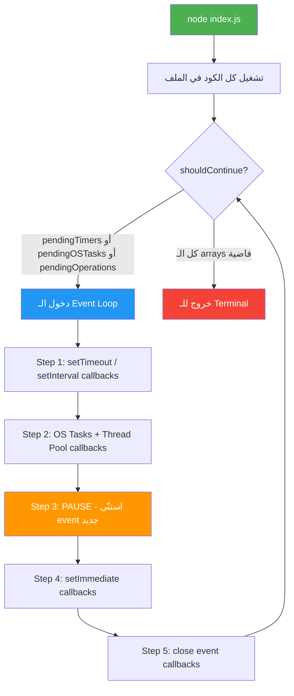
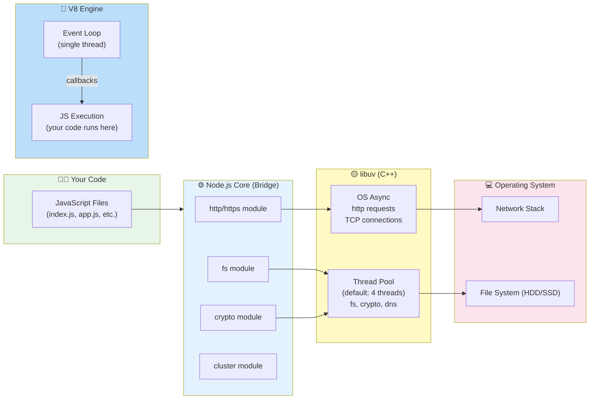
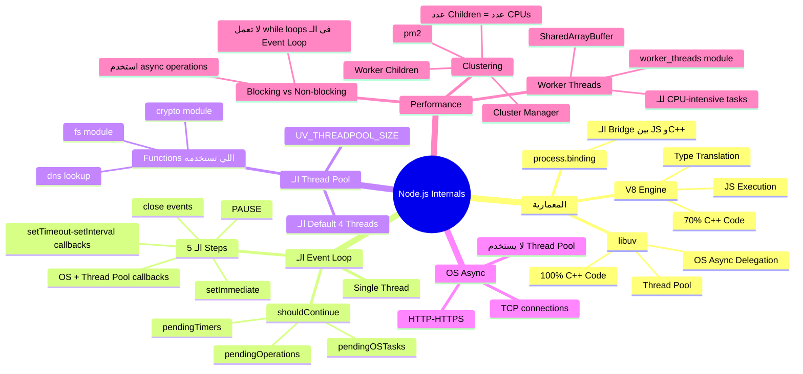

# الفصل الكبير — Node.js Internals: جوّه الـ Engine إيه اللي بيحصل؟

> **المتطلبات:** معرفة أساسية بـ JavaScript وازاي تشغّل Node.js من الـ terminal — لأن هنا مش هنكتب features، هنفهم الـ engine نفسه من جوا.

---

## البداية — ليه أصلاً لازم أفهم Internals؟

تخيّل معايا إنك شغّال على Node.js server، وفجأة الـ performance اتخرب. الـ requests بدأت تتأخر، وأنت مش فاهم ليه. رحت على Stack Overflow، لقيت حد بيقول "Node is single-threaded"، وحد تاني بيقول "Node can handle millions of requests concurrently"...

**طب إيه الكلام الصح؟! 🤔**

الحقيقة إن الاتنين صح، وغلط في نفس الوقت — وده بالظبط اللي هنفهمه النهارده.

لو مش فاهم إزاي الـ Event Loop بيشتغل، إزاي الـ Thread Pool بيتعامل مع الـ I/O، وامتى الـ OS بيتدخل — هتفضل تحل performance issues بالعشواء. أما لما تفهم، هتبقى قادر تشوف المشكلة من الكود نفسه قبل ما تحصل.

---

## [١] — معمارية Node.js: مش بس JavaScript

### الـ Big Picture — الـ 3 طبقات

Node.js مش بس "JavaScript on the server". هو في الحقيقة sandwich من 3 طبقات:

```
┌─────────────────────────────────────────┐
│         YOUR JavaScript CODE            │  ← الكود اللي إنت بتكتبه
├─────────────────────────────────────────┤
│              Node.js Core               │  ← الـ bridge بين JS والـ C++
│   (HTTP, fs, crypto, path, events...)   │
├──────────────────┬──────────────────────┤
│       V8         │       libuv           │  ← الـ engine الحقيقي
│  (JS Engine)     │  (Async I/O, Threads) │
│  ~30% JS         │   100% C++            │
│  ~70% C++        │                       │
└──────────────────┴──────────────────────┘
```

**V8** — ده الـ JavaScript engine اللي Google عملته لـ Chrome. مهمته إنه يأخد الـ JS code بتاعك ويشغّله. مكتوب بـ C++ في معظمه.

**libuv** — ده الـ library المسؤولة عن كل حاجة Async: الـ file system، الـ networking، والـ thread pool. 100% C++.

> ⚠️ **انتبه:** لما بتكتب `const fs = require('fs')` — إنت مش بتستخدم JavaScript بالكامل. إنت بتستخدم JavaScript wrapper فوق C++ code. الشغل الحقيقي بيتعمل في C++.

---

### رحلة الـ `pbkdf2` — مثال عملي

خليني أوريك إزاي Function واحدة بتعبر الـ 3 طبقات دول.

**`crypto.pbkdf2`** — دي function بتعمل password hashing. خليها تكون المثال بتاعنا.

```javascript
const crypto = require('crypto');

// ← لما بتكتب السطر ده، إيه اللي بيحصل فعلاً؟
crypto.pbkdf2('mypassword', 'salt', 100000, 512, 'sha512', (err, key) => {
  console.log('Hash done!', key.toString('hex').slice(0, 20));
});
```

**رحلة الـ Function:**

```
crypto.pbkdf2() in JavaScript
         ↓
lib/internal/crypto/pbkdf2.js  (JS file in Node source)
         ↓
Error checking + argument validation (JS)
         ↓
process.binding('crypto')   ← هنا بيعدي من JS لـ C++
         ↓
src/node_crypto.cc  (C++ file — 5000+ lines!)
         ↓
void PBKDF2()  in C++   ← الشغل الحقيقي هنا
         ↓
libuv Thread Pool  ← بيتشغّل في thread منفصل
         ↓
Result comes back → JS Callback يتشغّل
```

الـ `process.binding('crypto')` ده هو الـ bridge. هو اللي بيوصّل الـ JavaScript world بالـ C++ world.

```
┌─────────────────────────────────────┐
│  JavaScript World (lib/ folder)     │
│  crypto.pbkdf2() → _pbkdf2() → ... │
└─────────────────┬───────────────────┘
                  │  process.binding()
                  │  ← الجسر الوحيد
┌─────────────────▼───────────────────┐
│  C++ World (src/ folder)            │
│  V8 types + libuv thread pool       │
│  void PBKDF2() { ... }              │
└─────────────────────────────────────┘
```

> **نصيحة الخبراء:** في الـ node source code على GitHub، الـ `lib/` folder = JS side. الـ `src/` folder = C++ side. لو فضولي تعرف إزاي أي module بيشتغل من جوا، ابدأ من الـ `lib/` وتابع لحد ما توصل `process.binding()`.

---

## [٢] — Threads: اللبنة الأساسية قبل الـ Event Loop

قبل ما نتكلم عن الـ Event Loop، لازم نفهم الـ Thread. اسمعني كويس هنا.

### الـ Thread — زي الـ Todo List للـ CPU

تخيّل إن الـ CPU عنده طيّار (pilot). الـ Thread هو قائمة المهام اللي الطيّار ده لازم يعملها بالترتيب من فوق لتحت.

```
Thread Example:
┌─────────────────────────┐
│  1. اقرأ ملف من الـ HDD  │
│  2. احسب hash للنتيجة   │
│  3. ابعت HTTP response  │
└─────────────────────────┘
         ↓ CPU بينفّذهم واحدة واحدة من فوق لتحت
```

الـ OS scheduler هو اللي بيقرر أي thread يشتغل امتى. وعنده فلسفة:

**لو Thread واحد وقف ينتظر** (زي إنه بعت request للـ Hard Drive ومش جاي رد) — الـ scheduler بيقول "أنت بتضيع وقتي، روح نام وجيب غيرك".

```
Thread 1: اقرأ من الـ HDD
    ↓
[طلب من الـ HDD] → ← بيستنى... بيستنى...
    ↓
OS Scheduler: "إنت وقفت؟ طيب أنا هشغّل Thread 2 في الوقت ده"
    ↓
Thread 2: يشتغل (3 × 3 = 9) ← حاجة سريعة
    ↓
Thread 1: الـ HDD ردّ! → يكمّل شغله
```

**ده اللي بيسمحوله بالـ Concurrency.**

---

## [٣] — الـ Event Loop: قلب Node.js

### الـ Misconception الكبيرة

كلنا سمعنا "Node.js is single-threaded". الكلام ده صح... وغلط في نفس الوقت.

- **الـ Event Loop نفسه** → ✅ single-threaded فعلاً
- **بعض الـ Node.js Library functions** → ❌ مش single-threaded خالص

خليني أوريك ده بكود قبل أي كلام.

### الكود اللي هيغيّر فهمك

```javascript
// threads.js
const crypto = require('crypto');

const start = Date.now(); // ← بنسجّل وقت البداية

// ← بنشغّل الـ hash function مرتين في نفس الوقت
crypto.pbkdf2('a', 'b', 100_000, 512, 'sha512', () => {
  console.log('Hash 1:', Date.now() - start, 'ms'); // ← وقت الأولى
});

crypto.pbkdf2('a', 'b', 100_000, 512, 'sha512', () => {
  console.log('Hash 2:', Date.now() - start, 'ms'); // ← وقت التانية
});
```

**لو كانت Node.js single-threaded فعلاً، المتوقع:**

```
Hash 1: ~1000ms  (الأولى تخلص)
Hash 2: ~2000ms  (التانية تبدأ بعد الأولى)
```

**اللي بيحصل فعلاً:**

```
Hash 1: ~1050ms  ← الاتنين خلصوا تقريباً في نفس الوقت!
Hash 2: ~1060ms  ← ده دليل إن فيه multi-threading بيحصل
```

**طب ليه؟! 🤯** — لأن الـ `pbkdf2` بتستخدم الـ **Thread Pool** بتاع libuv!

---

### الـ Event Loop — الـ Pseudo Code

خليني أشرحلك الـ Event Loop بكود وهمي (pseudo code) زي ما المحاضرة اتكلمت عنه:

```javascript
// ← ده مش كود حقيقي، ده تمثيل لازاي الـ Event Loop بيشتغل

// أول ما بتشغّل `node index.js`:

// ① — شغّل كل الكود في الملف أول حاجة
myFile.runContents(); // ← بيعمل require، بيعرّف variables، بيسجّل callbacks

// ② — الـ Arrays دي بتتتبّع كل الـ pending work
const pendingTimers    = []; // ← setTimeout / setInterval / setImmediate
const pendingOSTasks   = []; // ← HTTP servers, network requests
const pendingOperations = []; // ← Thread pool tasks (fs, crypto, etc.)

// ③ — الـ Event Loop نفسه
// "اشتغّل طالما عندنا حاجة نعملها"
while (shouldContinue()) {
  
  // STEP 1: في setTimeout أو setInterval خلص وقته؟
  // → شغّل الـ callbacks بتاعتهم
  runExpiredTimers(pendingTimers);

  // STEP 2: في OS task خلص (request جه / file اتقرأ)؟
  // → شغّل الـ callbacks بتاعتهم
  runCompletedCallbacks(pendingOSTasks, pendingOperations);

  // STEP 3: PAUSE — استنّى لحد ما يحصل حاجة
  // (مش بيلف بأقصى سرعة — بيستنى event يحصل)
  pauseUntilNextEvent();

  // STEP 4: في setImmediate جاهزة تشتغل؟
  runImmediates(pendingTimers);

  // STEP 5: Handle close events (cleanup)
  // زي لما بتعمل readStream.on('close', ...)
  handleCloseEvents();
}

// ④ — الـ Function اللي بتقرر يكمّل ولا يخرج
function shouldContinue() {
  // لو في أي حاجة pending → كمّل
  return (
    pendingTimers.length ||    // في timers لسّه؟
    pendingOSTasks.length ||   // في servers شغّالة؟
    pendingOperations.length   // في thread pool work؟
  );
  // لو الكل فرغ → خروج للـ terminal
}
```

**ليه بيعمل Pause في الـ Step 3؟**

ده من أذكى حاجات Node! بدل ما يلف بأقصى سرعة ويضيع CPU، بيقول:
> "أنا مش عندي حاجة أعملها دلوقتي — هستنّى لحد ما يحصل event."

---

### الـ 5 Steps بوضوح أكثر

```
كل Tick (iteration) في الـ Event Loop بيحصل فيه:
┌────────────────────────────────────────────────────────┐
│                                                        │
│   STEP 1: expired setTimeout/setInterval callbacks    │
│            ↓                                           │
│   STEP 2: pending OS tasks + Thread Pool callbacks    │
│            ↓                                           │
│   STEP 3: PAUSE ← استنّى event جديد                   │
│            ↓                                           │
│   STEP 4: setImmediate callbacks                      │
│            ↓                                           │
│   STEP 5: close event callbacks (cleanup)             │
│                                                        │
│   ثم يرجع لـ shouldContinue() check                    │
└────────────────────────────────────────────────────────┘
```

---

## [٤] — الـ Thread Pool: السر المخفي

### ليه فيه Thread Pool أصلاً؟

لو الـ pbkdf2 اشتغلت في الـ Event Loop thread نفسه، السيرفر هيتجمّد لمدة ثانية كاملة ومش هيعمل أي حاجة تانية!

الـ Thread Pool حل المشكلة دي. libuv بتعمل تلقائياً **4 threads** إضافية غير الـ Event Loop thread.

```
┌───────────────────────────────────────────────────────┐
│                    Node.js Process                    │
│                                                       │
│  ┌──────────────────┐   ┌──────────────────────────┐  │
│  │   Event Loop     │   │      Thread Pool         │  │
│  │   (1 thread)     │   │   ┌───┐ ┌───┐ ┌───┐ ┌───┐│  │
│  │                  │   │   │ T1│ │ T2│ │ T3│ │ T4││  │
│  │  your JS code    │   │   │   │ │   │ │   │ │   ││  │
│  │  runs here       │   │   │pbk│ │ fs│ │pbk│ │ ? ││  │
│  │                  │   │   │df2│ │   │ │df2│ │   ││  │
│  └──────────────────┘   │   └───┘ └───┘ └───┘ └───┘│  │
│                         └──────────────────────────┘  │
└───────────────────────────────────────────────────────┘
```

**Functions اللي بتستخدم الـ Thread Pool:**
- كل حاجة في `fs` module (readFile, writeFile, etc.)
- `crypto.pbkdf2`, `crypto.randomBytes`
- بعض الـ `dns` lookups
- الكود اللي إنت بتكتبه باستخدام Worker Threads

**Functions اللي مش بتستخدمه:**
- `http`, `https` — بتستخدم الـ OS directly
- `net` module
- معظم الـ networking

---

### Benchmark الـ Thread Pool

```javascript
// threads.js — ده الكود الحقيقي من المحاضرة
const crypto = require('crypto');

// ← بنضبط حجم الـ Thread Pool (الـ default هو 4)
process.env.UV_THREADPOOL_SIZE = 1; // ← لو عملناه 1، التأثير كبير

const start = Date.now();

// ← 5 calls في نفس الوقت — إيه اللي هيحصل؟
for (let i = 1; i <= 5; i++) {
  crypto.pbkdf2('a', 'b', 100_000, 512, 'sha512', () => {
    console.log(`Hash ${i}:`, Date.now() - start, 'ms');
  });
}
```

**على جهاز Dual-Core (زي MacBook Pro 2015):**

**مع `UV_THREADPOOL_SIZE = 4` (الـ default):**
```
Hash 1: ~2000ms  ┐
Hash 2: ~2100ms  ├── الأربعة الأوائل خلصوا مع بعض (بس أبطأ)
Hash 3: ~2050ms  ┤   لأن الـ 2 cores اشتغلوا على 4 threads
Hash 4: ~2080ms  ┘
Hash 5: ~3000ms  ← التانية تلقي thread فاضي وخلصت لحالها
```

**ليه الأولى 4 بطيئة؟**

```
CPU Core 1: Thread 1 + Thread 2 (multi-threading)
CPU Core 2: Thread 3 + Thread 4 (multi-threading)

كل core بيشتغل على 2 threads في نفس الوقت
= double the work = double the time (~2s بدل 1s)
```

**مع `UV_THREADPOOL_SIZE = 2`:**
```
Hash 1: ~1000ms  ┐ الأوّلين خلصوا بسرعة
Hash 2: ~1050ms  ┘ (thread واحد لكل core)
Hash 3: ~2000ms  ┐ الجديدين خلصوا
Hash 4: ~2050ms  ┘
Hash 5: ~3000ms  ← الأخير
```

**مع `UV_THREADPOOL_SIZE = 5`:**
```
Hash 1-5: كلهم ~2500ms  ← كلهم خلصوا مع بعض، بس أبطأ
(5 threads على 2 cores = ضغط أكتر)
```

> ⚠️ **انتبه:** زيادة الـ threads مش معناها زيادة السرعة. الـ CPU عنده طاقة ثابتة — لو زدت الـ threads أكتر من الـ cores، هيتقسّم الشغل بس مش هيخلص أسرع.

---

## [٥] — OS Async Tasks: الـ Network لمّا يتخطى الـ Thread Pool

### الـ https.request — مش بيستخدم Thread Pool خالص

```javascript
// async.js
const https = require('https');

const start = Date.now();

// ← ده function بيعمل request لـ Google
function doRequest() {
  https.request('https://www.google.com', (res) => {
    res.on('data', () => {}); // ← بنستقبل الـ data chunks
    res.on('end', () => {
      console.log('Request done:', Date.now() - start, 'ms');
    });
  }).end(); // ← لازم تبعت .end() عشان الـ request يتبعت
}

// ← 6 requests في نفس الوقت
for (let i = 0; i < 6; i++) {
  doRequest();
}
```

**النتيجة:**
```
Request done: ~240ms
Request done: ~241ms
Request done: ~243ms
Request done: ~244ms
Request done: ~240ms  ← الكل خلص تقريباً في نفس الوقت!
Request done: ~242ms
```

🤯 **6 requests وكلهم خلصوا في ~240ms — ليه؟!**

لو كانت بتستخدم الـ Thread Pool (اللي عنده 4 threads بس) كان المتوقع إن 2 يستنّوا. بس ده مش اللي حصل.

**الجواب: الـ OS نفسه هو اللي بيعمل الـ Network Requests!**

```
┌─────────────────────────────────────────────────────────┐
│                      libuv                              │
│                                                         │
│   https.request() → libuv بتطلب من الـ OS              │
│   "إنت اعمل الـ request ده ولما يخلص قولّي"             │
│                                                         │
│   الـ OS بتعمل الـ request في الـ background             │
│   (بدون ما تمسّ الـ Thread Pool بتاع libuv)            │
│                                                         │
│   لما الـ response يجي: OS بتخبر libuv                 │
│   libuv بتشغّل الـ callback في الـ Event Loop            │
└─────────────────────────────────────────────────────────┘
```

**الفرق الجوهري:**

| | Thread Pool | OS Async |
|---|---|---|
| اللي بيستخدمه | `fs`, `crypto` | `http`, `https`, `net` |
| الـ Threads | محدودة بـ `UV_THREADPOOL_SIZE` | الـ OS بيقرر |
| الـ Limit | 4 (default) | كتير جداً |
| في الـ Event Loop Pseudo Code | `pendingOperations` | `pendingOSTasks` |

---

## [٦] — الـ Mega Example: الكل مع بعض 🤯

### ده أحسن سؤال إنترفيو في Node.js على الإطلاق

```javascript
// multitask.js
process.env.UV_THREADPOOL_SIZE = 4; // ← 4 threads في الـ pool

const https = require('https');
const crypto = require('crypto');
const fs    = require('fs');

const start = Date.now();

// ← HTTP Request — بيستخدم الـ OS مش الـ Thread Pool
function doRequest() {
  https.request('https://www.google.com', (res) => {
    res.on('data', () => {});
    res.on('end', () => console.log('HTTP:', Date.now() - start, 'ms'));
  }).end();
}

// ← Hash — بيستخدم Thread Pool
function doHash() {
  crypto.pbkdf2('a', 'b', 100_000, 512, 'sha512', () => {
    console.log('HASH:', Date.now() - start, 'ms');
  });
}

// ← نشغّلهم كلهم في نفس الوقت
doRequest(); // ← HTTP request واحد

fs.readFile('multitask.js', 'utf8', () => { // ← File read واحد
  console.log('FS:', Date.now() - start, 'ms');
});

doHash(); // ← 4 hashes
doHash();
doHash();
doHash();
```

**السؤال: إيه ترتيب الـ console.logs؟**

```
HTTP: ~240ms     ← أول حاجة (الـ OS بيعملها في background)
HASH: ~1000ms    ← واحدة بس من الـ hashes
FS:   ~1050ms    ← الـ file system!
HASH: ~2000ms    ← الـ 3 المتبقيين
HASH: ~2000ms
HASH: ~2000ms
```

**المفاجأة: ليه الـ FS جاي بعد HASH واحدة بس؟ 🤔**

---

### الـ Explanation — رسمة تفصيلية

```
الـ 4 Threads في الـ Pool:
┌─────┐  ┌─────┐  ┌─────┐  ┌─────┐
│ T1  │  │ T2  │  │ T3  │  │ T4  │
└──┬──┘  └──┬──┘  └──┬──┘  └──┬──┘
   │         │         │         │
   FS        Hash1    Hash2    Hash3    ← الـ 4 tasks الأوائل

الـ Hash4 → بيستنّى thread يفضى

الـ T1 (FS): بيبدأ يقرأ الـ File
   ↓
   بيطلب Stats من الـ HDD (ده I/O → بياخد وقت)
   ↓
   "أنا هستنّى الـ HDD، في حاجة تانية أعملها؟"
   ↓
   T1 بياخد الـ Hash4 ويبدأ يشتغل عليه!
   ↓
   Hash4 بيخلص (~1000ms)
   ↓
   T2 أو T3 بيخلص Hash1 أو Hash2
   ↓
   Thread فاضي بيكمّل شغل الـ FS (يقرأ الـ file فعلاً)
   ↓
   FS callback بيتشغّل
```

**ليه الـ HTTP جاي الأول بسهولة؟**

لأن الـ HTTPS بيستخدم الـ OS، مش الـ Thread Pool. مفيش competition مع الـ hashes.

**خليني أوريك التأثير لو غيّرنا الـ Thread Pool Size:**

```javascript
// لو عملنا UV_THREADPOOL_SIZE = 5
// Thread Pool هيبقى:
// T1=FS, T2=Hash1, T3=Hash2, T4=Hash3, T5=Hash4

// الـ FS هيبقى في thread لوحده!
// ← النتيجة:
// HTTP: ~240ms
// FS:   ~26ms   (سريع جداً! مش بيتعاور مع الـ hashes)
// HASH: ~1000ms
// HASH: ~1000ms
// HASH: ~1000ms
// HASH: ~1000ms
```

```javascript
// لو عملنا UV_THREADPOOL_SIZE = 1
// Thread Pool هيبقى thread واحد بس
// بيعمل: FS أول، يقرأ Stats، يعمل Hash1، يرجع يكمّل FS، Hash2، Hash3، Hash4
// النتيجة:
// HTTP: ~240ms
// HASH: ~1000ms
// HASH: ~2000ms
// HASH: ~3000ms
// FS:   ~3500ms  (لازم يستنّى الكل!)
// HASH: ~4000ms
```

---

## [٧] — الـ Event Loop الكامل — Flow Diagram



---

## [٨] — Performance: الـ Blocking Code كارثة

### المشكلة العملية

```javascript
// index.js — Express server
const express = require('express');
const app = express();

// ← ده function بيحجب الـ Event Loop كاملاً!
function doWork(duration) {
  const start = Date.now();
  while (Date.now() - start < duration) {
    // ← بيلف في while loop بدون أي I/O
    // ← الـ Event Loop متحجوز! مش هيرد على أي request تاني
  }
}

app.get('/', (req, res) => {
  doWork(5000); // ← 5 ثواني blocking!
  res.send('Hi there'); // ← الرد بعد 5 ثواني
});

app.get('/fast', (req, res) => {
  res.send('This was fast!'); // ← بس لو في request على /، ده هيستنّى!
});

app.listen(3000);
```

**اللي بيحصل:**

```
User 1: GET /  → بيستنّى 5 ثواني
User 2: GET /fast → بيستنّى 5 ثواني كمان!! 🤬

ليه؟ لأن الـ Event Loop محجوز في الـ while loop
ومش قادر يعالج أي request تاني
```

> ⚠️ **انتبه:** لو عندك كود JavaScript بتلف فيه loop طويلة أو بتعمل حسابات معقدة، ده بيحجب الـ Event Loop بالكامل. مش زي `fs.readFile` اللي بيتعمل في thread منفصل.

---

## [٩] — Clustering: الحل الأول

### الفكرة

بدل ما تشغّل instance واحدة من الـ server → شغّل عدة instances!

```
بدون Clustering:
┌──────────────────────────────────┐
│         Single Node Process      │
│  ┌───────────────────────────┐   │
│  │       Event Loop          │   │ ← request بيحجب الكل
│  └───────────────────────────┘   │
└──────────────────────────────────┘

مع Clustering (مثلاً 4 children):
┌──────────────────────────────────────────┐
│           Cluster Manager               │
│         (Master Process)                │
│                                         │
│  ┌───────┐  ┌───────┐  ┌───────┐  ┌────┐│
│  │Child 1│  │Child 2│  │Child 3│  │ C4 ││
│  │Server │  │Server │  │Server │  │    ││
│  └───────┘  └───────┘  └───────┘  └────┘│
└──────────────────────────────────────────┘

كل child له Event Loop منفصل → requests بيتوزّعوا!
```

### الـ Implementation

```javascript
// index.js — مع Clustering
const cluster = require('cluster');
const express = require('express');
const crypto  = require('crypto');

// ← ده المفتاح: هل الـ file اتشغّل كـ Master أو Child؟
if (cluster.isMaster) {
  // ← Master Process: مهمته بس إنشاء الـ children
  console.log(`Master ${process.pid} is running`);

  // ← بيعمل child لكل CPU core
  // cluster.fork() = بيشغّل index.js تاني بس كـ child
  cluster.fork(); // ← Child 1
  cluster.fork(); // ← Child 2
  cluster.fork(); // ← Child 3
  cluster.fork(); // ← Child 4

  // ← لو child مات، إعمل واحد جديد
  cluster.on('exit', (worker) => {
    console.log(`Worker ${worker.process.pid} died — starting new one`);
    cluster.fork(); // ← auto-restart!
  });

} else {
  // ← Children: دول بيشتغلوا كـ Express servers فعلاً
  const app = express();

  app.get('/', (req, res) => {
    // ← عمل crypto hash يمثّل heavy computation
    crypto.pbkdf2('a', 'b', 100_000, 512, 'sha512', () => {
      res.send(`Worker ${process.pid} done!`);
    });
  });

  app.get('/fast', (req, res) => {
    res.send('This was fast!'); // ← ده مش بيتأثر بالـ heavy routes
  });

  app.listen(3000, () => {
    console.log(`Worker ${process.pid} started`);
  });
}
```

### ازاي الـ Cluster يشوف الـ Master؟

```
أول مرة تشغّل `node index.js`:
    ↓
cluster.isMaster = true ← إنت الـ Master
    ↓
بتعمل cluster.fork() × 4
    ↓
كل fork بيشغّل index.js تاني
    ↓
cluster.isMaster = false ← دول الـ Children
    ↓
كل child بيشغّل الـ Express server
```

---

### الـ Benchmark: متى الـ Clustering ينفع ومتى يضرّ؟

**Setup:**

```bash
# ← Apache Benchmark: بنبعت 500 request بـ concurrency 50
ab -c 50 -n 500 http://localhost:3000/
```

**التجربة:**

| الـ Setup | 2 Requests Concurrent | 6 Requests Concurrent |
|---|---|---|
| 1 Child | ~2000ms (sequential) | ~6000ms |
| 2 Children | ~1000ms ✅ | ~3000ms |
| 6 Children (على Dual-Core) | ~1000ms | ~3500ms 😱 |

**ليه 6 Children أبطأ من 2 على Dual-Core؟**

```
Dual-Core CPU له طاقة = 2 units per second

2 Children:
  Core1 → Child1 (hash ~1s)
  Core2 → Child2 (hash ~1s)
  = خلصوا في ~1s ✅

6 Children:
  Core1 → يتقسّم على 3 children = كل واحد ياخد 1/3 الطاقة
  Core2 → يتقسّم على 3 children = كل واحد ياخد 1/3 الطاقة
  = كل hash بياخد ~3s 🤦
```

> **نصيحة الخبراء:** عدد الـ Children المثالي = عدد الـ Logical Cores على الجهاز. مش أقل ومش أكتر. الـ Logical Cores = Physical Cores × Threads per Core. على معظم الأجهزة الحديثة: `os.cpus().length` بيديك العدد الصح.

```javascript
const os = require('os');
const numCPUs = os.cpus().length; // ← الرقم المثالي للـ children

if (cluster.isMaster) {
  for (let i = 0; i < numCPUs; i++) {
    cluster.fork(); // ← مش أكتر من ده!
  }
}
```

---

## [١٠] — PM2: الـ Production-Ready Clustering

بدل ما تكتب الـ Clustering بإيدك، استخدم **pm2** — أحسن cluster manager في الـ Node.js ecosystem.

### Installation & Basic Usage

```bash
# ← Install globally
npm install -g pm2

# ← شغّل مع clustering (0 = عدد الـ CPUs تلقائياً)
pm2 start index.js -i 0

# ← شوف الـ processes الشغّالة
pm2 list

# ← Dashboard حي
pm2 monit

# ← Logs
pm2 logs

# ← وقّف كل حاجة
pm2 delete index
```

**عند استخدام pm2، الـ index.js بيرجع لـ normal server بدون Clustering code:**

```javascript
// index.js — نظيف بدون Cluster code (pm2 بيتولى ده)
const express = require('express');
const crypto  = require('crypto');
const app     = express();

app.get('/', (req, res) => {
  crypto.pbkdf2('a', 'b', 100_000, 512, 'sha512', () => {
    res.send('Done!');
  });
});

app.get('/fast', (req, res) => res.send('Fast!'));

app.listen(3000);

// ← pm2 هو اللي بيعمل الـ forking، مش إنت
```

```
pm2 start index.js -i 0
  ↓
pm2 بيشوف عندك كام CPU core
  ↓
بيعمل cluster.fork() بالعدد المناسب تلقائياً
  ↓
بيراقب كل child — لو مات بيعمله restart
  ↓
إنت بتنام مرتاح 😴
```

---

## [١١] — Worker Threads: الحل التاني (Experimental)

### الفكرة

بدل ما تعمل process جديدة (زي الـ Clustering)، بتعمل **thread** جديد في نفس الـ process.

```javascript
// index.js مع Worker Threads
const express = require('express');
const { Worker } = require('worker_threads'); // ← Modern Node.js API (v10.5+)
const app = express();

app.get('/', (req, res) => {

  // ← بنعمل Worker Thread جديد
  const worker = new Worker(`
    const { workerData, parentPort } = require('worker_threads');
    
    // ← الشغل الـ heavy بيتعمل هنا في thread منفصل
    let counter = 0;
    while (counter < 1_000_000_000) { // ← billion iterations
      counter++;
    }
    
    // ← نبعت النتيجة للـ main thread
    parentPort.postMessage({ result: counter });
  `, { eval: true }); // ← eval: true لأننا بنبعت code كـ string

  // ← استقبل النتيجة من الـ Worker
  worker.on('message', (msg) => {
    res.send('Result: ' + msg.result);
  });

  // ← Handle errors
  worker.on('error', (err) => {
    res.status(500).send('Worker error: ' + err.message);
  });
});

app.listen(3000);
```

**أو الطريقة الأنظف — Worker في ملف منفصل:**

```javascript
// worker.js — ملف الـ Worker المنفصل
const { workerData, parentPort } = require('worker_threads');

// ← workerData = البيانات اللي اتبعتلنا من الـ main thread
const { iterations } = workerData;

let counter = 0;
while (counter < iterations) {
  counter++;
}

// ← بنبعت النتيجة للـ main thread
parentPort.postMessage({ result: counter, pid: process.pid });
```

```javascript
// index.js — مع Worker في ملف منفصل
const { Worker } = require('worker_threads');

app.get('/', (req, res) => {
  const worker = new Worker('./worker.js', {
    workerData: { iterations: 1_000_000_000 } // ← بنبعت data للـ Worker
  });

  worker.on('message', (msg) => res.send('Result: ' + msg.result));
  worker.on('error', (err)  => res.status(500).send(err.message));
  worker.on('exit', (code)  => {
    if (code !== 0) console.error('Worker stopped with exit code', code);
  });
});
```

### الفرق بين Clustering وWorker Threads

| | Clustering | Worker Threads |
|---|---|---|
| الـ Isolation | Process منفصلة كاملة | Thread في نفس الـ Process |
| الـ Memory | كل process لها memory منفصلة | بيشاركوا الـ memory |
| الـ Communication | IPC (بطيء نسبياً) | SharedArrayBuffer (سريع) |
| الـ Stability | أحسن — crash مش بيأثر على غيره | أخطر — crash ممكن يأثر |
| الـ Use Case | HTTP servers, I/O | CPU-intensive tasks |
| الـ Maturity | Production-ready ✅ | لسّه نسبياً جديد ⚠️ |
| مناسب لـ | معظم التطبيقات | حسابات علمية، image processing |

> ⚠️ **انتبه:** لو الكود الـ heavy بتاعك بيستخدم `fs`, `crypto`, etc. — مش محتاج Worker Threads! دول أصلاً بيشتغلوا في الـ Thread Pool. Worker Threads بس لو عندك pure JS computation زي loops كبيرة.

---

## [١٢] — الـ Full Picture: كل حاجة مع بعض



---

## 🗺️ خريطة Node.js Internals كاملة



---

## ✅ Checkpoint — أسئلة إنترفيو Node.js Internals

**س: إيه الفرق بين V8 وlibuv؟**
> **V8** هو الـ JavaScript engine — مهمته إنه ينفّذ الـ JS code بتاعك. **libuv** هو الـ C++ library اللي بتدي Node.js القدرة على الـ Async I/O. V8 بيترجم JS لـ machine code، libuv بتتعامل مع الـ file system والـ networking والـ thread pool. الاتنين بيشتغلوا مع بعض — V8 بيشغّل الـ callbacks لما libuv تخبره إن الـ async operation خلصت.

**س: هل Node.js single-threaded فعلاً؟**
> الـ Event Loop نفسه single-threaded. بس ده مش الصورة الكاملة. libuv بتعمل **Thread Pool** بـ 4 threads افتراضياً للـ operations الـ CPU-intensive زي `fs.readFile` وـ `crypto.pbkdf2`. كمان، الـ OS نفسه بيتولّى الـ network operations زي `https.request` بدون ما يمسّ الـ Thread Pool. يعني Node.js مش purely single-threaded — الـ Event Loop single-threaded، بس الـ Node process ككل بيستخدم multiple threads.

**س: إيه اللي بيحصل لما تعمل `fs.readFile` وفي نفس الوقت `crypto.pbkdf2` وكمان `https.request`؟**
> الـ `https.request` بيتبعت للـ OS ومش بيمسّ الـ Thread Pool، فبيتعمل concurrently مع كل حاجة. الـ `fs.readFile` والـ `crypto.pbkdf2` الاتنين بيستخدموا الـ Thread Pool — لو في threads متاحة يشتغلوا مع بعض، لو الـ Pool امتلأت بيستنّوا في queue. لما thread يفضى، بياخد الـ task الجاي ويشغّله. الـ Event Loop بيبقى free طول الوقت ده — بيشغّل الـ callbacks بس لما الـ operations تخلص.

**س: امتى تستخدم Clustering وامتى تستخدم Worker Threads؟**
> **Clustering** للـ HTTP servers اللي محتاج تخدم requests كتيرة في نفس الوقت. بتعمل multiple processes كل واحدة بـ Event Loop منفصل. أحسن حاجة للـ production. **Worker Threads** للـ CPU-intensive JS code زي الـ image processing أو الـ complex calculations اللي مش بيعملوا I/O. لو الكود بيستخدم `fs` أو `crypto`، مش محتاج Worker Threads — دول أصلاً بيشتغلوا في thread منفصل.

**س: ليه زيادة عدد الـ Cluster Children أكتر من عدد الـ CPUs يبطّئ التطبيق؟**
> الـ CPU عنده قدرة ثابتة. لو عملت 8 children على 4-core machine، الـ OS scheduler هيكون مجبور يتبادل بين 8 processes على 4 cores — وده context switching بياخد وقت. النتيجة إن كل request بياخد وقت أطول لأن الـ CPU بيشتّت تركيزه. الـ sweet spot هو `numCPUs = os.cpus().length`.

**س: إيه هو `process.binding` وليه مهم؟**
> ده الـ bridge الداخلي اللي Node.js بيستخدمه لربط الـ JavaScript layer بالـ C++ layer. لما بتعمل `require('crypto')` وبتشغّل `pbkdf2`، الـ JavaScript function بتستدعي في آخر الأمر `process.binding('crypto')` اللي بيجيب C++ implementation من `src/node_crypto.cc`. ده الـ mechanism اللي بيخلّي Node.js يكون "JavaScript interface on top of C++ power".

---

## 🛠️ Practical Exercises — جرّب بنفسك

### Task 1 — افهم الـ Thread Pool

```bash
# أنشئ ملف threads_test.js وشغّله
node threads_test.js
```

```javascript
// threads_test.js
const crypto = require('crypto');

// ← جرّب تغيّر الرقم ده: 1, 2, 4, 6, 8
process.env.UV_THREADPOOL_SIZE = 4;

const start = Date.now();

for (let i = 1; i <= 6; i++) {
  crypto.pbkdf2('password', 'salt', 100_000, 512, 'sha512', () => {
    console.log(`Hash ${i}: ${Date.now() - start}ms`);
  });
}

// ← السؤال: إيه الـ pattern اللي بتشوفه؟
// ← جرّب كمان تغيّر عدد الـ for loops مع تغيير UV_THREADPOOL_SIZE
// ← إيه الـ optimal ratio؟
```

---

### Task 2 — قارن بين OS Async والـ Thread Pool

```javascript
// compare_io.js
const https  = require('https');
const crypto = require('crypto');
const fs     = require('fs');

process.env.UV_THREADPOOL_SIZE = 1; // ← thread واحد بس عشان الفرق يبان

const start = Date.now();
const log   = (label) => console.log(`${label}: ${Date.now() - start}ms`);

// ← بنشغّل الكل في نفس الوقت
https.request('https://www.google.com', (res) => {
  res.on('data', () => {});
  res.on('end', () => log('HTTPS (OS)'));
}).end();

fs.readFile(__filename, 'utf8', () => log('FS (Thread Pool)'));

crypto.pbkdf2('a', 'b', 100_000, 512, 'sha512', () => log('Crypto (Thread Pool)'));

// ← السؤال: إيه الـ order المتوقع؟
// ← جرّب تغيّر UV_THREADPOOL_SIZE لـ 2 — إيه اللي اتغيّر؟
```

---

### Task 3 — Blocking vs Non-Blocking

```javascript
// blocking_test.js
const express = require('express');
const crypto  = require('crypto');
const app     = express();

// ← ❌ الطريقة الغلط: blocking code في الـ Event Loop
app.get('/blocking', (req, res) => {
  const start = Date.now();
  // ← ده بيحجب الـ Event Loop!
  while (Date.now() - start < 3000) {} 
  res.send('Blocking done (3s)');
});

// ← ✅ الطريقة الصح: non-blocking async operation
app.get('/nonblocking', (req, res) => {
  // ← ده بيتعمل في Thread Pool — مش بيحجب
  crypto.pbkdf2('a', 'b', 100_000, 512, 'sha512', () => {
    res.send('Non-blocking done (~1s)');
  });
});

app.get('/instant', (req, res) => res.send('Instant!'));

app.listen(3000);

// ← الاختبار:
// 1. افتح tab واطلب /blocking
// 2. افتح تاني tab في نفس الوقت واطلب /instant
// 3. /instant هيتأخر بسبب /blocking!
// 4. جرّب نفس الحاجة مع /nonblocking بدل /blocking
// ← إيه الفرق؟
```

| الـ Endpoint | الأثر على الـ Requests التانية |
|---|---|
| `/blocking` | بيحجب كل حاجة تانية ⛔ |
| `/nonblocking` | مش بيأثر على حاجة تانية ✅ |
| `/instant` | فوري دايماً (ما لمسّتش الـ Event Loop) |

---

## 🫒 زتونة الإنترفيو

> **"Node.js مبنية على طبقتين أساسيتين: V8 اللي بتنفّذ الـ JavaScript، وlibuv اللي بتدي Node.js القوة الحقيقية عن طريق الـ Thread Pool والـ OS Async. الـ Event Loop هو الـ control structure الوحيد اللي بيشتغل في thread واحد — بيراقب 3 arrays: timers وOS tasks وthread pool operations، وبيشغّل الـ callbacks لما أي operation تخلص. لما بتعمل `fs.readFile` الـ call بتتحول لـ C++ وبتتعمل في thread من الـ pool عشان متحجبش الـ Event Loop. لما بتعمل `https.request` الـ OS نفسه بيتولّى الـ request ومش بيمسّ الـ Thread Pool خالص. الـ Clustering بيحل مشكلة الـ single Event Loop بإنه بيعمل multiple processes كل واحدة بـ Event Loop منفصل — والرقم المثالي للـ processes هو عدد الـ CPU cores. الغلطة الأكبر هي إنك تعمل blocking code في الـ Event Loop زي while loops أو heavy synchronous calculations — ده بيوقّف الـ server كله."**

---

*Next → Performance Monitoring & Profiling: بعد ما فهمت الـ internals، إزاي تشخّص الـ performance problems في production؟*
